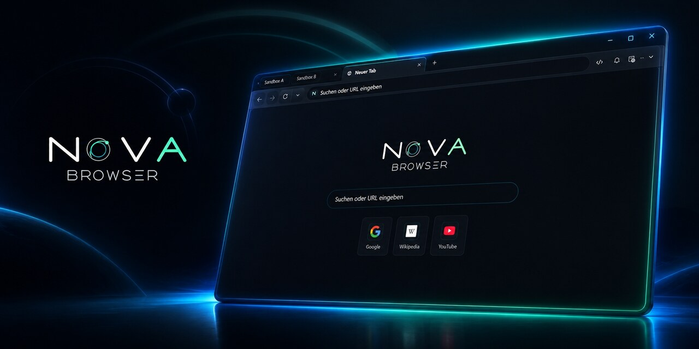

# Nova AI Workspace

**Built for what's next.**

**The local browser workspace where your AI agents work.**
Real browser sessions · terminal · memory · schedule · 800+ MCP tools — all local, all inspectable.

Works with **Claude Code · Codex · Gemini · Cursor · Windsurf** — any MCP client, any model.

-0078D4)    

---

## See it work

Nova is not a browser with an AI button. It is the machine your agent works on: it opens your real
logged-in sessions, reads the page as evidence, runs a terminal, remembers how sites behave, and
keeps working on a schedule while you are away.

**▶ [Watch Nova in action (YouTube)](https://www.youtube.com/@novainweb)** — the cognitive runtime,
site learning, closed-loop verification and autonomous task runs, each in a short video.

## Try it — 3 minutes, no sign-up

1. **[Download the setup](https://github.com/joelaniol/nova/releases)** — Windows 10 / 11 (x64).
2. **Activate** with the shared alpha license — no account needed:
   > **License key:** `NOVA-M89A9-JW3BT-RMTD7-Z4RWL-PQGT9`
   > **Email:** `demo@example.com`
3. **Connect your agent.** For Claude Code, Codex and Claude Desktop this happens by itself.
   Restart your agent, then tell it: **"please run the Nova onboarding."**

> On first launch Windows SmartScreen may warn that the app is not code-signed — expected for
> independent alpha builds. Choose **"More info" → "Run anyway"**.

> **ALPHA SOFTWARE — USE AT YOUR OWN RISK.** Nova is in active alpha development. Bugs, crashes,
> data loss and breaking changes may occur. There is no warranty of any kind. Do not rely on this
> software for critical tasks. By using Nova you accept the [Disclaimer](DISCLAIMER.md),
> [Acceptable Use Policy](ACCEPTABLE-USE.md), [Privacy Policy](PRIVACY.md) and the [License](LICENSE).
> · **ℹ️ [Alpha status & known issues →](ALPHA.md)**

> **Formerly Nova Browser.** Renamed during the alpha: the product grew past the browser — it now
> carries a terminal, a scheduler, connectors, credentials and a local knowledge layer — and the old
> name collided with unrelated projects. Same product, same team, clearer name.

**🇩🇪 [Diese Seite auf Deutsch →](#nova-ai-workspace-deutsch)**

---

## Built for developers and agents

Nova is not a conventional browser with an AI sidebar, and it is not a chatbot with a browser tab.
The browser is the agent's runtime and evidence surface: a live WebView2 desktop with persistent local
knowledge, automated task scheduling, deep web exploration and browser-enforced safety.

Agents don't just respond. They plan, execute, learn, verify, and run on schedule — unattended, around the clock.

## Why Nova

- **Fully autonomous agent scheduling** — Define tasks once. Nova runs them on intervals, file triggers, chained workflows, or manual dispatch. No human babysitting required.
- **Real browser, real context** — Agents operate inside a full WebView2 desktop browser with tabs, sandboxes, sessions, cookies, proxy profiles, and browser identity. Not a headless scraper — a complete browsing environment.
- **Persistent local intelligence** — Learned site knowledge, proven interaction recipes, task memory, and operator notes give agents a growing local knowledge base. They learn verified website behavior, remember what worked, and adapt when sites change. Nova doesn't just execute — it thinks ahead.
- **Deep autonomous exploration** — Website MCP discovery, hidden-WebView crawling, live-tab crawling for authenticated SPAs, Surface Explorer for UI states without URLs. Agents explore like a human would — but faster and more systematic.
- **Open agent protocol** — A localhost MCP server exposes 800+ browser and knowledge tools to Claude Code, Cursor, Windsurf, custom scripts, and any MCP-compatible client. Nova is the platform, not the model.
- **Multi-model, one workspace** — Claude, Codex, and Gemini run through the same agent panel with live transcript, tool cards, and seamless provider switching. Best model for each job.
- **Safety without handholding** — Domain rules, claims, audit logs, vault SecretRefs, emergency stop, kill switches, and strict MCP validation live in the browser runtime, not in a model prompt. Agents get guardrails, not a leash.

## Quick Start

1. Download the latest release from [Releases](https://github.com/joelaniol/nova/releases)
2. Extract the ZIP (portable) or run the installer
3. Run `NovaBrowser.exe`
4. Open Settings to configure language, sandboxes, AI provider accounts, MCP access, and agent permissions

5. **Connect your AI agent** — for Claude Code, Codex, and Claude Desktop this happens automatically. Restart your agent, then tell it **"please run the Nova onboarding"**. Details and other clients: see [Connect your AI agent](#connect-your-ai-agent-mcp) below.

> 📚 **Full documentation and video guides are coming soon.**

> On first launch, Windows SmartScreen may warn that the app is not code-signed.
> For independent alpha builds this is expected. Choose "More info" > "Run anyway".

## Reporting bugs · Fehler melden

**EN — Please report CRASHES only.** Known MCP-tool quirks are already tracked and get fixed over time, so there is no need to file those. If Nova **crashes**, open a [GitHub issue](https://github.com/joelaniol/nova/issues) describing what you did and, if possible, attach the log from **Settings → About → Open app logs**.

**DE — Bitte nur ABSTÜRZE melden.** Bekannte MCP-Tool-Eigenheiten sind bereits erfasst und werden nach und nach behoben — die musst du nicht melden. Wenn Nova **abstürzt**, ein [GitHub-Issue](https://github.com/joelaniol/nova/issues) mit dem Ablauf öffnen und, wenn möglich, das Log aus **Einstellungen → Info → App-Logs** anhängen.

## What Makes Nova Different

Traditional agent tools typically give a model a set of browser controls. Nova surrounds the model
with a local cognitive runtime: specialized functions for perception, memory, goals, evidence,
reflection and learning work together inside the browser.

**In practical terms, Nova combines several brain-like functions instead of one generic “memory” box:**

| Cognitive function | What Nova contributes |
|---|---|
| **Perception** | Reads the live browser through DOM, accessibility, screenshots, network, console and runtime signals |
| **Procedural memory** | The Phenomenological Knowledge Store (PKS) ([PKS video](https://www.youtube.com/watch?v=7NwRGC3l-r8)) remembers how websites work: fingerprints, interaction recipes, health and drift |
| **Operational awareness** | Operational Knowledge (OK) ([OK video](https://www.youtube.com/watch?v=LgShkPaSW7I)) tracks what is true now: state, capabilities, connections and policies |
| **Episodic task memory** | Episodic Task Memory (ETM) ([ETM video](https://www.youtube.com/watch?v=9qXrleOhPAw)) remembers recurring tasks, work units, progress, completion rules and learned guidance |
| **User-context memory** | Opt-in Browser Memory preserves domain notes, preferences and session context across visits |
| **Executive control** | Goal Register and awareness/reflection gates ([AAG video](https://www.youtube.com/watch?v=xhicSiFxPdY)) keep intent, steps, prerequisites and unfinished work visible |
| **Evidence and verification** | The Closed-Loop System (CLS) ([CLS video](https://www.youtube.com/watch?v=aKNp_74B8DE)) checks expected state → action → actual outcome; Evidence Verification Mode (EVM) turns research into testable claims instead of guesses |
| **Learning and adaptation** | The Agent Learning Pipeline (ALP) ([ALP video](https://www.youtube.com/watch?v=6iM3TbOL9o0)) turns verified outcomes into traceable candidates that move into active knowledge only after evidence and are revalidated when sites drift |

These functions do not replace the connected AI model. They give it durable cognition at the browser
level: grounded perception, several kinds of memory, explicit goals, verified outcomes and reusable
learning across sessions.

| | Traditional agent tools | Nova AI Workspace |
|---|---|---|
| **Cognitive architecture** | Model plus browser controls | Perception, goals, multiple memory systems, evidence, reflection and learning |
| **Action loop** | Dispatch an action and assume success | Check expectations, act, verify the real outcome, then adapt |
| **Browser role** | Browser as an external tool, remote session or screenshot feed | Persistent full desktop Chromium runtime with tabs, sandboxes, sessions and browser identity |
| **Autonomy** | Execution tied to a live client request or manually started workflow | Scheduled, chained and trigger-based runs with durable task progress and completion checks |
| **Memory** | Memory is owned by the model or client and is often one general store | Persistent browser-owned stores separate procedures, current state, task episodes and opt-in user context — and grow through verified experience over time |
| **Learning** | Start over when context is lost | Evidence-backed local knowledge that is promoted, monitored and revalidated |
| **Exploration** | Predefined steps, selectors or task-specific scripts | Autonomous site mapping, crawling and guarded exploration of hidden UI states |
| **Safety** | Policies and permissions live in the client or orchestration layer | Browser-enforced domain policies, per-tab claims, audit logs and an emergency stop |
| **Integration** | Browser integration depends on client- or vendor-specific adapters | Open MCP server — any MCP client, any model |

## Requirements

- Windows 10 or Windows 11
- Windows App SDK Runtime 1.8
- Microsoft Edge WebView2 Runtime

If Nova does not start because the Windows App Runtime is missing:

- **Option A:** Run `repair-windows-app-runtime.ps1` (included in the release)
- **Option B:** Download manually from [Microsoft](https://aka.ms/windowsappsdk/1.8/latest/windowsappruntimeinstall-x64.exe)

## Connect your AI agent (MCP)

While Nova is open it runs a local MCP server and exposes 800+ tools to your agent. For **Claude Code, Codex, and Claude Desktop this is automatic — no manual config, no copying tokens:**

1. **Install and launch Nova once.** The local MCP server starts on its own and writes the Nova connection into the config of Claude Code, Codex, and Claude Desktop for you. It never touches your other MCP servers or your permission allowlist.
2. **Restart your agent** so it reloads its config — Nova then appears as the `novabrowser` server. *This restart is the step most people forget: if Nova doesn't show up, restart the agent, not Nova.*
3. In your agent, say **"please run the Nova onboarding"**. Nova drops a short reference into your project so the agent knows what it can do and how.

**Other clients (Cursor, Windsurf, VS Code, your own):** open **Settings → AI & agents → Connection & setup** and copy the ready-made setup prompt — paste it into your agent and it wires itself up (a dedicated VS Code prompt is included). Advanced clients can read the endpoint and bearer token directly from the discovery file:

```
%LOCALAPPDATA%\NovaBrowser\mcp.json
```

Treat that file as a local credential.

**Troubleshooting.** The same **Connection & setup** page has **Sync now** (re-writes the client configs) and **Reinstall runner** (repairs the connector after moving or reinstalling Nova). Keep Nova open while your agent is working, and leave **Developer options** enabled — turning it off disables the MCP server.

## Local Data

All data is stored locally under `%LOCALAPPDATA%\NovaBrowser\` — settings, browser profiles, history, favorites, vault, logs, knowledge stores, crawler databases, task workspaces, and conversation archives.

Nova does not require a remote cloud service. When using third-party AI providers, their own data policies apply.

## License

All rights reserved. See [LICENSE](LICENSE) for details.

Third-party components are subject to their own licenses. See [THIRD-PARTY-LICENSES.txt](THIRD-PARTY-LICENSES.txt).

## Videos

See Nova in action: [YouTube Channel](https://www.youtube.com/@novainweb)

Browse the full video index with thumbnails and direct links in [videos/](videos/).

## Links

- **Website:** [nova-cognitive.com](https://nova-cognitive.com/)
- **Releases:** [GitHub Releases](https://github.com/joelaniol/nova/releases)
- **YouTube:** [@novainweb](https://www.youtube.com/@novainweb)
- **Contact:** Joel Aniol — [LinkedIn](https://www.linkedin.com/in/joelaniol/)

---

## Nova AI Workspace (Deutsch)

**Built for what’s next.**

**Der lokale Browser-Arbeitsplatz, in dem deine KI-Agenten arbeiten.**
Echte Browser-Sitzungen · Terminal · Gedächtnis · Zeitplan · 800+ MCP-Tools — alles lokal, alles nachprüfbar.

> **Früher Nova Browser.** Während der Alpha umbenannt: Das Produkt ist über den Browser
> hinausgewachsen — Terminal, Zeitplaner, Konnektoren, Zugangsdaten und eine lokale Wissensschicht
> gehören dazu — und der alte Name kollidierte mit fremden Projekten. Gleiches Produkt, klarerer Name.

### Für Entwickler und Agenten gebaut

Nova ist kein herkömmlicher Browser mit KI-Seitenleiste und kein Chatbot mit Browser-Tab. Der Browser
ist Laufzeit- und Belegoberfläche des Agenten: ein echter WebView2-Desktop mit persistentem lokalem
Wissen, automatisierter Aufgabenplanung, tiefer Web-Erkundung und browserseitig erzwungenen
Sicherheitsregeln.

Agenten antworten nicht nur. Sie planen, führen aus, lernen, verifizieren und laufen nach Zeitplan — unbeaufsichtigt, rund um die Uhr.

### Warum Nova

- **Vollautonomes Agent-Scheduling** — Tasks einmal definieren. Nova fuehrt sie nach Intervall, Datei-Trigger, verketteten Workflows oder manuellem Dispatch aus. Kein manuelles Babysitting noetig.
- **Echter Browser, echter Kontext** — Agenten arbeiten in einem vollstaendigen WebView2-Desktop-Browser mit Tabs, Sandboxes, Sessions, Cookies, Proxy-Profilen und Browser-Identitaet. Kein Headless-Scraper — eine komplette Browsing-Umgebung.
- **Persistente lokale Intelligenz** — Gelerntes Website-Wissen, bewährte Interaktions-Rezepte, Task-Gedächtnis und Operator-Notizen geben Agenten eine wachsende lokale Wissensbasis. Sie lernen verifiziertes Website-Verhalten, merken sich was funktioniert hat und passen sich an wenn sich Seiten ändern. Nova führt nicht nur aus — es denkt mit.
- **Tiefe autonome Exploration** — Website-MCP-Discovery, Hidden-WebView-Crawling, Live-Tab-Crawling fuer authentifizierte SPAs, Surface Explorer fuer UI-Zustaende ohne URLs. Agenten erkunden wie ein Mensch — nur schneller und systematischer.
- **Offenes Agent-Protokoll** — Ein lokaler MCP-Server stellt 800+ Browser- und Wissens-Tools fuer Claude Code, Cursor, Windsurf, eigene Scripts und jeden MCP-kompatiblen Client bereit. Nova ist die Plattform, nicht das Modell.
- **Multi-Model, ein Workspace** — Claude, Codex und Gemini laufen im selben Agentenpanel mit Live-Transcript, Tool-Cards und nahtlosem Provider-Wechsel. Bestes Modell fuer jeden Job.
- **Sicherheit ohne Gaengelband** — Domain-Regeln, Claims, Audit-Logs, Vault SecretRefs, Emergency Stop, Kill-Switches und strikte MCP-Validierung leben in der Browser-Runtime, nicht in einem Model-Prompt. Agenten bekommen Leitplanken, keine Leine.

### Schnellstart

1. Neuestes Release von [Releases](https://github.com/joelaniol/nova/releases) herunterladen
2. ZIP entpacken (portabel) oder Installer ausfuehren
3. `NovaBrowser.exe` starten
4. In den Einstellungen Sprache, Sandboxes, KI-Provider-Konten, MCP-Zugriff und Agentenrechte konfigurieren
5. **KI-Agent verbinden** — für Claude Code, Codex und Claude Desktop passiert das automatisch. Agenten neu starten, dann **„bitte führe das Nova-Onboarding aus“** sagen. Details und andere Clients: siehe [KI-Agent verbinden](#ki-agent-verbinden-mcp) weiter unten.

> Beim ersten Start kann Windows SmartScreen melden, dass die App nicht signiert ist. Bei Alpha-Builds ist das erwartbar. "Weitere Informationen" > "Trotzdem ausfuehren".

### Was Nova anders macht

Traditionelle Agent-Tools geben einem Modell meist nur eine Browsersteuerung. Nova ergänzt das Modell
um eine lokale kognitive Laufzeit: spezialisierte Funktionen für Wahrnehmung, Gedächtnis, Ziele,
Belege, Reflexion und Lernen arbeiten direkt im Browser zusammen.

**Praktisch kombiniert Nova mehrere gehirnähnliche Funktionen statt nur eines allgemeinen „Memory“-Speichers:**

| Kognitive Funktion | Was Nova beiträgt |
|---|---|
| **Wahrnehmung** | Liest den Live-Browser über DOM, Barrierefreiheit, Screenshots, Netzwerk, Konsole und Runtime-Signale |
| **Prozedurales Gedächtnis** | Der Phenomenological Knowledge Store (PKS) ([PKS-Video](https://www.youtube.com/watch?v=QFarrV8Xm9U)) merkt sich, wie Websites funktionieren: Fingerprints, Interaktionsrezepte, Zustand und Drift |
| **Operatives Bewusstsein** | Operational Knowledge (OK) ([OK-Video](https://www.youtube.com/watch?v=jWex6QNs86Y)) verfolgt, was jetzt gilt: Zustand, Fähigkeiten, Verbindungen und Regeln |
| **Episodisches Aufgabengedächtnis** | Episodic Task Memory (ETM) ([ETM-Video](https://www.youtube.com/watch?v=9bb_scVqb44)) erinnert wiederkehrende Aufgaben, Arbeitseinheiten, Fortschritt, Abschlussregeln und gelernte Hinweise |
| **Nutzerkontext-Gedächtnis** | Das optionale Browser Memory bewahrt Domain-Notizen, Präferenzen und Sitzungskontext über Besuche hinweg |
| **Exekutive Steuerung** | Goal Register sowie Awareness- und Reflexions-Gates ([AAG-Video](https://www.youtube.com/watch?v=8LFYHSoygh4)) halten Absicht, Schritte, Voraussetzungen und offene Arbeit sichtbar |
| **Belege und Verifikation** | Das Closed-Loop System (CLS) ([CLS-Video](https://www.youtube.com/watch?v=xUITcHwKkwA)) prüft erwarteten Zustand → Aktion → tatsächliches Ergebnis; Evidence Verification Mode (EVM) zerlegt Recherche in prüfbare Aussagen statt zu raten |
| **Lernen und Anpassung** | Die Agent Learning Pipeline (ALP) ([ALP-Video](https://www.youtube.com/watch?v=Pl_doQWt-G8)) macht aus verifizierten Ergebnissen nachvollziehbare Kandidaten, die erst mit Belegen in aktives Wissen gelangen und bei Website-Drift erneut geprüft werden |

Diese Funktionen ersetzen nicht das verbundene KI-Modell. Sie geben ihm Kognition auf Browser-Ebene:
geerdete Wahrnehmung, mehrere Gedächtnisarten, explizite Ziele, verifizierte Ergebnisse und
wiederverwendbares Lernen über Sitzungen hinweg.

| | Traditionelle Agent-Tools | Nova AI Workspace |
|---|---|---|
| **Kognitive Architektur** | Modell plus Browsersteuerung | Wahrnehmung, Ziele, mehrere Gedächtnissysteme, Belege, Reflexion und Lernen |
| **Aktionskreislauf** | Aktion senden und Erfolg annehmen | Erwartung prüfen, handeln, tatsächliches Ergebnis verifizieren und daraus lernen |
| **Browser-Rolle** | Browser als externes Werkzeug, Remote-Session oder Screenshot-Feed | Persistente vollwertige Desktop-Chromium-Laufzeit mit Tabs, Sandboxes, Sessions und Browser-Identität |
| **Autonomie** | Ausführung an eine laufende Client-Anfrage oder einen manuell gestarteten Workflow gebunden | Geplante, verkettete und triggerbasierte Läufe mit dauerhaftem Aufgabenfortschritt und Abschlussprüfungen |
| **Gedächtnis** | Gedächtnis gehört dem Modell oder Client und ist häufig ein allgemeiner Speicher | Persistente browser-eigene Speicher trennen Abläufe, aktuellen Zustand, Aufgabenepisoden und optionalen Nutzerkontext — und wachsen durch verifizierte Erfahrungen über die Zeit |
| **Lernen** | Bei Kontextverlust wieder von vorn beginnen | Belegtes lokales Wissen, das freigegeben, überwacht und erneut geprüft wird |
| **Exploration** | Vordefinierte Schritte, Selektoren oder aufgabenspezifische Skripte | Autonomes Site-Mapping, Crawling und geschützte Erkundung versteckter UI-Zustände |
| **Sicherheit** | Policies und Berechtigungen liegen im Client oder in der Orchestrierungsebene | Vom Browser erzwungene Domain-Policies, tabgebundene Claims, Audit-Logs und ein Notstopp |
| **Integration** | Browser-Integration hängt von client- oder anbieterspezifischen Adaptern ab | Offener MCP-Server — jeder MCP-Client, jedes Modell |

### Voraussetzungen

- Windows 10 oder Windows 11
- Windows App SDK Runtime 1.8
- Microsoft Edge WebView2 Runtime

Falls Nova wegen fehlender Windows App Runtime nicht startet:

- **Option A:** `repair-windows-app-runtime.ps1` ausfuehren (im Release enthalten)
- **Option B:** Manuell herunterladen: [Microsoft](https://aka.ms/windowsappsdk/1.8/latest/windowsappruntimeinstall-x64.exe)

### KI-Agent verbinden (MCP)

Solange Nova geöffnet ist, betreibt es einen lokalen MCP-Server und stellt deinem Agenten 800+ Tools bereit. Für **Claude Code, Codex und Claude Desktop läuft das automatisch — keine manuelle Konfiguration, kein Token-Kopieren:**

1. **Nova einmal installieren und starten.** Der lokale MCP-Server startet von selbst und trägt die Nova-Verbindung für dich in die Konfiguration von Claude Code, Codex und Claude Desktop ein. Deine anderen MCP-Server und deine Rechte-Freigaben bleiben unangetastet.
2. **Agenten neu starten**, damit er seine Konfiguration neu lädt — Nova erscheint dann als Server `novabrowser`. *Diesen Neustart vergisst man am ehesten: Wenn Nova nicht auftaucht, den Agenten neu starten, nicht Nova.*
3. Im Agenten sagen: **„bitte führe das Nova-Onboarding aus“**. Nova legt eine kurze Referenz in dein Projekt, damit der Agent weiß, was er kann und wie.

**Andere Clients (Cursor, Windsurf, VS Code, eigene):** **Einstellungen → KI & Agenten → Verbindung & Einrichtung** öffnen und den fertigen Einrichtungs-Prompt kopieren — in den Agenten einfügen, er richtet sich selbst ein (ein eigener VS-Code-Prompt ist dabei). Fortgeschrittene Clients können Endpunkt und Bearer-Token direkt aus der Discovery-Datei lesen:

```
%LOCALAPPDATA%\NovaBrowser\mcp.json
```

Diese Datei wie ein lokales Credential behandeln.

**Fehlerbehebung.** Dieselbe Seite **Verbindung & Einrichtung** hat **Jetzt synchronisieren** (schreibt die Client-Konfigs neu) und **Runner neu installieren** (repariert die Verbindung nach Verschieben oder Neuinstallation von Nova). Nova geöffnet lassen, während der Agent arbeitet, und **Entwickleroptionen** aktiviert lassen — ausschalten deaktiviert den MCP-Server.

### Lokale Daten

Alle Daten liegen lokal unter `%LOCALAPPDATA%\NovaBrowser\` — Einstellungen, Browser-Profile, History, Favoriten, Vault, Logs, Wissensspeicher, Crawler-Datenbanken, Task-Workspaces und Gespraechsarchive.

Nova braucht keinen Cloud-Dienst. Bei Nutzung von Drittanbieter-KI-Providern gelten deren Datenregeln.

### Lizenz

Alle Rechte vorbehalten. Siehe [LICENSE](LICENSE).

Drittanbieter-Komponenten unterliegen eigenen Lizenzen. Siehe [THIRD-PARTY-LICENSES.txt](THIRD-PARTY-LICENSES.txt).

### Videos

Nova in Aktion: [YouTube-Kanal](https://www.youtube.com/@novainweb)

Alle Videos mit Thumbnails und Direktlinks in [videos/](videos/).

### Links

- **Website:** [nova-cognitive.com](https://nova-cognitive.com/)
- **Releases:** [GitHub Releases](https://github.com/joelaniol/nova/releases)
- **YouTube:** [@novainweb](https://www.youtube.com/@novainweb)
- **Kontakt:** Joel Aniol — [LinkedIn](https://www.linkedin.com/in/joelaniol/)
