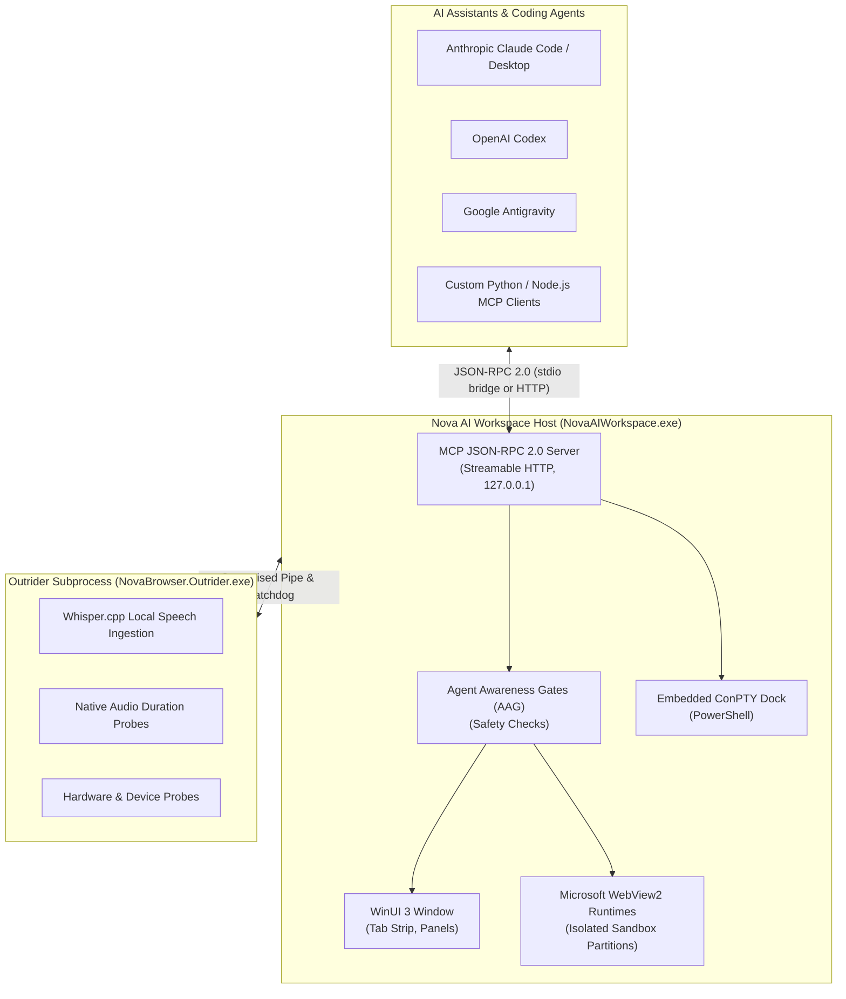

# Nova AI Workspace

<div align="center">

**The Autonomous AI Browser & Cognitive Runtime for Windows**  
*Built for Human Operators and AI Coding Assistants*

[-0078D4?logo=windows&logoColor=white)](#)
[](#)
[](#)
[](#)
[-FF6B6B)](#)
[](#)
[](#)
[](#)
[](#)

[Quickstart](docs/getting-started/quickstart.md) • [User Guide](docs/user-guide/README.md) • [Core Features](docs/core-features/README.md) • [Tool Catalog (400+ Tools)](docs/mcp-reference/tool-catalog.md) • [Deutsch](#nova-ai-workspace-deutsch)

</div>

---

## 🌟 What is Nova AI Workspace?

**Nova AI Workspace** is a next-generation Windows browser designed from the ground up for the era of agentic computing. It bridges the gap between human browsing and autonomous AI coding assistants, providing a single unified workspace where humans and agents collaborate seamlessly.

Traditional browser automation tools (Puppeteer, Playwright, Selenium) run in headless black boxes, separate windows, or disposable containers. They cannot leverage your daily authenticated sessions, cookies, or password managers, and they freeze when encountering captchas or 2FA prompts.

Nova changes this paradigm with the **Dual-Operator Model**:
* **Shared Context:** You and your AI agent (Anthropic Claude Code, OpenAI Codex, Google Antigravity, or custom agents) share the same browser window, authenticated sessions, and tab strip.
* **AI Visualization:** Watch your agent navigate, click and fill forms in real time. An optional on-screen cursor labelled "AI" shows where the agent acts, with an optional card for the current and next step.
* **You Stay in Control:** A tab an agent is working in says so; click it and confirm **Take over** to end the agent's control of that tab. **Emergency stop** in the main menu interrupts all agents at once. Typing or moving the mouse does not pause the agent by itself.

---

## 🚀 Try It — 3 Minutes, No Sign-up Needed

1. **[Download Setup from Releases](https://github.com/joelaniol/nova/releases)** — Windows 10 / 11 (x64).
2. **Activate** with the shared alpha license — no account required:
   > **License key:** `NOVA-M89A9-JW3BT-RMTD7-Z4RWL-PQGT9`  
   > **Email:** `demo@example.com`
3. **Connect your agent.** Automatically configured for Claude Code, Codex, Claude Desktop and Google Antigravity.  
   Restart your agent, then say: **"please run the Nova onboarding."**

> [!NOTE]
> On first launch Windows SmartScreen may warn that the app is not code-signed — expected for independent alpha builds. Choose **"More info" → "Run anyway"**.

> [!WARNING]
> **ALPHA SOFTWARE — USE AT YOUR OWN RISK.** Nova is in active alpha development. Bugs, crashes, data loss and breaking changes may occur. By using Nova you accept the [Disclaimer](DISCLAIMER.md), [Acceptable Use Policy](ACCEPTABLE-USE.md), [Privacy Policy](PRIVACY.md), and [License](LICENSE). · [Alpha status & known issues →](ALPHA.md)

---

## 🔬 Don't Take Our Word For It — Test It on the Lab

[`demos/lab.html`](demos/) is a benchmark page built specifically for challenging automation limits: an active session that must survive, a virtualized list with 10,000 rows (only about twenty in the DOM at a time), nested shadow roots, an iframe boundary, drag-and-drop that a dispatched click cannot do, file upload and download, native dialogs that stop JavaScript execution, and a verification code that exists only as canvas pixels.

Open it directly in Nova with no server required, and give your agent the benchmark task:
> *"Sign in, locate build 8472 in the virtual list, drag 'Deploy release' to Done, and extract the verification code from the canvas."*

[Read the interactive lab guide and solutions →](demos/README.md)

---

## 🏛️ System Architecture


```mermaid
flowchart TD
    subgraph Agents["AI Assistants & Coding Agents"]
        Claude["Anthropic Claude Code / Desktop"]
        Codex["OpenAI Codex"]
        Antigrav["Google Antigravity"]
        Custom["Custom Python / Node.js MCP Clients"]
    end

    subgraph HostProcess["Nova AI Workspace Host (NovaAIWorkspace.exe)"]
        MCPServer["MCP JSON-RPC 2.0 Server<br>(Streamable HTTP, 127.0.0.1)"]
        AAG["Agent Awareness Gates (AAG)<br>(Safety Checks)"]
        WinUI["WinUI 3 Window<br>(Tab Strip, Panels)"]
        Terminal["Embedded ConPTY Dock<br>(PowerShell)"]
        WebView["Microsoft WebView2 Runtimes<br>(Isolated Sandbox Partitions)"]
    end

    subgraph OutriderWorker["Outrider Subprocess (NovaBrowser.Outrider.exe)"]
        Whisper["Whisper.cpp Local Speech Ingestion"]
        AudioParser["Native Audio Duration Probes"]
        HardProbes["Hardware & Device Probes"]
    end

    Agents <-->|"JSON-RPC 2.0 (stdio bridge or HTTP)"| MCPServer
    MCPServer --> AAG
    AAG --> WebView
    AAG --> WinUI
    MCPServer --> Terminal
    HostProcess <-->|Supervised Pipe & Watchdog| OutriderWorker
```

---

## 🚀 Key Highlights & Capabilities

### ⚡ 400+ Deep Model Context Protocol (MCP) Tools
Agents can inspect DOM trees, measure element layout, compare screenshots against baselines, download files, run background crawlers, record and transcribe page audio, and manage tabs. The tools are grouped into 25 capability bundles that an agent loads as needed.
* Explore the complete [MCP Tool Catalog](docs/mcp-reference/tool-catalog.md).

### 🛡️ Multi-Sandbox Tab Strip (Zero Cookie Bleed)
Run multiple enterprise identities, staging environments, and personal accounts in a single browser window. Each sandbox maintains a completely isolated cookie jar, local storage, and cache directory, visually distinguished by color-coded tab accents.
* Read the [Sandboxes & Profile Isolation Guide](docs/user-guide/sandboxes-and-profiles.md).

### 💻 Integrated ConPTY Terminal Dock
A Windows pseudo-console (ConPTY) dock inside the Nova window. It starts PowerShell 7 when it is installed and Windows PowerShell otherwise. Run commands, start dev servers or use git next to the page you are working on.
* Read the [Terminal Dock Guide](docs/user-guide/terminal-dock.md).

### 👁️ AI Visualization & Staying in Control
See what an agent is doing: the optional "AI" cursor marks where it acts, and a tab under agent control is marked as such. If an agent reaches a payment checkout or a 2FA screen, you can take over the tab, solve it yourself and hand the work back. **Emergency stop** in the main menu interrupts all agents.
* Read the [AI Visualization & Staying in Control guide](docs/user-guide/live-assist-and-spectator.md).

### 🔒 Zero-Leak Vault & Secret References (`SecretRef`)
Agents can sign in with stored passwords without the plaintext passing through the AI model. Nova keeps vault entries encrypted with Windows DPAPI for your user account and fills them into the login form or HTTP sign-in itself. API keys go into a write-only secret store: an agent can use them but never read them back.
* Read the [Vault & Secret Isolation Guide](docs/core-features/vault-and-secrets.md).

### 🎙️ Local Whisper Speech Transcription (Offline & Private)
Transcribe audio and video locally with Whisper speech models. Recognition runs in the separate Outrider helper process; the models are downloaded once and then work offline.
* Read the [Media Intelligence Guide](docs/core-features/media-intelligence.md).

---

## 🧠 Cognitive Architecture: Beyond Generic Memory

Traditional agent tools provide raw browser automation commands. Nova surrounds the AI model with an integrated cognitive runtime directly in the browser:

| Cognitive Function | What Nova Contributes | Architecture Guide | Video Demo |
| :--- | :--- | :--- | :---: |
| **Perception** | Reads the live browser through DOM, accessibility, screenshots, network, and console | [Visual Evidence](docs/core-features/evm-and-visual-evidence.md) | — |
| **Procedural Memory** | Remembers website interaction recipes, state, health, and visual drift | [PKS Store](docs/core-features/pks.md) | [Watch](https://www.youtube.com/watch?v=7NwRGC3l-r8) |
| **Operational Awareness** | Login state, plan and active model of a site, plus per-domain notes for agents | [Operational Knowledge](docs/core-features/operational-knowledge.md) | [Watch](https://www.youtube.com/watch?v=LgShkPaSW7I) |
| **Episodic Task Memory** | Preserves recurring tasks, work units, progress, and learned guidance | [ETM Memory](docs/core-features/etm-and-task-memory.md) | [Watch](https://www.youtube.com/watch?v=9qXrleOhPAw) |
| **User Context** | Opt-in domain notes and preferences preserved across sessions | [Browser Memory](docs/core-features/browser-memory-and-board.md) | — |
| **Executive Control** | Goal Register and safety/reflection gates keep intent and steps visible | [AAG Gates](docs/core-features/aag.md) | [Watch](https://www.youtube.com/watch?v=xhicSiFxPdY) |
| **Closed-Loop Verification** | Expected state → action → verified outcome; evidence-based claims | [Closed-Loop System](docs/core-features/closed-loop-system.md) | [Watch](https://www.youtube.com/watch?v=aKNp_74B8DE) |
| **Adaptive Learning** | Candidate promotion pipeline that validates and re-checks on site drift | [Learning Pipeline (ALP)](docs/core-features/learning-pipeline-alp.md) | [Watch](https://www.youtube.com/watch?v=6iM3TbOL9o0) |

---

## ⚡ 1-Minute Agent Quickstart

**Usually there is nothing to configure.** When Nova starts, it registers itself with the supported AI
programs it finds on your machine: Claude Code, Claude Desktop, OpenAI Codex and Google Antigravity.
Restart the AI program once afterwards so it loads the new entry. For other programs, open the
connection wizard in Nova's settings.

The entry Nova writes only starts its bridge program. The bridge finds the running Nova by itself and
starts it if needed, so no password or port ends up in your AI program's config:

```json
{
  "mcpServers": {
    "nova": {
      "command": "C:\\Users\\<you>\\AppData\\Local\\nova-cognitive\\Nova\\bin\\NovaBrowser.McpProxy.exe"
    }
  }
}
```

Google Antigravity also gets `"args": ["--antigravity-tool-names"]`, because it does not accept the
dots in names like `nova.tabs`. Installations from before the product rename use
`%LOCALAPPDATA%\NovaBrowser` instead of `%LOCALAPPDATA%\nova-cognitive\Nova`.

For detailed configuration of custom clients, see the [Agent Integration Hub](docs/integration/README.md).

---

## 📚 Complete Documentation Index

Explore the comprehensive documentation for operators, developers, and AI agents:

| Section | Focus Area | Key Documents |
| :--- | :--- | :--- |
| **[Getting Started](docs/getting-started/README.md)** | Installation & Onboarding | [Installation](docs/getting-started/installation.md) • [First Run Tour](docs/getting-started/first-run.md) • [Quickstart](docs/getting-started/quickstart.md) |
| **[User Guide](docs/user-guide/README.md)** | Human Workspace & UI Controls | [Workspace Layout](docs/user-guide/workspace-layout.md) • [Sandboxes](docs/user-guide/sandboxes-and-profiles.md) • [Terminal Dock](docs/user-guide/terminal-dock.md) • [AI Visualization](docs/user-guide/live-assist-and-spectator.md) • [Shortcuts](docs/user-guide/keyboard-shortcuts.md) |
| **[Core Features](docs/core-features/README.md)** | Deep Architecture & Systems | [AAG Gates](docs/core-features/aag.md) • [PKS Knowledge Store](docs/core-features/pks.md) • [Outrider Boundary](docs/core-features/outrider-boundary.md) • [Vault & Secrets](docs/core-features/vault-and-secrets.md) • [Session Recording](docs/core-features/session-recording.md) |
| **[MCP Reference](docs/mcp-reference/README.md)** | 400+ Tools & Protocol | [Tool Catalog](docs/mcp-reference/tool-catalog.md) • [Protocol & Transport](docs/mcp-reference/protocol-and-transport.md) • [Dedicated Tool Guides](docs/mcp-reference/tools/README.md) |
| **[Integration](docs/integration/README.md)** | AI Assistants & Clients | [Claude Code](docs/integration/claude-code.md) • [Codex](docs/integration/openai-codex.md) • [Antigravity](docs/integration/google-antigravity.md) • [Claude Desktop](docs/integration/claude-desktop.md) • [Custom Agents](docs/integration/custom-agents.md) |
| **[Troubleshooting](docs/troubleshooting/README.md)** | Diagnostics & Error Recovery | [Connection Issues](docs/troubleshooting/agent-connection-issues.md) • [Diagnostics Logs](docs/troubleshooting/diagnostics.md) • [Session Recovery](docs/troubleshooting/sandbox-and-session-recovery.md) |

---

## 🔒 Privacy, Security & Data Sovereignty

* **Local Execution:** Nova AI Workspace runs on your Windows machine and keeps its data in your profile folder. It collects no usage analytics and does not send your browsing, cookies or tab contents to its own server; it contacts `nova-cognitive.com` only for license activation and opt-in crash reports. What your AI program reads through Nova goes to that program's provider. Details: [Privacy Policy](PRIVACY.md).
* **Encrypted Storage:** Vault passwords, stored secrets and the MCP access token are encrypted with the Windows Data Protection API (DPAPI) for your user account; session recordings are encrypted with AES-GCM under a DPAPI-protected key.
* **Supervised Outrider Process:** Native hardware access and audio parsing are quarantined in a dedicated child process with hard timeouts and watchdog supervision.

---

<a name="nova-ai-workspace-deutsch"></a>
## 🇩🇪 Nova AI Workspace (Deutsch)

**Der lokale KI-Browser & die kognitive Laufzeitumgebung für Windows.**  
Echte Browsersitzungen · ConPTY-Terminal · Wissensspeicher · Scheduler · über 400 MCP-Tools — lokal, transparent und auditierbar.

### Schnellstart in 3 Schritten
1. **[Setup herunterladen](https://github.com/joelaniol/nova/releases)** (Windows 10 / 11 x64).
2. **Aktivieren** mit dem Alpha-Testschlüssel:
   > **Schlüssel:** `NOVA-M89A9-JW3BT-RMTD7-Z4RWL-PQGT9`  
   > **E-Mail:** `demo@example.com`
3. **Agenten verbinden:** Claude Code, Codex, Claude Desktop und Antigravity werden automatisch eingerichtet. Nach Neustart des Agenten sagen: **„please run the Nova onboarding“**.

Detaillierte Anleitungen: **[Installationsanleitung auf Deutsch](docs/getting-started/installation.md#nova-ai-workspace-installieren)**.

---

## 📄 License & Community

* **Nova AI Workspace** is developed by Joel Aniol and contributors.
* **Issues & Feedback:** Report issues and feature requests on [GitHub Issues](https://github.com/joelaniol/nova/issues).
* **Website:** [nova-cognitive.com](https://nova-cognitive.com)
* **YouTube:** [@novainweb](https://www.youtube.com/@novainweb)
* **Contact:** Joel Aniol — [LinkedIn](https://www.linkedin.com/in/joelaniol/)
