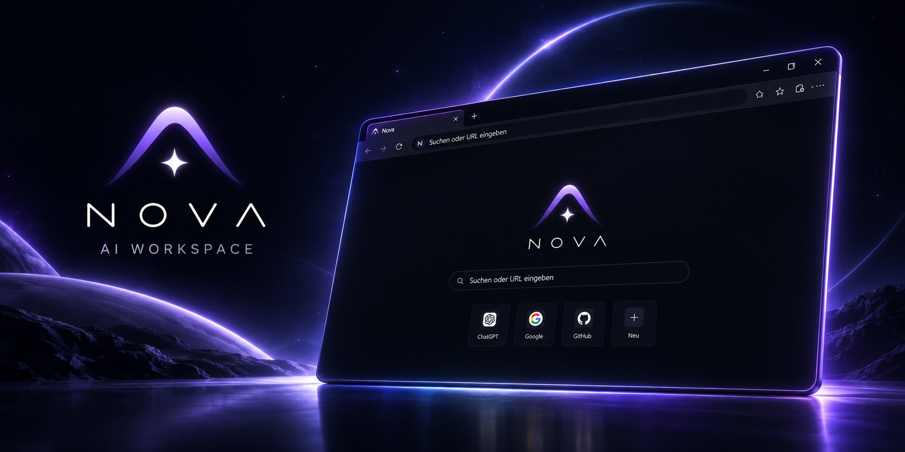
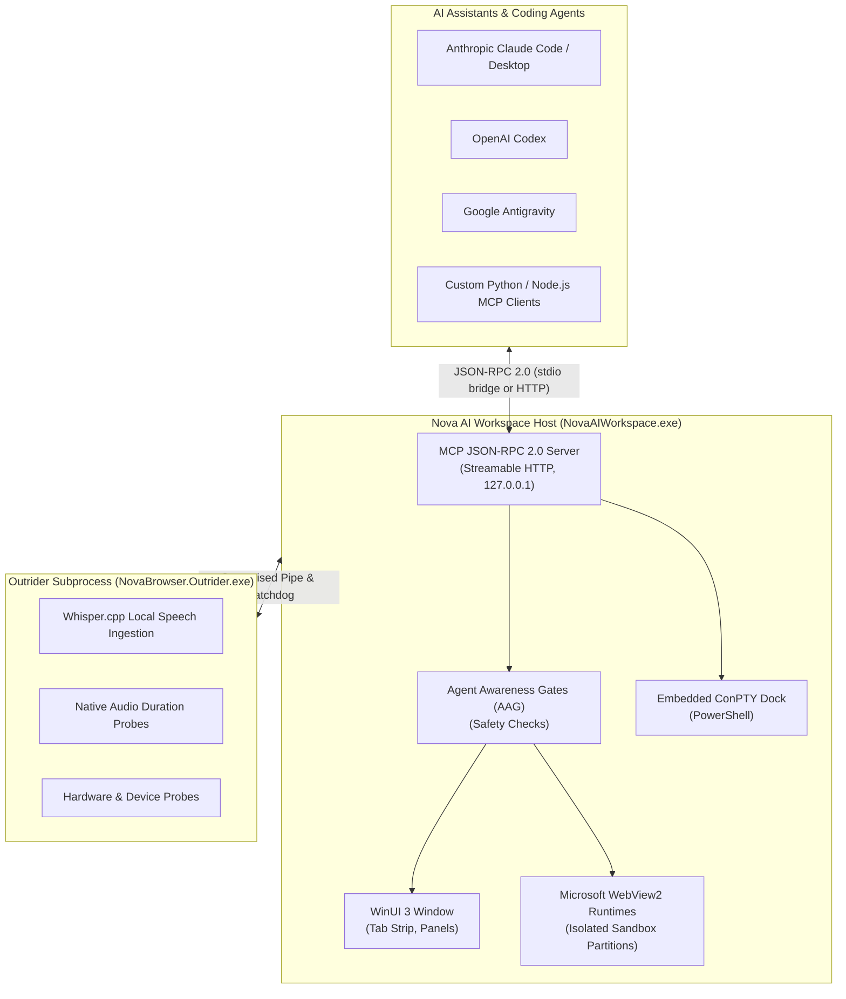

# Nova AI Workspace

### **Built for what's next.**

**The Autonomous AI Browser & Cognitive Runtime for Windows**  
*Built for Human Operators and AI Coding Assistants*

[-0078D4?logo=windows&logoColor=white)](#)

[-FF6B6B)](#)

[Download](https://github.com/joelaniol/nova/releases) • [Quickstart](docs/getting-started/quickstart.md) • [User Guide](docs/user-guide/README.md) • [Core Features](docs/core-features/README.md) • [Tool Catalog](docs/mcp-reference/tool-catalog.md) • [Changelog](docs/changelog/README.md) • [Troubleshooting](docs/troubleshooting/README.md)

---

## 🌟 What is Nova AI Workspace?

**Nova AI Workspace** is a next-generation Windows browser designed from the ground up for the era of agentic computing. It bridges the gap between human browsing and autonomous AI coding assistants, providing a single unified workspace where humans and agents collaborate seamlessly.

Nova brings browser interaction, persistent procedural knowledge, outcome verification and human handoffs into the workspace you use every day. The [Experience loop demo](demos/README.md) makes that combination tangible, including what happens when a previously useful recipe no longer fits the page.

The **Dual-Operator Model** connects the person and the agent:
* **Shared Context:** You and your AI agent (Anthropic Claude Code, OpenAI Codex, Google Antigravity, or custom agents) share the same browser window, authenticated sessions, and tab strip.
* **AI Visualization:** Watch your agent navigate, click and fill forms in real time. An optional on-screen cursor labelled "AI" shows where the agent acts, with an optional card for the current and next step.
* **You Stay in Control:** A tab an agent is working in says so; click it and confirm **Take over** to end the agent's control of that tab. **Emergency stop** in the main menu interrupts all agents at once. Typing or moving the mouse does not pause the agent by itself.

---

## 🚀 Try It — 3 Minutes, No Sign-up Needed

1. **[Download Setup from Releases](https://github.com/joelaniol/nova/releases)** — Windows 10 / 11 (x64).
2. **Activate.** No account required — the setup comes with the shared alpha license already filled in.
3. **Connect your agent.** Nova detects supported AI programs. Follow **Easy setup**, click **Connect** if offered, and restart your AI program. Then ask: **"Use Nova to find cat pictures and give me three source links."**

Looking for the trial key? → **[Alpha Trial License](docs/getting-started/trial-license.md)**

> [!NOTE]
> Windows SmartScreen may show **"Windows protected your PC"**. See the [installation notes](docs/getting-started/installation.md) before continuing with **"More info" → "Run anyway"**.

> [!WARNING]
> **ALPHA SOFTWARE — USE AT YOUR OWN RISK.** Nova is in active alpha development. Bugs, crashes, data loss and breaking changes may occur. By using Nova you accept the [Disclaimer](DISCLAIMER.md), [Acceptable Use Policy](ACCEPTABLE-USE.md), [Privacy Policy](PRIVACY.md), and [License](LICENSE). · [Alpha status & known issues →](ALPHA.md)

---

## 🔬 Try Nova with an Interactive Demo

The [interactive demo](demos/README.md) starts with an **Experience loop**: encounter a recurring notice, retrieve the experience on a return visit, handle a changed page, and verify an actual saved result. Eight smaller browser exercises are also included.

Download the repository and follow the guide to open the demo on a local HTTP address. Ask your connected agent:

> Clear the release notice and save the sample draft. Check the actual saved result, ask me to confirm when needed, and record the verified notice-handling experience in Nova. Show me what was stored and its current learning level.

The first save request deliberately leaves the draft unsaved. Later, **Site changed** invalidates the original dismissal selector. Look for real knowledge and verification evidence from Nova alongside the page's counters. All records are simulated; this is a workflow demonstration, not a performance benchmark.

[Open the demo guide →](demos/README.md) · [Deutsche Anleitung](demos/README.de.md)

---

## 🏛️ System Architecture

```mermaid
flowchart TD
    subgraph Agents["AI Assistants & Coding Agents"]
        Claude["Anthropic Claude Code / Desktop"]
        Codex["OpenAI Codex"]
        Antigrav["Google Antigravity"]
        Custom["Custom Python / Node.js MCP Clients"]
    end

    subgraph HostProcess["Nova AI Workspace Host (NovaAIWorkspace.exe)"]
        MCPServer["MCP JSON-RPC 2.0 Server<br>(Streamable HTTP, 127.0.0.1)"]
        AAG["Agent Awareness Gates (AAG)<br>(Safety Checks)"]
        WinUI["WinUI 3 Window<br>(Tab Strip, Panels)"]
        Terminal["Embedded ConPTY Dock<br>(PowerShell)"]
        WebView["Microsoft WebView2 Runtimes<br>(Isolated Sandbox Partitions)"]
    end

    subgraph OutriderWorker["Outrider Subprocess (NovaBrowser.Outrider.exe)"]
        Whisper["Whisper.cpp Local Speech Ingestion"]
        AudioParser["Native Audio Duration Probes"]
        HardProbes["Hardware & Device Probes"]
    end

    Agents <-->|"JSON-RPC 2.0 (stdio bridge or HTTP)"| MCPServer
    MCPServer --> AAG
    AAG --> WebView
    AAG --> WinUI
    MCPServer --> Terminal
    HostProcess <-->|Supervised Pipe & Watchdog| OutriderWorker
```

---

## 🚀 Key Highlights & Capabilities

### ⚡ Deep Model Context Protocol (MCP) Tools
Agents can inspect DOM trees, measure element layout, compare screenshots against baselines, download files, run background crawlers, record and transcribe page audio, and manage tabs. The tools are grouped into 25 capability bundles that an agent loads as needed.
* Explore the complete [MCP Tool Catalog](docs/mcp-reference/tool-catalog.md).

### 🛡️ Multi-Sandbox Tab Strip (Zero Cookie Bleed)
Run multiple enterprise identities, staging environments, and personal accounts in a single browser window. Each sandbox maintains a completely isolated cookie jar, local storage, and cache directory, visually distinguished by color-coded tab accents.
* Read the [Sandboxes & Profile Isolation Guide](docs/user-guide/sandboxes-and-profiles.md).

### 💻 Integrated ConPTY Terminal Dock
A Windows pseudo-console (ConPTY) dock inside the Nova window. It starts PowerShell 7 when it is installed and Windows PowerShell otherwise. Run commands, start dev servers or use git next to the page you are working on.
* Read the [Terminal Dock Guide](docs/user-guide/terminal-dock.md).

### 👁️ AI Visualization & Staying in Control
See what an agent is doing: the optional "AI" cursor marks where it acts, and a tab under agent control is marked as such. If an agent reaches a payment checkout or a 2FA screen, you can take over the tab, solve it yourself and hand the work back. **Emergency stop** in the main menu interrupts all agents.
* Read the [AI Visualization & Staying in Control guide](docs/user-guide/live-assist-and-spectator.md).

### 🔒 Zero-Leak Vault & Secret References (`SecretRef`)
Agents can sign in with stored passwords without the plaintext passing through the AI model. Nova keeps vault entries encrypted with Windows DPAPI for your user account and fills them into the login form or HTTP sign-in itself. API keys go into a write-only secret store: an agent can use them but never read them back.
* Read the [Vault & Secret Isolation Guide](docs/core-features/vault-and-secrets.md).

### 🎙️ Local Whisper Speech Transcription (Offline & Private)
Transcribe audio and video locally with Whisper speech models. Recognition runs in the separate Outrider helper process; the models are downloaded once and then work offline.
* Read the [Media Intelligence Guide](docs/core-features/media-intelligence.md).

---

## 🧠 Cognitive Architecture: Beyond Generic Memory

Traditional agent tools provide raw browser automation commands. Nova surrounds the AI model with an integrated cognitive runtime directly in the browser:

| Cognitive Function | What Nova Contributes | Architecture Guide | Video Demo |
| :--- | :--- | :--- | :---: |
| **Agent-Native Interface** | Built with agents: familiar action names and scoped aliases connect learned expectations to Nova's canonical tools | [Agent-Native Affordances](docs/core-features/agent-native-affordances.md) | — |
| **Perception** | Reads the live browser through DOM, accessibility, screenshots, network, and console | [Visual Evidence](docs/core-features/evm-and-visual-evidence.md) | — |
| **Procedural Memory** | Remembers website interaction recipes, state, health, and visual drift | [PKS Store](docs/core-features/pks.md) | [Watch](https://www.youtube.com/watch?v=7NwRGC3l-r8) |
| **Operational Awareness** | Login state, plan and active model of a site, plus per-domain notes for agents | [Operational Knowledge](docs/core-features/operational-knowledge.md) | [Watch](https://www.youtube.com/watch?v=LgShkPaSW7I) |
| **Episodic Task Memory** | Preserves recurring tasks, work units, progress, and learned guidance | [ETM Memory](docs/core-features/etm-and-task-memory.md) | [Watch](https://www.youtube.com/watch?v=9qXrleOhPAw) |
| **User Context** | Opt-in domain notes and preferences preserved across sessions | [Browser Memory](docs/core-features/browser-memory-and-board.md) | — |
| **Executive Control** | Goal Register and safety/reflection gates keep intent and steps visible | [AAG Gates](docs/core-features/aag.md) | [Watch](https://www.youtube.com/watch?v=xhicSiFxPdY) |
| **Closed-Loop Verification** | Expected state → action → verified outcome; evidence-based claims | [Closed-Loop System](docs/core-features/closed-loop-system.md) | [Watch](https://www.youtube.com/watch?v=aKNp_74B8DE) |
| **Adaptive Learning** | Candidate promotion pipeline that validates and re-checks on site drift | [Learning Pipeline (ALP)](docs/core-features/learning-pipeline-alp.md) | [Watch](https://www.youtube.com/watch?v=6iM3TbOL9o0) |

---

## ⚡ 1-Minute Agent Quickstart

Start Nova, connect your AI program in the setup wizard if needed, then restart that program.

> Use Nova to find cat pictures. Open the results in Nova and give me three source links.

Watch the browser as your agent works. You do not need to install project reference files or paste a bootstrap sequence for this first task. **Menu → Emergency stop** interrupts agent work; ordinary mouse or keyboard input does not pause it.

[Follow the Quickstart](docs/getting-started/quickstart.md) · [Choose your client](docs/integration/README.md) · [Get help](docs/troubleshooting/README.md)

---

## 📚 Complete Documentation Index

Explore the comprehensive documentation for operators, developers, and AI agents:

| Section | Focus Area | Key Documents |
| :--- | :--- | :--- |
| **[Getting Started](docs/getting-started/README.md)** | Installation & First Task | [Installation](docs/getting-started/installation.md) • [First Run Tour](docs/getting-started/first-run.md) • [Quickstart](docs/getting-started/quickstart.md) |
| **[User Guide](docs/user-guide/README.md)** | Human Workspace & UI Controls | [Workspace Layout](docs/user-guide/workspace-layout.md) • [Sandboxes](docs/user-guide/sandboxes-and-profiles.md) • [Terminal Dock](docs/user-guide/terminal-dock.md) • [AI Visualization](docs/user-guide/live-assist-and-spectator.md) • [Shortcuts](docs/user-guide/keyboard-shortcuts.md) |
| **[Core Features](docs/core-features/README.md)** | Deep Architecture & Systems | [AAG Gates](docs/core-features/aag.md) • [PKS Knowledge Store](docs/core-features/pks.md) • [Outrider Boundary](docs/core-features/outrider-boundary.md) • [Vault & Secrets](docs/core-features/vault-and-secrets.md) • [Session Recording](docs/core-features/session-recording.md) |
| **[Components & Processes](docs/components/README.md)** | Identify Nova-related processes | Main app • Outrider • MCP Proxy • TerminalRunner • ReplayValidator • WebView2 |
| **[MCP Reference](docs/mcp-reference/README.md)** | Tools & Protocol | [Tool Catalog](docs/mcp-reference/tool-catalog.md) • [Protocol & Transport](docs/mcp-reference/protocol-and-transport.md) • [Dedicated Tool Guides](docs/mcp-reference/tools/README.md) |
| **[Integration](docs/integration/README.md)** | AI Assistants & Clients | [Claude Code](docs/integration/claude-code.md) • [Codex](docs/integration/openai-codex.md) • [Antigravity](docs/integration/google-antigravity.md) • [Claude Desktop](docs/integration/claude-desktop.md) • [Custom Agents](docs/integration/custom-agents.md) |
| **[Troubleshooting](docs/troubleshooting/README.md)** | Help by Symptom | [Connection Issues](docs/troubleshooting/agent-connection-issues.md) • [Agent Behavior](docs/troubleshooting/agent-behavior.md) • [Diagnostics Logs](docs/troubleshooting/diagnostics.md) • [Session Recovery](docs/troubleshooting/sandbox-and-session-recovery.md) |

---

## 🔒 Privacy, Security & Data Sovereignty

* **Local Execution:** Nova AI Workspace runs on your Windows machine and keeps its data in your profile folder. It collects no usage analytics and does not send your browsing, cookies or tab contents to its own server; it contacts `nova-cognitive.com` only for license activation and opt-in crash reports. What your AI program reads through Nova goes to that program's provider. Details: [Privacy Policy](PRIVACY.md).
* **Encrypted Storage:** Vault passwords, stored secrets and the MCP access token are encrypted with the Windows Data Protection API (DPAPI) for your user account; session recordings are encrypted with AES-GCM under a DPAPI-protected key.
* **Supervised Outrider Process:** Native hardware access and audio parsing are quarantined in a dedicated child process with hard timeouts and watchdog supervision.

---

## 🇩🇪 Nova AI Workspace (Deutsch)

**Der lokale KI-Browser & die kognitive Laufzeitumgebung für Windows.**  
Echte Browsersitzungen · ConPTY-Terminal · Wissensspeicher · Scheduler · [MCP-Werkzeugkatalog](docs/mcp-reference/tool-catalog.md) — lokal, transparent und auditierbar.

### Schnellstart in 3 Schritten
1. **[Setup herunterladen](https://github.com/joelaniol/nova/releases)** (Windows 10 / 11 x64).
2. **Aktivieren:** Kein Konto nötig, das Setup bringt den Alpha-Testzugang schon ausgefüllt mit.
3. **Agenten verbinden:** Nova erkennt unterstützte KI-Programme. Folge der einfachen Einrichtung, klicke bei Bedarf **Verbinden** und starte dein KI-Programm neu. Sage dann: **„Such mir mit Nova Katzenbilder und gib mir drei Quellenlinks.“**

Testschlüssel gesucht? → **[Alpha-Testlizenz](docs/getting-started/trial-license.md#alpha-testlizenz)**

Detaillierte Anleitungen: **[Installationsanleitung auf Deutsch](docs/getting-started/installation.md#nova-ai-workspace-installieren)**.

---

## 📄 License & Community

* **Nova AI Workspace** is developed by Joel Aniol and contributors.
* **Issues & Feedback:** Report issues and feature requests on [GitHub Issues](https://github.com/joelaniol/nova/issues).
  Agents can use `nova.get_instructions(topic='bug_report')` for reporting rules and bug-ticket or work-session feedback templates. Review URLs and evidence for secrets and personal data; see the [alpha reporting policy](ALPHA.md#what-to-report).
* **Website:** [nova-cognitive.com](https://nova-cognitive.com)
* **YouTube:** [@novainweb](https://www.youtube.com/@novainweb)
* **Contact:** Joel Aniol — [LinkedIn](https://www.linkedin.com/in/joelaniol/)
