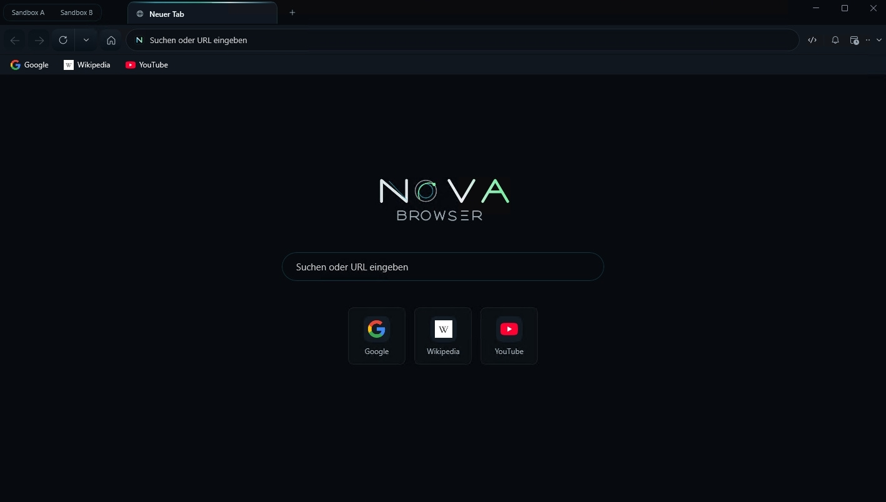

# Changelog — Nova Browser 1.0.0-alpha.16

Nutzersichtbare Änderungen seit `1.0.0-alpha.15` (09.09.2026–10.09.2026, 7 Commits im Release-Bereich `9059be87..7823db74`).
User-visible changes since `1.0.0-alpha.15` (2026-09-09–2026-09-10, 7 commits in release range `9059be87..7823db74`).

QM-Nummern verweisen auf das interne Findings-Ledger. Reine Test-, Build- und Prüfer-Arbeit bleibt
bewusst draußen; von den sieben Commits tragen fünf nutzersichtbare Änderungen, zwei sind Doku.

Purely internal test, build and scanner work is deliberately left out; five of the seven commits
carry user-visible change, two are documentation.

## Version snapshot / Versionsansicht

Nova Browser alpha.16: new tab page with the earlier green wordmark.
Nova Browser alpha.16: Neuer-Tab-Seite mit dem bisherigen grünen Schriftzug.

Window size, open tabs and shortcuts reflect the captured session.
Fenstergröße, offene Tabs und Schnellzugriffe entsprechen der aufgenommenen Sitzung.

---

# EN

## Highlights

- **Background agent visibility in the system tray.** Nova can work with its main window hidden, and the tray icon now dynamically reflects agent activity (green while working, amber shortly after, neutral when idle) with plain-text status tooltips (QM-4298)
- **Seamless recovery from background mode.** Bringing Nova back from the notification area works reliably from all directions — agent requests, Start menu, web links, or taskbar menus — unhiding the window and clearing the tray icon without getting stuck halfway (QM-4299, QM-4306)
- **No more false crash warnings on Windows shutdown.** Normal Windows shutdowns and restarts are cleanly detected (`WM_ENDSESSION`), eliminating the recurring false crash prompt on reboot (QM-4307)
- **Windows autostart synchronization.** The autostart toggle reflects Task Manager's `StartupApproved` registry status accurately; turning it on clears previous external disable flags (QM-4308)
- **Host-side error logging in `nova.console_read`.** Captures errors that webpages never log through JavaScript — CORS blocks, CSP violations, failed script/image requests, and uncaught exceptions (QM-4219)
- **Universal `_meta` parameter support.** All 397 MCP tool schemas and pre-dispatch validators accept `_meta` without rejecting calls, ensuring audit trails on guarded actions (QM-4300, QM-4301)
- **High-contrast taskbar indicators and DPI scaling fix.** Added a dark contrast ring around the status dot for light taskbars and fixed DPI scaling so agent activity no longer blurs the taskbar icon (QM-4312, QM-4313)

## Nova in the background

Until now, Nova could work with the window hidden and give you nothing to see. Every signal that an
agent was busy hung on the taskbar button — and hiding the window removes that button.

- The icon in the notification area now shows what an agent is doing: green while it works, amber
  shortly after, neutral when it is done. Hovering it says so in words (QM-4298)
- Coming back from the notification area works from every direction now: an agent's request, a
  second start from the Start menu or a link, and the taskbar's "Reset window size" entry. Three of
  those used to leave Nova half-hidden — window back, tray icon still sitting there (QM-4299, QM-4306)
- After coming back, the taskbar shows the agent indicator again instead of an empty button (QM-4309)
- Shutting Windows down is no longer mistaken for a crash. Nova used to report a crash after every
  restart and offer to restore tabs from it (QM-4307)
- With "start with Windows" enabled, Nova comes back after a Windows update restart, so scheduled
  tasks keep running. Crash- and hang-triggered restarts are deliberately excluded (QM-4316)

## Windows integration

- The autostart switch tells the truth. Turning Nova's autostart off in Task Manager does not delete
  the entry — Windows records the decision elsewhere, and Nova kept showing "on" for an autostart
  Windows would never perform. Switching it back on also clears that record (QM-4308)
- The tray icon can be reached with the keyboard, and its menu opens at the icon instead of wherever
  the mouse happens to be (QM-4310)
- The status dot is visible on light taskbars. Measured against the accessibility formula, the
  colours alone were far below the threshold; a dark ring now carries the shape (QM-4312)
- One agent run no longer leaves the taskbar logo permanently blurry on scaled displays (QM-4313)
- A double-click on the tray icon opens Nova once instead of three times (QM-4311)
- The tray menu closes on the first click outside it (QM-4314)

## For agents

- `nova.console_read` now also reports what the page never logged: CORS rejections, CSP violations,
  failed script and image loads, uncaught exceptions. Nova read the console page-side, so an agent
  saw an empty list where the developer tools were full of red. The new half has its own cursor and
  says why it is empty when it is (QM-4219)
- `_meta` is accepted on every tool. It was rejected on the guarded send/submit/login tools — the
  very ones where recording a reason for an irreversible action matters most (QM-4300)
- Every tool now publishes `_meta` in its schema, so a strict client can attach it without being
  refused before Nova ever sees the call (QM-4301)
- The pointer to a domain's operator notes survives `outputDetail: "minimal"`. It was dropped there,
  which punished exactly the agent that works carefully with its context (QM-4304)
- `nova.read_text` says which of several matches it returned. It quietly returned the first, which
  in a verification step reads as a confirmation of the wrong element (QM-4303)
- `nova.tabs` and `nova.perceive` say when the developer tools are open, because their device mode
  writes the same emulation register Nova reports from (QM-4220)
- The bootstrap hint recommends instead of claiming something is missing (QM-4305)

---

# DE

## Highlights

- **Sichtbarkeit von Hintergrund-Agenten im Infobereich.** Nova kann mit verstecktem Fenster arbeiten; das Tray-Icon zeigt nun den Arbeitszustand von Agenten dynamisch an (grün während der Arbeit, gelb kurz danach, neutral bei Leerlauf) samt Text-Tooltips (QM-4298)
- **Saubere Rückkehr aus dem Hintergrundmodus.** Das Wiederherstellen aus dem Infobereich funktioniert zuverlässig aus allen Richtungen — per Agenten-Befehl, Startmenü, Web-Links oder Taskleisten-Menü — und räumt das Tray-Icon sauber auf (QM-4299, QM-4306)
- **Keine falschen Absturzmeldungen beim Herunterfahren.** Ein reguläres Herunterfahren oder Neustarten von Windows wird über das Sitzungsende sauber erkannt, sodass nach dem Neustart kein falscher Absturz-Dialog mehr erscheint (QM-4307)
- **Echter Abgleich des Windows-Autostarts.** Der Autostart-Schalter synchronisiert sich mit dem Task-Manager-Status (`StartupApproved`); ein erneutes Aktivieren entfernt alte Windows-Sperren zuverlässig (QM-4308)
- **Host-seitige Fehlererfassung in `nova.console_read`.** Erfasst Fehler, die Seiten selbst nie protokollieren — CORS-Ablehnungen, CSP-Verstöße, fehlgeschlagene Skripte/Bilder und unbehandelte Ausnahmen (QM-4219)
- **Universelle Unterstützung des `_meta`-Parameters.** Alle 397 MCP-Werkzeuge und der Pre-Dispatch-Prüfer akzeptieren `_meta`, sodass Audit-Notizen auf geschützten Aktionen nicht mehr abgewiesen werden (QM-4300, QM-4301)
- **Kontrastreicher Taskleisten-Punkt und DPI-Skalierungs-Fix.** Dunkler Kontrastring für helle Taskleisten und Behebung eines Skalierungsfehlers, der das Taskleisten-Logo bei Agentenaktivität unscharf zeichnete (QM-4312, QM-4313)

## Nova im Hintergrund

Bisher konnte Nova mit verstecktem Fenster arbeiten und dir dabei nichts zu sehen geben. Jedes
Signal, dass ein Agent beschäftigt ist, hing am Taskleisten-Knopf — und das Verstecken des Fensters
entfernt genau diesen Knopf.

- Das Icon im Infobereich zeigt jetzt, was ein Agent tut: grün während der Arbeit, gelb kurz danach,
  neutral wenn nichts läuft. Der Mauszeiger darauf sagt es auch in Worten (QM-4298)
- Die Rückkehr aus dem Infobereich funktioniert aus jeder Richtung: auf Wunsch eines Agenten, beim
  zweiten Start über Startmenü oder Link, und über den Taskleisten-Eintrag „Fenstergröße
  zurücksetzen". Drei davon ließen Nova bisher halb versteckt zurück — Fenster da, Tray-Icon noch
  immer im Infobereich (QM-4299, QM-4306)
- Nach der Rückkehr zeigt die Taskleiste den Agenten-Marker wieder, statt einen leeren Knopf (QM-4309)
- Ein Windows-Herunterfahren wird nicht mehr für einen Absturz gehalten. Nova hat sich nach jedem
  Neustart selbst einen Absturz bescheinigt und angeboten, Tabs daraus wiederherzustellen (QM-4307)
- Mit „Mit Windows starten" kommt Nova nach einem Update-Neustart von Windows zurück, damit geplante
  Aufgaben weiterlaufen. Absturz- und Hänger-Neustarts sind bewusst ausgenommen (QM-4316)

## Windows-Integration

- Der Autostart-Schalter sagt die Wahrheit. Wer den Autostart im Task-Manager abschaltet, löscht den
  Eintrag nicht — Windows merkt sich die Entscheidung an anderer Stelle, und Nova zeigte weiter „an"
  für einen Autostart, den Windows nie ausführen würde. Beim Wiedereinschalten wird dieser Vermerk
  jetzt mit entfernt (QM-4308)
- Das Tray-Icon ist per Tastatur erreichbar, und sein Menü öffnet am Icon statt dort, wo gerade die
  Maus steht (QM-4310)
- Der Statuspunkt ist auf hellen Taskleisten sichtbar. Nach der Kontrastformel lagen die Farben
  allein weit unter der Schwelle; ein dunkler Ring trägt jetzt die Form (QM-4312)
- Ein Agentenlauf lässt das Taskleisten-Logo auf skalierten Bildschirmen nicht mehr dauerhaft
  unscharf zurück (QM-4313)
- Ein Doppelklick auf das Tray-Icon öffnet Nova einmal statt dreimal (QM-4311)
- Das Tray-Menü schließt beim ersten Klick daneben (QM-4314)

## Für Agenten

- `nova.console_read` meldet jetzt auch, was die Seite nie protokolliert hat: CORS-Ablehnungen,
  CSP-Verstöße, fehlgeschlagene Skript- und Bildladevorgänge, unbehandelte Ausnahmen. Nova las die
  Konsole seitenseitig, ein Agent sah also eine leere Liste, wo die Entwicklertools voller roter
  Meldungen standen. Die neue Hälfte hat einen eigenen Cursor und sagt, warum sie leer ist, wenn sie
  es ist (QM-4219)
- `_meta` wird von jedem Werkzeug angenommen. Ausgerechnet die abgesicherten Sende-, Absende- und
  Anmelde-Werkzeuge lehnten es ab — dort, wo ein festgehaltener Grund für eine unwiderrufliche
  Aktion am meisten zählt (QM-4300)
- Jedes Werkzeug führt `_meta` jetzt im Schema, damit ein streng prüfender Client es anhängen kann,
  ohne vorher abgewiesen zu werden (QM-4301)
- Der Hinweis auf vorhandene Domain-Notizen überlebt `outputDetail: "minimal"`. Dort fiel er weg und
  bestrafte damit genau den Agenten, der sparsam mit seinem Kontext umgeht (QM-4304)
- `nova.read_text` sagt, welchen von mehreren Treffern es geliefert hat. Es lieferte stillschweigend
  den ersten, was in einer Prüfung wie die Bestätigung des falschen Elements aussieht (QM-4303)
- `nova.tabs` und `nova.perceive` sagen, wenn die Entwicklertools offen sind, weil deren Gerätemodus
  dasselbe Emulationsregister beschreibt, aus dem Nova berichtet (QM-4220)
- Der Bootstrap-Hinweis empfiehlt, statt einen Mangel zu behaupten (QM-4305)
