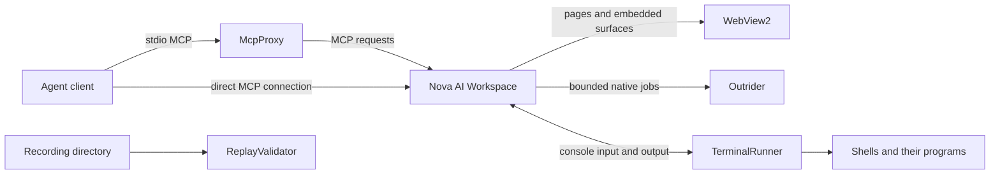

# Components and Processes

Nova uses several processes with different lifetimes. Seeing more than one Nova-related entry in Task Manager is therefore expected. This guide explains what each process does and why it is separate.

| Process | Purpose | When to expect it |
| :--- | :--- | :--- |
| [`NovaAIWorkspace.exe`](nova-ai-workspace.md) | The main app, tabs, settings and agent tool server. | While Nova is running, including notification-area background mode. |
| [`NovaBrowser.Outrider.exe`](outrider.md) | Supervised native hardware probes and local speech work. | When a feature needs native work; helper sessions or one-shot jobs. |
| [`NovaBrowser.McpProxy.exe`](mcp-proxy.md) | Connects an agent's standard-input/output MCP transport to Nova. | While a configured agent client is connected through the proxy. |
| [`NovaBrowser.TerminalRunner.exe`](terminal-runner.md) | Hosts pseudo consoles separately from the browser. | While terminal sessions need it; it can outlive the Nova window. |
| [`NovaBrowser.ReplayValidator.exe`](replay-validator.md) | Checks recording manifests and inventories artifacts; current replay coverage is limited. | When explicitly invoked for recording diagnostics or validation. |
| [`msedgewebview2.exe`](webview2-and-child-processes.md) | Microsoft's Chromium-based browser runtime. | While Nova's WebViews are active; multiple subprocesses are normal. |

Shells and agent CLIs such as PowerShell, Claude Code or Codex can appear underneath terminal or scheduled work. They are the selected programs, not additional Nova helper binaries.

## Why Separate Processes?

The boundaries solve different problems: Outrider contains native failures; TerminalRunner keeps console lifetimes independent; McpProxy adapts the connection transport; ReplayValidator inspects recordings outside the interactive app. WebView2 supplies the browser engine's own multiprocess architecture.

The MCP proxy is not a web-traffic proxy, and TerminalRunner is not Outrider. Closing a helper can interrupt the feature it serves. In particular, closing TerminalRunner ends its hosted terminals, even if the Nova window is already closed.

These names describe expected components, not proof that an arbitrary file with the same name is genuine. The main executable ships at the installation root, McpProxy under `tools/`, and the other Nova helpers alongside the app; Outrider also has an isolated copy under `outrider/`. WebView2 comes from Microsoft's runtime installation.

## How the Components Work Together

The diagram shows responsibility, rather than a promise that every box is always running. ReplayValidator is invoked separately; opening Nova does not automatically start a recording analysis. Scheduled task executors also have their own launch lifecycle and should not all be attributed to TerminalRunner.

## Choose the Page for Your Question

| Question | Start here |
| :--- | :--- |
| What keeps working when I hide or quit Nova? | [Main process](nova-ai-workspace.md) and [TerminalRunner](terminal-runner.md). |
| What protects the browser from a hanging device driver? | [Outrider](outrider.md). |
| Why does an agent launch another Nova executable? | [McpProxy](mcp-proxy.md). |
| Why did a command keep running after its tool call timed out? | [TerminalRunner](terminal-runner.md). |
| What does a recording validation pass actually establish? | [ReplayValidator](replay-validator.md). |
| Why are there so many runtime or shell processes? | [WebView2 and child processes](webview2-and-child-processes.md). |

Each page explains capabilities, an example workflow and the boundary of what it guarantees. Core-feature pages describe the user-facing behaviour across components; these pages explain which process carries which part of that work.

## Learn More

* [Core features](../core-features/README.md) — The capabilities these components support.
* [Agent integration](../integration/README.md) — Connecting an agent client.
* [Diagnostics](../troubleshooting/diagnostics.md) — Investigating a runtime problem.
* [Component inventory](components.json) — Executable names and their documentation pages.
