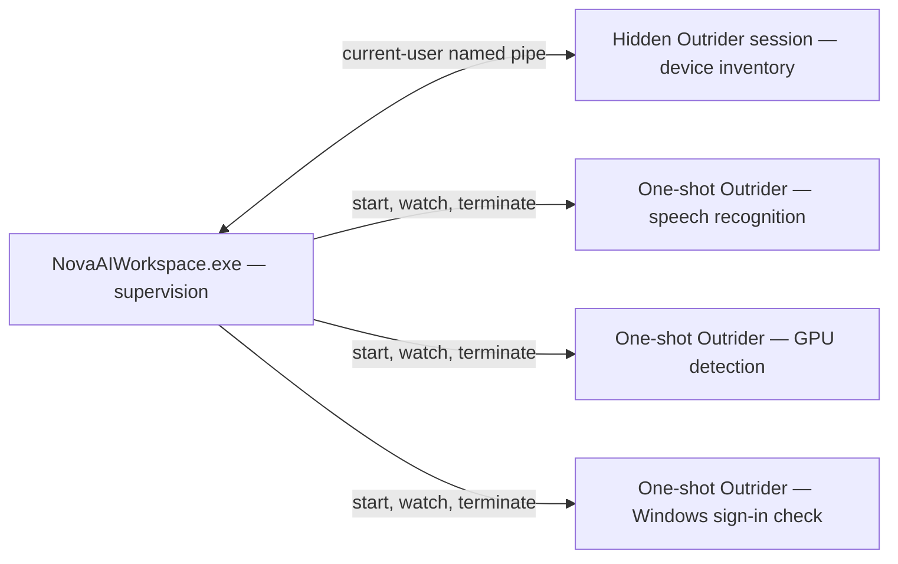

# Nova Outrider — Native Process Boundary

**Executable:** `NovaBrowser.Outrider.exe`.

Outrider is Nova's supervised helper for native work that can hang or crash outside normal managed exception handling: device enumeration, GPU capability detection, local speech recognition and the Windows sign-in check used when Windows Hello is unavailable. It ships with `NovaAIWorkspace.exe` so that a failed driver or native library can be contained in a disposable helper process while your browser tabs remain available.

## A Concrete Example: A Camera Driver Stops Responding

You open a camera list, and a driver hangs during enumeration. Nova waits until the probe's deadline, then reports a degraded result with a reason. Repeated inventory timeouts cause Nova to end the helper session and temporarily pause further probes before attempting a fresh helper.

An unavailable inventory does not establish that the computer has no cameras. It means the probe could not supply a reliable list. The boundary cannot repair a broken driver or make unsupported hardware work.

## Why Native Work Needs a Process Boundary

Windows device APIs, driver calls and native speech-recognition libraries can fail in ways a managed exception handler cannot catch. A faulty virtual camera driver, an unsupported CPU instruction or a corrupt model file should not close every tab and stop every running agent workflow.

Outrider provides fault isolation in the current user's Windows context. It is not an operating-system security sandbox and does not grant permissions or authorize agent actions. [Sandboxes](../../core-features/sandbox-isolation/README.md) separate website sessions; [Agent Awareness Gates (AAG)](../../core-features/agent-awareness-gates-aag/README.md) check action prerequisites; the [vault](../../core-features/privacy/vault-and-secrets/README.md) controls saved-credential delivery.

## Capabilities

| Work | What Outrider supplies | Where Nova uses it |
| :--- | :--- | :--- |
| DirectShow camera inventory | Video-input devices exposed through the driver stack. | Camera choices and device information. |
| Windows media-device inventory | Camera, microphone and speaker information available through Windows device APIs. | Settings, site permission prompts, site information and `nova.permission_center_get`. |
| GPU capability detection | Information for local speech-recognition configuration. | Transcription settings. |
| Local speech recognition | A transcription result from an audio file and a local model. | Transcription window and `nova.media_transcribe_start`. |
| Windows credential verification | The outcome of a Windows sign-in check. | Saved-password reveal or export when Windows Hello is unavailable. |

Outrider does not decide which device a website may access or whether a saved password may be delivered. Nova owns those decisions. Speech recognition also needs the appropriate local model; the presence of the helper alone does not mean transcription is configured.

## When It Runs

Device inventory uses an on-demand hidden helper session. Speech recognition, GPU detection and credential verification use fresh one-shot helper processes. More than one Outrider process can therefore be expected during concurrent native work.

* **Shared inventory session:** Nova starts the hidden helper on first use. A current-user named pipe carries framed requests and results. Nova verifies the connecting helper's identity, handshake and supported capabilities before using it. The session can handle up to three jobs concurrently.
* **One-shot work:** Each invocation performs one specific job and exits. Nova supervises its progress and lifetime. Credential verification stays outside the shared inventory worker because an OS credential dialog and driver inventory have different failure characteristics.

The installation includes an isolated Outrider folder as well as the helper at the installation root. These are deployment copies of the same component, not two different products.

## Failure and Recovery

* **Bounded work:** Requests and messages have limits, and each job has a deadline. Nova can terminate a helper that stops responding.
* **Per-job failure:** An inventory request that misses its deadline returns an empty result with a failure reason. Other active requests can continue; repeated timeouts can end the shared session and trigger a temporary pause before recovery.
* **No retry in the browser process:** Nova returns a degraded result instead of repeating the same failed native probe inside the interactive app.
* **Lifecycle supervision:** The shared inventory worker watches its parent and stops when Nova is gone. One-shot jobs have their own supervision and deadlines.
* **Decisions stay in Nova:** Outrider reports results; permission and trust decisions remain with the main app.

Ending Outrider in Task Manager interrupts the associated native work. Inspect the feature's reported failure before repeatedly launching the same job. A degraded inventory result should remain distinguishable from a successful result containing no devices.

## Related Documentation

* [Media Intelligence](../../core-features/media-intelligence/README.md) — Media features and their boundaries.
* [Local Speech Transcription](../../core-features/media-intelligence/transcription/README.md) — Models, recognition and cancellation.
* [Devices & Permissions](../../core-features/media-intelligence/devices-and-permissions/README.md) — Camera, microphone and speaker access.
* [Native Dialogs & UI Prompts](../../core-features/native-dialogs-and-prompts/README.md) — Dialogs outside the page.
* [TerminalRunner](../terminal-runner.md) — The separate helper for console work.

[All components and processes](../README.md)
