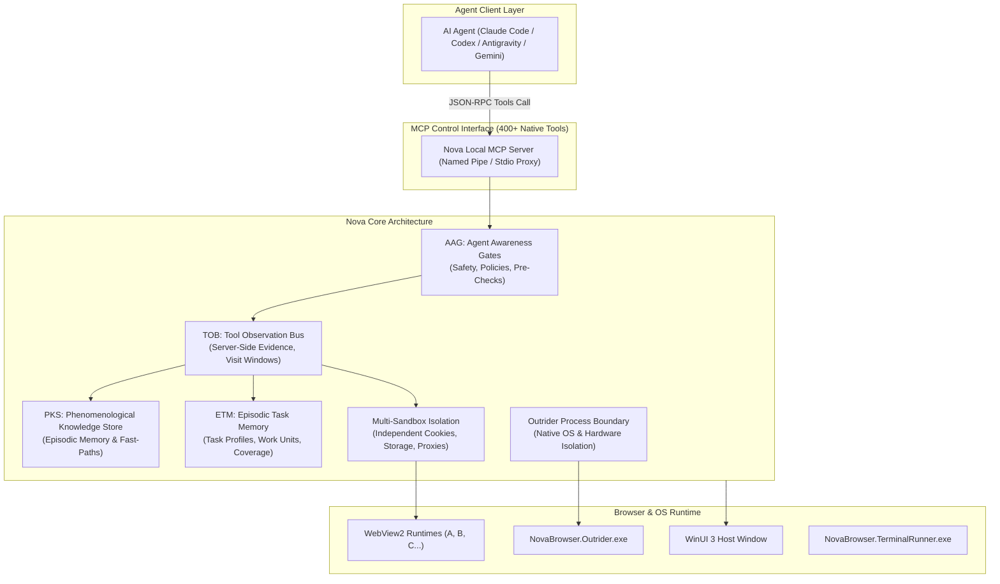

# Nova AI Workspace — Core Features & Architectural Hub

> [!NOTE]
> This hub provides a structured architectural overview of all 25 core technologies powering **Nova AI Workspace** (`NovaAIWorkspace.exe`). It connects high-level system architecture with in-depth subsystem specifications and production implementations.

---

## Executive Summary

Traditional web browsers were historically designed for human hand-eye coordination. Autonomous AI agents (such as Claude Code, OpenAI Codex, Antigravity, and Gemini) interacting with web pages via screen captures and simulated mouse coordinates suffer from massive token consumption, latency, visual jitter, obscured elements, and done hallucinations.

**Nova AI Workspace** solves these fundamental flaws through a native, deterministic desktop and browser runtime built on **.NET 8, WinUI 3, and Microsoft WebView2**. Through an optimized Model Context Protocol (MCP) interface with over 400 native tools, agents gain complete semantic control, self-learning fast-paths, and multi-layered safety verification.

---

## The 6 Architectural Pillars

---

## Core Features Matrix (25 Technologies)

| Core Feature | Problem Solved | Key Component | Primary MCP Tools | Deep-Dive Guide |
| :--- | :--- | :--- | :--- | :--- |
| **[PKS & Continuous Learning](pks.md)** | Eliminates expensive, repeated exploration of known sites; slashes vision token overhead | SQLite store (`pks.db`), 4-phase loop (L0 $\rightarrow$ L1 $\rightarrow$ L2) | `nova.pks_get`, `nova.pks_upsert`, `nova.pks_match`, `nova.learn_promote` | [pks.md](pks.md) |
| **[Agent Awareness Gates (AAG)](aag.md)** | Prevents blind clicks, auth destruction, loops, and unverified done claims | Pre-checks, Evidence Verification, Multi-Agent Lease Locking | `nova.guarded_*`, `nova.task_instance_verify`, `nova.tab_claim` | [aag.md](aag.md) |
| **[Tool Observation Bus (TOB)](tob.md)** | Decouples agent claims from server-side truth; tamper-proof evidence ledger | `DispatchEnvelopeBuilder`, `tob_tool_observation`, `VisitWindowBuilder` | `nova.task_instance_verify`, `task_instance_progress`, `task_instance_get` | [tob.md](tob.md) |
| **[Episodic Task Memory (ETM)](etm-and-task-memory.md)** | Prevents premature abandonment in large audits ("17/120 audited – done!"); enforces work units | `McpTaskMemoryHandler`, Task Profiles, `TaskUrlCoverageTracker` | `nova.task_match`, `nova.task_instance_create`, `task_instance_complete` | [etm-and-task-memory.md](etm-and-task-memory.md) |
| **[Learning Pipeline (ALP)](learning-pipeline-alp.md)** | Intelligent bridge between observation diary (LCJ) and durable PKS knowledge | `LearningSuggestor`, `CandidateGenerator`, SimHash quality layer | `nova.learn_suggest`, `nova.learn_generate`, `nova.learn_promote` | [learning-pipeline-alp.md](learning-pipeline-alp.md) |
| **[Browser Memory & Board](browser-memory-and-board.md)** | Personal operator notes with natural time-decay and multi-agent whiteboard | `BrowsingMemoryRepository` (half-lives 14-120d), `KnowledgeBoardStore` | `nova.memory_note`, `nova.memory_recall`, `nova.board_get` | [browser-memory-and-board.md](browser-memory-and-board.md) |
| **[Auth Surface Detection (ASD)](auth-surface-detection.md)** | Universal login-wall, MFA, and auth state classification without fragile hardcoding | `AuthProbeScript`, `AccountSurfaceDetector`, Tri-State logic (`Unknown`) | `nova.guarded_login`, `nova.ok_observe`, `auth.loggedIn` | [auth-surface-detection.md](auth-surface-detection.md) |
| **[Native Dialogs & Prompts](native-dialogs-and-prompts.md)** | Solves thread-blocking Win32 system dialogs (file pickers, HTTP auth, SSL warnings) | `NativeDialogAutomationHeuristics`, `ScriptDialogInterceptionPolicy` | `nova.ui_inspect_native_dialog`, `ui_confirm_native_dialog`, `ui_*_resolve` | [native-dialogs-and-prompts.md](native-dialogs-and-prompts.md) |
| **[Humanized Input Engine](humanized-input-engine.md)** | Bot-resilient Bézier mouse movements with micro-jitter and piercing of closed Shadow DOMs | `ShadowDomSelectorEngine` (` >>> `), `DragDropPolyfillScript`, KeyMapper | `nova.input_drag_humanized`, `nova.click_selector`, `nova.input_text` | [humanized-input-engine.md](humanized-input-engine.md) |
| **[Multi-Sandbox Isolation](sandbox-isolation.md)** | Zero session bleeding across accounts (e.g. personal, corporate, staging) in a single host | Partitioned `EBWebView` profiles, storage, proxies & fingerprints | `nova.sandbox_context`, `nova.resolve_sandbox`, `nova.proxy_switch` | [sandbox-isolation.md](sandbox-isolation.md) |
| **[Outrider Process Boundary](outrider-boundary.md)** | Protects WinUI 3 & WebView2 from hangs and crashes caused by drivers/WinRT/hardware | Isolated child process (`NovaBrowser.Outrider.exe`) with named pipe & watchdog | `nova.hardware_diagnostics_*`, `nova.media_*`, `nova.perceive` | [outrider-boundary.md](outrider-boundary.md) |
| **[Terminal Workspaces](terminal-workspaces.md)** | Autonomous CLI, git, and build execution embedded directly within the workspace | ConPTY runner (`NovaBrowser.TerminalRunner.exe`), survives app reloads | `nova.terminal_open`, `nova.terminal_run_command`, `nova.terminal_read` | [terminal-workspaces.md](terminal-workspaces.md) |
| **[Agent-Authored Plugins](plugins.md)** | Tailored website extensions authored on-the-fly without C# recompilation | Jint JavaScript VM, `PluginEngineDispatcher`, Shadow DOM overlays | `nova.plugin_create`, `nova.plugin_test`, `nova.plugin_inspect` | [plugins.md](plugins.md) |
| **[Crawler & Discovery](crawler-and-discovery.md)** | Fast, structured mapping of large web domains without manual tab navigation | Breadth-First-Search (BFS) in headless WebViews, persistent `crawl.db` | `nova.crawl_start`, `nova.site_urls`, `nova.explore_surface` | [crawler-and-discovery.md](crawler-and-discovery.md) |
| **[EVM & Visual Evidence](evm-and-visual-evidence.md)** | Guards against research hallucinations and eliminates 4K vision token waste | Claim-testing engine, lossless PNG proof-crops, visual diffing engine | `nova.capture_screenshot`, `nova.screenshot_diff`, `audit_accessibility` | [evm-and-visual-evidence.md](evm-and-visual-evidence.md) |
| **[Scheduled Tasks](scheduled-tasks.md)** | Unattended recurring background jobs on cron schedules without open prompts | Fire-and-collect scheduler thread, task workspaces, secure secret injection | `nova.scheduled_task_create`, `scheduled_task_runs`, `workspace_*` | [scheduled-tasks.md](scheduled-tasks.md) |
| **[Site Data Management](site-data-management.md)** | Precise programmatic control over cookies (including HttpOnly), LocalStorage, and cache | Native WebView2 CookieManager binding, Public Suffix validator | `nova.cookie_list`, `nova.cookie_set`, `nova.storage_inspect` | [site-data-management.md](site-data-management.md) |
| **[Proxy & Network Engine](proxy-and-network.md)** | Granular SOCKS5/HTTP routing per sandbox with active WebRTC leak protection | Profile manager, dynamic live switching, CDP network interception | `nova.proxy_switch`, `nova.proxy_status`, `network_intercept_*` | [proxy-and-network.md](proxy-and-network.md) |
| **[Operational Knowledge (OK)](operational-knowledge.md)** | Real-time state intelligence on tab accounts, active models, and service capabilities | Observation log, versioned facts, auto-surfacing domain notes | `nova.ok_observe`, `nova.ok_signal_schema`, `nova.domain_note` | [operational-knowledge.md](operational-knowledge.md) |
| **[Session Recording & Replay](session-recording.md)** | Forensic recording and time-travel debugging of ephemeral bugs and interaction chains | CDP domain streaming, DOM mutation observer, DPAPI DEK manager | `nova.session_record_start`, `session_record_export`, `record_query` | [session-recording.md](session-recording.md) |
| **[Media & Speech Intelligence](media-intelligence.md)** | Local, private audio transcription without third-party cloud API costs | In-process/Outrider Whisper.cpp, dual-budget calculator, WebAudio hooks | `nova.media_transcribe_start`, `media_capture_start`, `media_activity_*` | [media-intelligence.md](media-intelligence.md) |
| **[Connectors & Protocols](connectors-and-protocols.md)** | Secure email (IMAP/SMTP) and file transfer (SFTP/FTP) with secret masking | MailKit, SSH.NET with bounded streams, traversal guards, rate limiters | `nova.mail_*`, `nova.sftp_*`, `nova.connector_*`, `external_*` | [connectors-and-protocols.md](connectors-and-protocols.md) |
| **[Anti-Fingerprint & Stealth](fingerprint-and-identity.md)** | Protection against bot detection and cross-site tracking via consistent noise | Deterministic seeding (`ComputeSeed`), Canvas/Audio hooks, Client Hints | `nova.fingerprint_*`, `nova.identity_*`, `nova.emulation_*` | [fingerprint-and-identity.md](fingerprint-and-identity.md) |
| **[Secure Vault & Zero-Leak Secrets](vault-and-secrets.md)** | Autofills credentials into DOM input elements without leaking plaintext to the LLM | DPAPI-encrypted `vault.dat`, origin binding (PSL), ephemeral `SecretRef` | `nova.type_selector_secret`, `nova.vault_*`, `nova.secret_*` | [vault-and-secrets.md](vault-and-secrets.md) |
| **[Closed-Loop System (CLS)](closed-loop-system.md)** | Eliminates false click confirmations and autonomously resolves cookie banners | 4-pillar control loop (PKS/OK/Goal/Notes), TransitionVerifier, AutoApply | `nova.goal_register`, `nova.run_sequence`, `nova.phenomenon_apply` | [closed-loop-system.md](closed-loop-system.md) |

---

## Detailed Architectural Guides

1. **[PKS & Continuous Learning Engine (`pks.md`)](pks.md)**
   Self-learning procedural memory: How interaction patterns and UI phenomena become high-speed, token-free fast-paths.
2. **[Agent Awareness Gates (`aag.md`)](aag.md)**
   Determinism instead of blind trust: Multi-stage pre-execution safety and empirical evidence verification.
3. **[Tool Observation Bus & Evidence Ledger (`tob.md`)](tob.md)**
   Objective server-side truth: Canonical dispatch envelopes, dwell-time calculation, and tamper-proof visit windows.
4. **[Episodic Task Memory & Task URL Coverage (`etm-and-task-memory.md`)](etm-and-task-memory.md)**
   Guarding against premature task abandonment: Task profiles, work units, and exhaustive URL coverage verification.
5. **[Agent Learning Pipeline & Candidate Journal (`learning-pipeline-alp.md`)](learning-pipeline-alp.md)**
   The quality filter for procedural knowledge: Statistical evaluation of LCJ candidate observations into permanent PKS playbooks.
6. **[Browser Memory & Knowledge Board (`browser-memory-and-board.md`)](browser-memory-and-board.md)**
   Personal context & team collaboration: Domain-bound operator memory with mathematical decay and multi-agent shared board.
7. **[Auth Surface Detection & Login Verification (`auth-surface-detection.md`)](auth-surface-detection.md)**
   Universal classification of login walls, MFA prompts, and authentication states with Tri-State safety (`Unknown` $\neq$ `false`).
8. **[Native Dialogs & UI Prompts Automation (`native-dialogs-and-prompts.md`)](native-dialogs-and-prompts.md)**
   Overcoming Win32 thread blocking: Asynchronous inspection and programmatic resolution of file pickers, auth modals, and print prompts.
9. **[Humanized Input & Shadow DOM Traversal (`humanized-input-engine.md`)](humanized-input-engine.md)**
   Natural mouse kinematics (Bézier physics curves, micro-jitters) and deep Shadow DOM piercing (` >>> `).
10. **[Multi-Sandbox Session Isolation (`sandbox-isolation.md`)](sandbox-isolation.md)**
    Identity and state partitioning: How multiple browser personas operate concurrently without session leakage.
11. **[Outrider Process Boundary (`outrider-boundary.md`)](outrider-boundary.md)**
    Hardware resilience and crash isolation: Why risky native system calls are isolated into a dedicated helper process.
12. **[Terminal Workspaces & ConPTY (`terminal-workspaces.md`)](terminal-workspaces.md)**
    Embedded pseudo-terminals: Enabling agents to run build, git, and shell workflows with scrollback persistence.
13. **[Agent-Authored Plugins (`plugins.md`)](plugins.md)**
    Dynamic Jint JavaScript runtime: Allowing agents to author custom scraping tools, macros, and overlays on-demand.
14. **[Autonomous Crawler & Surface Explorer (`crawler-and-discovery.md`)](crawler-and-discovery.md)**
    Structured site discovery: Headless BFS crawlers, sitemap parsing, and persistent site URL index database.
15. **[Evidence Verification Mode & Visual Evidence (`evm-and-visual-evidence.md`)](evm-and-visual-evidence.md)**
    Visual and factual truth: Claim tests and high-density proof-crops instead of wasteful full-viewport vision prompts.
16. **[Scheduled Tasks & Background Automation (`scheduled-tasks.md`)](scheduled-tasks.md)**
    Autonomous background execution: Cron scheduling, persistent run logs, and workspace-scoped secret injection.
17. **[Site Data & Privacy Management (`site-data-management.md`)](site-data-management.md)**
    Cookies & web storage: Full programmatic control over HttpOnly cookies, Public Suffix bounds, and DOM cache clearing.
18. **[Proxy Routing & Stealth Network (`proxy-and-network.md`)](proxy-and-network.md)**
    SOCKS5/HTTP routing per sandbox, WebRTC IP leak guards, and CDP-level network interception.
19. **[Operational Knowledge (`operational-knowledge.md`)](operational-knowledge.md)**
    Real-time semantic facts: Tab status, dynamic provider capabilities, and auto-surfacing domain notes.
20. **[Session Recording & Time-Travel Debugging (`session-recording.md`)](session-recording.md)**
    Forensic replay: Full CDP event streaming, DOM mutations, HAR exports, and DPAPI encryption.
21. **[Media Intelligence & Speech Transcription (`media-intelligence.md`)](media-intelligence.md)**
    On-device Whisper.cpp inference in Outrider, audio duration probes, WebAudio/MSE hooks, and device audits.
22. **[Connectors & Protocol Gateways (`connectors-and-protocols.md`)](connectors-and-protocols.md)**
    Managed email (IMAP/SMTP) and file transfer protocols (SFTP/FTP) with origin-bound credential isolation.
23. **[Anti-Fingerprint Protection & Stealth Identity (`fingerprint-and-identity.md`)](fingerprint-and-identity.md)**
    3-tier hierarchy, deterministic Canvas/Audio noise seeding, and synchronous high-entropy Client Hints.
24. **[Secure Vault & Zero-Leak Secret Injection (`vault-and-secrets.md`)](vault-and-secrets.md)**
    Password and API token injection directly into DOM elements without exposing plaintext to LLM context.
25. **[Closed-Loop System (CLS) & Ambient Auto-Apply (`closed-loop-system.md`)](closed-loop-system.md)**
    The closed feedback loop for browser automation, eliminating false confirmations and self-healing cookie banners.

---

## Related Documentation

* **[Getting Started Hub](../getting-started/README.md)** — Installation, system requirements, and first-run guide.
* **[Agent Integration Hub](../integration/README.md)** — Connecting Claude Code, Codex, Antigravity, and custom SDKs.
* **[MCP Reference Index](../mcp-reference/README.md)** — Complete Model Context Protocol specifications and tool catalog.
* **[Troubleshooting & Diagnostics](../troubleshooting/README.md)** — Resolving connection drops, process recovery, and logs.
