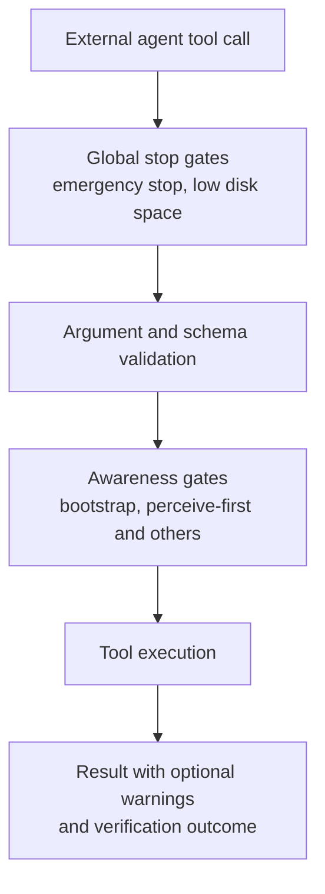

# Agent Awareness Gates (AAG) & Execution Verification Framework

> [!NOTE]
> Agent Awareness Gates (AAG) are checks in Nova's tool pipeline that interrupt an agent when an important precondition is missing: the agent has not loaded a tool bundle, has not looked at the page since it navigated, the user pressed the emergency stop, or the disk is almost full. Depending on the gate and its setting, AAG adds a warning to the tool result or blocks the call with a structured explanation of what to do next.

---

## 1. Problem Statement

In unprotected browser automation, autonomous LLM agents exhibit common failure patterns:
* **False Belief of Success:** The agent clicks "Save", but a loading spinner was active or an invisible backdrop intercepted the click. The agent reports success although nothing was saved.
* **Acting Blind:** The agent types into a page right after navigating, without having looked at it, and lands in the wrong element.
* **Colliding Concurrent Actions:** Multiple agents control the same browser tab concurrently and overwrite each other's input.
* **Token Waste from Missing Initialization:** An agent probes individual tools instead of loading a structured tool bundle first.

AAG and the related verification features address these failure modes.

---

## 2. Where the Checks Sit

The gates apply to calls from external agents. Internal sequences that Nova runs itself are not interrupted by them.

---

## 3. The Checks in Detail

### Global Stop Gates
* **Emergency stop:** The **Emergency stop** menu item interrupts running agents, the agent interface (MCP) and running scripts. Until the user chooses **Release emergency stop**, every new tool call is refused (`safety.emergency_stop`); there is no tool to bypass it.
* **Low disk space:** If a storage location Nova or the agent writes to has 500 MB or less free space, external tool calls are refused (`safety.disk_space_low`) until more space is available.

### Argument Validation
Parameter types and allowed values are checked before a tool runs; invalid arguments fail immediately with JSON-RPC error code `-32602`.

### Awareness Gates
* **Bootstrap (`setup.bootstrap_required`):** The first tool call of a session that has not loaded a tool bundle via `nova.tools_bundle` gets a one-time `bootstrapWarning` naming the recommended bundle (usually `browser_automation`). Once a matching bundle has been loaded successfully, the gate stays quiet. Read-only discovery tools such as `nova.tabs`, `nova.get_instructions` and `nova.app_info` are exempt.
* **Perceive-first (`safety.perceive_first`):** Flags interactive calls on a tab that the agent has not perceived since its last navigation; the resolution is `nova.perceive` with `mode='summary'`.
* Both gates can run in the modes Off, Warn, ShadowBlock or Block (default: Warn). In Block mode, the call returns `isError: true` with the gate ID and the suggested resolution instead of running.

### Multi-Agent Lease Locking (Tab Claims)
* An agent reserves exclusive write access to a tab via `nova.tab_claim` (lease of 120 seconds by default, 5 seconds to 30 minutes).
* Tab-targeted calls from other agents are refused while the lease is active, until it expires or is released via `nova.tab_release`.
* This prevents overwritten input and duplicate concurrent form submissions.

### Destructive Menu Warnings
After a right-click opens a context menu, Nova reads the menu and reports destructive entries (such as delete) in the tool result. The scan only recognizes menus that expose ARIA roles or an obvious menu marker; a menu it cannot read is reported as such, not as harmless.

### Outcome Verification
Interactive tools such as `nova.click_selector` accept a `transitionContract` with preconditions (checked before the click) and postconditions (checked after it). The result reports whether the outcome was verified (`verified_success`, `verified_fail`, `indeterminate`) together with retry advice. See the [Closed-Loop System (CLS)](closed-loop-system.md). Calls that a gate blocked are recorded by the [Tool Observation Bus (TOB)](tob.md) as blocked observations.

---

## 4. The "Guarded" Tool Family

Nova provides guarded macros for common commit points. Each wraps `nova.click_selector` and adds a matching transition contract automatically:

| Tool | Guarded Workflow |
| :--- | :--- |
| `nova.guarded_send_message` | Sends a chat message. With `text`, Nova finds the composer, types the text, verifies it by reading it back, finds the send button and clicks it in one call. |
| `nova.guarded_submit_form` | Clicks a submit button with a submit-focused transition contract. |
| `nova.guarded_login` | Clicks a login submit with a contract that fails on explicit authentication errors and treats a continued login flow (for example a second factor) as an ambiguous follow-up state, not a hard failure. |
| `nova.guarded_switch_model` | Clicks a model switch with a select-option transition contract. |
| `nova.guarded_switch_sandbox` | Clicks a sandbox/workspace switch with a select-option transition contract. |

---

## 5. Under the Hood

* **Destructive Menu Scan:** `DestructiveMenuScanner`
* **Dispatch Observation Envelopes:** `DispatchEnvelopeBuilder`
* **Outcome Verification:** `TransitionVerifier`

---

## Related Documentation

* **[Tool Observation Bus (TOB)](tob.md)** — Server-side record of what agents actually executed.
* **[Closed-Loop System (CLS)](closed-loop-system.md)** — Verified state transitions.
* **[Input Dispatch & Shadow DOM Traversal](humanized-input-engine.md)** — How clicks, keys and drags reach the page.
* **[MCP Reference Index](../mcp-reference/README.md)** — Catalog of all native tools.
