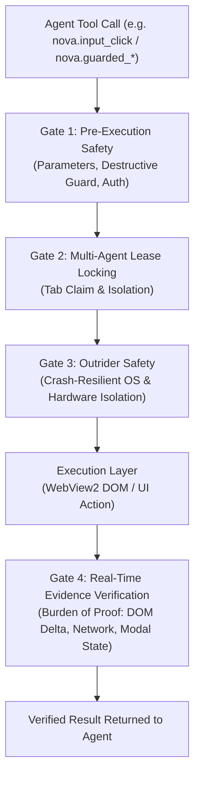

# Agent Awareness Gates (AAG) & Execution Verification Framework

> [!NOTE]
> The Agent Awareness Gates (AAG) framework protects against accidental destruction, race conditions, and done hallucinations. It enforces deterministic preconditions before an action executes and requires empirical proof in the DOM or network before an agent is allowed to declare a step complete.

---

## 1. Problem Statement: The "Done Hallucination"

In unprotected browser automation, autonomous LLM agents exhibit common failure patterns:
* **False Belief of Success:** The agent clicks "Save", but a loading spinner was active or an invisible modal backdrop intercepted the click. The agent hallucinates "Successfully saved", while user data is permanently lost.
* **Accidental Destruction:** During complex form interactions, an agent accidentally clicks "Delete" or "Cancel" instead of "Submit".
* **Colliding Concurrent Actions (Race Conditions):** Multiple parallel subagents control the same browser tab concurrently, clobbering input fields and corrupting session state.
* **Token Waste from Missing Initialization:** An agent attempts blind individual tool calls instead of initializing with a structured tool bundle.

**AAG** resolves these vulnerabilities through a multi-tiered safety and verification pipeline.

---

## 2. The 4-Tier Protection Architecture

---

## 3. The Gates in Detail

### Gate 1: Pre-Execution Safety & Destructive Action Guards
Before a mutating command executes, Nova evaluates:
* **Strict Schema & Argument Validation:** Parameter types are strictly enforced; invalid arguments fail immediately with JSON-RPC error code `-32602`.
* **Destructive Action Guard:** Scans for dangerous UI triggers (e.g. "Delete Account", "Discard All Data") and requires explicit confirmation, preventing blind clicks.
* **Emergency Stop & Disk Space Gates:** Global emergency stop signals or low disk space conditions fail-closed immediately to protect local system integrity.

### Gate 2: Multi-Agent Lease Locking (Tab Claims)
Nova supports multi-agent workflows (e.g. specialized subagents for research, form filling, and monitoring):
* An agent reserves exclusive write access to a tab via `nova.tab_claim`.
* Every tab-targeted call is verified against the `claimOwner`. External tool calls are rejected until the lease expires (`leaseRemainingMs`) or is voluntarily released via `nova.tab_release`.
* Prevents corrupted input and duplicate concurrent form submissions.

### Gate 3: Outrider Process Boundary
High-risk native calls interacting with Windows hardware, COM, WinRT, or audio/video drivers are never executed in the main browser process. Instead, they are delegated across an isolated boundary to [`NovaBrowser.Outrider.exe`](outrider-boundary.md).

### Gate 4: Real-Time Evidence Verification (Burden of Proof & TOB Integration)
The core anti-hallucination engine, powered by the [Tool Observation Bus (TOB)](tob.md). An agent cannot consider an action objective achieved until server-side observations verify the postconditions:
* `absent`: An expected element (e.g. a loading spinner or confirmation dialog) has demonstrably disappeared from the DOM.
* `wait`: The expected target element or success alert has materialized in the DOM.
* `topmost_clickability_restored`: Click-blocking backdrops and modals have been completely dismissed.
* `network_delta`: The corresponding HTTP POST request was completed with a successful status code (2xx/3xx).
* `strong_visit_window`: The agent has demonstrably observed the page with sufficient dwell time ($\ge$ 1.0s) and a verified read signal (`tob_visit_window`).

---

## 4. Mandatory Bootstrap Gate

To prevent agents from wasting context tokens querying dozens of individual tool schemas, AAG enforces a **Mandatory Bootstrap**:
1. When an agent invokes an interactive tool in a fresh session without having called `nova.tools_bundle`, AAG injects a structured `bootstrapWarning`.
2. The warning advises the agent which tool bundle is recommended for the current workflow intent (e.g. `browser_automation`, `plugin_management`, `crawler_ops`).
3. Once the matching bundle is activated, the gate is transparently deactivated for the remainder of the session.

---

## 5. The "Guarded" Tool Family

Nova provides specialized high-level guarded tools for critical user interactions that verify pre- and post-conditions atomically:

| Tool | Guarded Workflow |
| :--- | :--- |
| `nova.guarded_send_message` | Dispatches chat messages only if the composer field contains verified text and confirms response streaming. |
| `nova.guarded_submit_form` | Validates required input fields prior to submission and verifies form dismissal or page navigation. |
| `nova.guarded_login` | Executes login workflows using credentials from the secure vault under Auth Surface Detection (ASD) watch. |
| `nova.guarded_switch_model` | Switches AI models in supported web interfaces and verifies that the selected dropdown pill updated. |

---

## 6. Production Implementation References

* **AAG Block Results & Validation:** `NovaBrowser/Core/Mcp/McpServer.AagBlockResult.cs`
* **Destructive Action Scanners:** `NovaBrowser/Core/Safety/DestructiveMenuScanner.cs`
* **Evidence & Screenshot Budgets:** `NovaBrowser/Core/Mcp/McpServer.ExecutionScreenshots.AagBudget.cs`
* **Tab Claims & Lease Locking:** `NovaBrowser/Core/Mcp/McpServer.ExecutionTabs.cs`
* **Tool Observation Bus & Envelopes:** `NovaBrowser/Core/Tob/DispatchEnvelopeBuilder.cs`

---

## Related Documentation

* **[Tool Observation Bus (TOB)](tob.md)** — Server-side evidence ledger and tamper-proof visit windows.
* **[Closed-Loop System (CLS)](closed-loop-system.md)** — Closed feedback loop for automated state verification.
* **[Humanized Input Engine](humanized-input-engine.md)** — Bot-resilient physical mouse and keyboard execution.
* **[MCP Reference Index](../mcp-reference/README.md)** — Complete catalog of all 400+ native tools.
