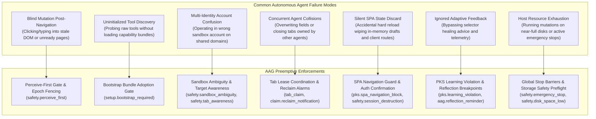
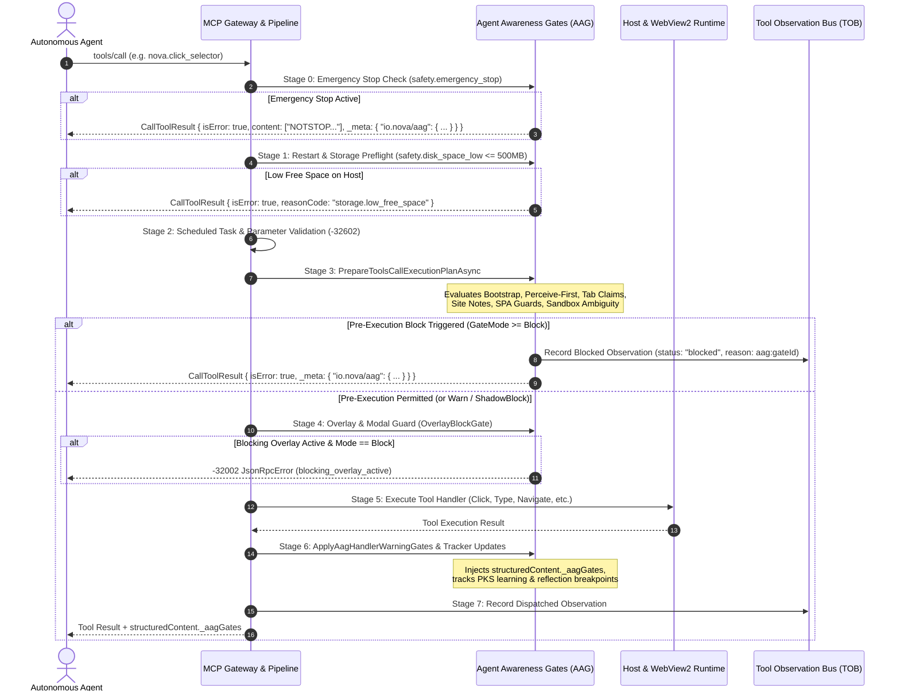
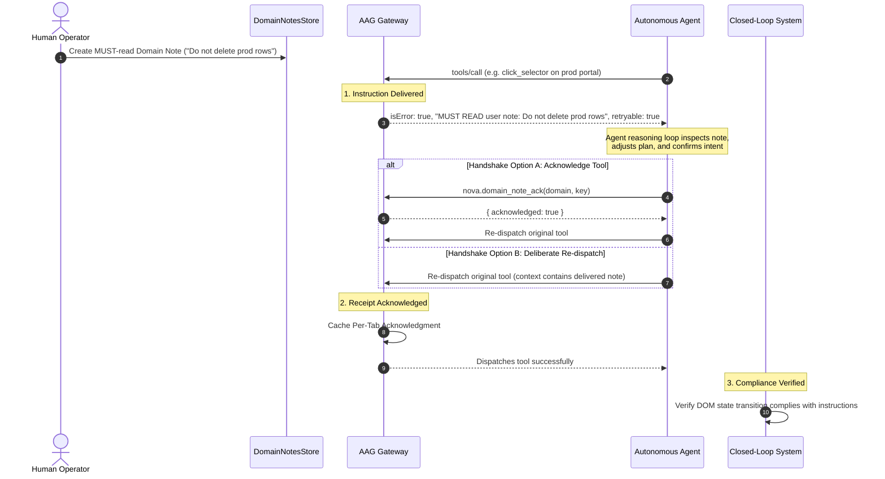
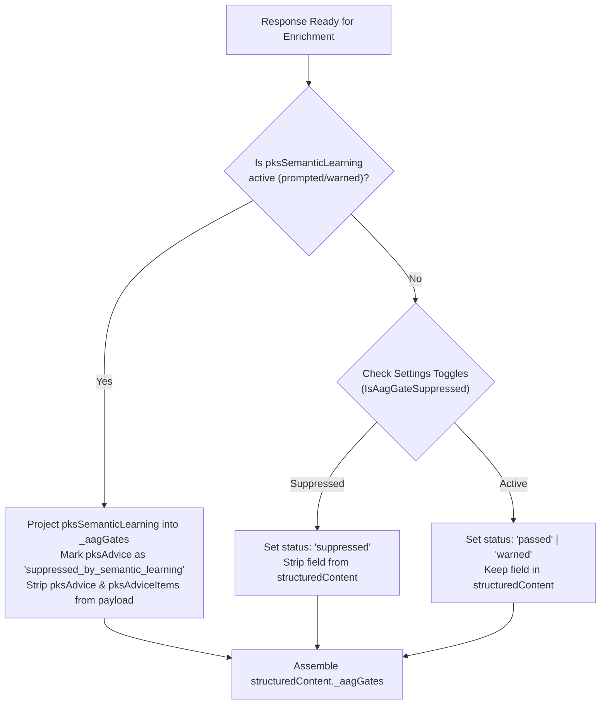
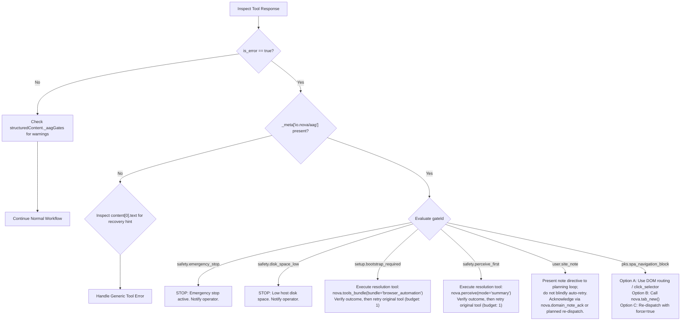

# Agent Awareness Gates (AAG)

> „Manchmal brauchen sie nur einen kleinen Bump in die richtige Richtung.“
>
> — Joel, 2025

> [!NOTE]
> Agent Awareness Gates (AAG) form Nova AI Workspace's preemptive policy and situational awareness subsystem within the Model Context Protocol (MCP) tool execution pipeline. Acting prior to tool dispatch, AAG evaluates selected operational preconditions—such as tool bundle initialization, live DOM observation freshness, multi-agent tab leases, sandbox identity boundaries, user-defined site policies, Single Page Application (SPA) session persistence, host storage headroom, and process-wide emergency stops. Depending on configured enforcement modes (`Off`, `Warn`, `ShadowBlock`, `Block`), Nova can warn the agent, simulate a block for operational diagnostics, or reject the action with structured, actionable recovery instructions.

---

## 1. The Problem & Core Philosophy

An AI agent navigates to a website and immediately attempts to click a button using a selector from an earlier page state. The selector may still exist in the DOM, but the page context, user account, or active tab may have shifted.

Without preemptive guardrails, autonomous agents execute discrete API or MCP calls based solely on past conversational memory. Unlike human operators who continuously observe visual feedback and notice UI transitions, an unguided agent exhibits classic automation failures:



### 1.1 Core Architectural Philosophy
> **AAG does not attempt to make an agent smarter through verbose prompt engineering.**
> Instead, it shifts observable execution preconditions out of unpredictable model compliance into the deterministic MCP execution layer.

AAG evaluates observable technical prerequisites at the protocol boundary. While the [Tool Observation Bus (TOB)](../tool-observation-bus-tob/README.md) logs what occurred for forensic auditing and the [Closed-Loop System (CLS)](../closed-loop-system-cls/README.md) verifies post-action visual state transitions, AAG governs whether an action is permitted to dispatch in the first place.

### 1.2 What AAG Is vs. What It Is Not
* **AAG evaluates observable preconditions:** It checks whether a read tool was dispatched, whether a bundle was registered, or whether an emergency stop is active.
* **AAG does not measure model comprehension:** Successfully executing a DOM read or evaluating a simple expression satisfies the technical gate, but does not prove that the LLM understood the page.
* **AAG does not verify post-action state:** Whether a button click successfully submitted a form or caused a modal to close is the domain of post-action outcome verification (CLS), not pre-dispatch gates.
* **AAG does not replace system security:** It operates alongside, but does not replace, OS-level process isolation, credential encryption, or host network firewalls.

---

## 2. Central Enforcement Matrix

The following matrix provides a complete reference for all awareness gates, their default enforcement tiers, affected tool scopes, and resolution pathways:

| Gate Identifier | Category | Default Mode | Affected Scope / Tools | Primary Runtime Effect | Agent Resolvable? | Bypass / Override Mechanism |
| :--- | :--- | :---: | :--- | :--- | :---: | :--- |
| `safety.emergency_stop` | **Unconditional Barrier** | Always Active | All MCP tools & background tasks | Hard execution halt; cancels running tasks | **No** (Operator only) | None (Host WinUI menu only) |
| `safety.disk_space_low` | **Unconditional Barrier** | Always Active | All mutating & persistent write tools | Preflight halt if free disk space $\le 500\text{ MB}$ | **No** (Host cleanup) | None (Fail-closed invariant) |
| `private_target_write` | **Unconditional Barrier** | Always Active | 22+ persistent storage tools (PKS, Notes, Memory) | Rejects durable writes originating from InPrivate tabs | **Yes** (Switch tab) | None (Privacy invariant) |
| `setup.bootstrap_required` | **Configurable Precondition** | `Warn` | Non-exempt browser automation tools | Blocks tools if capability bundle is not loaded | **Yes** | Call `nova.tools_bundle(bundle='browser_automation')` |
| `safety.perceive_first` | **Configurable Precondition** | `Warn` | Mutating UI tools (`click_selector`, `type_selector`, etc.) | Blocks interaction after navigation until page is observed | **Yes** | Call `nova.perceive`, read DOM/text, or wait for selector |
| `user.site_note` | **Configurable Precondition** | `Block` | Tools targeting domains with user MUST-read notes | Delivery block until directive receipt is acknowledged | **Yes** | Re-dispatch call OR call `nova.domain_note_ack` |
| `safety.overlay_detected` | **Configurable Precondition** | `ShadowBlock` | DOM interaction tools (`click_selector`, etc.) | Blocks click/type when full-screen modal/CMP covers element | **Yes** | Call `nova.cmp_apply` or `nova.dismiss_blockers` |
| `safety.native_dialog` | **Configurable Precondition** | Always Active | All browser interaction tools | Blocks DOM tools while host modal dialog is open | **Yes** | Invoke dialog resolver from `nextActions` payload |
| `pks.spa_navigation_block` | **Configurable Precondition** | `Block` | `nova.navigate`, `nova.reload` on detected SPAs | Blocks hard reload to protect in-memory client state | **Yes** | Use in-page DOM routing OR pass `force: true` |
| `safety.session_destruction` | **Configurable Precondition** | Always Active | Session-terminating navigations | Blocks navigation warning of session destruction | **Yes** | Pass `force: true` AND `confirmSessionDestruction: true` |
| `aag.screenshot_budget` | **Configurable Precondition** | `Block` | `capture_screenshot`, responsive captures | Downgrades payload to disk file or blocks $>50\text{ MB}$ | **Yes** | Downscale viewport or pass `force: true` ($1\text{ MB}-50\text{ MB}$) |
| `proxy.credentials_awareness` | **Configurable Precondition** | `Warn` | `nova.proxy_set_password` | Blocks password mutation if proxy bundle is unloaded | **Yes** | Call `nova.tools_bundle(bundle='proxy_management')` |
| `learn.onboarding_required` | **Configurable Precondition** | `Warn` | `get_instructions(mode='learn')` | Requires domain onboarding summary confirmation | **Yes** | Call `nova.learn_onboarding_confirm` |
| `pks.learning_violation` | **Configurable Precondition** | `Warn` | Actions ignoring selector healing advice | Blocks after 2 unfulfilled selector warnings | **Yes** | Call `nova.telemetry_report` or `nova.pks_patch` |
| `safety.backup_integrity` | **Advisory Nudge / Alarm** | Always Active | All tool responses | Injects persistent warning on every response until acknowledged | **Yes** | Call `nova.mail_backup_status` with `acknowledge=true` |
| `safety.tab_awareness` | **Advisory Nudge** | Always Active | Calls with implicit tab resolution | Injects tab resolution warning into response | **Yes** | Specify explicit `targetId` |
| `safety.sandbox_ambiguity` | **Advisory Nudge** | Always Active | Calls on domains with multiple active sandboxes | Injects identity disambiguation warning (1x per session) | **Yes** | Specify explicit sandbox or tab `targetId` |
| `efficiency.sequential_tool_calls` | **Advisory Nudge** | Always Active | 3+ consecutive sequential mutation calls | Recommends macro batching via `nova.run_sequence` | **Yes** | Batch actions using `nova.run_sequence` |
| `aag.reflection_reminder` | **Advisory Nudge** | `Warn` | Workflow completion boundaries (`tab_release`) | Prompts agent to persist discovered knowledge | **Yes** | Call `nova.pks_upsert` or `nova.operator_notes_store` |

---

## 3. End-to-End Pipeline & Architecture

Every incoming MCP `tools/call` request passes through a multi-stage gateway before dispatching to Chromium or host subsystems. The evaluation sequence is ordered by hazard severity: process-level safety barriers execute first, followed by parameter validation, session orientation, domain directives, and mutating action guards.



### 3.1 Architectural Invariants
1. **Fail-Closed on High-Hazard Barriers:** Process-wide safety gates (`safety.emergency_stop`, `safety.disk_space_low`) fail closed in memory prior to any tool dispatch or disk I/O. If writing the audit record to disk fails (for instance, when storage is completely full), the tool call remains rejected. The execution halt is never relaxed due to audit logging failures.
2. **Business Errors vs Protocol Errors:** AAG gate rejections are returned as standard MCP tool responses with `isError: true` and rich recovery guidance in both the human-/model-readable `content[0].text` payload and structured `_meta["io.nova/aag"]` metadata. They do not return JSON-RPC transport crashes (`-32603`), enabling agents to read the advice and self-heal within their execution loops.
3. **Traceability Parity:** Every blocked call is recorded in TOB (`McpActionLog`), complete with `traceId`, `durationMs`, caller client identity, and the exact `aag:<gateId>` reason code.

---

## 4. Enforcement Modes (`AagGateMode`)

Each configurable awareness gate operates across four distinct enforcement tiers defined by `AagGateMode`:

| Mode | Numeric | JSON Wire | Runtime Behavior | Telemetry & Observability |
| :--- | :---: | :--- | :--- | :--- |
| **`Off`** | `0` | `"off"` | Gate evaluation is completely skipped. | Zero overhead; no warnings or metrics emitted. |
| **`Warn`** | `1` | `"warn"` | Missing preconditions do not prevent execution. Tool runs normally; advisory warnings are injected into `structuredContent`. | Logged at `[INF]` level; warning fields projected in `structuredContent._aagGates`. |
| **`ShadowBlock`** | `2` | `"shadowblock"` | Evaluates full blocking conditions. Tool runs normally, but the gate records that it *would have blocked* under `Block` mode. | Increments internal atomic counters (`_bootstrapShadowBlockCount`, etc.) and sets `status: "shadow_blocked"`. |
| **`Block`** | `3` | `"block"` | Tool execution is intercepted. Precondition failure halts dispatch and returns `isError: true` with structured recovery options. | Generates TOB blocked observation; emits `AagBlockResult` with `_meta["io.nova/aag"]`. |

### 4.1 The Role of `ShadowBlock`
`ShadowBlock` provides a non-disruptive canary rollout mode for **gate policies**, not a risk-free mode for browser actions:
* **Gate Policy Rollout:** An operator can enable a strict rule in `ShadowBlock` to observe whether agent workflows would stall, without actually halting execution.
* **Underlying Actions Still Mutate:** Under `ShadowBlock`, the tool call proceeds with its standard browser interactions (clicks, keystrokes, form submissions). It does not sandbox or undo browser mutations.
* **Calls Can Still Fail:** Tool execution is not guaranteed to succeed; underlying Chromium errors, missing selectors, navigation timeouts, or unconditional security barriers will still fail the call.
* **Telemetry Verification:** Telemetry pipelines measure real-world shadow block rates. Once agent prompts demonstrate consistent adherence to guidance, the operator flips the gate mode from `"shadowblock"` to `"block"`.

---

## 5. Deep Gate Catalog & Operational Boundaries

AAG categorizes gates into three distinct structural classes: **Unconditional Host Barriers**, **Configurable Precondition Gates**, and **Advisory Guidance**.

### 5.1 Unconditional Host Barriers

These gates protect host system stability and privacy invariants. They cannot be disabled through configuration or overridden by tool arguments:

#### `safety.emergency_stop`
* **Trigger:** An operator clicks **Emergency Stop** in the Nova WinUI interface or triggers an external kill signal.
* **Behavior:** Rejects all MCP tool calls immediately with `isError: true`, `gateId: "safety.emergency_stop"`, and text message `"NOTSTOP"`.
* **In-Flight Cancellation:** Instantly triggers process-wide `CancellationToken` cancellation via `EmergencyStopState`, immediately aborting active HTTP web requests, CDP script executions, and database transactions.
* **Control Plane Preservation:** JSON-RPC handshakes (`initialize`, `ping`, `notifications/cancelled`) remain operational so connected MCP clients do not crash. Only tool executions and resource reads are refused.

#### `safety.disk_space_low`
* **Trigger:** Free disk space on the host volume hosting Nova's local databases drops to $\le 500\text{ MB}$.
* **Behavior:** Halts tool execution with `reasonCode: "storage.low_free_space"`.
* **Rationale:** Prevents write failures, corrupted partial writes, and database transaction rollbacks in local SQLite WAL databases.

#### `private_target_write`
* **Trigger:** An agent dispatches a persistent write tool (`nova.pks_upsert`, `nova.domain_note`, `nova.memory_note`, `nova.crawl_start`, etc.) targeting an InPrivate tab.
* **Behavior:** The write operation is hard-refused. Read operations (`nova.pks_get`, `nova.domain_notes_list`, `nova.memory_recall`) remain functional.
* **Rationale:** Guarantees that private browsing sessions cannot leak durable browsing artifacts into long-term databases.

---

### 5.2 Perception & Observation Preconditions (`safety.perceive_first`)

The `safety.perceive_first` gate ensures that agents do not mutate uninspected web pages after navigation:

```mermaid
stateDiagram-v2
    [*] --> Unnavigated
    Unnavigated --> Navigated: nova.navigate / route / reload / back / forward
    Navigated --> ObservationRequired: Flagged (Target Tab Stale)
    ObservationRequired --> MutatingAttempt: Agent calls click_selector / type_selector
    MutatingAttempt --> Blocked: Mode == Block (Returns isError:true + hint)
    MutatingAttempt --> Warned: Mode == Warn / ShadowBlock (Executes + injects warning)
    ObservationRequired --> Observed: Agent calls perceive / read_text / read_dom / eval / wait_for_selector
    Observed --> Interacting: Flag cleared; mutating tools execute normally
    Interacting --> Navigated: Page reloads or navigates to new URL
```



#### Triggering Tools
Any tool initiating page navigation sets the observation requirement on the target tab:
* `nova.navigate`, `nova.route`, `nova.back`, `nova.forward`, `nova.reload`.

#### Intercepted Tools
Mutating user interface tools are checked against the flag:
* `nova.type_selector`, `nova.type_selector_secret`, `nova.click_selector`, `nova.guarded_login`, `nova.guarded_submit_form`, `nova.guarded_switch_model`, `nova.guarded_switch_sandbox`, `nova.guarded_send_message`, `nova.file_upload`, `nova.input_click`, `nova.input_text`, `nova.input_key`, `nova.input_shortcut`.

#### Clearing Tools
The gate clears when any of the following observation tools execute against the target tab:
* `nova.perceive`
* `nova.read_text`, `nova.read_text_structured`
* `nova.read_dom`
* `nova.wait_for_selector`, `nova.wait_for_eval`
* `nova.eval`

> [!IMPORTANT]
> **Operational Boundary of `perceive_first`:**
> * Calling `nova.eval("1+1")` or reading raw text clears the gate flag because an observation API was dispatched to the tab session. The gate verifies that *an observation step occurred*, not that the LLM understood the visual layout or semantic state.
> * Direct JavaScript DOM mutations executed via `nova.eval` or low-level protocol calls via `nova.cdp` bypass the `perceive_first` selector check; they are governed by separate script execution policies and guarded sandbox controls.

---

### 5.3 User Directives & Domain Notes (`user.site_note`)

Human operators can attach persistent behavioral directives to specific domains (e.g., `"Never submit payments without human confirmation"` or `"Use Sandbox B on this portal"`). When an agent interacts with a domain containing a MUST-read note, AAG enforces compliance through a structured three-phase lifecycle:



#### The Tripartite Lifecycle
1. **Instruction Delivered:** When the gate fires, Nova delivers the complete note text in the error payload (`content[0].text` and `_meta["io.nova/aag"]`).
2. **Receipt Acknowledged (Handshake):** The agent signals that the instruction has been received by either calling `nova.domain_note_ack(domain='...', key='...')` or re-dispatching the original tool. This satisfies the delivery gate handshake. **A re-dispatched call confirms delivery receipt; it does not prove cognitive comprehension or compliance.**
3. **Compliance Verified:** Actual adherence to the instruction must be validated downstream through post-action outcome verification (CLS), forensic audit logs (TOB), or human supervision.

#### The Compact Stub Pattern
In `Warn` mode, repeating a lengthy note on every tool call would consume thousands of tokens. After the first delivery, AAG transitions subsequent responses to a compact stub:
```json
{
  "gateId": "user.site_note",
  "domain": "portal.example.com",
  "key": "compliance_rule",
  "enforcement": "warn",
  "reReadCall": "nova.domain_notes_list(domain='portal.example.com')"
}
```

---

### 5.4 Environment Modals, Challenges & Host Dialogs

#### Out-of-DOM Host Dialogs (`openNativeDialog`)
Web pages can trigger native browser dialogs (HTTP Basic Auth, untrusted SSL certificates, WebRTC device permissions, downloads, or tab restoration prompts) that freeze Chromium execution outside the DOM tree:
```json
{
  "structuredContent": {
    "openNativeDialog": {
      "isOpen": true,
      "kind": "restore_tabs",
      "title": "Restore previous tabs?",
      "blocksBrowserTools": true,
      "message": "A host-owned dialog is open. It is rendered by the browser shell, not by the page, and blocks browser interactions until resolved.",
      "nextActions": [
        {
          "priority": 100,
          "tool": "nova.ui_restore_tabs_prompt_resolve",
          "reason": "Resolve startup tab restore prompt",
          "args": { "decision": "restore" }
        }
      ]
    }
  }
}
```
Browser interaction tools are blocked until the dialog is resolved using the priority-ranked tool specified in `nextActions`.

#### Bot Challenges & HTTP Block Classification (`StallPageGate`)
When anti-bot challenges (Cloudflare, Turnstile, CAPTCHAs) or HTTP error responses (403, 429, 503) stall the WebView2 renderer, subsequent CDP commands time out with generic errors. `StallPageGate` performs a host-side inspection within a 750ms budget using `PageGateClassifier`. If a challenge is detected, automated retries are suppressed and the agent is instructed to pause for human verification.

#### Modals & Cookie Overlays (`safety.overlay_detected`)
When full-screen modals or Cookie Consent Management Platforms (CMPs) cover clickable elements, `OverlayBlockGate` prevents clicking obscured coordinates, returning `-32002 JsonRpcError` (`blocking_overlay_active`) and directing the agent to `nova.cmp_apply` or `nova.dismiss_blockers`.

---

### 5.5 Session State & Navigation Safety

#### SPA Hard-Reload Guard (`pks.spa_navigation_block`)
Modern Single Page Applications (SPAs) store volatile in-memory state, unsaved form drafts, dynamic client routing state, and session tokens that are discarded upon full browser reloads. When an agent calls `nova.navigate` or `nova.reload` on an identified SPA:
* The action is blocked with `gateId: "pks.spa_navigation_block"`.
* The agent is instructed to use client-side routing, click in-page navigation links, open a new tab (`nova.tab_new`), or pass `force: true` if a full reload is explicitly intended.

#### Session Destruction Confirmation (`safety.session_destruction`)
Navigations that terminate active authenticated sessions require explicit confirmation:
* Blocked with `isError: true` unless the agent provides `force: true` AND `confirmSessionDestruction: true`.
* **Semantic Note:** Passing `confirmSessionDestruction: true` represents an explicit programmatic acknowledgment by the calling agent; it does not constitute verified human consent.

#### Media Safety & Byte Budget (`aag.screenshot_budget`)
Capturing full-page screenshots at high device scale factors can generate multi-megabyte payloads that cause memory exhaustion in agent runtimes:
* Payloads between $1\text{ MB}$ and $50\text{ MB}$ are auto-downgraded to local disk references unless the agent explicitly supplies `force: true`.
* Payloads exceeding $50\text{ MB}$ are blocked by an unbypassable host safety cap.

---

## 6. In-Flight Stop, Cancellation & Atomic Sequences

Awareness gates govern not only single discrete tool calls, but also atomic macro sequences and in-flight background operations.

### 6.1 Process-Wide Cancellation Barrier (`EmergencyStopState`)
When an emergency stop is engaged:
1. `EmergencyStopState.Activate(triggeredBy, reason)` bumps the process generation counter and signals a linked `CancellationTokenSource`.
2. All running tool handlers, background crawler tasks, and active CDP operations listening to the linked token abort immediately via `OperationCanceledException`.
3. The control plane remains responsive: protocol queries like `tools/list`, `ping`, and `initialize` continue to reply, allowing connected clients to report status cleanly without transport disconnects.

### 6.2 Atomic Sequence Pre-Validation (`nova.run_sequence`)
When an agent submits a multi-step macro via `nova.run_sequence`, AAG evaluates the entire batch **before step 0 executes**:
* **Perceive-First Preflight:** If any step contains a mutating action (`click_selector`, `type_selector`, etc.) and the target tab has not been perceived since navigation, the sequence is halted before the first step runs.
* **Credential Safety Preflight:** If any step contains sensitive credential modifications (e.g. `nova.proxy_set_password`) and required capability bundles are missing, execution halts up-front.
* **Mid-Sequence Abort:** Each step is tied to the emergency stop cancellation token. If an emergency stop occurs mid-sequence, the active step aborts immediately and remaining steps are cancelled.
* **Non-Idempotent Retry Guard:** If a step fails after Chromium confirms `actionDispatched: true` (e.g., the click reached the page), automatic retries are blocked to prevent duplicate form submissions or duplicate financial transactions.

---

## 7. The Annotation Engine (Response Enrichment)

When gates do not block execution (operating in `Warn` or `ShadowBlock` mode, or serving as informational context), they enrich successful tool responses via `ApplyAagHandlerWarningGates`.



### 7.1 Suppression Hierarchy
* **Semantic Priority:** When an interactive semantic prompt (`pksSemanticLearning`) is active, lower-level selector repair advice (`pksAdvice`) is automatically suppressed to keep the agent focused on high-level architecture decisions.
* **Non-Suppressible Signals:** Resolution confirmations (`pksSemanticLearningResolution`) and user-authored site notes are **never suppressible** via configuration toggles.

### 7.2 The Permanent Mail Backup Integrity Alarm (`safety.backup_integrity`)
If a background mailbox backup encounters dropped messages, network timeouts, or folder read errors, an open alarm is recorded in `MailBackupService`.
* `backupIntegrityWarning` is injected into **every single tool response** across the entire session.
* It cannot be silenced via settings toggles. It clears only when the agent explicitly calls `nova.mail_backup_status(profileId='...', acknowledge=true)` after having notified the user of missing messages.

---

## 8. Token Efficiency, Deduplication & Anti-Nagging

Repeating full advisory payloads on every single tool call creates a severe **Token Starvation Trap** where prompt context is consumed by redundant warnings. Nova implements three specific mitigation mechanisms:

### 8.1 Stable Guidance Text Hashing
Advisories often combine stable guidance (e.g., bundle catalogs) with transient hints. AAG computes SHA256 hashes exclusively over the **stable guidance text** (`ComputeBootstrapWarningHash`). Transient additions are delivered via `BootstrapWarningDelivery.MessageOnly` without re-emitting the full bundle list.

### 8.2 The 25-Call Periodic Re-Delivery Heuristic
If an advisory is delivered once and then silenced permanently, an agent whose session runs for hundreds of turns may lose the instructions if earlier messages scroll out of its context window.

To mitigate this, AAG tracks suppressed deliveries (`SuppressedSinceFull`). After **25 consecutive suppressed calls**, the gate re-sends the full advisory once as an operational safeguard.
> [!NOTE]
> This is a periodic re-delivery heuristic for long-running sessions, not active detection of LLM context window compression. Nova has no visibility into the host LLM's internal context window management.

### 8.3 Stable Client-Keyed Identity Tracking
Transport session IDs rotate on HTTP reconnection or transient network drops. To prevent re-nagging, AAG keys deduplication against the **declared MCP client identity** (`McpClientInfo.Name` $\rightarrow$ `client:<normalized_name>`). Clients sharing the same declared name share deduplication state by design; anonymous callers fall back to transport session IDs.

---

## 9. Autonomous Agent Integration & Recovery Playbook

When integrating an autonomous agent with Nova, client frameworks should distinguish between wire-level metadata and the model-facing prompt:

### 9.1 Protocol Envelopes: `content[0].text` vs `_meta`
* **Human- & Model-Facing Channel (`content[0].text`):** Many MCP client harnesses only forward the text content of tool results into the LLM prompt, ignoring metadata dictionaries. Nova guarantees that `content[0].text` alone contains a complete, self-contained explanation of the failure and actionable recovery instructions.
* **Orchestrator Channel (`_meta["io.nova/aag"]`):** Carries structured JSON fields (`gateId`, `retryable`, `resolution`, `traceId`) designed for automated client wrappers and orchestrators.

### 9.2 Recovery Decision Flow



### 9.3 Conceptual Client Implementation Pattern (Pseudocode / Python SDK)

The following example illustrates a robust client integration pattern implementing explicit retry budgets, resolution verification, and deliberate handling of user directives:

```python
"""
Conceptual Python SDK reference pattern for handling Nova AAG recovery.
Demonstrates structured error handling, retry limits, and deliberate directive handling.
"""

from typing import Any, Dict, Optional


async def execute_nova_tool_with_recovery(
    client: Any,
    tool_name: str,
    args: Dict[str, Any],
    max_retries: int = 1,
) -> Any:
  """Executes an MCP tool call on Nova with structured AAG recovery handling."""
  attempts = 0

  while attempts <= max_retries:
    attempts += 1
    result = await client.call_tool(tool_name, args)

    # If the tool succeeded, inspect advisory warnings and return
    if not getattr(result, "is_error", False):
      _log_advisories_if_present(result)
      return result

    # Check for structured AAG metadata on failure
    # Note: On the wire this is _meta["io.nova/aag"]; Python SDK models expose it via result.meta
    meta = getattr(result, "meta", None) or {}
    aag = meta.get("io.nova/aag")

    if not aag:
      # No AAG metadata present: return standard tool failure
      return result

    gate_id = aag.get("gateId")
    is_retryable = aag.get("retryable", False)
    resolution = aag.get("resolution")

    # 1. Unconditional Host Safety Barriers: Never retry
    if gate_id in ("safety.emergency_stop", "safety.disk_space_low"):
      raise RuntimeError(
          f"Workflow halted by critical host safety barrier: {gate_id}. "
          f"Details: {_get_error_text(result)}"
      )

    # 2. User Site Notes: Deliberate handling required
    if gate_id == "user.site_note":
      # CRITICAL: Do NOT mechanically auto-retry without inspecting instructions!
      # Surfacing the note to the agent reasoning loop is required so the plan adapts.
      note_text = _get_error_text(result)
      print(f"[AAG Directive Received] {note_text}")

      # Option A: Acknowledge explicitly via dedicated tool
      domain = aag.get("domain") or aag.get("currentPageUrl")
      ack_res = await client.call_tool(
          "nova.domain_note_ack", {"domain": domain, "key": aag.get("key")}
      )
      if getattr(ack_res, "is_error", False):
        raise RuntimeError(
            f"Failed to acknowledge site note: {_get_error_text(ack_res)}"
        )

      # Option B: Proceed with adjusted tool arguments after acknowledgment
      return await client.call_tool(tool_name, args)

    # 3. Precondition Gates with Executable Resolution
    if is_retryable and resolution and attempts <= max_retries:
      res_tool = resolution.get("tool")
      res_args = resolution.get("args", {})
      print(f"[AAG Resolving] Invoking {res_tool} to satisfy {gate_id}...")

      # Execute resolution tool and verify its outcome before retrying original call
      resolution_result = await client.call_tool(res_tool, res_args)
      if getattr(resolution_result, "is_error", False):
        raise RuntimeError(
            f"AAG resolution step {res_tool} failed: "
            f"{_get_error_text(resolution_result)}"
        )

      # Retry original tool call within retry budget
      continue

    # Unhandled or non-retryable AAG condition
    return result

  return result


def _get_error_text(result: Any) -> str:
  """Extracts human/model-readable error text from content array."""
  content = getattr(result, "content", [])
  if content and hasattr(content[0], "text"):
    return content[0].text
  return str(content)


def _log_advisories_if_present(result: Any) -> None:
  """Inspects structuredContent._aagGates for advisory warnings."""
  sc = getattr(result, "structured_content", None) or getattr(
      result, "structuredContent", None
  )
  if sc and isinstance(sc, dict) and "_aagGates" in sc:
    for gate_name, info in sc["_aagGates"].items():
      if isinstance(info, dict) and info.get("status") == "warned":
        print(
            f"[AAG Advisory] Gate '{gate_name}': review operational"
            " preconditions."
        )
```

---

## 10. Configuration Reference (`settings.json`)

All awareness gates are configurable in Nova's application settings (`settings.json`). The settings file supports human-readable enum values (`"off"`, `"warn"`, `"shadowblock"`, `"block"`):

| Settings Property | Type | Default | Description |
| :--- | :---: | :---: | :--- |
| `BootstrapGateMode` | `AagGateMode` | `Warn` | Governs `nova.tools_bundle` adoption before non-exempt tool calls. |
| `PerceiveFirstGateMode` | `AagGateMode` | `Warn` | Requires DOM observation after navigation before mutating tools can execute. |
| `SiteNoteEnforcementMode` | `AagGateMode` | `Block` | Governs MUST-read Domain Notes acknowledgment on matching domains. |
| `McpLearnOnboardingGateMode` | `AagGateMode` | `Warn` | Enforces domain onboarding confirmation in `get_instructions(mode='learn')`. |
| `LearningGateMode` | `AagGateMode` | `Warn` | Escalates pending `pksAdvice` follow-ups after 2 unfulfilled calls. |
| `ReflectionGateMode` | `AagGateMode` | `Warn` | Prompts knowledge persistence at workflow boundaries (`tab_release`, etc.). |
| `PksSemanticLearningGateMode`| `string` | `"advisory"` | Strict mode (`"strict"`) blocks mutations on domains with unresolved semantic opportunities. |
| `OverlayBlockGateMode` | `AagGateMode` | `ShadowBlock`| Blocks mutating inputs when full-screen modals cover elements (`blocking_overlay_active`). |
| `ScreenshotBudgetGateMode` | `AagGateMode` | `Block` | Enforces media byte caps, auto-downgrades to file references, and prevents host OOMs. |
| `TaskUrlCoverageGateMode` | `AagGateMode` | `Warn` | Enforces URL coverage criteria during task instance completion. |
| `TaskUrlCoverageScanRecommendedGateMode` | `AagGateMode` | `Warn` | Advises agents working on exhaustive tasks to use `nova.coverage_scan`. |
| `SandboxLowConfidenceGateMode` | `AagGateMode` | `Warn` | Blocks `resolve_sandbox` if semantic affinity score is below threshold. |
| `SandboxMultiMatchGateMode` | `AagGateMode` | `Warn` | Blocks `resolve_sandbox` if multiple sandboxes match with similar scores. |
| `SandboxAccountMismatchGateMode`| `AagGateMode` | `Warn` | Blocks `resolve_sandbox` if candidate account differs from requested hint. |
| `SandboxNotReadyGateMode` | `AagGateMode` | `Warn` | Blocks `resolve_sandbox` if target WebView2 instance is uninitialized. |
| `PksDriftGateMode` | `AagGateMode` | `Off` | Detects phenomenological drift against verified baseline knowledge. |

---

## Related Documentation

* **[Tool Observation Bus (TOB)](../tool-observation-bus-tob/README.md)** — Comprehensive audit logging of attempted, dispatched, and blocked actions.
* **[Closed-Loop System (CLS)](../closed-loop-system-cls/README.md)** — Post-action state verification and transition contracts.
* **[Phenomenological Knowledge Store (PKS)](../learning/phenomenological-knowledge-store-pks/README.md)** — Self-healing selector learning and SPA navigation phenomenons.
* **[Learning Candidate Journal (LCJ)](../learning/learning-candidate-journal-lcj/README.md)** — Lifecycle tracking of candidate observations and auto-repairs.
* **[Domain Notes Architecture](../learning/domain-notes/README.md)** — User-authored domain directives and acknowledgment storage.
* **[Domain Notes User Guide](../../user-guide/agents/domain-notes.md)** — Operational instructions for setting up MUST-read agent notes.
* **[Proxy Routing & Traffic Isolation](../network/proxy/README.md)** — Network tunneling and proxy credential isolation.
* **[Humanized Input Engine](../humanized-input-engine/README.md)** — Dispatch mechanics, shadow DOM traversal, and coordinate clicking.
* **[MCP Reference Index](../../mcp-reference/README.md)** — Exhaustive specification of all native tools.

[All core features](../README.md)
