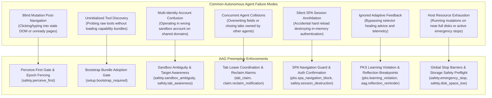
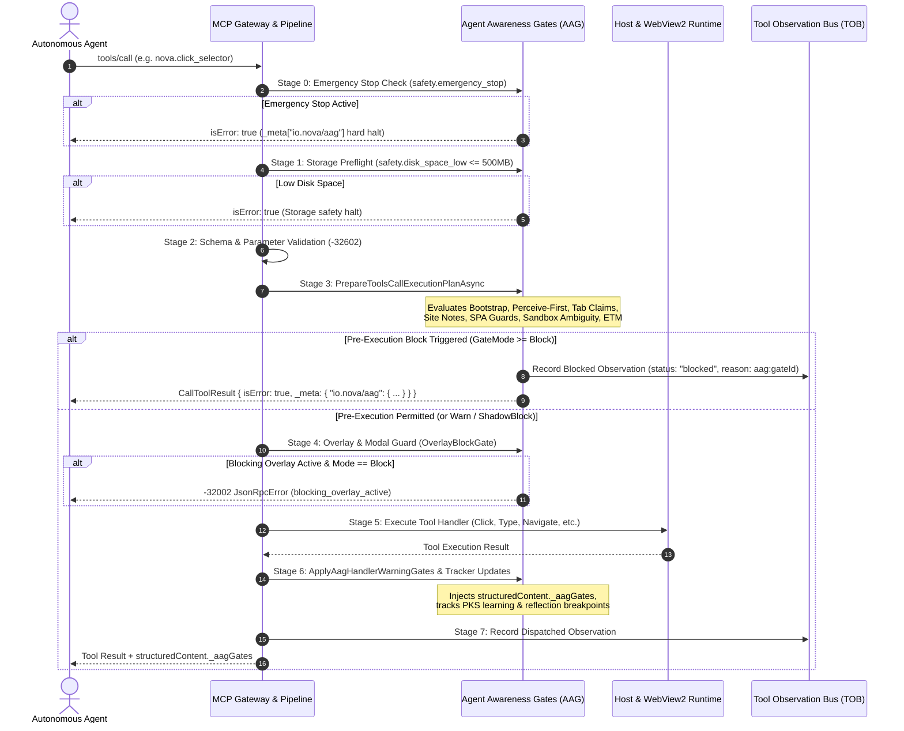
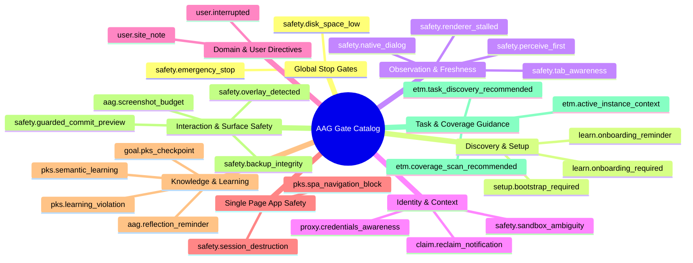
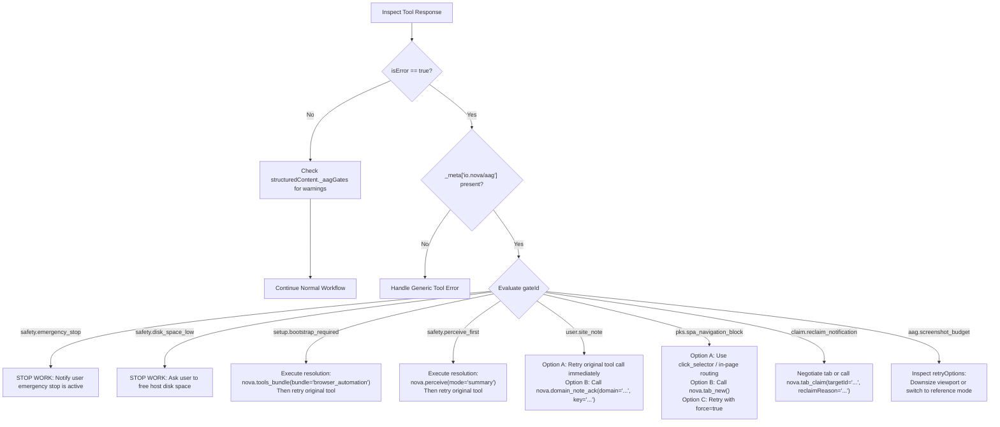

# Agent Awareness Gates (AAG)

> [!NOTE]
> Agent Awareness Gates (AAG) form Nova AI Workspace's preemptive policy and situational awareness subsystem within the Model Context Protocol (MCP) tool execution pipeline. Acting prior to tool dispatch, AAG inspects operational preconditions—such as tool bundle initialization, live DOM observation freshness, multi-agent tab leases, sandbox identity boundaries, user-defined site policies, Single Page Application (SPA) session persistence, host disk headroom, and emergency stop states. Depending on configured enforcement modes (`Off`, `Warn`, `ShadowBlock`, `Block`), AAG either decorates successful results with structured guidance or halts execution with machine-readable, recoverable error payloads.

---

## 1. Executive Summary & Problem Space

In autonomous browser automation, LLM-based agents frequently suffer from fundamental perception and synchronization disconnects. Unlike human operators who continuously observe visual feedback and process environmental cues, autonomous agents execute discrete API or MCP calls based solely on past conversational context. When operating without strict precondition enforcement, agents exhibit catastrophic failure modes:



AAG sits directly in front of tool execution to eliminate these failure classes at the protocol boundary. While the [Tool Observation Bus (TOB)](../tool-observation-bus-tob/README.md) logs what occurred for forensic auditing and the [Closed-Loop System (CLS)](../closed-loop-system-cls/README.md) verifies post-action visual state transitions, AAG guarantees that **no tool executes unless the agent has demonstrated valid situational awareness of the environment.**

---

## 2. End-to-End Pipeline & Architecture

Every incoming MCP `tools/call` request passes through a multi-stage gateway before dispatching to Chromium or host subsystems. The evaluation sequence is ordered by risk severity: global safety barriers run first, followed by structural schema validation, session orientation, domain rules, and mutating action guards.



### 2.1 Architectural Invariants
1. **Fail-Closed on High-Hazard Barriers:** Process-wide safety gates (`safety.emergency_stop`, `safety.disk_space_low`) fail closed. No parameter flag or bypass switch can override an emergency stop or a filled filesystem.
2. **Business Errors vs Protocol Errors:** AAG gate rejections are returned as standard MCP tool responses with `isError: true` and rich recovery guidance in `_meta["io.nova/aag"]`. They do not return JSON-RPC transport crashes (`-32603`), enabling agents to read the advice and self-heal within their natural execution loops.
3. **Traceability Parity:** Every blocked call is recorded in TOB (`McpActionLog`), complete with `traceId`, `durationMs`, `goalId`, caller client identity, and the exact `aag:<gateId>` reason code.

---

## 3. Enforcement Modes (`AagGateMode`)

Each configurable awareness gate operates across four distinct enforcement tiers defined by `AagGateMode`. This enables operators to tune strictness from non-intrusive auditing to ironclad blocking:

| Mode | Numeric | JSON Wire | Runtime Behavior | Telemetry & Observability |
| :--- | :---: | :--- | :--- | :--- |
| **`Off`** | `0` | `"off"` | Gate evaluation is completely skipped. | Zero overhead; no warnings or metrics emitted. |
| **`Warn`** | `1` | `"warn"` | Missing preconditions do not prevent execution. Tool runs normally; advisory warnings are injected into `structuredContent`. | Logged at `[INF]` level; warning fields projected in `structuredContent._aagGates`. |
| **`ShadowBlock`** | `2` | `"shadowblock"` | Evaluates full blocking conditions. Tool runs normally, but the gate records that it *would have blocked* under `Block` mode. | Increments internal atomic counters (`_bootstrapShadowBlockCount`, etc.) and sets `status: "shadow_blocked"`. |
| **`Block`** | `3` | `"block"` | Tool execution is intercepted. Precondition failure halts dispatch and returns `isError: true` with structured recovery options. | Generates TOB blocked observation; emits `AagBlockResult` with `_meta["io.nova/aag"]`. |

### 3.1 The Calibration Role of `ShadowBlock`
Deploying autonomous agents into production with strict blocking can risk workflow stall if an agent runtime cannot parse error messages. `ShadowBlock` solves this by acting as a zero-risk dry-run canary:
* The agent experiences the lenient behavior of `Warn` (its tool calls always succeed).
* Telemetry pipelines observe real-world block rates, identifying whether an agent would have stalled or whether rules need fine-tuning.
* Once the agent prompts demonstrate adherence to guidance, the operator flips the gate mode from `"shadowblock"` to `"block"`.

---

## 4. Comprehensive Gate Catalog

Nova AI Workspace implements an extensive array of awareness gates across multiple functional clusters:



### 4.1 Global Stop Gates

#### `safety.emergency_stop`
* **Trigger:** Engaged instantly when the user clicks **Emergency Stop** in Nova's main menu, or when a linked cancellation barrier triggers.
* **Scope:** All non-handshake MCP methods (`tools/list`, `tools/call`, `resources/read`). Pure handshake calls (`initialize`, `ping`) pass through to keep transports alive.
* **Behavior:** Fails closed unconditionally. Aborts running operations via linked `CancellationToken` and rejects any new tool calls.
* **Resolution:** The user must manually select **Release Emergency Stop** in Nova's main menu. No agent tool call can release this barrier.

#### `safety.disk_space_low`
* **Trigger:** Evaluated via `DriveInfo` across storage candidate paths: `StoragePaths.BaseDir`, `AppContext.BaseDirectory`, `McpScreenshotsDir`, `SharedDir`, `TaskWorkspaceDir`, and configured `DownloadDirectoryPath`. Fires if available free space is $\le 500\text{ MB}$ (`DiskSafetyMinimumFreeBytes`).
* **Behavior:** Blocks all mutating calls before disk writes corrupt SQLite WAL files, telemetry stores, or agent workspace files.
* **Resolution:** Host operator must free disk space. Zero force bypass.

---

### 4.2 Discovery & Setup Gates

#### `setup.bootstrap_required`
* **Trigger:** An agent invokes functional tools without first loading a primary tool bundle via `nova.tools_bundle`.
* **Exempt Tools:** Pure discovery and setup tools:
  ```text
  nova.tools_bundle, nova.mcp_transport_log, nova.get_instructions,
  nova.tabs, nova.explain, nova.app_info, nova.tab_claim, nova.tab_release,
  nova.sandbox_context, nova.resolve_sandbox, nova.install_onboarding,
  nova.get_onboarding, nova.reference_docs_list, nova.reference_doc_read
  ```
* **Warn-Only Tools:** Pure database readers (`nova.traces_list`, `nova.agent_activity_summary`, `nova.scheduled_task_list`, `nova.scheduled_task_get`, `nova.scheduled_task_runs`, etc.) emit warnings but are never hard-blocked.
* **Clearing Action:** Load a bootstrap-capable bundle: `nova.tools_bundle(bundle='browser_automation')` or `nova.tools_bundle(bundle='plugin_management')`. Supplemental bundles (`task_memory`, `pks_learning`) do **not** clear this gate.
* **Anti-Nagging & Token Optimization:** See [Section 6](#6-token-efficiency-deduplication--anti-nagging) for details on hash caching and the 25-call compaction safety net.

#### `learn.onboarding_required`
* **Trigger:** Session called `nova.get_instructions(mode='learn')` on a domain with pending onboarding materials, but has not yet confirmed domain instructions.
* **Behavior:** In `Block` mode, halts execution on learn-eligible tool calls until the agent calls `nova.learn_onboarding_confirm` with a substantive paraphrase of the domain's operational guidelines.

---

### 4.3 Observation & Freshness Gates

#### `safety.perceive_first`
* **Trigger:** Invoking a mutating interaction tool on a target tab that has not undergone visual or structural observation since the last navigation event.
* **Monitored Mutating Tools:**
  ```text
  nova.type_selector, nova.type_selector_secret, nova.click_selector,
  nova.guarded_login, nova.guarded_submit_form, nova.guarded_switch_model,
  nova.guarded_switch_sandbox, nova.guarded_send_message, nova.file_upload,
  nova.input_click, nova.input_text, nova.input_key, nova.input_shortcut
  ```
* **Clearing Tools:**
  ```text
  nova.perceive (mode != 'state'), nova.eval, nova.read_text,
  nova.read_text_structured, nova.read_dom, nova.wait_for_selector, nova.wait_for_eval
  ```
* **The Settlement Readiness Bypass:** When `nova.navigate` is executed with `settlementReadiness` criteria (e.g. waiting for a specific DOM selector) and returns `structuredContent.settlement.readiness.satisfied = true`, `safety.perceive_first` does **not** re-arm. The readiness verification itself constitutes proof of observation.
* **Epoch Fencing (`PerceiveFirstExecutionFence`):** Captures `StateGeneration`, `TabVersionAtStart`, and `TargetEpochAtStart`. If a concurrent navigation occurs while an observation tool is running, the gate refuses to clear, preventing race conditions.

#### `safety.tab_awareness`
* **Trigger:** An agent addresses the implicit `"active"` tab (`rawTargetId` omitted or `"active"`) when tab state has drifted (a tab was opened, closed, switched, or navigated) or when the awareness TTL (`TabAwarenessTtlMs`) has expired.
* **Behavior:** Emits `TAB_AWARENESS: active=<id> (<kind>, url=<url>, title=<title>)`. Explains once per session, and thereafter injects concise tab identity facts to prevent context noise.
* **Resolution:** Call `nova.tabs()` to refresh awareness or supply explicit `targetId` parameters.

#### `safety.renderer_stalled`
* **Trigger:** CDP Renderer Stall Breaker opens due to an unresponsive WebView2 rendering process (frozen JavaScript loop, renderer deadlock, OOM crash).
* **Behavior:** Injects non-suppressible warning alerting the agent that the page is unresponsive, preventing false assumptions of an empty page.

---

### 4.4 Identity, Claim & Context Gates

#### `safety.sandbox_ambiguity`
* **Trigger:** Invoked via `nova.tabs`, `nova.sandbox_context`, `nova.resolve_sandbox`, `nova.set_active_tab`, or `nova.guarded_switch_sandbox`. Detects when multiple isolated sandbox profiles share the same domain service (e.g. personal vs work Google Workspace, or multiple WhatsApp Web accounts).
* **Behavior:** Emits a once-per-session ambiguity warning listing the candidate sandboxes with their UIDs and account hints.
* **Impact:** Prevents agents from silently dispatching messages or reading private emails from the wrong account.

#### `claim.reclaim_notification`
* **Trigger:** Fires as a one-shot block when a second agent has used `forceReclaim=true` on `nova.tab_claim` to displace the current agent's tab lease lock.
* **Payload:** Delivers the displacing agent's ID, the displacement reason, and options to either negotiate work or reclaim the tab back via `nova.tab_claim(targetId=..., reclaimReason=...)`.

#### `proxy.credentials_awareness`
* **Trigger:** Invoking `nova.proxy_set_password` without having loaded the `proxy_management` bundle.
* **Behavior:** Blocks password modification. Informs the agent that proxy passwords are encrypted via Windows DPAPI and never returned over MCP, ensuring the agent understands credential immutability before writing.

---

### 4.5 Domain & User Directive Gates

#### `user.site_note` (Domain Notes MUST-Read Gate)
* **Trigger:** User authors a domain note in Nova with `Enforcement: Block` for a specific domain or sandbox. When an agent touches that domain, the gate halts all non-note tool calls.
* **Exempt Tools:** `nova.domain_note`, `nova.domain_note_ack`, `nova.domain_notes_list`, `nova.domain_note_delete`.
* **Dual-Mode Acknowledgment:**
  1. **Option A (Retry Pattern):** Simply retrying the exact original tool call acknowledges the note. Because the note text was delivered in the block message, the retry proves the instruction has entered the LLM's active prompt context!
  2. **Option B (Explicit Tool Call):** Calling `nova.domain_note_ack(domain=..., key=...)` for agent frameworks whose strict safety policies forbid retrying failed calls.
* **Bulk Acknowledgment:** Multiple notes on the same domain are delivered together (newest first, older notes in "Also pending") and acknowledged simultaneously in a single retry or ACK call.
* **Auto-Rearm & Invalidation:**
  * **Edit Invalidation:** If a user edits a note (`UpdatedUtc` increases), the cached acknowledgment is immediately invalidated. The agent MUST read the updated instructions!
  * **Time Threshold:** `RepeatAcknowledgeMinutes` re-arms the gate after a specified duration.
  * **Call Threshold:** `RepeatAcknowledgeToolCalls` re-arms the gate after a specified number of tool calls.

#### `user.interrupted`
* **Trigger:** The user manually clicks **Cancel** in the Discovery flyout UI while an autonomous crawl or surface exploration is running.
* **Behavior:** One-shot block on `nova.crawl_start`, `nova.crawl_update`, and `nova.explore_surface`. Informs the agent: *"The user cancelled the running Discovery analysis for this website. Ask the user why they stopped before restarting. Do not restart automatically."*

---

### 4.6 Single Page Application (SPA) Safety Gates

#### `pks.spa_navigation_block`
* **Trigger:** Calling hard navigation tools (`nova.navigate`, `nova.reload`) on a rich Single Page Application where PKS has classified navigation as state-destructive.
* **Resolution:** Recommends in-page DOM interaction (`nova.click_selector`, internal routing) or opening a fresh tab (`nova.tab_new`). Can be bypassed with `force: true`.

#### `safety.session_destruction`
* **Trigger:** Calling `nova.navigate` with `force: true` on an authenticated SPA tab whose credentials or session would be destroyed by navigation.
* **Behavior:** Hard block requiring explicit confirmation: `confirmSessionDestruction: true`.
* **Recovery Guidance:** Informs the agent: *"To proceed, add confirmSessionDestruction=true. Recovery: use vault_list + guarded_login to re-authenticate after navigation."*

---

### 4.7 Knowledge & Learning Gates

#### `pks.learning_violation`
* **Trigger:** An agent performs actions that generate actionable selector advice (`pksAdvice`), but fails to report outcomes or submit healing patches within 2 consecutive relevant tool calls (`CallThreshold = 2`).
* **Fulfillment Tools:** `nova.telemetry_report` or `nova.pks_patch`.
* **Tracker Mechanics:** Governed by `LearningGateTracker` and persistent SQLite queue (`learning_repair_queue`). Auto-repairs safe selector patches automatically in the background.

#### `pks.semantic_learning` (Strict Mode)
* **Trigger:** When `PksSemanticLearningGateMode` is set to `"strict"`, mutating interactions are blocked on domains with unaddressed semantic opportunities until the agent resolves or dismisses the opportunity via `nova.learn_resolve_opportunity`.

#### `aag.reflection_reminder` (Knowledge Reflection Breakpoint)
* **Trigger:** Reaching natural workflow completion boundaries:
  ```text
  nova.tab_release, nova.tab_close, nova.task_instance_complete
  ```
* **Evaluation:** `ReflectionGateTracker` monitors interaction depth ($\ge 3$), observed authentication flows, failed-then-succeeded selector patterns, and long wait times.
* **Guidance:** Reminds the agent to persist acquired knowledge via `nova.pks_upsert` or `nova.operator_notes_store` before the session context is lost.

---

### 4.8 Interaction & Surface Safety Gates

#### `safety.overlay_detected` & `OverlayBlockGate`
* **Trigger:** Mutating click or typing tools (`click_selector`, `input_click`, `type_selector`, etc.) targeting elements covered by aggressive full-screen modals, cookie banners, or backdrop overlays.
* **Behavior:** In `Block` mode, halts execution with `-32002 JsonRpcError` (`blocking_overlay_active`).
* **Resolution:** Directs agent to `nova.cmp_apply` (for recognized CMP vendors) or `nova.dismiss_blockers`. Can be acknowledged per session via `nova.domain_note(domain=host, key='overlay.acknowledged_block', value='true')`.

#### `aag.screenshot_budget`
* **Trigger:** Evaluates screenshot captures against a multi-tier memory and token budget:
  * **Soft Warn ($> 200\text{ KB}$):** Delivers image normally; logs warning for auditing.
  * **Forceable Hard ($> 1\text{ MB}$ OR $> 16\text{ MP}$ OR dimension $\ge 10,000\text{ px}$):** Automatically downgrades capture to thumbnail + reference file on disk unless `force: true` is supplied.
  * **Absolute Safety ($> 50\text{ MB}$ OR $> 50\text{ MP}$):** Hard-rejects capture with `ScreenshotAagBlockException` to protect host memory and vision model token limits. Zero force bypass.

#### `safety.backup_integrity`
* **Trigger:** Background mail backups encountering failed, interrupted, or incomplete message streams.
* **Behavior:** Injects non-suppressible `backupIntegrityWarning` into every tool response until acknowledged via `nova.mail_backup_status(profileId='<profileId>', acknowledge=true)`. Prevents agents from mistakenly reporting to the user that a backup finished successfully when messages were dropped.

---

### 4.9 Task & Coverage Guidance Gates

#### `etm.task_discovery_recommended`
* **Trigger:** First non-discovery tool call of a session when non-archived task profiles exist in the ETM database.
* **Behavior:** One-shot advisory recommending `nova.task_search` or `nova.task_profiles` to retrieve existing workflows, checks, and learned guidance before starting from scratch.

#### `etm.coverage_scan_recommended`
* **Trigger:** Operating on an exhaustive task instance (`Exhaustive = true`, `CoverageSchemaVersion >= 2`) using standard perception tools (`nova.perceive`).
* **Behavior:** Informs the agent that agent-asserted perception is never block-eligible for verified task completion; directs the agent to use server-trusted `nova.coverage_scan`.

---

## 5. The Structured Wire Protocol & MCP Envelopes

AAG communicates with agents through two standardized JSON envelope structures:

### 5.1 Hard Block Envelope (`AagBlockResult`)
When an awareness gate trips in `Block` mode, Nova returns a valid MCP `CallToolResult` with `isError: true`. Structured metadata is attached under `_meta["io.nova/aag"]` (MCP reverse-DNS convention):

```json
{
  "content": [
    {
      "type": "text",
      "text": "AAG blocked by safety.perceive_first. Call nova.perceive with {\"mode\":\"summary\"} on the target and retry nova.click_selector."
    }
  ],
  "isError": true,
  "_meta": {
    "io.nova/aag": {
      "kind": "aag_block",
      "gateId": "safety.perceive_first",
      "gateMode": "block",
      "retryable": true,
      "traceId": "trc_9a8b7c6d",
      "durationMs": 3,
      "resolution": {
        "tool": "nova.perceive",
        "args": {
          "mode": "summary"
        }
      },
      "settingOverride": {
        "setting": "PerceiveFirstGateMode",
        "alternatives": ["warn", "shadowblock", "off"]
      },
      "reasonCode": "safety.perceive_first"
    }
  }
}
```

#### Wire Field Specification (`AagBlockMeta`)

| Field | Type | Description |
| :--- | :--- | :--- |
| `kind` | `string` | Constant `"aag_block"`. |
| `gateId` | `string` | Canonical gate identifier (e.g. `"safety.perceive_first"`, `"setup.bootstrap_required"`). |
| `gateMode` | `string` | Effective mode: `"block"`. |
| `retryable` | `bool` | `true` if satisfying the resolution permits retrying the original tool. |
| `traceId` | `string?` | Dispatch request trace ID linking to TOB audit logs. |
| `durationMs` | `long?` | Preflight evaluation elapsed time in milliseconds. |
| `resolution` | `object?` | Exact MCP tool call (`tool` name and `args`) that satisfies the precondition. |
| `settingOverride`| `object?`| Settings key and allowable values if the operator wishes to reconfigure the gate. |
| `reasonCode` | `string?` | Machine-readable error code for programmatic client branching. |
| `alternative` | `object?` | Optional alternative recovery path (e.g. `force: true` or `nova.tab_new`). |
| `details` | `object?` | Context-specific diagnostic payloads (e.g. low disk thresholds, drive roots). |

---

### 5.2 Success & Warning Enrichment (`structuredContent._aagGates`)
When tools execute successfully (or under `Warn` / `ShadowBlock` modes), AAG projects gate statuses into `structuredContent._aagGates`:

```json
{
  "structuredContent": {
    "ok": true,
    "status": "success",
    "_aagGates": {
      "perceiveFirstWarning": {
        "gateId": "safety.perceive_first",
        "status": "warned"
      },
      "siteNoteWarning": {
        "gateId": "user.site_note",
        "status": "passed"
      },
      "pksAdvice": {
        "gateId": "pks.selector_advice",
        "status": "suppressed"
      },
      "pksSemanticLearning": {
        "gateId": "pks.semantic_learning",
        "status": "prompted"
      }
    }
  }
}
```

#### Status Vocabulary
* `"passed"`: Preconditions checked and fully satisfied.
* `"warned"`: Preconditions missing; advisory warning delivered inline.
* `"shadow_blocked"`: Evaluated under `ShadowBlock` mode; would have blocked under `Block`.
* `"prompted"`: Interactive guidance or reflection prompt delivered.
* `"suppressed"`: Gate silenced by user settings (e.g. `McpPksAdviceEnabled = false`).
* `"suppressed_by_semantic_learning"`: Lower-priority selector advice silenced because a higher-priority semantic learning prompt is active on the same response.

> [!TIP]
> **Minimal Output Detail Allowlist:** When tools are invoked with `outputDetail: 'minimal'`, Nova strips non-essential telemetry from `structuredContent`. However, `_aagGates` and non-suppressible safety gates are explicitly preserved on the `ActionMinimalCoreKeepFields` allowlist, ensuring agents never lose safety visibility in lean envelopes.

---

## 6. Token Efficiency, Deduplication & Anti-Nagging

Autonomous agents spend hundreds of tool calls solving complex web tasks. Naively repeating full advisory payloads on every single tool call creates a severe **Token Starvation Trap**:

```text
350 tokens (bundle catalog advisory) x 60 calls = 21,000 wasted prompt tokens!
```

Nova implements dedicated token optimization and deduplication mechanics:

### 6.1 Stable Text Hashing vs One-Time Additions
Advisories often combine stable guidance (e.g. bundle catalogs) with transient hints (e.g. one-time self-onboarding invitations). Hashing the combined string causes hash oscillation when the one-time hint expires, tricking deduplicators into re-delivering the full catalog.

AAG calculates SHA256 hashes exclusively over the **stable guidance text** (`ComputeBootstrapWarningHash`). Transient additions are delivered via `BootstrapWarningDelivery.MessageOnly` without re-emitting the 25-item bundle list.

### 6.2 The 25-Call Compaction Safety Net
If an advisory is delivered once per session and then silenced completely, an agent whose context window undergoes LLM context compaction will lose the instructions permanently.

To solve this, AAG tracks suppressed deliveries (`SuppressedSinceFull`). After **25 consecutive suppressed calls** (`BootstrapWarningResendAfterSuppressed`), the gate automatically refreshes the full advisory once, re-seeding the agent's compacted memory without continuous per-call spam.

### 6.3 Stable Client-Keyed Identity Tracking
Transport session IDs rotate on HTTP reconnection, proxy restarts, or transient network timeouts. If deduplication keys off the transport session, reconnection causes immediate re-nagging.

AAG keys bootstrap and guidance deduplication against the **stable MCP client identity** (`McpClientInfo.Name` $\rightarrow$ `client:<normalized_name>`), preserving deduplication state across transport reconnects.

---

## 7. Autonomous Agent Integration & Recovery Playbook

Autonomous agents should implement a standardized recovery decision loop when interacting with Nova's MCP server:



### 7.1 Python Agent Implementation Example

```python
async def execute_nova_tool(client, tool_name: str, args: dict):
    result = await client.call_tool(tool_name, args)

    # 1. Handle AAG Precondition Blocks
    if result.is_error and "_meta" in result and "io.nova/aag" in result["_meta"]:
        aag = result["_meta"]["io.nova/aag"]
        gate_id = aag["gateId"]
        resolution = aag.get("resolution")

        # Handle hard stop barriers
        if gate_id in ("safety.emergency_stop", "safety.disk_space_low"):
            raise RuntimeError(f"Workflow halted by critical safety barrier: {gate_id}")

        # Handle User Site Notes (Dual-Mode Acknowledge)
        if gate_id == "user.site_note":
            print(f"Ingested required user site note for {aag.get('currentPageUrl')}")
            # Retrying the exact call satisfies the gate via prompt ingestion proof
            return await client.call_tool(tool_name, args)

        # Automatic resolution and retry
        if aag.get("retryable") and resolution:
            print(f"Resolving AAG gate '{gate_id}' via {resolution['tool']}...")
            await client.call_tool(resolution["tool"], resolution.get("args", {}))
            # Retry original tool
            return await client.call_tool(tool_name, args)

    # 2. Inspect Injected Warnings on Successful Execution
    if hasattr(result, "structuredContent") and "_aagGates" in result.structuredContent:
        for gate_name, info in result.structuredContent["_aagGates"].items():
            if info.get("status") == "warned":
                print(f"AAG Advisory Notice [{info.get('gateId')}]: review operational prerequisites.")

    return result
```

---

## 8. Configuration Reference (`settings.json`)

All awareness gates are configurable in Nova's application settings (`settings.json`). The settings file supports human-readable enum values (`"off"`, `"warn"`, `"shadowblock"`, `"block"`) via `AagGateModeJsonConverter`:

| Settings Property | Type | Default | Description |
| :--- | :---: | :---: | :--- |
| `BootstrapGateMode` | `AagGateMode` | `Warn` | Enforces `nova.tools_bundle` adoption before non-exempt tool calls. |
| `PerceiveFirstGateMode` | `AagGateMode` | `Warn` | Requires DOM perception after navigation before mutating tools can execute. |
| `SiteNoteEnforcementMode` | `AagGateMode` | `Block` | Governs MUST-read Domain Notes acknowledgment on matching domains. |
| `McpLearnOnboardingGateMode` | `AagGateMode` | `Warn` | Enforces domain onboarding confirmation in `get_instructions(mode='learn')`. |
| `LearningGateMode` | `AagGateMode` | `Warn` | Escalates pending `pksAdvice` follow-ups after 2 unfulfilled calls. |
| `ReflectionGateMode` | `AagGateMode` | `Warn` | Prompts knowledge persistence at workflow boundaries (`tab_release`, etc.). |
| `PksSemanticLearningGateMode`| `string` | `"advisory"` | Strict mode (`"strict"`) blocks mutations on domains with unresolved semantic opportunities. |
| `OverlayBlockGateMode` | `AagGateMode` | `ShadowBlock`| Blocks mutating inputs when full-screen modals cover elements (`blocking_overlay_active`). |
| `ScreenshotBudgetGateMode` | `AagGateMode` | `Block` | Enforces media byte caps, auto-downgrades to file references, and prevents OOMs. |
| `TaskUrlCoverageGateMode` | `AagGateMode` | `Warn` | Enforces URL coverage criteria during task instance completion. |
| `TaskUrlCoverageScanRecommendedGateMode` | `AagGateMode` | `Warn` | Advises agents working on exhaustive tasks to use `nova.coverage_scan`. |
| `SandboxLowConfidenceGateMode` | `AagGateMode` | `Warn` | Blocks `resolve_sandbox` if semantic affinity score is below threshold. |
| `SandboxMultiMatchGateMode` | `AagGateMode` | `Warn` | Blocks `resolve_sandbox` if multiple sandboxes match with similar scores. |
| `SandboxAccountMismatchGateMode`| `AagGateMode` | `Warn` | Blocks `resolve_sandbox` if candidate account differs from requested hint. |
| `SandboxNotReadyGateMode` | `AagGateMode` | `Warn` | Blocks `resolve_sandbox` if target WebView2 instance is uninitialized. |
| `PksDriftGateMode` | `AagGateMode` | `Off` | Detects phenomenological drift against verified baseline knowledge. |

---

## Related Documentation

* **[Tool Observation Bus (TOB)](../tool-observation-bus-tob/README.md)** — Comprehensive audit logging of attempted, dispatched, and blocked actions.
* **[Closed-Loop System (CLS)](../closed-loop-system-cls/README.md)** — Post-action state verification and transition contracts.
* **[Phenomenological Knowledge Store (PKS)](../learning/phenomenological-knowledge-store-pks/README.md)** — Self-healing selector learning and SPA navigation phenomenons.
* **[Learning Candidate Journal (LCJ)](../learning/learning-candidate-journal-lcj/README.md)** — Lifecycle tracking of candidate observations and auto-repairs.
* **[Domain Notes Architecture](../learning/domain-notes/README.md)** — User-authored domain directives and acknowledgment storage.
* **[Domain Notes User Guide](../../user-guide/agents/domain-notes.md)** — Operational instructions for setting up MUST-read agent notes.
* **[Proxy Routing & Traffic Isolation](../network/proxy/README.md)** — Network tunneling and proxy credential isolation.
* **[Humanized Input Engine](../humanized-input-engine/README.md)** — Dispatch mechanics, shadow DOM traversal, and coordinate clicking.
* **[MCP Reference Index](../../mcp-reference/README.md)** — Exhaustive specification of all native tools.

[All core features](../README.md)
