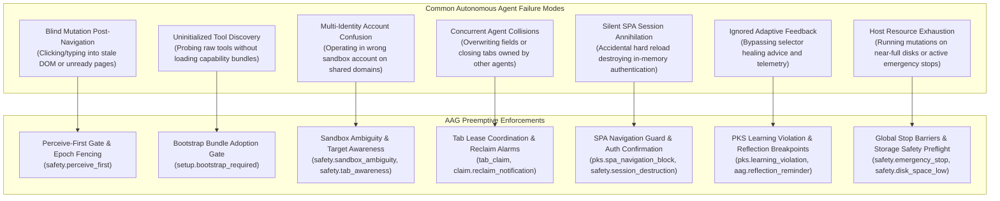
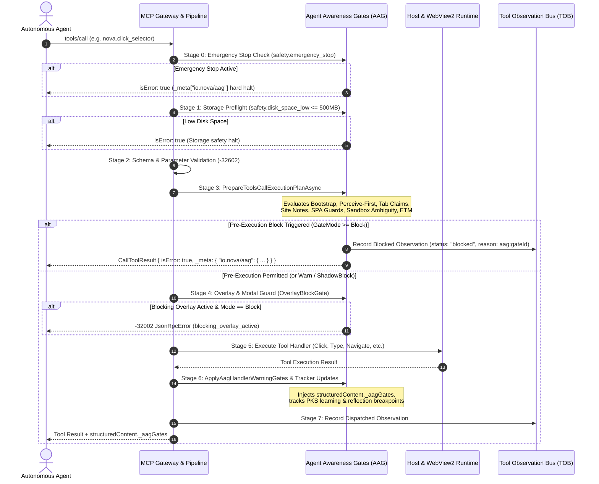
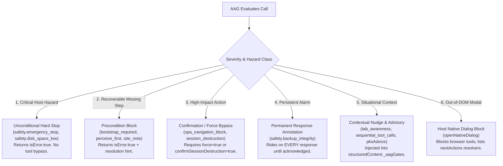
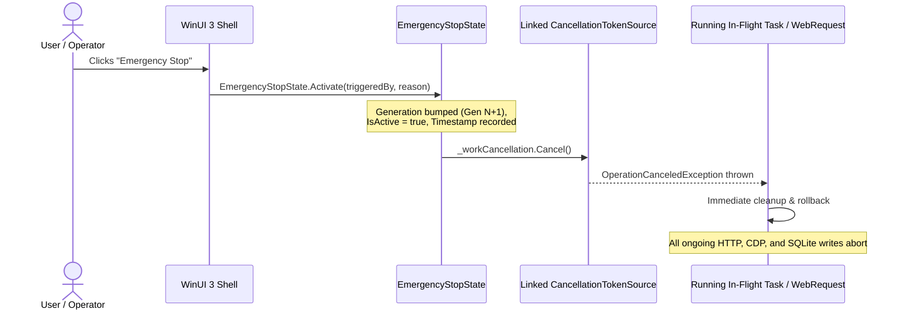
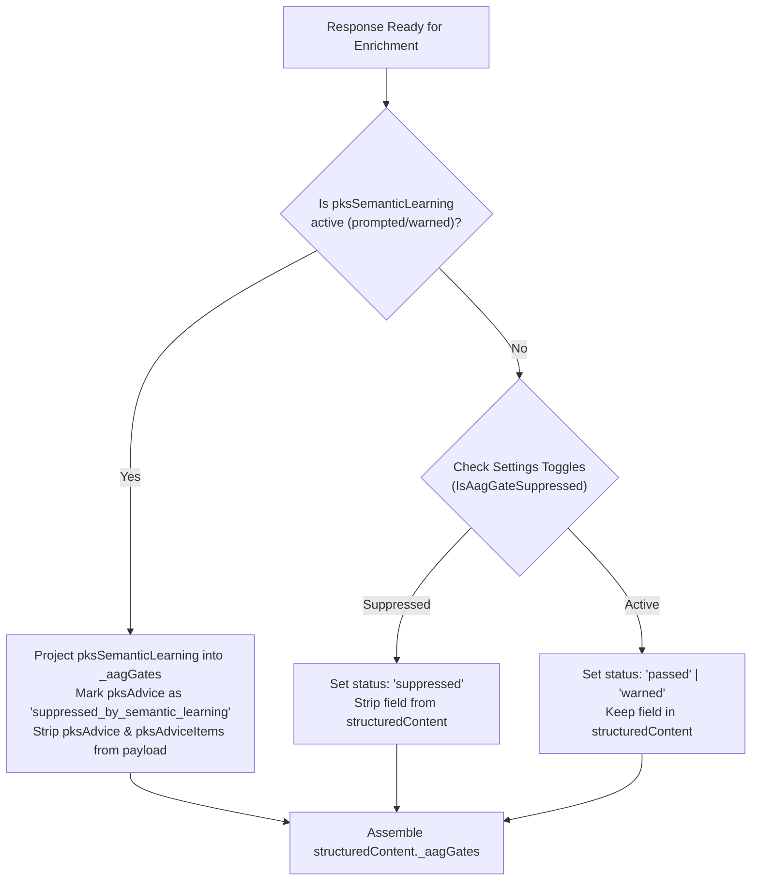
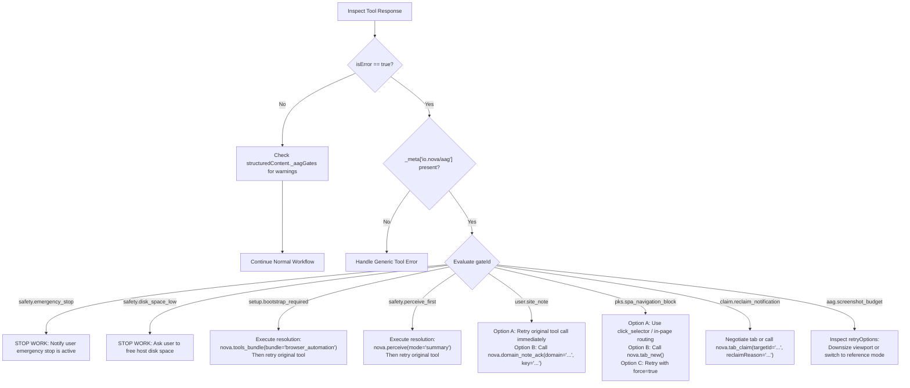

# Agent Awareness Gates (AAG)

> [!NOTE]
> Agent Awareness Gates (AAG) form Nova AI Workspace's preemptive policy and situational awareness subsystem within the Model Context Protocol (MCP) tool execution pipeline. Acting prior to tool dispatch, AAG inspects operational preconditions—such as tool bundle initialization, live DOM observation freshness, multi-agent tab leases, sandbox identity boundaries, user-defined site policies, Single Page Application (SPA) session persistence, host disk headroom, and emergency stop states. Depending on configured enforcement modes (`Off`, `Warn`, `ShadowBlock`, `Block`), AAG either decorates successful results with structured guidance or halts execution with machine-readable, recoverable error payloads.

---

## 1. Executive Summary & Problem Space

In autonomous browser automation, LLM-based agents frequently suffer from fundamental perception and synchronization disconnects. Unlike human operators who continuously observe visual feedback and process environmental cues, autonomous agents execute discrete API or MCP calls based solely on past conversational context. When operating without strict precondition enforcement, agents exhibit catastrophic failure modes:



AAG sits directly in front of tool execution to eliminate these failure classes at the protocol boundary. While the [Tool Observation Bus (TOB)](../tool-observation-bus-tob/README.md) logs what occurred for forensic auditing and the [Closed-Loop System (CLS)](../closed-loop-system-cls/README.md) verifies post-action visual state transitions, AAG guarantees that **no tool executes unless the agent has demonstrated valid situational awareness of the environment.**

---

## 2. End-to-End Pipeline & Architecture

Every incoming MCP `tools/call` request passes through a multi-stage gateway before dispatching to Chromium or host subsystems. The evaluation sequence is ordered by risk severity: global safety barriers run first, followed by structural schema validation, session orientation, domain rules, and mutating action guards.



### 2.1 Architectural Invariants
1. **Fail-Closed on High-Hazard Barriers:** Process-wide safety gates (`safety.emergency_stop`, `safety.disk_space_low`) fail closed. No parameter flag or bypass switch can override an emergency stop or a filled filesystem.
2. **Business Errors vs Protocol Errors:** AAG gate rejections are returned as standard MCP tool responses with `isError: true` and rich recovery guidance in `_meta["io.nova/aag"]`. They do not return JSON-RPC transport crashes (`-32603`), enabling agents to read the advice and self-heal within their natural execution loops.
3. **Traceability Parity:** Every blocked call is recorded in TOB (`McpActionLog`), complete with `traceId`, `durationMs`, `goalId`, caller client identity, and the exact `aag:<gateId>` reason code.

---

## 3. Enforcement Modes (`AagGateMode`)

Each configurable awareness gate operates across four distinct enforcement tiers defined by `AagGateMode`. This enables operators to tune strictness from non-intrusive auditing to ironclad blocking:

| Mode | Numeric | JSON Wire | Runtime Behavior | Telemetry & Observability |
| :--- | :---: | :--- | :--- | :--- |
| **`Off`** | `0` | `"off"` | Gate evaluation is completely skipped. | Zero overhead; no warnings or metrics emitted. |
| **`Warn`** | `1` | `"warn"` | Missing preconditions do not prevent execution. Tool runs normally; advisory warnings are injected into `structuredContent`. | Logged at `[INF]` level; warning fields projected in `structuredContent._aagGates`. |
| **`ShadowBlock`** | `2` | `"shadowblock"` | Evaluates full blocking conditions. Tool runs normally, but the gate records that it *would have blocked* under `Block` mode. | Increments internal atomic counters (`_bootstrapShadowBlockCount`, etc.) and sets `status: "shadow_blocked"`. |
| **`Block`** | `3` | `"block"` | Tool execution is intercepted. Precondition failure halts dispatch and returns `isError: true` with structured recovery options. | Generates TOB blocked observation; emits `AagBlockResult` with `_meta["io.nova/aag"]`. |

### 3.1 The Calibration Role of `ShadowBlock`
Deploying autonomous agents into production with strict blocking can risk workflow stall if an agent runtime cannot parse error messages. `ShadowBlock` solves this by acting as a zero-risk dry-run canary:
* The agent experiences the lenient behavior of `Warn` (its tool calls always succeed).
* Telemetry pipelines observe real-world block rates, identifying whether an agent would have stalled or whether rules need fine-tuning.
* Once the agent prompts demonstrate adherence to guidance, the operator flips the gate mode from `"shadowblock"` to `"block"`.

---

## 4. Reaction Taxonomy: Hard-Stop vs. Block vs. Annotation

AAG employs a nuanced spectrum of reactions depending on whether a violation poses an immediate operational hazard, represents a recoverable missing step, requires user input, or serves as continuous contextual guidance:



### 4.1 Comprehensive Reaction Matrix

| Gate Identifier | Primary Reaction Class | Wire Manifestation | Resolution / Acknowledgment Mechanism | Bypass Availability |
| :--- | :--- | :--- | :--- | :--- |
| `safety.emergency_stop` | **Unconditional Hard Stop** | `isError: true`, `_meta["io.nova/aag"]`, human text `"NOTSTOP"` | User clicks **Release Emergency Stop** in Nova main menu | None (Host only) |
| `safety.disk_space_low` | **Unconditional Hard Stop** | `isError: true`, `reasonCode: "storage.low_free_space"` | Operator frees disk space on host filesystem ($> 500\text{ MB}$) | None (Hard barrier) |
| `aag.screenshot_budget` (Absolute Safety) | **Unconditional Hard Stop** | `isError: true`, `ScreenshotAagBlockException` | Downscale viewport dimensions or capture smaller subregions | None ($>50\text{ MB}$ cap) |
| `private_target_write` | **Privacy Hard Stop** | Refusal of 22+ persistent database write tools | Switch to non-private tab for durable knowledge storage | None (Privacy invariant) |
| `user.interrupted` | **One-Shot Stop** | `isError: true`, `gateId: "user.interrupted"` | Agent consults user regarding why analysis was stopped | None (Do not restart blindly) |
| `setup.bootstrap_required` | **Precondition Block** | `isError: true` with `resolution.tool = "nova.tools_bundle"` | Call `nova.tools_bundle(bundle='browser_automation')` | Bypassed once bundle loads |
| `safety.perceive_first` | **Precondition Block** | `isError: true` with `resolution.tool = "nova.perceive"` | Call `nova.perceive(mode='summary')` or read DOM/text | Cleared by read/eval tools |
| `user.site_note` (Block) | **Dual-Mode Block** | `isError: true`, full note text in message | **(A)** Retry exact call immediately OR **(B)** `nova.domain_note_ack` | Cleared by prompt ingestion |
| `proxy.credentials_awareness` | **Precondition Block** | `isError: true`, `reasonCode: "proxy.credentials.bundle_required"` | Load `nova.tools_bundle(bundle='proxy_management')` | Cleared once bundle loaded |
| `learn.onboarding_required` | **Precondition Block** | `isError: true`, delivers template payload | Call `nova.learn_onboarding_confirm` with substantive summary | Cleared upon confirmation |
| `pks.learning_violation` | **Precondition Block** | `isError: true` after 2 unfulfilled calls | Call `nova.telemetry_report` or `nova.pks_patch` | Cleared by fulfillment tool |
| `pks.semantic_learning` (Strict) | **Precondition Block** | `isError: true` on unresolved opportunity | Resolve opportunity via `nova.learn_resolve_opportunity` | Cleared upon resolution |
| `aag.reflection_reminder` | **Breakpoint Block** | `isError: true` at `tab_release` / completion | Call `nova.pks_upsert` or `nova.operator_notes_store` | Cleared upon persistence |
| `safety.overlay_detected` | **Modal Block** | `-32002 JsonRpcError` (`blocking_overlay_active`) | Call `nova.cmp_apply`, `nova.dismiss_blockers`, or note bypass | Session note bypass available |
| `safety.native_dialog` | **Host Dialog Block** | Injected `openNativeDialog` blocking payload | Invoke dialog resolver from `nextActions` (e.g. `restore_tabs`) | Dialog resolution required |
| `pks.spa_navigation_block` | **Guard with Force** | `isError: true` or `-32001 JsonRpcError` | Use DOM routing, `nova.tab_new()`, or retry with `force: true` | `force: true` |
| `safety.session_destruction` | **Confirmation Block**| `isError: true`, warning of session destruction | Retry with `force: true` AND `confirmSessionDestruction: true` | Explicit confirmation |
| `aag.screenshot_budget` (Hard Cap)| **Auto-Downgrade / Force** | Downgrades to file reference or blocks | Pass `force: true` or inspect disk reference file | `force: true` ($1\text{ MB}-50\text{ MB}$) |
| `safety.backup_integrity` | **Permanent Alarm** | Injected `backupIntegrityWarning` on EVERY response | Call `nova.mail_backup_status(profileId='...', acknowledge=true)` | Permanent until user told |
| `safety.tab_awareness` | **Context Annotation**| Injected `tabAwarenessWarning` | Call `nova.tabs()` or specify explicit `targetId` | Advisory only |
| `safety.sandbox_ambiguity` | **Identity Annotation**| Injected `sandboxAmbiguityWarning` (1x per session)| Review sandbox IDs before dispatching account-specific work | Advisory only |
| `efficiency.sequential_tool_calls`| **Efficiency Nudge** | Injected `sequentialToolCallNudge` after 3+ calls | Batch predictable mutations via `nova.run_sequence` | Advisory only |
| `pksAdvice` / `pksAdviceItems` | **Selector Annotation** | Inline element advice in `structuredContent` | Apply recommended selector patch or fallback locator | Suppressible by settings |

---

## 5. In-Flight Stop, Cancellation & Atomic Sequences

Awareness gates protect not only single discrete tool calls, but also atomic sequences executed through `nova.run_sequence` and long-running background tasks.

### 5.1 Process-Wide Cancellation Barrier (`EmergencyStopState`)
The emergency stop mechanism provides an unbypassable, instant halt across the entire Nova process:



* **Linked Cancellation:** All background jobs, crawler tasks, and MCP tool handlers obtain their cancellation tokens via `EmergencyStopState.CreateLinkedCancellationTokenSource(callerCt)`. When the emergency stop fires, all running work cancels immediately.
* **Handshake Preservation:** Even during active emergency stops, JSON-RPC protocol handshakes (`initialize`, `ping`, `notifications/cancelled`) remain operational so connected MCP clients do not disconnect or crash. Only tool executions and resource reads are refused.

### 5.2 Atomic Sequence Pre-Validation (`nova.run_sequence`)
When an agent submits a multi-step macro via `nova.run_sequence`, AAG prevents partial execution failures by inspecting the entire batch **before the first step executes**:

1. **Batch Perceive-First Inspection:** The gate scans all steps in `steps[]`. If any step contains a mutating action (`click_selector`, `type_selector`, `guarded_*`, etc.) and the target tab has not been perceived, `run_sequence` is blocked immediately at step 0 (`safety.perceive_first`).
2. **Credential Safety Inspection:** If any step contains `nova.proxy_set_password` and the `proxy_management` bundle has not been loaded, the entire sequence is halted up-front.
3. **Mid-Sequence In-Flight Interruption:** Each individual step executed by the sequence loop (`HandleSequenceStepCallAsync`) is tied to the linked emergency stop cancellation token. If the user engages the emergency stop during step 4 of an 8-step sequence, step 4 aborts instantly and steps 5–8 never execute.
4. **Non-Idempotent Retry Safety:** If a step fails with a transient error, `run_sequence` evaluates `SeqTryReadActionDispatched(stepResult)`. If `actionDispatched: true` was recorded (meaning the click or keystroke actually reached Chromium), automatic retries are blocked to prevent duplicate payments, duplicate chat messages, or multiple form submissions.

---

## 6. The Annotation Engine (Result Enrichment & Suppressions)

When awareness gates do not block execution (either because they operate in `Warn` or `ShadowBlock` mode, or because they are informational annotations), they enrich successful tool results via `ApplyAagHandlerWarningGates`.

### 6.1 Priority Suppression Hierarchy
Multiple annotations can fire simultaneously on a single tool call. To prevent context window bloat, AAG implements a strict suppression hierarchy:



* **Semantic Priority:** When Nova generates an interactive semantic prompt (`pksSemanticLearning`), lower-level selector advice (`pksAdvice`) is automatically stripped from the response payload. The agent's focus must remain on the high-level semantic question rather than micro-selector hints.
* **Non-Suppressible Close-Loop Signals:** Resolution confirmations (`pksSemanticLearningResolution`) and user-authored site notes are **never suppressible**, guaranteeing that close-loop signals are never hidden by global settings.

### 6.2 The Compact Stub Pattern for User Site Notes
In `Warn` mode, delivering a full 1,000-character site note on every subsequent tool call would consume thousands of tokens. AAG solves this with the Compact Stub Pattern:

1. **First Encounter:** The full note text is delivered in `structuredContent.siteNoteWarning`.
2. **Subsequent Calls:** AAG detects that the client has received the current hash and transitions to a lightweight stub:
   ```json
   {
     "gateId": "user.site_note",
     "domain": "example.com",
     "key": "compliance_rule",
     "enforcement": "warn",
     "reReadCall": "nova.domain_notes_list(domain='example.com')"
   }
   ```
3. **Tab Close Cleanup:** If a tool call closes the target tab (`nova.tab_close`), site note enrichment is skipped entirely—a note delivered to a closed tab has no addressee and represents wasted context.

### 6.3 The Permanent Mail Backup Alarm (`safety.backup_integrity`)
Unlike transient warnings, `safety.backup_integrity` represents a persistent data integrity alarm:
* If a background mailbox backup encounters dropped messages, network timeouts, or partial folder reads, an alarm is entered into `MailBackupService.OpenAlarms`.
* As long as an open alarm exists, `backupIntegrityWarning` is injected into **every single tool response** across the entire session.
* It cannot be silenced via settings toggles. It clears only when the agent explicitly invokes `nova.mail_backup_status(profileId='<profileId>', acknowledge=true)` after having notified the user of missing messages.

---

## 7. Host Modals, Bot Gates & Privacy Stop Gates

AAG monitors boundary conditions that exist outside standard webpage DOM trees:

### 7.1 Out-of-DOM Host Dialogs (`openNativeDialog`)
Web pages can trigger native browser dialogs (HTTP Basic Auth, untrusted SSL certificates, WebRTC device permissions, downloads, or tab restoration prompts) that freeze the DOM and cannot be observed via `read_dom` or `capture_screenshot`:

```json
{
  "structuredContent": {
    "openNativeDialog": {
      "isOpen": true,
      "kind": "restore_tabs",
      "title": "Restore previous tabs?",
      "blocksBrowserTools": true,
      "message": "A host-owned dialog is open. It is rendered by the browser shell, not by the page, and blocks browser interactions until resolved.",
      "nextActions": [
        {
          "priority": 100,
          "tool": "nova.ui_restore_tabs_prompt_resolve",
          "reason": "Resolve startup tab restore prompt",
          "args": { "decision": "restore" }
        }
      ]
    }
  }
}
```

* When an in-app modal is open, browser interaction tools are refused.
* The response includes priority-ranked `nextActions` pointing to the exact resolution tool (`nova.ui_restore_tabs_prompt_resolve`, `nova.ui_certificate_prompt_resolve`, `nova.ui_auth_prompt_resolve`, etc.), enabling zero-guesswork recovery.

### 7.2 Bot Challenges & HTTP Block Classification (`StallPageGate`)
When an automated agent is blocked by Cloudflare, Turnstile, or CAPTCHA challenges, the site's anti-bot scripts frequently deadlock the WebView2 JavaScript thread. Subsequent tool calls time out with generic `cdp.renderer_stalled` errors, tempting agents into infinite refresh loops.

Nova's `StallPageGate` breaks this loop:
* When a stall occurs, Nova inspects the tab URL, window title, and navigation HTTP status code host-side (within a strict 750ms budget) using `PageGateClassifier`.
* If a challenge or HTTP block (403, 429, 503) is detected, Nova suppresses renderer retries and alerts the agent:
  ```text
  "AAG StallPageGate: bot_challenge detected on this tab. Stop automated retries and request human verification."
  ```

### 7.3 InPrivate Target Write Gate (`PrivateTargetWriteGate`)
Private browsing guarantees that no traces remain on the local machine. However, Nova's persistent knowledge systems (PKS, Domain Notes, Browsing Memory, Crawler Stores, Session Forensics) survive tab closures by design.

To maintain privacy invariants, `PrivateTargetWriteGate` enforces an architectural write barrier:
* Any mutating call from an InPrivate tab to persistent storage (`nova.pks_upsert`, `nova.domain_note`, `nova.memory_note`, `nova.crawl_start`, etc.) is **hard-refused**.
* Read operations (`nova.pks_get`, `nova.domain_notes_list`, `nova.memory_recall`) remain fully functional, allowing agents to benefit from existing knowledge without leaking private session activities back into disk databases.

---

## 8. Token Efficiency, Deduplication & Anti-Nagging

Autonomous agents spend hundreds of tool calls solving complex web tasks. Naively repeating full advisory payloads on every single tool call creates a severe **Token Starvation Trap**:

```text
350 tokens (bundle catalog advisory) x 60 calls = 21,000 wasted prompt tokens!
```

Nova implements dedicated token optimization and deduplication mechanics:

### 8.1 Stable Text Hashing vs One-Time Additions
Advisories often combine stable guidance (e.g. bundle catalogs) with transient hints (e.g. one-time self-onboarding invitations). Hashing the combined string causes hash oscillation when the one-time hint expires, tricking deduplicators into re-delivering the full catalog.

AAG calculates SHA256 hashes exclusively over the **stable guidance text** (`ComputeBootstrapWarningHash`). Transient additions are delivered via `BootstrapWarningDelivery.MessageOnly` without re-emitting the 25-item bundle list.

### 8.2 The 25-Call Compaction Safety Net
If an advisory is delivered once per session and then silenced completely, an agent whose context window undergoes LLM context compaction will lose the instructions permanently.

To solve this, AAG tracks suppressed deliveries (`SuppressedSinceFull`). After **25 consecutive suppressed calls** (`BootstrapWarningResendAfterSuppressed`), the gate automatically refreshes the full advisory once, re-seeding the agent's compacted memory without continuous per-call spam.

### 8.3 Stable Client-Keyed Identity Tracking
Transport session IDs rotate on HTTP reconnection, proxy restarts, or transient network timeouts. If deduplication keys off the transport session, reconnection causes immediate re-nagging.

AAG keys bootstrap and guidance deduplication against the **stable MCP client identity** (`McpClientInfo.Name` $\rightarrow$ `client:<normalized_name>`), preserving deduplication state across transport reconnects.

---

## 9. Autonomous Agent Integration & Recovery Playbook

Autonomous agents should implement a standardized recovery decision loop when interacting with Nova's MCP server:



### 9.1 Python Agent Implementation Example

```python
async def execute_nova_tool(client, tool_name: str, args: dict):
    result = await client.call_tool(tool_name, args)

    # 1. Handle AAG Precondition Blocks
    if result.is_error and "_meta" in result and "io.nova/aag" in result["_meta"]:
        aag = result["_meta"]["io.nova/aag"]
        gate_id = aag["gateId"]
        resolution = aag.get("resolution")

        # Handle hard stop barriers
        if gate_id in ("safety.emergency_stop", "safety.disk_space_low"):
            raise RuntimeError(f"Workflow halted by critical safety barrier: {gate_id}")

        # Handle User Site Notes (Dual-Mode Acknowledge)
        if gate_id == "user.site_note":
            print(f"Ingested required user site note for {aag.get('currentPageUrl')}")
            # Retrying the exact call satisfies the gate via prompt ingestion proof
            return await client.call_tool(tool_name, args)

        # Automatic resolution and retry
        if aag.get("retryable") and resolution:
            print(f"Resolving AAG gate '{gate_id}' via {resolution['tool']}...")
            await client.call_tool(resolution["tool"], resolution.get("args", {}))
            # Retry original tool
            return await client.call_tool(tool_name, args)

    # 2. Inspect Injected Warnings on Successful Execution
    if hasattr(result, "structuredContent") and "_aagGates" in result.structuredContent:
        for gate_name, info in result.structuredContent["_aagGates"].items():
            if info.get("status") == "warned":
                print(f"AAG Advisory Notice [{info.get('gateId')}]: review operational prerequisites.")

    return result
```

---

## 10. Configuration Reference (`settings.json`)

All awareness gates are configurable in Nova's application settings (`settings.json`). The settings file supports human-readable enum values (`"off"`, `"warn"`, `"shadowblock"`, `"block"`) via `AagGateModeJsonConverter`:

| Settings Property | Type | Default | Description |
| :--- | :---: | :---: | :--- |
| `BootstrapGateMode` | `AagGateMode` | `Warn` | Enforces `nova.tools_bundle` adoption before non-exempt tool calls. |
| `PerceiveFirstGateMode` | `AagGateMode` | `Warn` | Requires DOM perception after navigation before mutating tools can execute. |
| `SiteNoteEnforcementMode` | `AagGateMode` | `Block` | Governs MUST-read Domain Notes acknowledgment on matching domains. |
| `McpLearnOnboardingGateMode` | `AagGateMode` | `Warn` | Enforces domain onboarding confirmation in `get_instructions(mode='learn')`. |
| `LearningGateMode` | `AagGateMode` | `Warn` | Escalates pending `pksAdvice` follow-ups after 2 unfulfilled calls. |
| `ReflectionGateMode` | `AagGateMode` | `Warn` | Prompts knowledge persistence at workflow boundaries (`tab_release`, etc.). |
| `PksSemanticLearningGateMode`| `string` | `"advisory"` | Strict mode (`"strict"`) blocks mutations on domains with unresolved semantic opportunities. |
| `OverlayBlockGateMode` | `AagGateMode` | `ShadowBlock`| Blocks mutating inputs when full-screen modals cover elements (`blocking_overlay_active`). |
| `ScreenshotBudgetGateMode` | `AagGateMode` | `Block` | Enforces media byte caps, auto-downgrades to file references, and prevents OOMs. |
| `TaskUrlCoverageGateMode` | `AagGateMode` | `Warn` | Enforces URL coverage criteria during task instance completion. |
| `TaskUrlCoverageScanRecommendedGateMode` | `AagGateMode` | `Warn` | Advises agents working on exhaustive tasks to use `nova.coverage_scan`. |
| `SandboxLowConfidenceGateMode` | `AagGateMode` | `Warn` | Blocks `resolve_sandbox` if semantic affinity score is below threshold. |
| `SandboxMultiMatchGateMode` | `AagGateMode` | `Warn` | Blocks `resolve_sandbox` if multiple sandboxes match with similar scores. |
| `SandboxAccountMismatchGateMode`| `AagGateMode` | `Warn` | Blocks `resolve_sandbox` if candidate account differs from requested hint. |
| `SandboxNotReadyGateMode` | `AagGateMode` | `Warn` | Blocks `resolve_sandbox` if target WebView2 instance is uninitialized. |
| `PksDriftGateMode` | `AagGateMode` | `Off` | Detects phenomenological drift against verified baseline knowledge. |

---

## Related Documentation

* **[Tool Observation Bus (TOB)](../tool-observation-bus-tob/README.md)** — Comprehensive audit logging of attempted, dispatched, and blocked actions.
* **[Closed-Loop System (CLS)](../closed-loop-system-cls/README.md)** — Post-action state verification and transition contracts.
* **[Phenomenological Knowledge Store (PKS)](../learning/phenomenological-knowledge-store-pks/README.md)** — Self-healing selector learning and SPA navigation phenomenons.
* **[Learning Candidate Journal (LCJ)](../learning/learning-candidate-journal-lcj/README.md)** — Lifecycle tracking of candidate observations and auto-repairs.
* **[Domain Notes Architecture](../learning/domain-notes/README.md)** — User-authored domain directives and acknowledgment storage.
* **[Domain Notes User Guide](../../user-guide/agents/domain-notes.md)** — Operational instructions for setting up MUST-read agent notes.
* **[Proxy Routing & Traffic Isolation](../network/proxy/README.md)** — Network tunneling and proxy credential isolation.
* **[Humanized Input Engine](../humanized-input-engine/README.md)** — Dispatch mechanics, shadow DOM traversal, and coordinate clicking.
* **[MCP Reference Index](../../mcp-reference/README.md)** — Exhaustive specification of all native tools.

[All core features](../README.md)
