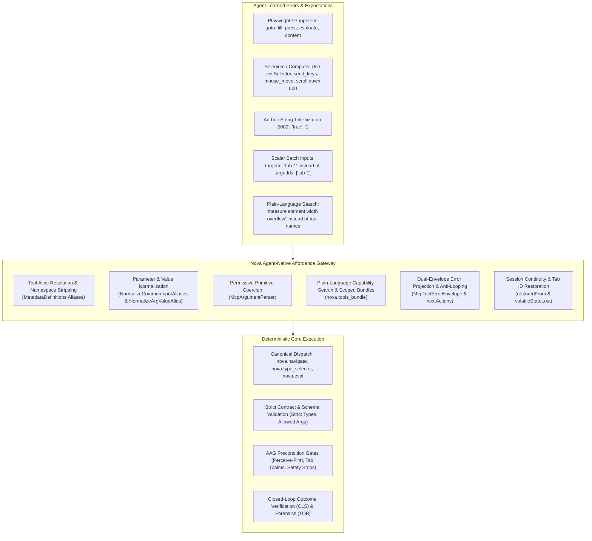
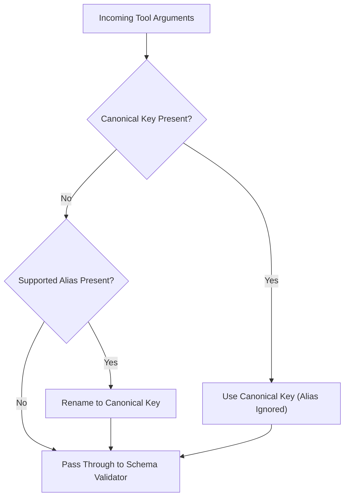
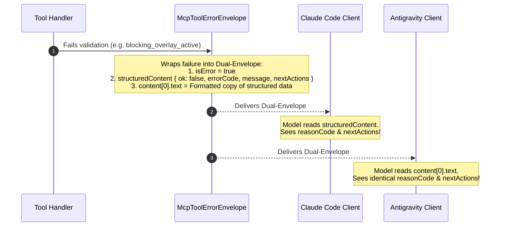
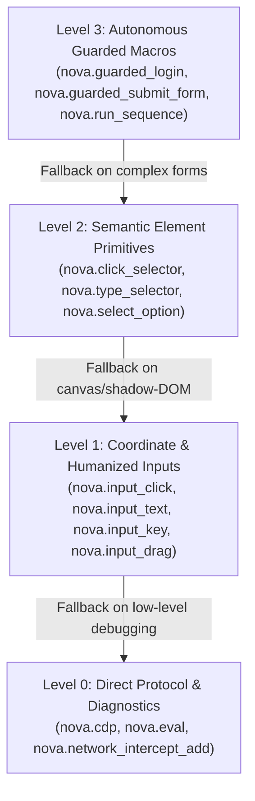

# Agent-Native Affordances

> [!NOTE]
> In human-computer interaction, affordances are the perceived and actual properties of an interface that indicate how it can be used (such as a door handle shaped for pulling). In AI agent automation, **Agent-Native Affordances** are the architectural and protocol-level properties of Nova AI Workspace designed to match the statistical priors, reasoning patterns, and operational expectations of Large Language Models (LLMs). Rather than forcing agents into brittle trial-and-error cycles, Nova provides cognitive ergonomics: intuitive vocabulary bridges, automatic parameter normalizations, plain-language capability search, value harmonizations, resilient dual-envelope error representations, session continuity across restarts, secret-preserving inputs, directional self-healing guidance, and layered control tiers.

---

## 1. The Affordance Paradigm & Core Philosophy

An AI agent arrives at an automation task equipped with extensive training on Playwright, Puppeteer, Selenium, and computer-use APIs. When attempting to navigate or interact with a webpage, it instinctively generates calls such as `nova.goto(url="https://...")`, uses parameter names like `value` instead of `text`, or provides Anthropic-style scroll objects like `{ direction: "down", amount: 500 }`.

In conventional tool servers, these intuitive calls crash with strict protocol errors:
* `-32601 Method not found` (because the tool is named `navigate`, not `goto`)
* `-32602 Invalid params` (because the schema expected `text`, not `value`)
* Transport crashes (because numbers or booleans were passed as string tokens)

These rigid rejections waste hundreds of prompt tokens, force models into blind retry loops, and frequently stall autonomous workflows.



### 1.1 The Core Design Tenet
> **Agents should not have to unlearn what they already know in order to use Nova.**
> Nova accommodates clear learned expectations while keeping the underlying canonical contract exact, deterministic, and fully auditable.

Agent-native affordances are **not tech debt or loose typing**. They constitute an intentional cognitive compatibility layer that translates common agent intuitions into canonical Nova operations prior to dispatch. Once translated, every call executes against Nova's strict schema validators, tab lease checkers, and [Agent Awareness Gates (AAG)](../agent-awareness-gates-aag/README.md).

---

## 2. The Seven Pillars of Nova's Affordance Architecture

Nova implements agent-native ergonomics across seven distinct architectural dimensions:

```mermaid
flowchart LR
    subgraph P1["1. Vocabulary Bridges"]
        A1["Action Aliases"]
        A2["Parameter Aliases"]
        A3["Prefix Stripping"]
    end

    subgraph P2["2. Value Harmonization"]
        B1["outputDetail Mapping"]
        B2["Type Coercion"]
        B3["Scalar-to-Array Lifting"]
    end

    subgraph P3["3. Capability Discovery"]
        C1["Plain-Language Search"]
        C2["Scoped Tool Bundles"]
        C3["On-Demand Instructions"]
    end

    subgraph P4["4. Dual Envelopes"]
        D1["content[0].text Mirror"]
        D2["structuredContent"]
        D3["Client Asymmetry Guard"]
    end

    subgraph P5["5. Directional Recovery"]
        E1["nextActions Guidance"]
        E2["Anti-Loop State Machines"]
        E3["DOM Exception Hints"]
    end

    subgraph P6["6. Session Continuity"]
        F1["restoredFrom Mapping"]
        F2["volatileStateLost Diagnosis"]
        F3["retryAfterMs Backoff"]
    end

    subgraph P7["7. Tiered & Safe Control"]
        G1["Macros down to CDP"]
        G2["Deep Shadow DOM Piercing"]
        G3["Opaque Vault Secrets"]
    end

    P1 --> P2 --> P3 --> P4 --> P5 --> P6 --> P7
```



1. **Cognitive Vocabulary Bridges:** Transparently routing familiar framework action names (Playwright, Selenium, Puppeteer, Anthropic Computer-Use) and parameter synonyms to canonical Nova endpoints.
2. **Structural & Value Harmonization:** Reconciling divergent output detail vocabularies, coercing stringified primitives into JSON types, and automatically lifting singular IDs into expected batch arrays.
3. **Plain-Language Capability Discovery:** Enabling agents to find tools using natural language task descriptions (`query="measure element width overflow"`) and loading scoped capability bundles on demand.
4. **Universal Dual-Envelope Observability:** Projecting rich failure metadata into both structured JSON fields and self-contained text blocks to ensure guidance reaches the LLM across asymmetrical client harnesses.
5. **Directional Self-Healing & Loop Breakers:** Providing actionable `nextActions` vectors, cycle-detection state machines, and DOM exception diagnostics that prevent agents from stalling in repetitive retry loops.
6. **Session Continuity & Tab Restoration:** Preserving tab references across application restarts via `restoredFrom` mapping and explicitly diagnosing lost volatile state (media streams, object URLs).
7. **Tiered Control & Privacy-Preserving Execution:** Enabling seamless transitions between high-level autonomous macros and low-level coordinate inputs, piercing Shadow DOM boundaries, and filling sensitive credentials without cleartext exposure.

---

## 3. Multi-Layer Compatibility Engine

### 3.1 Action Name Bridges (Tool Aliases)

When an agent attempts to execute a tool without prior catalog discovery, it relies on its internal training memory. Nova maintains a high-performance lookup table that maps familiar names to their canonical counterparts:

| Category | Familiar / Incoming Tool Name | Canonical Nova Tool | Intuition Source / Framework |
| :--- | :--- | :--- | :--- |
| **Navigation** | `nova.goto` | `nova.navigate` | Playwright `page.goto()`, Puppeteer |
| | `nova.refresh` | `nova.reload` | Selenium `driver.refresh()`, Playwright |
| **Form & Input** | `nova.fill`, `nova.type` | `nova.type_selector` | Playwright `page.fill()`, Puppeteer |
| | `nova.click`, `nova.click_element` | `nova.click_selector` | Standard DOM automation |
| | `nova.press`, `nova.key`, `nova.keypress` | `nova.input_key` | Playwright `page.press()`, Anthropic Computer-Use |
| | `nova.select` | `nova.select_option` | Playwright `page.selectOption()` |
| | `nova.upload` | `nova.file_upload` | Shorthand file input |
| **Mouse & Viewport** | `nova.move`, `nova.mouse_move` | `nova.input_move` | Anthropic Computer-Use `mouse_move` |
| | `nova.scroll` | `nova.scroll_by` | Generic mouse wheel intuition |
| | `nova.viewport` | `nova.emulation_set_device_metrics` | Playwright `page.setViewportSize()` |
| | `nova.useragent` | `nova.emulation_set_user_agent` | Shorthand emulation |
| **DOM & Inspection** | `nova.evaluate`, `nova.run_js`, `nova.eval_js`, `nova.exec`, `nova.execute` | `nova.eval` | Playwright `page.evaluate()`, Selenium |
| | `nova.content`, `nova.page_source`, `nova.dom`, `nova.get_dom` | `nova.read_dom` | Playwright `page.content()`, Selenium |
| | `nova.text` | `nova.read_text` | Shorthand text extraction |
| | `nova.url`, `nova.title` | `nova.page_info` | Playwright `page.url()`, `page.title()` |
| | `nova.cookies` | `nova.cookie_list` | Plural cookie lookup intuition |
| | `nova.waitforselector`, `nova.wait_for_element` | `nova.wait_for_selector` | Puppeteer camelCase / Selenium wait |
| | `nova.console`, `nova.network`, `nova.messages` | `nova.console_read`, `nova.network_read`, `nova.messages_read` | Bare noun log stream intuition |
| | `nova.dialog` | `nova.ui_inspect_native_dialog` | Playwright `page.on('dialog')` intuition |
| **Tab Management** | `nova.new_tab` | `nova.tab_new` | Browser tab creation shorthand |
| | `nova.close_tab` | `nova.tab_close` | Browser tab closing shorthand |
| | `nova.list_tabs`, `nova.get_tabs` | `nova.tabs` | Verb-prefixed tab queries |
| **History Navigation**| `nova.history`, `nova.history_list`, `nova.history_query`, `nova.browsing_history` | `nova.history_search` | Global browsing history intuition |
| | `nova.history_navigate`, `nova.history_jump` | `nova.history_go` | Per-tab back/forward navigation |
| **Media & Audio** | `nova.screenshot`, `nova.take_screenshot` | `nova.capture_screenshot` | Common screenshot intuition |
| | `nova.app_screenshot` | `nova.capture_app_screenshot` | Window-level capture intuition |
| | `nova.transcribe`, `nova.speech_to_text`, `nova.audio_transcribe` | `nova.media_transcribe_start` | Voice & audio processing intuition |
| **Network Mocking** | `nova.intercept`, `nova.network_intercept`, `nova.mock`, `nova.mock_request` | `nova.network_intercept_add` | Request interception & mocking |
| | `nova.unroute` | `nova.network_intercept_clear` | Playwright `page.unroute()` intuition |
| | `nova.replay`, `nova.repeat`, `nova.network_repeater`, `nova.repeat_request` | `nova.network_replay` | Proxy repeater & replay tools |
| **Session Capture** | `nova.session_recording_start`, `nova.trace_start`, `nova.record_start` | `nova.session_record_start` | Tracing & recording intuition |
| | `nova.session_recording_stop`, `nova.trace_stop`, `nova.record_stop` | `nova.session_record_stop` | Tracing stop intuition |
| | `nova.session_record_decode`, `nova.session_recording_decode` | `nova.session_record_export` | Export / decoding intuition |
| **Remote Protocols**| `nova.sftp_download`, `nova.ftp_download` | `nova.sftp_get`, `nova.ftp_get` | POSIX file transfer verbs |
| | `nova.sftp_upload`, `nova.ftp_upload` | `nova.sftp_put`, `nova.ftp_put` | POSIX file transfer verbs |
| | `nova.sftp_ls`, `nova.ftp_ls` | `nova.sftp_list`, `nova.ftp_list` | POSIX directory listing verbs |
| | `nova.sftp_rm`, `nova.ftp_rm` | `nova.sftp_delete`, `nova.ftp_delete` | POSIX removal verbs |
| | `nova.sftp_mv`, `nova.ftp_mv` | `nova.sftp_rename`, `nova.ftp_rename` | POSIX rename verbs |
| | `nova.ssh_exec` | `nova.ssh_run` | Remote execution shorthand |
| **Lifecycle & Setup**| `nova.onboard`, `nova.onboarding`, `nova.setup` | `nova.install_onboarding` | Single-call agent onboarding |
| | `nova.quit`, `nova.exit`, `nova.shutdown`, `nova.close_app` | `nova.app_quit` | Application shutdown verbs |
| | `nova.mcp_log`, `nova.mcp_server_log` | `nova.mcp_transport_log` | Diagnostics log intuition |

---

### 3.2 Namespace & Client Prefix Stripping

MCP client environments format tool names differently. For instance, Claude Code flattens dots and prefixes names as `mcp__nova__nova_tabs`, while Antigravity uses `mcp_nova_nova_tabs`. If an agent extracts a visible tool name from conversational context or a subagent prompt and feeds it back into an execution macro or `tools_bundle` lookup, traditional parsers fail.

Nova automatically normalizes tool namespaces prior to alias matching:
1. **Client Prefix Stripping:** Leading transport prefixes (`mcp__nova__`, `mcp_nova_`) are stripped.
2. **Flattened Prefix Stripping:** If an agent sends `nova_click_selector`, the redundant `nova_` prefix is removed.
3. **Canonical Namespace Restoration:** Bare dot-free names (e.g. `click_selector` or `goto`) are prepended with `nova.` so all internal gates, claim checkers, and policy handlers operate on a uniform identifier.

---

### 3.3 Parameter Normalization (`NormalizeCommonInputAliases`)

Parameter naming discrepancies represent one of the most frequent causes of `-32602` schema errors. Nova intercepts incoming arguments at dispatch entry and normalizes supported aliases to canonical properties.

> [!IMPORTANT]
> **Precedence Invariant:** If both an alias and its canonical parameter are supplied, **the canonical parameter always wins**. Aliases only activate when the canonical key is absent.



#### Parameter Normalization Matrix

| Target Scope / Tools | Incoming Alias | Canonical Parameter | Design Rationale & Safety Boundary |
| :--- | :--- | :--- | :--- |
| **All Selector Tools** (`click_selector`, `type_selector`, `get_element_rect`, etc.) | `cssSelector`<br>`css`<br>`locator` | `selector` | Standardizes Selenium (`cssSelector`), Anthropic (`css`), and Playwright (`locator`) terminology. Safe across all tools because unknown properties are rejected anyway. |
| **Text Input Tools** (`nova.type_selector`, `nova.input_text`) | `value`<br>`input` | `text` | Playwright `fill(selector, value)` and Selenium `send_keys` swap between `value` and `input`. Strictly scoped to text tools so it does not collide with `select_option` or `cookie_set` (where `value` is canonical). |
| **Wait Tools** (`nova.wait_for_*`) | `pollIntervalMs`<br>`intervalMs` | `pollMs` | Reconciles Puppeteer and custom timing names with Nova's canonical interval argument. |
| **PKS Knowledge Tools** (`pks_get`, `pks_match`, `pks_patch`, `pks_upsert`, etc.) | `domain` | `scope` | Agents working with Domain Notes call the target website `domain`, while PKS calls it `scope`. Scoped strictly to PKS tools; on `domain_notes_*`, `scope` denotes sandbox level. |
| **Cookie Inspection** (`nova.cookie_list`) | `domain`<br>`name` | `domainFilter`<br>`nameFilter` | Playwright and Selenium cookie queries use `domain` and `name`. Scoped exclusively to list queries so mutating tools (`cookie_set`) retain literal `domain` and `name`. |
| **Memory Notes** (`nova.memory_note`) | `kind` | `memoryType` | Gemini agents naturally reach for `kind`. Maps to closed enum (`note|preference|context`) without leaking to other tools where `kind` is canonical. |
| **Text Reading** (`nova.read_text`) | `chars` | `maxChars` | Claude Code often supplies concise `chars` for output truncation. Mapped exclusively on single-region text reads. |
| **Network Replay** (`nova.network_replay`) | `id`<br>`data` / `payload`<br>`timeout` | `replayId`<br>`body`<br>`timeoutMs` | Maps HTTP client and REST terminology into replay schema. |
| **Network Interception** (`nova.network_intercept_add`, `nova.network_intercept_clear`) | `pattern` / `urlGlob`<br>`code` / `statusCode`<br>`id` / `rule` | `urlPattern`<br>`status`<br>`ruleId` | Aligns Playwright (`pattern`) and HTTP status naming conventions (`statusCode`). |
| **Navigation Tools** (`nova.navigate`, `nova.tab_new`) | `href` | `url` | Standardizes DOM anchor attribute intuition (`href`) to URL. |
| **InPrivate Isolation** (`nova.tab_new`) | `incognito` / `inPrivate`<br>`newContext` / `isolated` | `private`<br>`isolate` | Chrome (`incognito`) and Playwright (`newContext`) mental models mapped to Nova's privacy and sandbox isolation flags. |
| **Modal & Search Filters** (`wait_for_modal`, `perceive`, `search_text`) | `visible` | `visibleOnly` | Reconciles shorthand visibility filters. Strictly excluded from `wait_for_selector` (where `visible` is a poll predicate). |
| **Tab Reclaim** (`nova.tab_claim`) | `reason` | `reclaimReason` | Agents responding to claim-conflict prompts often type `reason`. Scoped strictly to `tab_claim` to prevent stripping `reason` on lifecycle tools. |

---

### 3.4 Complex Conversions & Structural Lifting

Affordances extend beyond 1:1 parameter renaming to encompass multi-field structural conversions:

#### Anthropic Computer-Use Scroll Conversion
Anthropic computer-use tools instruct models to scroll using directional objects:
```json
{ "direction": "down", "amount": 500 }
```
Nova's `nova.scroll_by` natively expects signed Cartesian coordinates (`deltaX`, `deltaY`). Calling `scroll_by` with directional objects would ordinarily fail schema validation.

Nova's `NormalizeScrollDirectionAmountToDeltas` converter translates directional inputs automatically:
* `"down"` $\rightarrow$ `deltaY = +amount`
* `"up"` $\rightarrow$ `deltaY = -amount`
* `"right"` $\rightarrow$ `deltaX = +amount`
* `"left"` $\rightarrow$ `deltaX = -amount`

#### Automatic Scalar-to-Array Lifting
Agents frequently pass a singular ID string to batch-oriented tools:
* Supplying `{ targetId: "tab-1" }` to `nova.tab_snapshot` is automatically lifted to `targetIds: ["tab-1"]`
* Supplying `{ messageId: "msg-101" }` to `nova.mail_delete` is automatically lifted to `messageIds: ["msg-101"]`

This prevents unnatural `-32602 array expected` errors when an agent is operating on an isolated item.

---

### 3.5 Value Synonym Harmonization (`outputDetail`)

Across Nova's tool suite, 14 tools provide projection-level controls (`outputDetail`) to regulate token usage. Over successive feature waves, different tools adopted varying subset vocabularies (`minimal`, `compact`, `summary`, `full`) for similar concepts.

When an agent carries a word from one tool to another (e.g. using `summary` on a tool that publishes `compact`), Nova normalizes the value to the nearest valid equivalent rather than rejecting the call:

| Published Tool Vocabulary | Applicable Tools | Accepted Synonyms & Normalization |
| :--- | :--- | :--- |
| `compact` / `full` / `minimal` | `back`, `click_selector`, `forward`, `history_go`, `navigate`, `reload`, `tab_new` | `summary` $\rightarrow$ `compact` |
| `full` / `minimal` / `summary` | `crawl_results`, `crawl_status`, `tabs` | `compact` $\rightarrow$ `summary` |
| `compact` / `full` | `capture_screenshot`, `eval`, `get_element_rect`, `wait_for_selector` | `summary` $\rightarrow$ `compact`<br>`minimal` $\rightarrow$ `compact` |
| `full` / `minimal` | `type_selector` | `compact` $\rightarrow$ `minimal`<br>`summary` $\rightarrow$ `minimal` |
| `full` / `summary` | `pks_get` | `compact` $\rightarrow$ `summary`<br>`minimal` $\rightarrow$ `summary` |

> [!NOTE]
> **The Safe Direction Principle:** Value normalization maps strictly toward the nearest equivalent or slightly more informative tier. It never maps downward in a way that strips safety warnings or requested diagnostic data.

---

### 3.6 Permissive Primitive Coercion (`McpArgumentParser`)

LLM tokenizers often emit numeric values and booleans as quoted JSON strings, producing payloads such as:
```json
{
  "maxChars": "5000",
  "force": "true",
  "isolate": "1"
}
```
Nova's `McpArgumentParser` implements resilient type coercion for primitive types:
* **Booleans:** Accepts `"true"`, `"1"`, `true` $\rightarrow$ `true`; `"false"`, `"0"`, `false` $\rightarrow$ `false`.
* **Integers & Floats:** Parses string representations into `int` or `double` using invariant culture (`"5000"` $\rightarrow$ `5000`, `"1.5"` $\rightarrow$ `1.5`).
* **Enums & Closed Vocabularies:** Case-insensitive trimming (`"SUMMARY"` $\rightarrow$ `"summary"`).

Unknown string values that cannot be parsed as valid numbers or booleans continue to be rejected with clean, descriptive `-32602` error messages.

---

## 4. Plain-Language Capability Discovery & Dynamic Guidance

### 4.1 Plain-Language Query Search in `nova.tools_bundle(query=...)`

A primary failure mode of autonomous agents is the **"Blank Slate Fallback Trap"**: when an agent is unsure whether a tool exists for a specialized task (such as layout measurement, table extraction, or audio transcription), it frequently concludes the capability is missing and attempts to hand-roll fragile 50-line scripts inside `nova.eval`.

Nova's capability search affordance solves this directly:
* **Task-Oriented Fuzzy Queries:** Agents can query capabilities in natural language:
  ```json
  { "query": "measure element width overflow clipped text" }
  ```
* **Intelligent Tokenization & Stop-Word Removal:** The search engine strips function words (`"how"`, `"do"`, `"I"`, `"want"`, `"to"`, `"please"`) and ranks tools based on term hits across both tool names and full descriptions.
* **OR-Combined Thresholding:** Imprecise paraphrases still succeed: querying `"transcribe voice message audio to text"` reliably returns `nova.media_transcribe_start`, even though none of the individual terms match the exact tool name alone.

### 4.2 Scoped Capability Bundles
Rather than dumping 100+ tools into an agent's initial context window, Nova organizes tools into on-demand functional bundles:
* `browser_automation`: Core navigation, element clicking, form entry, and tab lifecycles.
* `page_read_debug`: DOM extraction, console monitoring, network inspection, layout measurement, and visual diffs.
* `vault_auth`: Password retrieval, credential injection, and authenticated account switching.
* `crawler_ops`: Site exploration, link verification, and URL coverage scans.
* `proxy_management`: Traffic tunneling, proxy testing, and credentials management.

#### Transparent Gated Tool Diagnostics
When a tool is disabled because an application setting is toggled off (e.g. `BrowsingMemoryEnabled` or `CrawlerOps`), calling `nova.tools_bundle(includeUnavailable=true)` returns `unavailableToolDetails`:
```json
{
  "toolName": "nova.memory_note",
  "available": false,
  "requiredSetting": "BrowsingMemoryEnabled",
  "reason": "Disabled by host administrator in settings.json"
}
```
This tells the agent why the tool is unavailable, preventing it from misdiagnosing configuration limits as broken tools.

### 4.3 Tailored On-Demand Guidance (`nova.get_instructions`)
Operating instructions are delivered on demand via `nova.get_instructions`, optimized for minimal token overhead:
* **Compact Default (~5 KB):** Returns essential Trust & Safety rules, session bootstrap procedures, and plain-language search tips without exceeding client token limits.
* **Specialized Operational Modes:**
  * `mode="learn"`: Activates onboarding guidance, coverage floors, and interactive semantic opportunities.
  * `mode="audit"`: Supplies accessibility and layout testing directives.
  * `topic="bug_report"`: Provides structured Markdown incident templates and log redaction instructions.
* **Dynamic Context Projection:** Injects domain-specific notes, active operator policies, and task profiles tailored to the current browsing target.

---

## 5. Universal Dual-Envelope Response Affordance (`McpToolErrorEnvelope`)

Different MCP client environments process and present tool results to LLMs asymmetrically:
* **Claude Code:** Prioritizes `structuredContent`. If `structuredContent` is present, it strips the text array from the prompt context. If a JSON-RPC transport error occurs, it presents only `message`.
* **Antigravity:** Primary attention is given to the text block (`content[0].text`).
* **OpenAI Codex:** Inspects both text and structured content, validating responses against `outputSchema`.

This asymmetry poses an operational hazard: an error hint placed solely in `structuredContent` is invisible to Antigravity, while an error hint placed solely in `content[0].text` is invisible to Claude Code.



### 5.1 The Dual-Envelope Guarantee
Nova routes all tool failures through `McpToolErrorEnvelope`:
1. **Soft Error Standardization:** Every tool failure returns `isError: true` rather than a protocol-level transport disconnect.
2. **Structured Payload:** `structuredContent` contains machine-readable fields (`ok: false`, `errorCode`, `reasonCode`, `repairHint`, `nextActions`, `retryAfterMs`).
3. **Verbatim Text Mirroring:** `content[0].text` receives an exact, human- and model-readable text projection of the structured fields.

Regardless of whether an agent interacts via Claude Code, Antigravity, Codex, Cursor, or a custom SDK harness, the repair instructions are guaranteed to enter the model's active context.

### 5.2 Clean Empty-Argument Formatting (`McpAllowedArgsMessage`)
When an agent calls an argumentless tool (such as `nova.ui_inspect_native_dialog`) with speculative parameters, naive formatters output:
```text
unknown property 'targetId'. Allowed: 
```
This confusing blank listing tempts agents into believing the server encountered a bug. Nova formats zero-argument rejections explicitly:
```text
The tool 'nova.ui_inspect_native_dialog' accepts no arguments.
```

---

## 6. Directional Recovery & Loop Breakers

An affordance must guide an agent forward when an action cannot be completed. Conventional systems return dead-end errors; Nova provides **directional vectors** (`nextActions`) and stateful loop breakers.

### 6.1 The `nextActions` Protocol
When a tool fails or an awareness gate intercepts execution, the response includes prioritized alternative steps:
```json
{
  "isError": true,
  "structuredContent": {
    "ok": false,
    "errorCode": -32002,
    "reasonCode": "blocking_overlay_active",
    "message": "Element is obscured by a full-screen consent dialog.",
    "nextActions": [
      {
        "priority": 100,
        "tool": "nova.cmp_apply",
        "reason": "Dismiss detected consent overlay",
        "args": { "mode": "accept_all" }
      },
      {
        "priority": 80,
        "tool": "nova.dismiss_blockers",
        "reason": "Attempt generic modal dismissal",
        "args": { "strategy": "conservative" }
      }
    ]
  }
}
```

### 6.2 Anti-Loop State Machine in `dismiss_blockers`
When agents encounter stubborn modals, they frequently enter infinite retry loops. Nova's `dismiss_blockers` tracks route attempts per session (`consecutiveBlockedOnRoute`):
1. **First Failure (Conservative):** Recommends `nova.perceive` and one-time escalation to `strategy="aggressive"`.
2. **Second Failure (Aggressive):** Recommends `nova.perceive` with an explicit directive: `"Do NOT retry dismiss_blockers on this route; inspect DOM directly"`.

This stateful escalation breaks 30+ call retry spirals.

### 6.3 DOM Script Exception Interception in `nova.eval`
The single largest error class among autonomous agents is evaluating JavaScript expressions against non-existent elements:
```javascript
document.querySelector(".submit-btn").getBoundingClientRect() // Throws TypeError: null is not an object
```
When `nova.eval` catches common DOM exceptions (`null / undefined access`, `invalid selector`), it intercepts the raw stack trace and enriches the message with an actionable diagnosis:
```text
eval.script_threw: Cannot read properties of null (reading 'getBoundingClientRect').
Affordance Hint: The selector returned null. Call nova.read_dom() or nova.perceive(mode='summary') to verify element existence before querying properties.
```

---

## 7. Session Continuity, Tab Restoration & Backoff Affordances

### 7.1 Target ID Continuity Across Restarts (`restoredFrom`)
During long-running automation or system updates, Nova or the underlying browser may restart. When tabs are restored, Chromium assigns them fresh internal runtime identifiers.

In standard architectures, an agent continuing with an existing tab ID immediately fails with `unknown target`. Nova's target resolution engine mitigates this:
* **Automatic Tab Re-Mapping:** Restored tabs carry a `restoredFrom` attribute preserving their pre-restart ID.
* **Transparent Resolution:** If an agent dispatches an action using the previous tab ID, Nova automatically resolves the call to the restored tab without interrupting execution.

### 7.2 Explicit Volatile State Diagnostics (`volatileStateLost`)
If a tab is permanently lost or replaced, Nova's error handler recognizes the 8-hex tab identifier and generates a detailed diagnostics payload explaining what died with the old document context:
* Injected probes and page-side listeners.
* Active media recordings (such as `nova.media_capture_start`).
* Object URLs and blob handles (`nova.page_blobs_list`).

The error provides concrete instructions on which watchers must be re-armed on the new tab before re-triggering actions.

### 7.3 Rate-Limiting with Explicit Backoff Durations (`retryAfterMs`)
When operations encounter temporary network rate limits or cooldown windows, Nova returns `-32029` accompanied by `retryAfterMs`:
```json
{
  "errorCode": -32029,
  "message": "Connector probe cooldown active. Retry after 2000ms.",
  "data": {
    "profileId": "prod-auth",
    "retryAfterMs": 2000
  }
}
```
This tells the calling agent exactly how long to pause, preventing frantic polling loops.

---

## 8. Deep DOM Inspection, Selector Healing & Secret Privacy

### 8.1 Deep Shadow DOM Piercing & Coordinate Extraction
Modern web components encapsulate inputs inside nested Shadow DOM trees where standard `document.querySelector` fails. Nova's `nova.get_element_rect` and `nova.get_active_element_deep` automatically pierce shadow root boundaries:
* Returns exact viewport-relative bounding boxes (`x`, `y`, `width`, `height`).
* Identifies deep active elements regardless of shadow tree nesting depth.
* Facilitates smooth fallback to coordinate-level clicking ([Humanized Input Engine](../humanized-input-engine/README.md)) when DOM dispatch is obstructed.

### 8.2 Adaptive Selector Healing (`pksAdvice`)
When an element's selector changes or breaks due to website redesigns, Nova's Phenomenological Knowledge Store (PKS) intercepts the failure and evaluates learned selector patterns:
* Injects alternative verified selectors directly into `structuredContent.pksAdvice`.
* Supplies ranked locator candidates so the agent can self-heal without re-reading the entire DOM.

### 8.3 Opaque Secret Injection (`nova.type_selector_secret`)
Autonomous agents often need to submit passwords, API keys, or credit card numbers. Transmitting cleartext secrets in MCP tool calls (`text="secret123"`) pollutes conversational logs and leaks credentials to LLM providers.

Nova provides an opaque secret injection affordance:
* Secrets stored in Nova's local encrypted Vault can be referenced by key or prepared token (`nova.vault_prepare_fill`).
* `nova.type_selector_secret` injects the credential host-side directly into the active input element.
* Cleartext credentials never enter the LLM prompt, conversational context, or MCP action logs.

---

## 9. Educational Feedback Loop (`InjectAliasInfo`)

Aliases in Nova are designed as **transitional learning bridges**, not permanent cloaks. When an agent invokes a tool via an alias or a flattened name, Nova executes the canonical tool and injects pedagogical metadata into the response:

```json
{
  "structuredContent": {
    "ok": true,
    "_aliasInfo": {
      "aliasedFrom": "nova.goto",
      "canonicalTool": "nova.navigate",
      "guidance": "You called 'nova.goto', which was resolved to canonical 'nova.navigate'. Use canonical names for direct execution."
    }
  }
}
```

### Discovery vs Execution Boundary
* **Discovery (`tools/list`):** Publishes **only canonical tools**. Aliases are never exposed in tool discovery catalogs, keeping schemas clean and preventing prompt pollution.
* **Execution (`tools/call`):** Accepts aliases, normalizes arguments, executes the canonical logic, and returns educational feedback.

The calling model naturally adopts canonical names in subsequent steps without wasting a turn on an error.

---

## 10. Tiered Levels of Control (Layered Autonomy)

Nova provides four progressively lower tiers of abstraction. An agent can operate at the highest level of abstraction that succeeds, dropping down to lower levels when edge cases arise:



1. **Level 3: Autonomous Guarded Macros:** High-level compound operations (`nova.guarded_login`, `nova.guarded_submit_form`, `nova.run_sequence`) that handle waits, input verification, and form submission in a single roundtrip.
2. **Level 2: Semantic Element Primitives:** Standard DOM selector tools (`nova.click_selector`, `nova.type_selector`, `nova.select_option`). Handles scrolling into view, element readiness checks, and humanized typing.
3. **Level 1: Coordinate & Humanized Inputs:** Hardware-level simulation (`nova.input_click`, `nova.input_text`, `nova.input_key`, `nova.input_drag`). Interacts with arbitrary pixel coordinates, canvas games, complex SVGs, or custom web components. See [Humanized Input Engine](../humanized-input-engine/README.md).
4. **Level 0: Direct Protocol & Diagnostics:** Raw browser control via Chrome DevTools Protocol (`nova.cdp`), arbitrary JavaScript evaluation (`nova.eval`), and real-time request mocking ([Network Interception](../network/network-interception/README.md)).

### Contract Parity Across Levels
Lower levels provide finer physical control, but **never bypass safety contracts**:
* An `input_click` coordinate dispatch is subject to the same tab lease checks (`tab_claim`) and emergency stops as a high-level `guarded_login`.
* A `cdp` command targeting an InPrivate tab cannot perform persistent writes to long-term databases.
* All levels emit structured telemetry to the [Tool Observation Bus (TOB)](../tool-observation-bus-tob/README.md).

---

## 11. Intentional Boundary Decisions: Rejected Aliases & Anti-Patterns

Not every recurring agent expectation qualifies for an alias. Where an alias would mask a conceptual misunderstanding, create semantic collisions, or create security risks, Nova explicitly **rejects the alias** and clarifies the boundary through documentation and error messaging:

### 1. `includeAllWindows` on `nova.tabs` (Deliberately Rejected)
* **Agent Expectation:** Agents coming from Playwright or CDP try calling `nova.tabs` with argument `includeAllWindows=true`.
* **Why Rejected:** Nova operates a single application window; all tabs (including multi-sandbox tabs) exist in that window. Creating an alias would reinforce the false mental model that additional hidden windows exist and prompt the agent to search for non-existent `windowId` parameters.
* **Affordance Fix:** The tool description for `nova.tabs` was updated to explicitly state that the returned list is complete and window-invariant.

### 2. `nova.route` as Request Interception (Deliberately Rejected)
* **Agent Expectation:** Playwright uses `page.route()` to define network request interception.
* **Why Rejected:** Nova already possesses a canonical tool named `nova.route` that performs Single Page Application in-page routing. Aliasing `nova.route` to request interception would cause an agent intending to mock an API to inadvertently navigate away from the current page.
* **Affordance Fix:** Network interception is canonically named `nova.network_intercept_add` with aliases `nova.intercept` and `nova.mock_request`. Playwright's `unroute` safely aliases to `nova.network_intercept_clear` because no name collision exists.

### 3. `hard` $\rightarrow$ `force` on `nova.reload` (Deliberately Rejected)
* **Agent Expectation:** Agents try `hard=true` on reload.
* **Why Rejected:** On `nova.reload`, `hard` denotes a cache-bypassing browser reload, whereas `force` denotes an AAG session-destruction gate bypass. Automatically rewriting `hard` $\rightarrow$ `force` would silently escalate a simple cache refresh into an irreversible session termination.

### 4. Ambiguous Cache Types in `nova.cache_clear` (Deliberately Rejected)
* **Agent Expectation:** Agents pass `dataTypes=['cache']`.
* **Why Rejected:** In Chromium, "cache" is genuinely ambiguous between HTTP Disk Cache (`diskCache`) and HTML5 Cache Storage API (`cacheStorage`). Automatically guessing would result in incomplete cache clears. The error message explicitly enumerates the supported valid tokens.

---

## 12. Framework Compatibility Matrix

The following matrix summarizes how Nova bridges common automation frameworks:

| Automation Concept | Playwright Convention | Selenium Convention | Anthropic Computer-Use | Canonical Nova Equivalent |
| :--- | :--- | :--- | :--- | :--- |
| **Page Navigation** | `page.goto(url)` | `driver.get(url)` | N/A | `nova.navigate(url=...)` *(alias: `goto`)* |
| **Text Typing** | `page.fill(sel, value)` | `el.send_keys(text)` | `type(text)` | `nova.type_selector(selector=..., text=...)` *(aliases: `value`, `input`)* |
| **Element Clicking**| `page.click(sel)` | `el.click()` | `left_click` | `nova.click_selector(selector=...)` *(alias: `click`)* |
| **Keyboard Press** | `page.press(key)` | `el.send_keys(Key)` | `key(key)` | `nova.input_key(key=...)` *(alias: `press`)* |
| **Script Eval** | `page.evaluate(fn)` | `driver.execute_script`| N/A | `nova.eval(expression=...)` *(aliases: `evaluate`, `exec`)* |
| **DOM Inspection** | `page.content()` | `driver.page_source` | N/A | `nova.read_dom()` *(aliases: `content`, `page_source`)* |
| **Screenshots** | `page.screenshot()` | `driver.save_screenshot`| `screenshot` | `nova.capture_screenshot()` *(alias: `screenshot`)* |
| **Scrolling** | `page.mouse.wheel()` | `ActionChains.scroll` | `{ direction, amount }` | `nova.scroll_by(deltaY=...)` *(auto-converts direction/amount)* |
| **Network Mocks** | `page.route(pattern)` | DevTools CDP | N/A | `nova.network_intercept_add(urlPattern=...)` *(alias: `intercept`)* |

---

## Related Documentation

* **[Agent Awareness Gates (AAG)](../agent-awareness-gates-aag/README.md)** — Preemptive situational execution checks and recovery contracts.
* **[Closed-Loop System (CLS)](../closed-loop-system-cls/README.md)** — Post-action visual transition verification.
* **[Tool Observation Bus (TOB)](../tool-observation-bus-tob/README.md)** — Forensic event tracking and audit trails.
* **[Humanized Input Engine](../humanized-input-engine/README.md)** — Coordinate mouse physics, bezier trajectories, and typing delays.
* **[Phenomenological Knowledge Store (PKS)](../learning/phenomenological-knowledge-store-pks/README.md)** — Self-healing selector learning and SPA navigation phenomenons.
* **[Network Interception & Replay](../network/network-interception/README.md)** — Tab-scoped mock rules and request replay engine.
* **[MCP Reference Index](../../mcp-reference/README.md)** — Complete catalog of all canonical native tools.

[All core features](../README.md)
