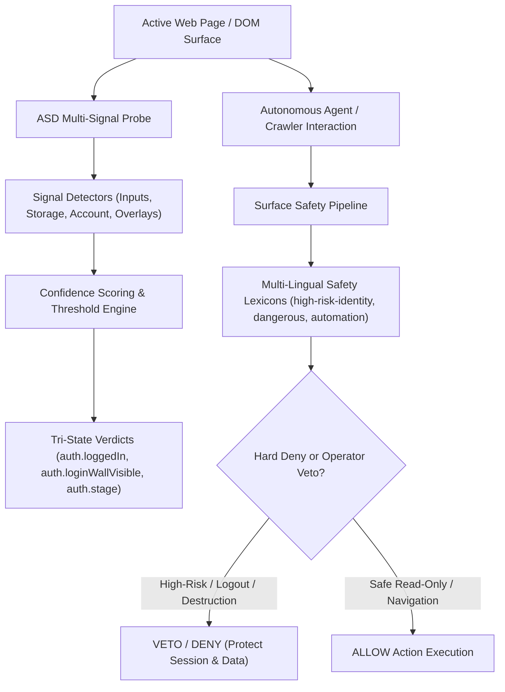
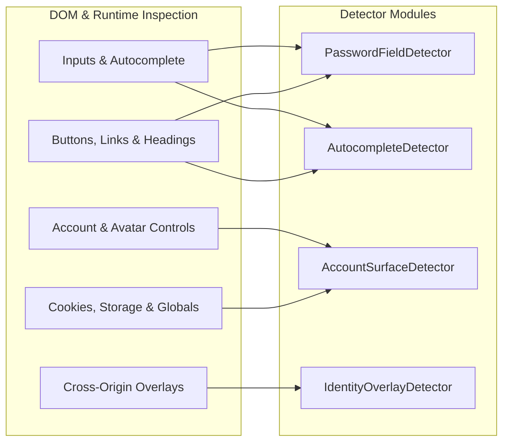
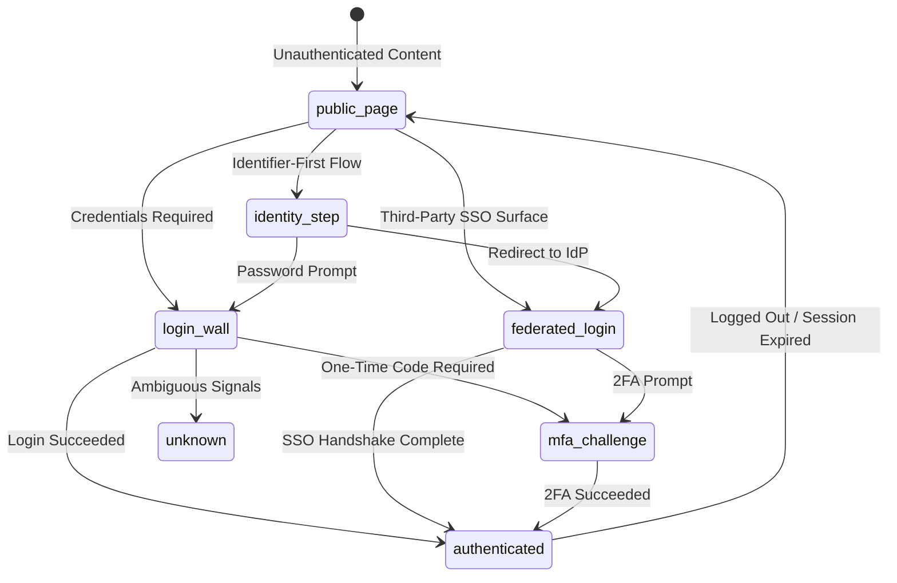
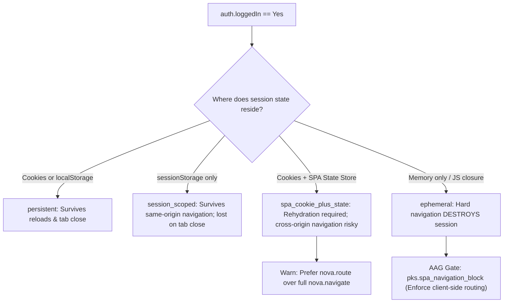
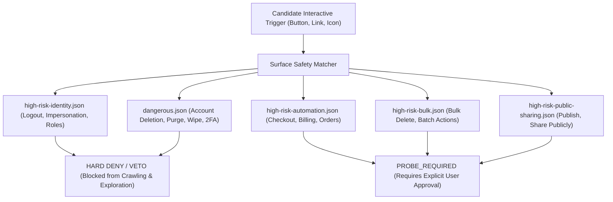
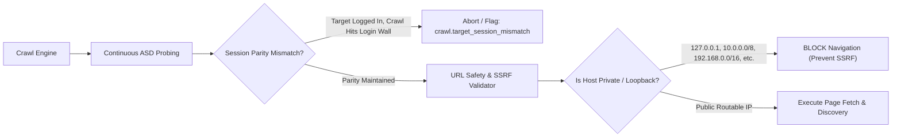
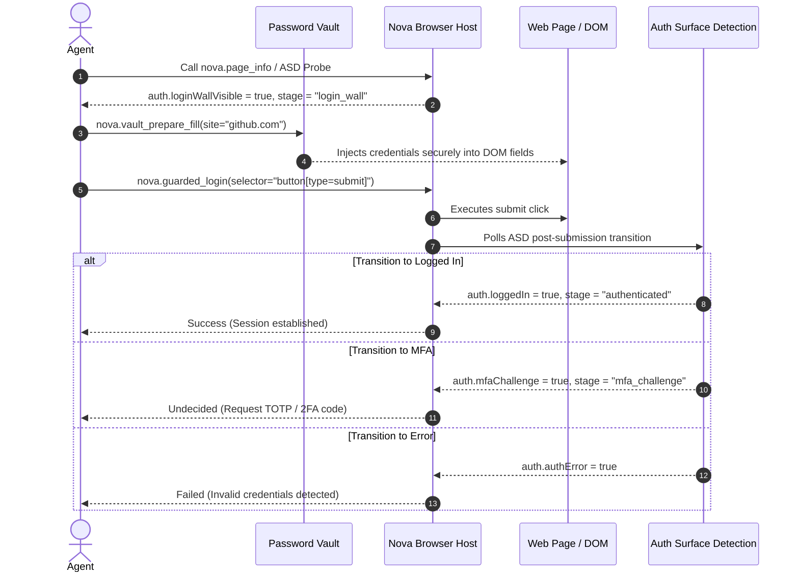

# Auth Surface Detection (ASD) & Surface Safety

> [!NOTE]
> **Auth Surface Detection (ASD)** assesses authentication states and surface risks using heuristic page signals, three-valued truth logic, and embedded multi-lingual safety lexicons. It determines whether a browser surface presents an interactive login wall, an active authenticated session, a multi-factor authentication (MFA) challenge, or an identity error. Operating alongside the **Surface Safety Lexicon Shield**, Nova actively prevents autonomous agents, background crawlers, and surface explorers from accidentally triggering destructive account mutations, financial checkouts, or unintended session logouts.

---

## 1. Executive Summary & The Problem of Blind Automation

Browser automation frequently collapses when encountering modern authentication workflows. Traditional automation frameworks make two catastrophic assumptions:

1. **Boolean Coercion:** An automated script asks: *"Is the user logged in?"* If the page presents an intermediate MFA challenge, an email-first identifier step, or an ambiguous session rehydration state, a naive boolean check returns `false`. The automation engine then falls back to re-submitting saved login credentials—triggering account lockouts, rate limits, or security alarms.
2. **Selector Fragility:** Scripts relying on fixed DOM selectors (`#login-button`, `.sign-in`) fail immediately upon minor frontend redesigns, A/B testing variations, single sign-on (SSO) redirects, or shadow DOM encapsulation.
3. **Exploratory Destruction:** When autonomous agents or web crawlers explore an application interface, they indiscriminately interact with buttons and links. Without contextual safety boundaries, automated crawlers routinely click `Logout`, `Sign Out`, `Abmelden`, `Delete Account`, or `Cancel Subscription`, instantly terminating valid sessions or destroying customer data.

Nova solves these challenges through two deeply coordinated engines:
* **Auth Surface Detection (ASD):** A top-document heuristic probing system that computes continuous confidence scores across DOM structures, accessibility attributes, storage keys, and framework state stores, resolving them into strict **three-valued truth logic** (`Yes`, `No`, `Unknown`).
* **The Surface Safety Lexicon Shield:** A multi-layered safety pipeline backed by multi-lingual embedded JSON lexicons that classifies interactive triggers and enforces **hard-denials** on high-risk identity and destructive actions (e.g. logouts, profile impersonations, account purges, financial transactions).

---

## 2. The Tri-State Logic Paradigm (`Yes`, `No`, `Unknown`)

In security-critical browser automation, **absence of positive evidence is not evidence of absence**. 

If Nova cannot definitively verify whether a user is logged in, answering `No` would cause an agent to assume the session is terminated and execute re-login procedures. Conversely, answering `Yes` might cause an agent to attempt privileged actions against an unauthenticated public redirect.

ASD mandates **Three-Valued Logic (`AuthTriState`)**:

| Tri-State Value | Wire Representation | Operational Meaning | System Behavior |
| :--- | :--- | :--- | :--- |
| **`Yes`** | `true` | Observed signals firmly exceed the positive confidence threshold ($\ge 0.50$). | Preconditions requiring the state succeed; guarded transitions proceed. |
| **`No`** | `false` | Observed signals firmly fall below the negative confidence threshold ($< 0.20$). | Preconditions requiring the state fail cleanly without ambiguous retry loops. |
| **`Unknown`** | `null` | Evidence is ambiguous, contradictory, or between thresholds ($[0.20, 0.50)$). | **Never coerced to false.** Guarded actions requiring `true` or `false` halt and request clarification. |

### Core Invariants of the Tri-State Model
* **No Silent Defaulting:** If an in-page script fails, if the DOM is unreadable, or if conflicting indicators appear simultaneously (e.g., a visible password field on an account management page that also features a logout button), ASD returns `Unknown` (`null`).
* **Fail-Closed Architecture:** Security gates and guarded tools treat `Unknown` as non-passing for assertions requiring explicit affirmative verification.

---

## 3. Multi-Signal Probing & Heuristic Detection Architecture

ASD runs a sandboxed, top-document JavaScript probing script that inspects page elements, attributes, accessibility trees, storage records, and framework globals without external dependencies. The gathered signals feed into dedicated detector modules.

### 3.1 DOM Input & Autocomplete Analysis
The probe inspects all visible `<input>` and `<textarea>` elements across top-level documents and accessible DOM scopes:
* **Password Fields:** Counts visible fields with `type="password"`. A single password field indicates a login surface; multiple password fields indicate registration or password change workflows.
* **W3C Autocomplete Semantics:** Reads standard autocomplete tokens:
  * `autocomplete="current-password"`: Strongly weights toward an explicit login surface.
  * `autocomplete="new-password"`: Indicates account creation, onboarding, or password reset; suppresses login-wall scoring.
  * `autocomplete="one-time-code"`: Signals a Multi-Factor Authentication (MFA) challenge or SMS/TOTP step.
  * `autocomplete="username"` / `autocomplete="email"`: Identifies credential identifier fields.
* **Identifier Fields:** Evaluates visible inputs by attributes (`name`, `id`, `placeholder`, `aria-label`, `data-testid`) containing tokens like `email`, `username`, `login`, `user-id`, or `identifier`.

### 3.2 Form Linkage & Multi-Lingual Action Dictionaries
Auth surfaces vary across internationalized applications. ASD embeds multi-lingual keyword dictionaries to recognize action anchors, submission buttons, and headings across English, German, French, and Spanish:

* **Auth Action URLs (`authHrefKeywords`):** Detects navigation links pointing to `/login`, `/signin`, `/sign-in`, `/auth`, `/oauth`, `/sso`, `/account/login`, `/session`, `/connexion`, `/connect`, `/acceso`, `/entrar`, `/iniciar-sesion`, `/registro`.
* **Action Button Text (`authTextKeywords` & `submitKeywords`):** Identifies textual triggers matching:
  * English: `log in`, `login`, `sign in`, `signin`, `continue with`, `submit`, `next`.
  * German: `anmelden`, `einloggen`, `weiter`, `fortfahren`, `anmelden mit`.
  * French: `se connecter`, `connexion`, `continuer`, `suivant`, `continuer avec`.
  * Spanish: `iniciar sesion`, `acceder`, `entrar`, `continuar`, `siguiente`, `continuar con`.
* **Federated Identity Providers (`providerKeywords`):** Recognizes branded SSO buttons for `Google`, `Microsoft`, `GitHub`, `Apple`, `Okta`, and `Auth0`.
* **Auth Headings (`authHeadingKeywords`):** Inspects `<h1>`–`<h3>`, `<legend>`, and `[role="heading"]` for phrases announcing login or account access.

### 3.3 Account Controls & Authenticated Surface Detection
To determine if a page represents an already authenticated session, ASD searches for controls that only appear when logged in:
* **Logout Links (`logoutSels`):** Inspects anchors and buttons matching `a[href*="logout"]`, `a[href*="abmelden"]`, `a[href*="signout"]`, `a[href*="sign-out"]`, `button[data-testid*="logout"]`.
* **Profile & Settings Anchors:** Evaluates links matching `/profile`, `/account`, `/user`, `/settings`, `/preferences`, and corresponding localized ARIA labels (`Profil`, `Einstellungen`, `Konto`).
* **User Avatars:** Identifies user profile icons or images located inside `<header>`, `<nav>`, `[role="banner"]`, or `[role="navigation"]`. Checks image `src`, `alt`, and `class` attributes, as well as `<svg>` icons with user-related ARIA labels (`avatar`, `user`, `profile`).

### 3.4 Storage & Runtime State Inspection
Authentication often resides in client-side storage rather than visible DOM elements:
* **Cookies:** Inspects active cookies for well-known session identifiers (`session`, `sid`, `auth`, `token`, `jwt`).
* **Web Storage (`localStorage` & `sessionStorage`):** Scans key names and structured values for authentication evidence, user profiles, or JWT tokens.
* **SPA Framework State Stores:** Detects active state management frameworks (React Redux, Pinia, Vuex, Angular) holding user authentication objects.
* **Global Auth Objects:** Checks for runtime globals such as `window.__auth`, `window.firebase`, or active Service Workers managing offline session sync.

### 3.5 Identity & SSO Overlay Detection (`IdentityOverlayDetector`)
Modern web applications frequently embed third-party identity providers in floating dialogs, modals, or iframes (e.g. Google One Tap, Microsoft Entra / MSA, Okta, Atlassian, Apple Sign-In).

When an agent interacts with a web page, these overlays can intercept clicks, obscure form controls, or present unexpected authentication prompts.
* **Geometry & Viewport Scoring:** Evaluates visible cross-origin iframes with high `z-index` ($\ge 1000$), fixed/absolute positioning, and surface area occupying $\ge 10\%$ of the viewport.
* **Provider Catalog Matching:** Identifies known authentication origins (e.g. `accounts.google.com`, `login.microsoftonline.com`, `appleid.apple.com`).
* **Negative Filtering:** Specifically excludes advertising widgets, cookie consent banners (CMP), customer support chat widgets, and CAPTCHA frames.
* **Advisory Warning:** Generates `structuredContent.identityOverlayWarning` and triggers the Agent Awareness Gate `safety.identity_overlay` (`status="warned"`), advising the agent that an external identity overlay is present before dispatching actions.

---

## 4. The 6 Lifecycle Stages (`auth.stage`) & Confidence Scoring Matrix

ASD maps the gathered signals to an explicit authentication lifecycle stage, providing agents with complete situational awareness of the current page context.

### 4.1 Stage Definitions

| Stage Identifier | Characteristic Surface | Key Evidentiary Signals |
| :--- | :--- | :--- |
| **`public_page`** | Standard unauthenticated content | No password fields, no login prompts, low auth confidence ($< 0.20$), standard navigation. |
| **`login_wall`** | Traditional sign-in form | Visible password input, form submit button, login action anchors, or explicit password submit readiness. |
| **`identity_step`** | Multi-step sign-in (email/username first) | Identifier input field visible, "Continue" / "Next" action, no password field yet, auth headings present. |
| **`federated_login`** | Third-party SSO portal | Provider buttons (`Google`, `Microsoft`, `Apple`, `Okta`), no local credential inputs. |
| **`mfa_challenge`** | Two-Factor / Multi-Factor challenge | One-time code field (`autocomplete="one-time-code"`), SMS/TOTP prompts, previous auth step completed. |
| **`authenticated`** | Active logged-in user session | Visible logout controls, profile/avatar navigation, valid storage keys, or active runtime auth globals. |
| **`unknown`** | Ambiguous or conflicting page state | Signup forms with both current and new password fields, contradictory signals, or failed probe execution. |

### 4.2 Confidence Scoring & Threshold Engine
The scoring engine computes continuous confidence values between `0.0` and `1.0`:
* **Login Wall Scoring:**
  * Password input inside a form with a submit button: **Base `0.90`**.
  * Standalone visible password field: **Base `0.65`**.
  * Identity step surface with "Continue" trigger: **Base `0.75`** (or `0.60` without explicit step action).
  * Federated SSO surface: **Base `0.55`**.
  * Presence of "Forgot Password" or login actions adds $+0.10$ each (clamped to `1.0`).
  * *Signup Discounting:* If `new-password`, second password confirmation, or terms-and-conditions checkboxes appear without `current-password`, login confidence is discounted to $\le 0.20$ to prevent false positives.
* **Authenticated Scoring:**
  * Visible logout link: **Base `0.95`**.
  * $\ge 3$ account controls (profile link, settings link, avatar in header): **`0.80`**.
  * 2 account controls: **`0.45`** (yields `Unknown`).
  * 1 account control: **`0.20`** (yields `No`).
  * Active auth globals or SPA state stores: **Up to `0.90`** depending on storage backing.
  * Active login walls or password fields depress logged-in confidence to $\le 0.30$.

### 4.3 Dual-Fact Mapping
Verdicts are published to the Tool Observation Bus (TOB) and dual-facts dictionary:

| Fact Key | Type | Description |
| :--- | :--- | :--- |
| `auth.loginWallVisible` | `boolean \| null` | `true` if $\ge 0.50$, `false` if $< 0.20$, `null` if between. |
| `auth.loggedIn` | `boolean \| null` | `true` if $\ge 0.50$, `false` if $< 0.20$, `null` if between. |
| `auth.mfaChallenge` | `boolean \| null` | `true` if qualifying OTC field exists with auth context. |
| `auth.authError` | `boolean \| null` | `true` if error messages are detected on an active auth surface. |
| `auth.stage` | `string` | One of the 6 lifecycle stages (`login_wall`, `identity_step`, etc.). |
| `auth.persistence` | `string` | Persistence tier (`persistent`, `session_scoped`, `ephemeral`, etc.). |

---

## 5. Session Persistence Classification (`auth.persistence`) & SPA Protection

Modern Single Page Applications (SPAs) manage user credentials across varying storage tiers. A destructive page reload or cross-origin navigation can instantly destroy an in-memory session. ASD classifies persistence to enable predictive navigation gating.

### 5.1 The Four Persistence Tiers

1. **`persistent`:**
   * **Backing:** Persistent cookies or `localStorage` auth tokens.
   * **Safety:** Highly resilient. The session survives full-page hard refreshes (`nova.reload`), browser tab recycling, and browser restarts.
2. **`session_scoped`:**
   * **Backing:** Stored in `sessionStorage`.
   * **Safety:** Survives same-origin full-page navigations (`nova.navigate`) within the same tab, but is completely lost if the tab is closed or a new tab is opened.
3. **`spa_cookie_plus_state`:**
   * **Backing:** Standard cookies exist, but active user state is managed in an in-memory client store (Redux, Pinia, Vuex) or runtime auth global.
   * **Safety:** A hard navigation or reload may cause visual de-synchronization or state loss if server rehydration fails. Nova warns agents to prefer client-side SPA routing (`nova.route`) over full-page navigation (`nova.navigate`).
4. **`ephemeral`:**
   * **Backing:** Pure memory-only authentication (e.g. JWT held only in a JavaScript closure or React component state). No tokens exist in cookies or web storage.
   * **Safety: CRITICAL.** Any standard browser reload (`F5`) or external navigation causes **immediate, unrecoverable session loss**.

### 5.2 Protection via Agent Awareness Gates (AAG)
When ASD detects `auth.persistence == "ephemeral"`, Nova's awareness pipeline enforces the `pks.spa_navigation_block` gate. If an agent attempts to execute `nova.navigate` to an external URL or perform a destructive hard reload on an ephemeral session, the action is blocked unless the agent explicitly confirms session destruction (`confirmSessionDestruction=true`).

---

## 6. The Surface Safety Lexicon Shield & Exclusion Dictionaries

Autonomous surface exploration (`nova.explore_surface`) and background web crawlers (`nova.crawl_start`) navigate web applications by discovering interactive elements and clicking them.

Without strict safety guardrails, automated explorers create havoc:
* Clicking `Abmelden` or `Sign Out` terminates authenticated sessions.
* Clicking `Delete Workspace`, `Cancel Subscription`, or `Purge Data` destroys user environments.
* Clicking `Buy Now` or `Place Order` executes unintended financial transactions.

To prevent this, Nova equips ASD and the Surface Explorer with the **Surface Safety Lexicon Shield**.

### 6.1 Multi-Lingual Safety Lexicons
Nova embeds comprehensive, multi-lingual JSON lexicon dictionaries that classify interface elements into risk tiers:

| Lexicon Category | File Fragment | Target Languages | Example Triggers Matched | Explorer & Crawler Action |
| :--- | :--- | :--- | :--- | :--- |
| **`HighRiskIdentity`** | `high-risk-identity.json` | DE, EN, ES, FR | `logout`, `abmelden`, `sign out`, `se déconnecter`, `cerrar sesión`, `switch profile`, `impersonate`, `assume role`, `transfer admin`, `identität wechseln`. | **HARD DENY.** Crawlers and automated explorers are strictly prohibited from clicking identity-altering triggers. |
| **`Dangerous`** | `dangerous.json` | DE, EN, ES, FR (9,000+ phrases) | `delete account`, `alle daten löschen`, `cancel subscription`, `abo kündigen`, `2fa zurücksetzen`, `reset 2fa`, `purge`, `wipe`, `destroy`. | **HARD DENY.** Catastrophic and permanent mutations are vetoed immediately. |
| **`HighRiskAutomation`** | `high-risk-automation.json` | DE, EN, ES, FR | `buy now`, `jetzt kaufen`, `place order`, `kostenpflichtig bestellen`, `checkout`, `pay`, `zahlen`. | **PROBE_REQUIRED.** Financial checkout triggers require human-in-the-loop confirmation. |
| **`HighRiskBulk`** | `high-risk-bulk.json` | DE, EN, ES, FR | `bulk delete`, `alle löschen`, `select all and delete`, `batch cancel`. | **PROBE_REQUIRED.** High-volume mutations are quarantined. |
| **`HighRiskPublicSharing`** | `high-risk-public-sharing.json` | DE, EN, ES, FR | `share publicly`, `öffentlich freigeben`, `publish to web`, `make public`. | **PROBE_REQUIRED.** Privacy-altering visibility toggles require approval. |
| **`SafeReadonly`** | `safe-readonly.json` | Multi | `view`, `details`, `expand`, `anzeigen`, `öffnen`. | **ALLOW.** Read-only inspection triggers are permitted. |
| **`SafeNavigation`** | `safe-navigation.json` | Multi | `next`, `previous`, `page 2`, `weiter`, `zurück`. | **ALLOW.** Pagination and read-navigation triggers are permitted. |

### 6.2 The 5-Module Surface Safety Pipeline
When evaluating candidate elements, Nova executes a deterministic 5-module evaluation pipeline:

1. **SemanticAllowModule:** Identifies declarative open controls (e.g. `
`, ARIA popups, tabs, accordions) designed for safe content disclosure.
2. **DomContextHardDenyModule (Structural Veto):**
   * Automatically denies form-owned submit elements (`input[type="submit"]`, `<button>` defaulting to submit inside `<form>`).
   * Automatically denies form-associated overrides (`formaction`, `formmethod`).
   * Automatically denies file download triggers (`download` attribute).
   * Automatically denies external protocol schemes (`mailto:`, `tel:`, `javascript:`).
   * Automatically denies confirmation dialog triggers (`role="alertdialog"`).
3. **KeywordSoftEvidenceModule (Lexicon Shield):**
   * Matches element text, accessible names, titles, and IDs against the multi-lingual lexicon fragments.
   * Triggers matching `HighRiskIdentity` or `Dangerous` receive an immediate veto.
4. **HeuristicQualificationModule:** Evaluates complex disclosure patterns (e.g. custom elements with popup heuristics).
5. **ReadNavQualificationModule:** Qualifies read-only pagination controls (`load more`, `next page`).

**Aggregation Invariant:** *Hard Deny > Runtime Invariants > Strong Allow > Soft Evidence.* A trigger matching `logout` or `delete account` can **never** be clicked by autonomous exploration, regardless of its semantic markup or button appearance.

---

## 7. Crawler Integration & SSRF Defense-in-Depth

The web crawler (`nova.crawl_start`, `nova.crawl_status`, `nova.crawl_verify`) shares ASD and surface safety engines to maintain security boundaries while indexing web applications.

### 7.1 Continuous Auth Probing & Session Parity
During crawling, every newly loaded page is automatically evaluated by ASD:
* **Login Wall Avoidance:** If a crawl job encounters `auth.loginWallVisible == true` on a public crawl, it halts crawling along that path to prevent becoming trapped in authentication loops.
* **Target Auth Parity Verification:** When a crawl is bound to an authenticated tab session, Nova continuously compares the crawl's authentication status against the target tab (`HasTargetAuthParityMismatch`). If the target is logged in but the crawler encounters a login wall or logged-out state, the crawler immediately aborts with error code `crawl.target_session_mismatch`, preventing unauthenticated page corruption.

### 7.2 Network Boundary & SSRF Prevention
To prevent autonomous crawlers from being weaponized for Server-Side Request Forgery (SSRF) or scanning private internal intranets, Nova enforces strict network boundary validation:
* **Scheme Restrictions:** Crawlers strictly permit `http://` and `https://` URLs.
* **Prohibited Hostnames:** Blocks `localhost` and all `.local` mDNS domains.
* **Private & Link-Local IP Blocking:** Literal IP addresses and DNS-resolved target IPs are strictly blocked if they fall within RFC 1918 or local ranges:
  * `127.0.0.0/8` (IPv4 Loopback)
  * `10.0.0.0/8` (Private Class A)
  * `172.16.0.0/12` (Private Class B)
  * `192.168.0.0/16` (Private Class C)
  * `169.254.0.0/16` (Link-Local / APIPA / Cloud Metadata Services like `169.254.169.254`)
  * `::1` (IPv6 Loopback) and `fe80::/10` (IPv6 Link-Local)

### 7.3 Ghost Surface Reaper (`HiddenCrawlSurfaceRegistry`)
Headless crawling utilizes hidden WebViews. If a crawl process terminates unexpectedly or encounters a worker fault, leaked WebViews could continue executing scripts or playing background media ("ghost audio").
* **Continuous Registry Tracking:** Every hidden crawl WebView is registered with its active job ID and idle timestamp.
* **Sweeper Daemon:** A background sweeper evaluates registered surfaces every 60 seconds.
* **5-Minute Idle Threshold:** Any hidden WebView that remains idle without navigation or script execution for $\ge 5$ minutes is automatically disposed and garbage collected.

---

## 8. Guarded Interactions & Vault Workflow

Submitting authentication credentials requires deterministic synchronization between password vaults, form submission, and ASD verification.

### 8.1 Precondition & Transition Contract in `nova.guarded_login`
`nova.guarded_login` enforces strict Closed-Loop System (CLS) invariants:
1. **Precondition Gate:** Fails immediately if `auth.loginWallVisible` is not `Yes` (`true`). An agent cannot trigger guarded logins on pages that do not present a login surface.
2. **Execution:** Clicks the submit button associated with the credential form.
3. **Transition Verification:** Continuously assesses ASD facts until a settling state is reached:
   * **Success:** `auth.loggedIn == true` $\rightarrow$ Returns success.
   * **Intermediate Challenge:** `auth.mfaChallenge == true` or `auth.stage == "identity_step"` $\rightarrow$ Returns an undecided state, instructing the agent to prompt for the two-factor code rather than retrying password submission.
   * **Authentication Failure:** `auth.authError == true` $\rightarrow$ Returns failure with error diagnostic evidence.

### 8.2 Secret Masking with the Password Vault
Agents should never read plaintext passwords into their language model context.
* **Safe Fill Preparation:** The agent calls `nova.vault_prepare_fill` or `nova.type_selector_secret`, specifying a secret reference key.
* **Direct IPC Injection:** Nova injects the decrypted secret directly into the WebView2 DOM input buffer via native OS messaging.
* **Zero Model Exposure:** Plaintext passwords are never reflected in tool outputs, transcripts, or MCP message payloads.

---

## 9. Sensitive Action Re-Authentication Gate

When an operator or agent attempts to reveal or export credentials stored inside Nova's Password Vault, software-only permissions are insufficient.

Nova enforces the **Sensitive Action Re-Authentication Gate**:
* **Hardware Biometrics First:** Triggers Windows Hello (`UserConsentVerifier`) requiring biometric verification (fingerprint or facial recognition).
* **Credential UI Fallback:** If biometrics are unavailable, falls back to Win32 Credential UI (`CredUIPromptForWindowsCredentials`) verified via secure local `LogonUser`.
* **Hardware-Backed TTL:** Upon successful biometric confirmation, an in-memory stopwatch cache suppresses re-prompts for a strictly limited Time-To-Live (TTL). The cache is invalidated immediately if settings are modified or the application restarts.

---

## 10. Summary: The ASD & Surface Safety Matrix

| Subsystem | Primary Responsibility | Governing Invariant | Outcome on Violation |
| :--- | :--- | :--- | :--- |
| **ASD Tri-State Logic** | Evaluates `loginWallVisible`, `loggedIn`, `mfaChallenge`, `authError`. | Three-valued logic: `Unknown` is never coerced to `false`. | Prevents destructive re-login loops. |
| **ASD Persistence** | Classifies `persistent`, `session_scoped`, `spa_cookie_plus_state`, `ephemeral`. | Ephemeral sessions must not undergo hard reloads or cross-origin navigations. | AAG blocks navigation with `pks.spa_navigation_block`. |
| **Identity Overlay** | Detects Google One Tap, Entra, Okta, and Apple SSO iframes. | Read-only awareness; non-invasive advisory payload. | Alerts agent with `safety.identity_overlay` warning. |
| **Lexicon Shield** | Classifies triggers against multi-lingual dictionaries (`dangerous`, `high-risk-identity`). | Hard Deny > Runtime Invariants > Strong Allow > Soft Evidence. | Vetoes crawler/explorer clicks on `logout`, `delete`, or financial checkout. |
| **Crawler Guardrails** | Validates session parity and blocks private RFC 1918 / loopback IPs. | SSRF defense-in-depth; target auth parity required. | Rejects private IP navigation; halts crawler on session mismatch. |
| **Guarded Login** | Executes login form submission under Closed-Loop verification. | Requires `auth.loginWallVisible == true`; tracks post-login settling. | Reports intermediate MFA challenges; prevents blind re-submission. |
| **Sensitive Re-Auth** | Protects password export and plaintext credential reveal. | Windows Hello / CredUI hardware confirmation required. | Blocks credential disclosure without operator presence. |

---

## Related Documentation

* **[Agent Awareness Gates (AAG)](../agent-awareness-gates-aag/README.md)** — Situational awareness gates and pre-execution safety rules.
* **[Agent-Native Affordances](../agent-native-affordances/README.md)** — Atomic compound primitives and closed-loop interaction mechanics.
* **[Closed-Loop System (CLS)](../closed-loop-system-cls/README.md)** — Post-action verification and assertion contracts.
* **[Password Vault & Secret Injection](../vault-and-secrets/README.md)** — Secure credential storage and hardware-gated injection.
* **[Web Crawler & Discovery](../crawler-and-discovery/README.md)** — Autonomous indexing, target session parity, and surface discovery.
* **[Operational Knowledge (OK)](../learning/operational-knowledge-ok/README.md)** — Real-time tab state, session observation, and capability tracking.

[All core features](../README.md)
