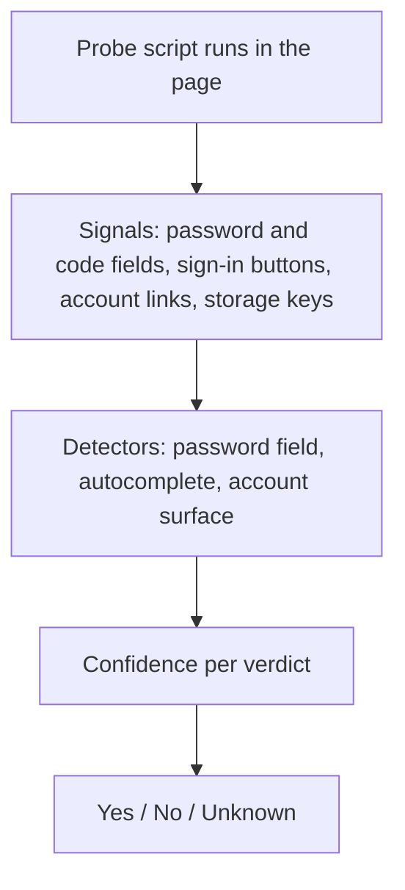

# Auth Surface Detection (ASD)

> [!NOTE]
> **Auth Surface Detection (ASD)** recognizes sign-in states on arbitrary websites without site-specific selectors: a visible login wall, a signed-in session, a two-factor challenge and a sign-in error. Every verdict has three possible values — yes, no and unknown — and "unknown" is never silently treated as "no".

---

## 1. Problem Statement: Fragile Login Detection

Browser automation often fails around sign-in for two reasons:
1. **Hard-coded selectors:** Looking for a specific element ID (e.g. `#login-btn`) breaks on the next redesign, on SSO pages and on sites the script was never written for.
2. **"Unknown" collapsed into "false":** If a check cannot tell whether the user is signed in and answers "no", an agent that has just signed in may submit the login form again — and repeated attempts can lock the account.

**Guiding principle:** *"Unknown" is a separate state, not "false".* If the signals do not support a clear verdict, ASD returns unknown, and checks that require yes or no do not pass.

---

## 2. How It Works

The probe collects signals such as:
* Visible password fields and their `autocomplete` values (`current-password`, `new-password`, `one-time-code`), forms with a submit button, a second password field or a terms checkbox (typical for sign-up).
* Identifier fields (email/username step), sign-in and sign-up buttons, buttons for signing in with another provider, sign-in headings, "forgot password" links, visible error messages.
* Logout links, profile and settings links, an avatar in the page header.
* Sign-in related keys in cookies, `localStorage` and `sessionStorage`, sign-in state in page scripts and SPA state stores.

From these, ASD computes a confidence between 0 and 1 for "login wall visible" and for "signed in". **0.5 or more** means yes, **below 0.2** means no, anything in between is unknown. Sign-up and password-reset forms lower the login-wall confidence, so they are not mistaken for a login. If the probe itself fails, every verdict is unknown.

---

## 3. Verdicts

| Fact | Yes | No | Unknown |
| :--- | :--- | :--- | :--- |
| **`auth.loginWallVisible`** | A login form, an email/username step or a "sign in with ..." page is shown. | No sign-in surface found. | The signals are too weak or contradictory. |
| **`auth.loggedIn`** | E.g. a logout link, or several account signals (profile link, settings link, avatar) together. | No account signals. | Weak or mixed account signals. |
| **`auth.mfaChallenge`** | A one-time-code field on a sign-in surface. | No code prompt. | The login-wall verdict is unknown. |
| **`auth.authError`** | A visible error message on a sign-in surface. | No error found. | The login-wall verdict is unknown. |

Unknown is reported as `null`. In addition, `auth.stage` names the page type (`login_wall`, `identity_step`, `federated_login`, `mfa_challenge`, `authenticated`, `public_page` or `unknown`), and `auth.persistence` says where the session appears to live (`persistent`, `session_scoped`, `spa_cookie_plus_state`, `ephemeral` or `unknown`).

---

## 4. Where ASD Is Used

* **`nova.guarded_login`:** Clicks the sign-in button of a form the agent has already filled in, and checks the result with ASD. It runs only if `auth.loginWallVisible` is yes; it reports success when `auth.loggedIn` becomes yes, failure when `auth.authError` is yes, and an undecided result when a two-factor step, an email/username step or a "sign in with ..." page follows. It does not fill in credentials itself — use the [password vault](vault-and-secrets.md) for that.
* **Transition contracts:** The `auth.*` facts can be used as assertions in the `transitionContract` of guarded tools.
* **Navigation safety:** If `auth.persistence` shows that a session lives only in page memory (`ephemeral`), Nova blocks full-page URL navigation such as `nova.navigate`, which would end that session. For `session_scoped` and `spa_cookie_plus_state` sessions, only navigation to another origin is blocked.
* **Crawler:** Crawls use the same detection to recognize login walls.

---

## Related Documentation

* **[Agent Awareness Gates (AAG)](aag.md)** — Pre-execution safety and verification rules.
* **[Password Vault & Secret Injection](vault-and-secrets.md)** — Filling passwords without exposing them to the agent.
* **[Operational Knowledge (OK)](operational-knowledge.md)** — Real-time tab state and capability tracking.
