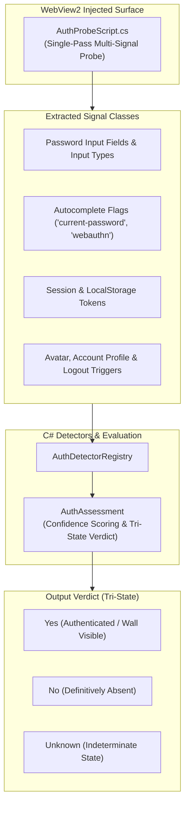

# Auth Surface Detection (ASD) & Universal Login Verification

> [!NOTE]
> The **Auth Surface Detection (ASD)** system (`NovaBrowser.Core.AuthDetectors`) universally identifies authentication interfaces across arbitrary websites: login walls, authenticated user sessions, MFA challenges, and auth error states. It replaces fragile site-specific selectors with a heuristic signal architecture governed by Tri-State safety logic.

---

## 1. Problem Statement: Fragile Login Detection & The False-Negative Dilemma

Conventional browser automation frameworks regularly fail during authentication workflows due to two core flaws:
1. **Hardcoded Selectors:** Systems look for rigid element IDs (e.g. `#login-btn` or `data-testid="profile"`). When a website diverges (e.g. enterprise SSO, banking portals, dynamic SDUI layouts), the system falsely reports: *"User is not authenticated"*.
2. **Collapse of `Unknown` into `False`:** When an automated scanner cannot determine state with 100% certainty, naive systems collapse the verdict to `false`. Consequently, an agent that just completed an SSO handshake believes it is still logged out, retriggers the login form, and locks the user account due to repeated auth attempts.

**The ASD Guiding Principle:**
> *"‘Unknown’ is a first-class, distinct state—not ‘false’."*

Whenever heuristics cannot produce an unambiguous verdict, Nova returns `Unknown`. Downstream systems (`AssertionEngine`, guarded login macros) trigger safe **fail-closed handling** rather than acting on false assumptions.

---

## 2. The ASD Architecture & Signal Analysis

---

## 3. Tri-State Evaluation Model

ASD evaluates three core dimensions across every analyzed web surface:

| Dimension | `Yes` | `No` | `Unknown` |
| :--- | :--- | :--- | :--- |
| **`auth.loginWallVisible`** | Clear password, SSO, or credential inputs detected. | Normal content page without authentication prompts. | Ambiguous overlay or delayed DOM hydration. |
| **`auth.loggedIn`** | User profile avatar, account dropdown, or session token confirmed. | Public guest view definitively verified. | Indeterminate or hybrid navigation shell. |
| **`auth.mfaChallenge`** | 2FA/OTP input field or WebAuthn prompt active. | No secondary factor prompt present. | Challenge state cannot be confirmed. |

---

## 4. Production Code References

| Component | Source File | Responsibility |
| :--- | :--- | :--- |
| **`AuthProbeScript`** | `NovaBrowser/Core/AuthDetectors/AuthProbeScript.cs` | Injected JavaScript probe: Single-pass extraction of passwords, autocomplete tokens, form actions, and storage keys. |
| **`AccountSurfaceDetector`**| `NovaBrowser/Core/AuthDetectors/AccountSurfaceDetector.cs` | Evaluates profile indicators, user menus, and authenticated navigation chrome. |
| **`PasswordFieldDetector`** | `NovaBrowser/Core/AuthDetectors/PasswordFieldDetector.cs` | Differentiates login password inputs from signup and confirmation fields. |
| **`AuthAssessment`** | `NovaBrowser/Core/AuthDetectors/AuthAssessment.cs` | Data model representing aggregate verdicts with confidence scores (0.0 – 1.0). |

---

## 5. Integration with Guarded Tools

ASD forms the foundation of reliable login automation:
* **`nova.guarded_login`:** Injects credentials from the secure vault only when `auth.loginWallVisible == Yes`. After dispatching submission, it confirms that `auth.loggedIn == Yes` before continuing.
* **Auto-Surfacing in OK:** Operational Knowledge automatically registers ASD verdicts as live facts (`auth.loggedIn`), ensuring the agent always knows whether an active session exists.

---

## Related Documentation

* **[Agent Awareness Gates (AAG)](aag.md)** — Pre-execution safety and verification rules.
* **[Secure Vault & Zero-Leak Secrets](vault-and-secrets.md)** — Form autofill without exposing credentials to LLM context.
* **[Operational Knowledge (OK)](operational-knowledge.md)** — Real-time tab state and capability tracking.
