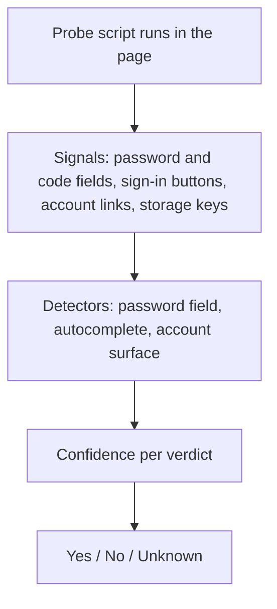

# Auth Surface Detection (ASD)

> [!NOTE]
> **Auth Surface Detection (ASD)** assesses sign-in states using generic page signals: a visible login wall, a signed-in session, a two-factor challenge and a sign-in error. Every verdict has three possible values — yes, no and unknown — and "unknown" is never silently treated as "no".

---

## 1. A Concrete Example: Login Continues to a Code Challenge

An agent fills a login form and submits it through `nova.guarded_login`. The next page asks for a one-time code. Treating that as failure could cause another password submission; treating it as success would skip an unfinished step.

ASD can recognise the code challenge and the guarded workflow reports an ambiguous follow-up state. The agent inspects that state and continues the authorised login flow. When the evidence cannot determine the state, Nova preserves `unknown` instead of inventing a yes or no.

## 2. What a Sign-In Assessment Establishes

ASD combines visible fields, account controls and session-related signals. It is a heuristic assessment of the observed page, not a server-side authentication check. A logged-in verdict does not establish which account is active, which tenant it belongs to, or whether it may perform a particular action.

The [vault](vault-and-secrets.md) delivers saved credentials, [CLS](closed-loop-system.md) checks the guarded transition, and [Operational Knowledge](operational-knowledge.md) retains reported session observations. Before account-sensitive work, verify the intended identity and the capability needed for the task.

## 3. Why Unknown Must Stay Distinct

Browser automation often fails around sign-in for two reasons:

1. **Hard-coded selectors:** Looking for a specific element ID (e.g. `#login-btn`) breaks on the next redesign, on SSO pages and on sites the script was never written for.
2. **"Unknown" collapsed into "false":** If a check cannot tell whether the user is signed in and answers "no", an agent that has just signed in may submit the login form again — and repeated attempts can lock the account.

**Guiding principle:** *"Unknown" is a separate state, not "false".* If the signals do not support a clear verdict, ASD returns unknown, and checks that require yes or no do not pass.

---

## 4. How It Works

The probe collects signals such as:

* Visible password fields and their `autocomplete` values (`current-password`, `new-password`, `one-time-code`), forms with a submit button, a second password field or a terms checkbox (typical for sign-up).
* Identifier fields (email/username step), sign-in and sign-up buttons, buttons for signing in with another provider, sign-in headings, "forgot password" links, visible error messages.
* Logout links, profile and settings links, an avatar in the page header.
* Sign-in related keys in cookies, `localStorage` and `sessionStorage`, sign-in state in page scripts and SPA state stores.

From these, ASD computes a confidence between 0 and 1 for "login wall visible" and for "signed in". **0.5 or more** means yes, **below 0.2** means no, anything in between is unknown. Sign-up and password-reset forms lower the login-wall confidence, so they are not mistaken for a login. If the probe itself fails, every verdict is unknown.

---

## 5. Verdicts

| Fact | Yes | No | Unknown |
| :--- | :--- | :--- | :--- |
| **`auth.loginWallVisible`** | A login form, an email/username step or a "sign in with ..." page is shown. | No sign-in surface found. | The signals are too weak or contradictory. |
| **`auth.loggedIn`** | Sufficient account or session evidence, such as a logout link, combined account controls or supported runtime-state signals. | The observed evidence falls below the negative-verdict threshold. | Weak or mixed evidence between the thresholds. |
| **`auth.mfaChallenge`** | A one-time-code field with supporting context, including some borderline login surfaces. | No qualifying code challenge found. | Insufficient login context without a qualifying code challenge. |
| **`auth.authError`** | A visible error message on a sign-in surface. | No error found. | The login-wall verdict is unknown. |

Unknown is reported as `null`. In addition, `auth.stage` names the page type (`login_wall`, `identity_step`, `federated_login`, `mfa_challenge`, `authenticated`, `public_page` or `unknown`), and `auth.persistence` says where the session appears to live (`persistent`, `session_scoped`, `spa_cookie_plus_state`, `ephemeral` or `unknown`).

---

## 6. Where ASD Is Used

* **`nova.guarded_login`:** Clicks the sign-in button of a form the agent has already filled in, and checks the result with ASD. It runs only if `auth.loginWallVisible` is yes; it reports success when `auth.loggedIn` becomes yes, failure when `auth.authError` is yes, and an undecided result when a two-factor step, an email/username step or a "sign in with ..." page follows. It does not fill in credentials itself — use the [password vault](vault-and-secrets.md) for that.
* **Transition contracts:** The `auth.*` facts can be used as assertions in the `transitionContract` of guarded tools.
* **Navigation safety:** Auth-persistence checks can block full-page navigation when observed session state would be at risk. `ephemeral` indicates memory-only state; `session_scoped` indicates session-storage state. The `spa_cookie_plus_state` cross-origin check additionally depends on Nova's SPA rehydration setting. These checks use detected or cached signals; they are not a guarantee that navigation preserves every site's session.
* **Crawler:** Crawls use the same detection to recognize login walls.

---

## Related Documentation

* **[Agent Awareness Gates (AAG)](aag.md)** — Pre-execution safety and verification rules.
* **[Password Vault & Secret Injection](vault-and-secrets.md)** — Filling passwords without exposing them to the agent.
* **[Operational Knowledge (OK)](operational-knowledge.md)** — Real-time tab state and capability tracking.
