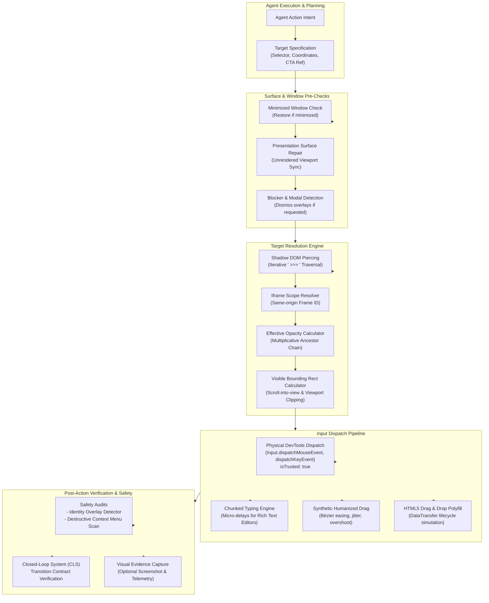
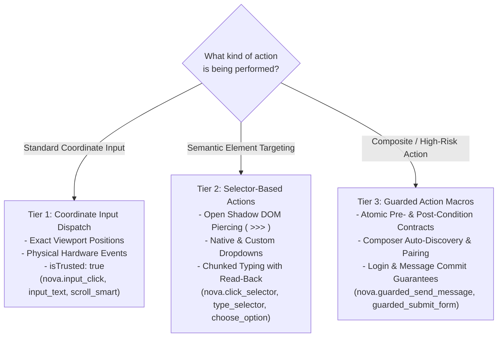
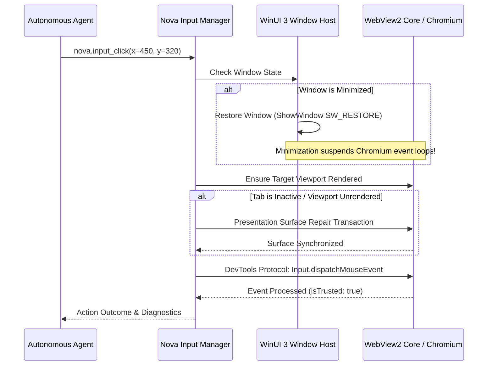

# Browser Interaction Architecture

Nova provides a multi-layered browser interaction architecture designed for autonomous AI agents operating in complex web applications. It bridges the gap between high-level agent intentions and low-level browser execution by decoupling target element resolution, presentation surface maintenance, physical input delivery, and post-action verification.

Rather than relying on naive JavaScript `element.click()` injections, Nova delivers input through the browser engine's DevTools protocol to generate genuine hardware-level events (`isTrusted: true`), restores throttled presentation surfaces, navigates nested open shadow roots, and provides guarded macros with closed-loop verification contracts.

---

## Core Interaction Subsystems

| Subsystem | Scope & Capabilities | Core Tools |
| :--- | :--- | :--- |
| **[Input Dispatch](input-dispatch/README.md)** | Low-level coordinate mouse clicks, movements, physical wheel events, hardware key combinations, atomic text insertion, and smart container scrolling. | `nova.input_click`, `nova.input_move`, `nova.input_wheel`, `nova.input_text`, `nova.input_key`, `nova.input_shortcut`, `nova.scroll_by`, `nova.scroll_smart`, `nova.scroll_to`, `nova.scroll_element` |
| **[Selectors & Shadow DOM](selectors-and-shadow-dom/README.md)** | Resolving elements across open shadow roots (` >>> `), iframe boundaries, visible bounding boxes, chunked typing into rich-text editors, custom dropdown selection, and guarded macros. | `nova.click_selector`, `nova.type_selector`, `nova.select_option`, `nova.choose_option`, `nova.guarded_send_message`, `nova.guarded_submit_form`, `nova.guarded_login`, `nova.guarded_switch_model`, `nova.guarded_switch_sandbox`, `nova.composer_state` |
| **[Drag & Drop](drag-and-drop/README.md)** | DevTools browser-input mouse dragging, synthetic humanized mouse dragging with Bézier easing and overshoot, and an injected HTML5 Drag and Drop polyfill. | `nova.input_drag`, `nova.input_drag_humanized` |

---

## Choosing the Interaction Path

Nova offers three distinct tiers of browser interaction depending on the complexity of the target page and the required level of verification:

### Tier 1: Coordinate-Based Low-Level Dispatch

Operates directly on viewport pixel coordinates $(x, y)$. 
* **When to use:** Canvas applications, mapping interfaces, visual CTA handles from perceptual models, or controls obscured by complex layout wrappers.
* **Characteristics:** Dispatches real DevTools input packets (`isTrusted: true`).
* **Caveat:** Coordinates depend on current viewport scroll offsets and responsive layout breakpoints.

### Tier 2: Element-Based Semantic Actions

Resolves target elements dynamically at execution time via CSS selectors.
* **When to use:** Modern web interfaces, Single Page Applications (SPAs), Web Components with open shadow roots, and structured forms.
* **Characteristics:** Automatically handles scrolling the element into view, calculating visible bounding rectangles, verifying ancestor opacity, and checking for blocking overlays.

### Tier 3: Guarded Action Macros

High-level composite actions that encapsulate multi-step workflows (e.g., locating an input field, typing text, verifying the input, locating the paired submit button, and clicking it) into an atomic operation.
* **When to use:** Chat interfaces (ChatGPT, Claude.ai, Gemini), login surfaces, form submissions, and workspace switches.
* **Characteristics:** Automatically attaches [Closed-Loop System (CLS)](../closed-loop-system-cls/README.md) transition contracts, retries after dismissible blockers, and reports structured reason codes if element discovery or verification fails.

---

## Window State & Presentation Surface Protection

Browser automation frequently fails because the host operating system throttles background or minimized windows. Nova implements strict host-level surface repair mechanisms before dispatching any input:

1. **Automatic Minimization Recovery:** When a window is minimized, Chromium throttles timers, pauses `requestAnimationFrame` loops, and discards certain physical input events. Nova checks window state prior to every pointer or keyboard dispatch. If minimized, Nova restores the window to ensure deterministic event delivery.
2. **Unrendered Target Viewport Repair:** When interacting with background tabs or sandboxes whose presentation surface was deferred, Nova initiates a presentation repair transaction. This forces Chromium to compute layout geometry and synchronize viewport metrics before mouse coordinates are evaluated.

---

## Post-Action Safety Scans

Every interactive dispatch is subject to automated post-action safety auditing to protect the user against malicious or deceptive web behavior:

* **Identity Overlay Detection:** Following a click or form submission, Nova inspects newly spawned DOM elements to detect whether an unexpected overlay attempts to mimic a system login dialog, credential prompt, or phishing interface.
* **Destructive Context Menu Scan:** Coordinate-based right-clicks (`button='right'`) undergo an automated menu inspection. If the resulting context menu exposes destructive actions (e.g., account deletion, data purge, token revocation), Nova includes safety warnings and requires explicit confirmation.

---

## Verification & Outcome Guarantees

> [!IMPORTANT]
> **Dispatch $\neq$ Acceptance:** Successful delivery of a click or text event proves only that the browser engine accepted the physical input. It does not prove that a remote server processed the request, that a database record was created, or that the application state transitioned successfully.

To establish true execution certainty, agents must combine browser interaction with:
1. **[Closed-Loop System (CLS) Transition Contracts](../closed-loop-system-cls/README.md):** Verifying DOM preconditions and postconditions (e.g., verifying that a modal closes or a success banner appears).
2. **[Evidence Verification Mode (EVM)](../../research/evidence-verification-mode-evm/README.md):** Capturing screenshots and comparing visual diffs.
3. **[Agent Awareness Gates (AAG)](../agent-awareness-gates-aag/README.md):** Managing ambiguities and confirmation prompts on critical mutations.

---

## Subsystem Navigation

* **[Input Dispatch](input-dispatch/README.md)**: Deep dive into the DevTools input pipeline, chunked typing, smart scrolling, and keyboard combinations.
* **[Selectors & Shadow DOM](selectors-and-shadow-dom/README.md)**: Open shadow root traversal (` >>> `), opacity calculations, dropdown selection, and guarded macros.
* **[Drag & Drop](drag-and-drop/README.md)**: Physical DevTools mouse drag, synthetic humanized drag profiles, and the HTML5 drag polyfill.

---

[All core features](../README.md) · [Browser Automation Tools](../../mcp-reference/tools/browser-automation/README.md) · [Guarded Actions Tools](../../mcp-reference/tools/guarded-actions/README.md)
