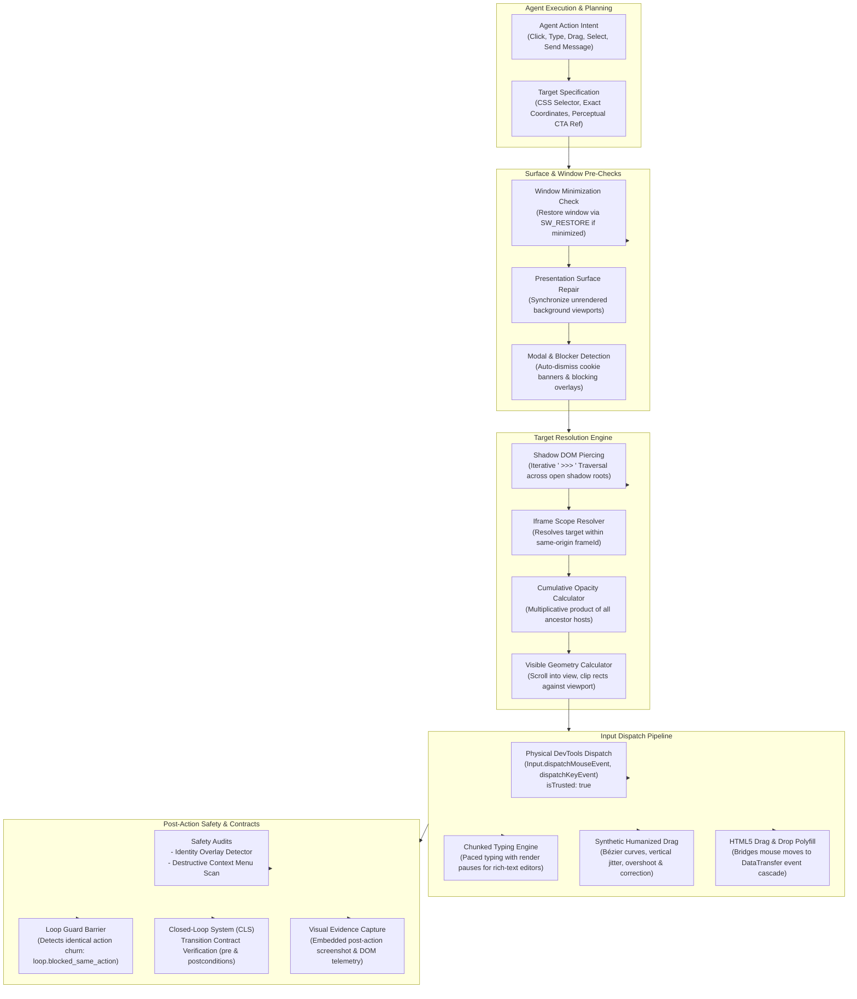
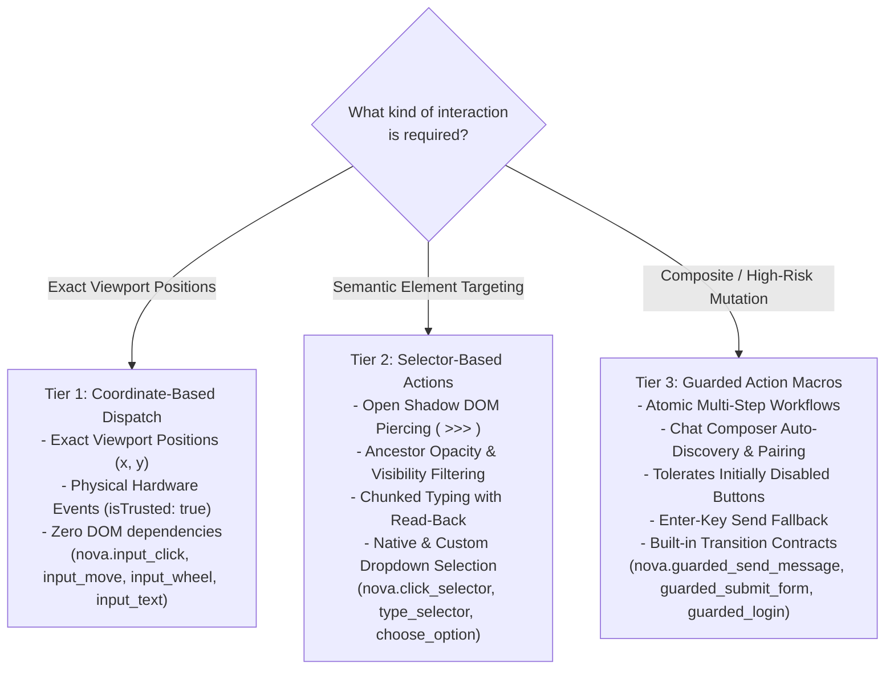
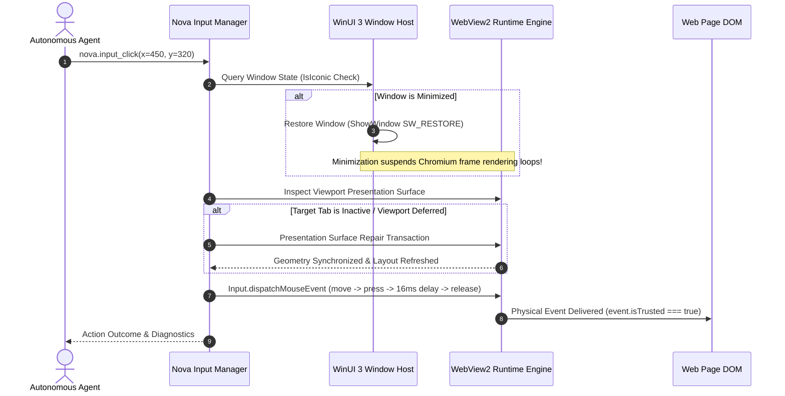
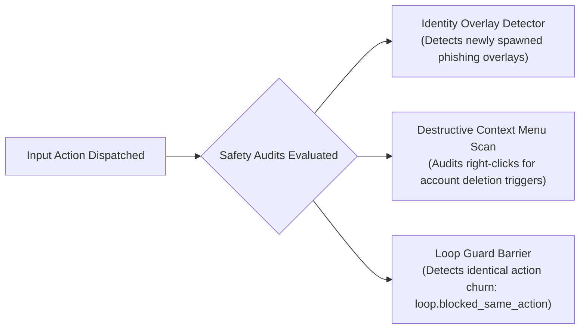

# Browser Interaction Architecture

> "Dispatching an event is trivial; ensuring the browser accepted it, the DOM updated, and the application state transitioned is where autonomy begins."
>
> — Nova Interaction Philosophy

> [!NOTE]
> Nova AI Workspace (`NovaAIWorkspace.exe`) provides an enterprise-grade browser interaction pipeline designed for autonomous Model Context Protocol (MCP) agents operating in modern, dynamic web applications. Rather than relying on naive JavaScript injections like `element.click()`, Nova delivers physical input directly through the browser engine's DevTools protocol (`isTrusted: true`), automatically restores throttled presentation surfaces, navigates open Shadow DOM trees, handles complex drag-and-drop dynamics, and executes composite guarded macros backed by closed-loop verification contracts.

---

## 1. High-Level Architecture & Interaction Pipeline

The browser interaction subsystem bridges the gap between high-level agent intentions and low-level physical rendering. It decouples target element resolution, window surface maintenance, physical input delivery, and post-action verification into an integrated pipeline:

---

## 2. The Three-Tier Interaction Hierarchy

Nova provides three distinct interaction tiers tailored to varying levels of UI complexity and safety requirements:

### Tier 1: Coordinate-Based Low-Level Dispatch

Operates directly on viewport pixel coordinates $(x, y)$ without querying the Document Object Model:
- **Primary Use Cases:** HTML5 Canvas applications, interactive WebGL viewports, mapping interfaces, custom visual controls, and perceptual Call-To-Action handles (`ctaRef` from `nova.perceive`).
- **Characteristics:** Dispatches physical Chromium DevTools Protocol (CDP) packets. Events arrive with `isTrusted: true`.
- **Operational Trade-Off:** Bypasses DOM mutation observers and layout queries, but requires coordinates adjusted for current scroll offsets and device scale factors.

### Tier 2: Element-Based Semantic Actions

Dynamically queries and resolves DOM targets using standard CSS selectors or Shadow DOM piercing expressions:
- **Primary Use Cases:** Standard web applications, forms, navigation menus, Web Components, and responsive Single Page Applications (SPAs).
- **Characteristics:** Automatically scrolls target elements into view, computes visible bounding boxes clipped by parent overflow containers, checks cumulative ancestor opacity, and handles rich-text editor inputs with chunked typing and read-back verification.

### Tier 3: Guarded Action Macros

High-level composite actions that encapsulate discovery, input, verification, and commit execution into an atomic operation:
- **Primary Use Cases:** Conversational AI interfaces (ChatGPT, Claude.ai, Gemini, Slack), login surfaces, form submissions, and model switching.
- **Characteristics:** Eliminates script race conditions. Automatically discovers paired submit controls, tolerates initially disabled buttons, provides Enter-key fallback on icon-only buttons, and attaches [Closed-Loop System (CLS)](../closed-loop-system-cls/README.md) transition contracts.

---

## 3. Window State & Presentation Surface Protection

Browser automation frequently fails because the host operating system throttles background or minimized windows. Nova implements strict host-level surface repair mechanisms prior to every input dispatch:

### 1. Automatic Minimization Restoration

When a browser window is minimized to the taskbar, Chromium activates aggressive power-saving optimizations:
- Frame rendering loops (`requestAnimationFrame`) are paused.
- JavaScript timers are throttled to 1-second intervals or suspended entirely.
- Pointer event dispatch can be dropped or desynchronized from the true DOM layout.

Before dispatching any pointer or keyboard input, Nova inspects the window handle. If minimized, Nova restores the window (`SW_RESTORE`) to guarantee that layout geometry and rendering loops are fully active before coordinates are evaluated.

### 2. Presentation Surface Repair

When interacting with background tabs or inactive sandboxes whose visual presentation was deferred, the target viewport may not have computed its latest layout geometry. Nova initiates a presentation surface repair transaction that forces Chromium to compute layout geometry, update CSS transforms, and synchronize viewport metrics before mouse coordinates are resolved.

### 3. Modal & Cookie Blocker Dismissal

When interacting with web pages, popups, cookie consent notices, and promotional dialogs frequently obscure the target element. All high-level interaction tools support `autoDismissBlockers: true`, which automatically detects dismissible overlays, clicks their dismissal button, and retries target resolution seamlessly.

---

## 4. Post-Action Safety Scans & Loop Guard

Every interactive dispatch undergoes automated post-action auditing to safeguard the user against deceptive websites and automation lockups:

1. **Identity Overlay Detector:**
   Following an input action or form submission, Nova inspects newly appeared DOM elements to verify whether an overlay attempts to mimic a native operating system login dialog, corporate Single Sign-On prompt, or credential capture form.
2. **Destructive Context Menu Scan:**
   Right-click actions (`button="right"`) undergo an automated inspection of the resulting context menu. If the menu exposes destructive actions (e.g., account deletion, data purge, token revocation), Nova includes explicit warnings in the tool outcome.
3. **Loop Guard Barrier (`loop.blocked_same_action`):**
   If an agent repeatedly executes the exact same failing action at the same URL (e.g., clicking a disabled button in an infinite loop), Nova's loop guard halts execution, prevents further click dispatch, and provides actionable remediation guidance.

---

## 5. Verification & Outcome Guarantees

> [!IMPORTANT]
> **Dispatch $\neq$ Acceptance:**
> Successful delivery of a mouse click or keystroke confirms only that the browser engine accepted the physical input. It **does not prove** that the web application processed the request, that a backend server acknowledged the transaction, or that the application state changed.

To establish true execution certainty, agents must combine browser interaction with Nova's verification subsystems:

1. **[Closed-Loop System (CLS) Transition Contracts](../closed-loop-system-cls/README.md):**
   Declare explicit preconditions and postconditions (e.g., asserting that `page.url` changes, or that `@css=div.alert-success` becomes visible).
2. **[Evidence Verification Mode (EVM)](../../research/evidence-verification-mode-evm/README.md):**
   Request `includeScreenshot: true` on pointer actions to capture visual proof of state transitions.
3. **[Agent Awareness Gates (AAG)](../agent-awareness-gates-aag/README.md):**
   Preemptive gates that prevent blind mutations when tabs or accounts are ambiguous.

---

## 6. Subsystem Navigation Index

Explore the dedicated deep-dive guides for technical specifications, algorithms, and tool references:

| Subsystem Guide | Core Capabilities & Focus | Key Tools Covered |
| :--- | :--- | :--- |
| [**Input Dispatch**](input-dispatch/README.md) | DevTools CDP physical input pipeline, `isTrusted: true`, hardware frame delays, chunked typing for rich-text editors, Monaco and CodeMirror model adapters, physical wheel events, and smart container scrolling with stalled-loader rebound recovery. | `nova.input_click`, `nova.input_move`, `nova.input_wheel`, `nova.input_text`, `nova.type_selector`, `nova.input_key`, `nova.input_shortcut`, `nova.scroll_smart`, `nova.scroll_by`, `nova.scroll_to`, `nova.scroll_element` |
| [**Selectors & Shadow DOM**](selectors-and-shadow-dom/README.md) | Open Shadow DOM piercing with the ` >>> ` combinator, cumulative ancestor opacity calculations, visible bounding box clipping, iframe scoping, native vs. custom dropdown selection (`nova.choose_option`), and guarded action macros (`guarded_send_message`, `guarded_submit_form`, `guarded_login`). | `nova.click_selector`, `nova.type_selector`, `nova.select_option`, `nova.choose_option`, `nova.guarded_send_message`, `nova.guarded_submit_form`, `nova.guarded_login`, `nova.guarded_switch_model`, `nova.guarded_switch_sandbox`, `nova.composer_state` |
| [**Drag & Drop**](drag-and-drop/README.md) | The drag-and-drop divide: physical DevTools mouse drag (`nova.input_drag`) vs. synthetic humanized drag (`nova.input_drag_humanized`) with Bézier easing, perpendicular jitter, and deliberate overshoot; plus the injected HTML5 Drag and Drop polyfill bridging mouse gestures to `DataTransfer`. | `nova.input_drag`, `nova.input_drag_humanized` |

---

## 7. Related Documentation

- [Closed-Loop System (CLS)](../closed-loop-system-cls/README.md) — Precondition and postcondition transition contracts.
- [Agent Awareness Gates (AAG)](../agent-awareness-gates-aag/README.md) — Preemptive action safety and policy validation.
- [Auth Surface Detection (ASD)](../auth-surface-detection-asd/README.md) — Login surface recognition and authentication progression.
- [Evidence Verification Mode (EVM)](../../research/evidence-verification-mode-evm/README.md) — Visual evidence verification and screenshot comparisons.
- [Browser Automation Tools Catalog](../../mcp-reference/tools/browser-automation/README.md) — Complete MCP tool schemas and parameter reference.

[All core features](../README.md)
