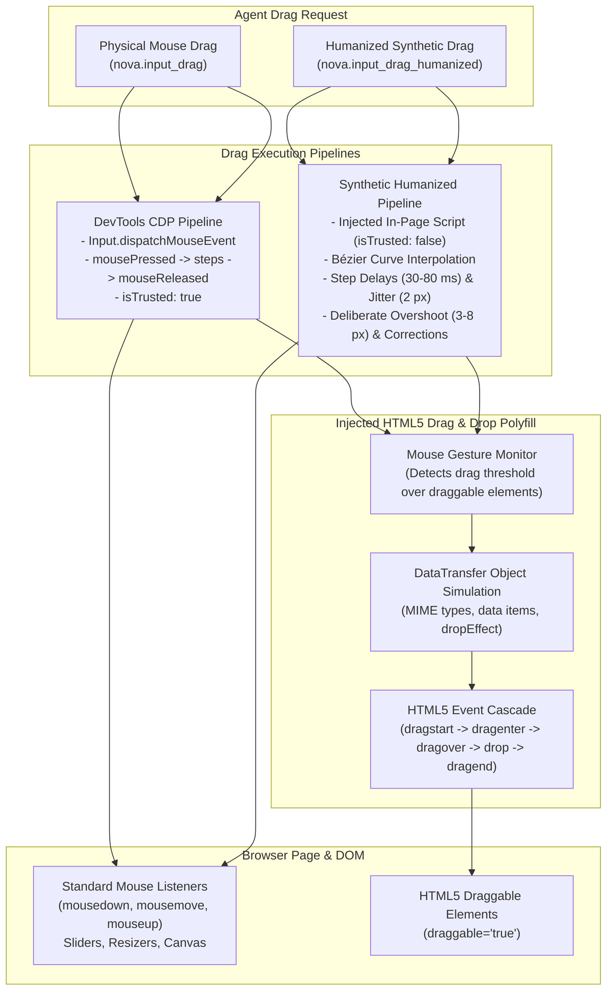
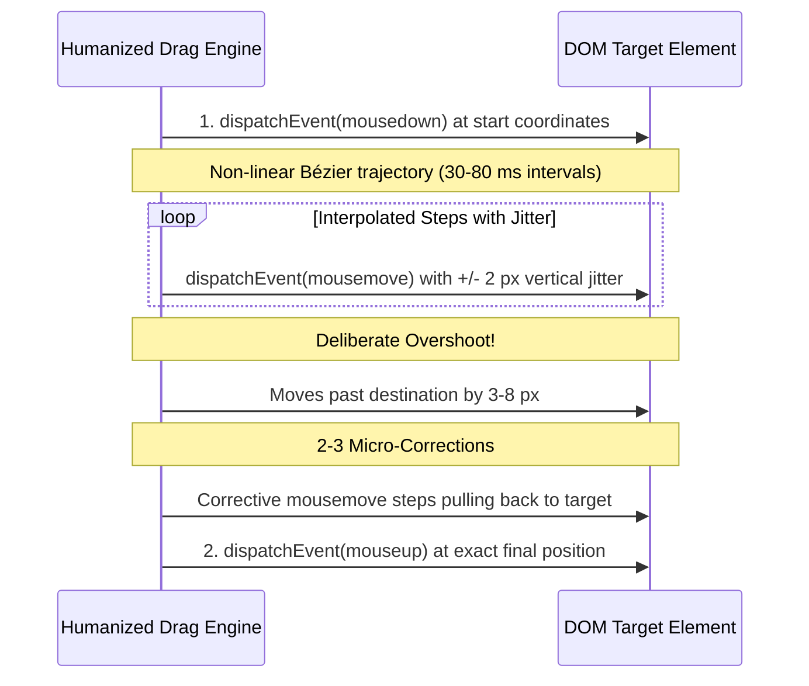
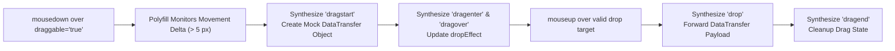

# Drag & Drop Architecture & Polyfill

Dragging and dropping elements on the modern web encompasses two fundamentally different technical paradigms: low-level mouse gestures on interactive components (sliders, canvas nodes, map panning) and high-level HTML5 Drag and Drop (DnD) specifications used by Kanban boards, file dropzones, and sortable lists.

Nova provides two complementary drag execution paths—**DevTools Physical Drag** (`isTrusted: true`) and **Synthetic Humanized Drag** with Bézier easing—backed by an automatically injected **HTML5 Drag and Drop Polyfill** that bridges physical mouse movements to the HTML5 `DataTransfer` event cascade.

---

## The Two Drag Execution Paths

| Feature / Trait | Physical DevTools Drag (`nova.input_drag`) | Humanized Synthetic Drag (`nova.input_drag_humanized`) |
| :--- | :--- | :--- |
| **Execution Path** | Chromium DevTools Protocol (`Input.dispatchMouseEvent`) | Page-injected JavaScript runner |
| **Event Authenticity** | **Physical (`isTrusted: true`)** | **Synthetic (`isTrusted: false`)**, reported as `mode: "humanized_js"` |
| **Movement Profile** | Linear interpolation across evenly spaced steps (default: 10 steps) | Non-linear Bézier curve, vertical jitter, overshoot, and backward correction |
| **Latency / Duration** | Immediate hardware frames (~16 ms per step) | Configurable duration (500–10,000 ms, default randomized 1,800–2,400 ms) |
| **Bot Detection Tolerance** | High (native browser engine event) | Heuristic (designed for behavioral human emulation) |
| **Primary Use Cases** | Sliders, native scrollbars, map panning, strict canvas apps | Sliders with anti-bot heuristics, human behavior simulations |

---

## 1. Physical DevTools Drag (`nova.input_drag`)

Dispatches physical mouse events through the browser's native input pipeline:
1. **Initial Coordinates:** Starts at `startX`/`startY` or the geometric center of `selector`.
2. **Press:** Emits `mousePressed` with button `left`.
3. **Interpolated Moves:** Divides the vector between start and end into evenly spaced `steps` (default: 10). Emits `mouseMoved` for each step.
4. **Release:** Emits `mouseReleased` at the destination coordinates `endX`/`endY`.

Because events arrive directly from the browser process, `event.isTrusted` is `true`. Use this tool whenever a website listens to pointer events and requires genuine hardware input.

---

## 2. Humanized Synthetic Drag (`nova.input_drag_humanized`)

Humans do not move computer mice in mathematically straight lines or with constant velocity. Automated bots moving in perfect linear trajectories are easily flagged by behavioral anti-fraud scripts.

`nova.input_drag_humanized` runs an in-page script that models realistic human motor mechanics:

### Movement Profile Parameters

* **`durationMs` (500 to 10,000 ms):** Total duration of the gesture. If omitted, Nova selects a random duration between 1,800 ms and 2,400 ms.
* **`jitterPx` (0 to 10 px, default: 2 px):** Simulates micro-tremors by adding perpendicular pseudo-random deviations to each step.
* **Deliberate Overshoot & Correction:** The trajectory deliberately overshoots the destination by 3–8 pixels before performing 2–3 micro-corrections to settle precisely on target.
* **Profile Reporting:** The tool response includes a complete trace of all generated steps, timestamps, and pixel coordinates for empirical analysis.

> [!WARNING]
> While humanized drag simulates realistic behavioral kinematics, events are dispatched via page script and carry `isTrusted: false`. If a target page requires trusted input, use `nova.input_drag`.

---

## 3. The HTML5 Drag and Drop Polyfill

Standard mouse events (`mousedown`, `mousemove`, `mouseup`) and the HTML5 Drag and Drop specification (`dragstart`, `dragenter`, `dragover`, `drop`, `dragend`) are completely separate event systems in modern browsers:
* Elements marked `draggable="true"` do not automatically emit HTML5 drag events when driven by DevTools synthetic mouse moves.
* Consequently, drag-and-drop operations on Kanban boards (Jira, Trello, GitHub Projects), email folder reorganizations, and file upload dropzones frequently fail during browser automation.

### The Injected Polyfill Solution

Nova resolves this by automatically injecting a lightweight HTML5 Drag and Drop polyfill into web pages:

1. **Threshold Detection:** When a mouse gesture starts over an element with `draggable="true"` and moves beyond a 5-pixel threshold, the polyfill intercepts the gesture.
2. **`DataTransfer` Simulation:** The polyfill instantiates a simulated `DataTransfer` object capable of storing MIME types, string payloads, and file references.
3. **Event Lifecycle Dispatch:** It synthesizes the full HTML5 event cascade:
   - `dragstart` on the source element.
   - `dragenter` and `dragover` on intermediate and target dropzone elements.
   - `drop` on the final target container when mouseup occurs.
   - `dragend` on the original source element to finalize the transaction.
4. **Universal Compatibility:** Both `nova.input_drag` and `nova.input_drag_humanized` seamlessly activate this polyfill.

---

## Verifying Drag Outcomes

A completed drag gesture does **not** verify that the application accepted the resulting state:
* A slider might snap back to its previous position if network validation fails.
* A reordered Kanban card might revert if the server rejected the move.

### Verification Best Practices

1. **[Closed-Loop System (CLS) Contracts](../../closed-loop-system-cls/README.md):** Define a postcondition assertion (e.g., verifying that the slider's `aria-valuenow` attribute updated to the target number, or that the reordered card exists within the new column).
2. **[Evidence Verification Mode (EVM)](../../../research/evidence-verification-mode-evm/README.md):** Capture a screenshot immediately after the gesture to confirm visual alignment.

---

## Tool Reference

| Tool | Core Parameters | Output / Diagnostics |
| :--- | :--- | :--- |
| [`nova.input_drag`](../../../mcp-reference/tools/browser-automation/nova-input-drag.md) | `startX`, `startY`, `endX`, `endY`, `selector`, `steps`, `delayMs` | Action outcome, step count, physical dispatch confirmation (`isTrusted: true`) |
| [`nova.input_drag_humanized`](../../../mcp-reference/tools/browser-automation/nova-input-drag-humanized.md) | `startX`, `startY`, `endX`, `endY`, `selector`, `durationMs`, `jitterPx` | Synthetic drag outcome (`mode: "humanized_js"`), step timeline, overshoot metrics |

---

[Browser Interaction overview](../README.md) · [Input Dispatch](../input-dispatch/README.md) · [Selectors & Shadow DOM](../selectors-and-shadow-dom/README.md) · [All core features](../../README.md)
