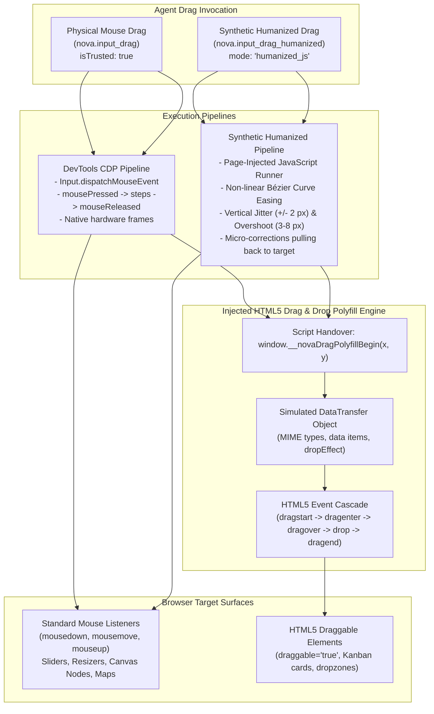
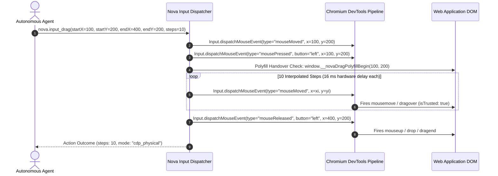
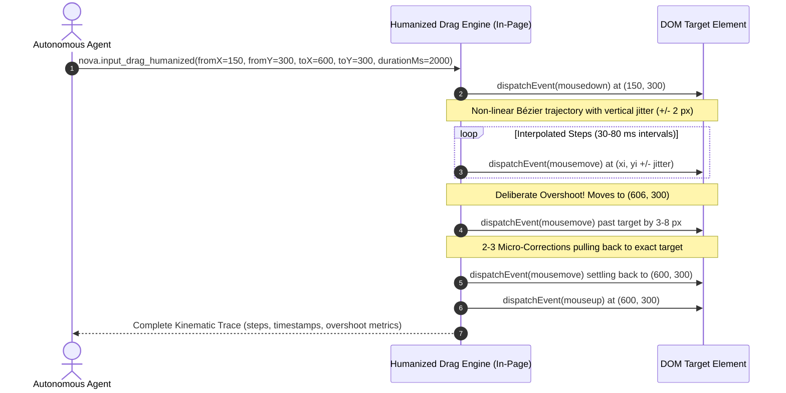

# Drag & Drop Architecture & Polyfill

> "Physical mouse gestures and HTML5 Drag & Drop are two different worlds in web engines; bridging them reliably requires deep protocol understanding and behavioral realism."
>
> — Browser Input Engineering Invariants

> [!NOTE]
> Dragging and dropping elements on the modern web encompasses two fundamentally different technical paradigms: low-level continuous mouse gestures (sliders, resizers, canvas nodes, map panning) and high-level HTML5 Drag and Drop (DnD) specifications (`draggable="true"` Kanban boards, sortable lists, file dropzones). Nova provides two complementary drag execution paths—**Physical DevTools Drag** (`isTrusted: true`) and **Synthetic Humanized Drag** with Bézier easing—backed by an automatically injected **HTML5 Drag and Drop Polyfill** that bridges physical mouse movements to the HTML5 `DataTransfer` event cascade in WinUI 3 WebView2.

---

## 1. The Modern Drag & Drop Divide

In modern web engines, dragging elements is divided across two incompatible subsystems:



### Drag Execution Paths Compared

| Dimension | Physical DevTools Drag (`nova.input_drag`) | Synthetic Humanized Drag (`nova.input_drag_humanized`) |
|---|---|---|
| **Execution Path** | Chromium DevTools Protocol (`Input.dispatchMouseEvent`) | Page-injected JavaScript runner |
| **Event Authenticity** | **Physical (`event.isTrusted === true`)** | **Synthetic (`event.isTrusted === false`)**, reported as `mode: "humanized_js"` |
| **Kinematic Profile** | Linear interpolation across evenly spaced steps (default: 10 steps) | Non-linear Bézier curve, vertical jitter ($\pm 2$ px), overshoot ($3$–$8$ px), and pullback corrections |
| **Duration & Timing** | Hardware frame intervals (~16 ms per step) | Configurable duration ($500$–$10,000$ ms, default randomized $1,800$–$2,400$ ms) |
| **Anti-Bot Tolerance** | High (native browser engine event) | Behavioral heuristic tolerance (emulates natural human motor kinematics) |
| **Primary Use Cases** | HTML5 Canvas, sliders, native scrollbars, map panning, strict authentication | Behavioral bot mitigation bypass, human simulation workflows |

---

## 2. The WinUI 3 WebView2 Limitation & The Injected Polyfill

A critical challenge in modern Windows desktop browser automation is that Chromium DevTools Protocol (CDP) mouse events **do not trigger native Chromium drag sessions** for elements with `draggable="true"` inside WinUI-hosted WebView2:

- Native mouse movements injected via CDP fire `mousedown`, `mousemove`, and `mouseup`.
- However, Chromium's internal drag manager requires native OS-level window messages (`WM_LBUTTONDOWN`, `WM_MOUSEMOVE` across system drag thresholds) to initiate an operating system drag drop loop.
- Without an intervention, automated drag gestures over Kanban boards (Jira, Trello, GitHub Projects), sortable tables, and file upload dropzones fail completely: the element highlights briefly, but no drag session starts.

### The Injected Polyfill Solution

Nova resolves this by automatically embedding and injecting a specialized HTML5 Drag and Drop polyfill into active web pages:

```mermaid
flowchart LR
    Start["CDP mousePressed over draggable='true'"] --> Handover["Handover: window.__novaDragPolyfillBegin(x, y)"]
    Handover --> Threshold["Monitor Movement Delta (> 5 px)"]
    Threshold --> DragStart["Synthesize 'dragstart'\nCreate Mock DataTransfer Object"]
    DragStart --> DragOver["Synthesize 'dragenter' & 'dragover'\nUpdate dropEffect (copy, move, link)"]
    DragOver --> MouseUp["CDP mouseReleased over Dropzone"]
    MouseUp --> Drop["Synthesize 'drop'\nForward DataTransfer Payload"]
    Drop --> DragEnd["Synthesize 'dragend'\nCleanup Drag State"]
```



#### Technical Polyfill Invariants

1. **Script Architecture:** Loaded outside the view layer to avoid XAML runtime initialization constraints during headless test execution.
2. **Deterministic Handover:** Before dispatching mouse moves, Nova evaluates a script handover expression at the starting coordinates:
   ```javascript
   (function(){
     try {
       return !!(window.__novaDragPolyfillBegin && window.__novaDragPolyfillBegin(x, y));
     } catch(e) {
       return false;
     }
   })()
   ```
3. **Culture-Invariant Numeric Formatting:** The handover expression strictly formats coordinate floating-point values using `CultureInfo.InvariantCulture`. On localized Windows systems (such as German locales that use commas for decimals, e.g. `"12,5"`), culture-sensitive formatting would split the coordinate into two arguments, silently corrupting the drag coordinates.
4. **`DataTransfer` Simulation:** The polyfill constructs a simulated `DataTransfer` object supporting MIME types (`text/plain`, `text/html`, custom application types), data items, and `dropEffect` states (`copy`, `move`, `link`, `none`).
5. **Universal Activation:** Both `nova.input_drag` and `nova.input_drag_humanized` activate this polyfill transparently.

---

## 3. Physical DevTools Drag (`nova.input_drag`)

Dispatches physical mouse events through the browser engine's native DevTools pipeline:



### Parameter Specifications

- **Coordinates:** Supports `startX`, `startY`, `endX`, `endY` or aliased parameter names `fromX`, `fromY`, `toX`, `toY`. If a `selector` is provided, Nova resolves the starting point to the geometric center of the target element.
- **`steps` (integer, default: 10):** The number of intermediate linear interpolation points along the gesture vector.
- **`button` (string, default: `"left"`):** The mouse button held during the drag (`"left"`, `"middle"`, `"right"`).

---

## 4. Synthetic Humanized Drag (`nova.input_drag_humanized`)

Automated scripts that drag objects in mathematically straight lines with uniform velocity are easily flagged by behavioral anti-bot heuristics. Real human hand movements exhibit non-linear acceleration, minor perpendicular tremors, and slight overshoots:



### Kinematic Emulation Mechanics

1. **Non-Linear Bézier Easing:** Interpolates the trajectory using cubic Bézier velocity curves (slow initial acceleration, steady mid-stroke glide, and deceleration near target).
2. **Perpendicular Jitter (`jitterPx`):** Injects pseudo-random vertical fluctuations (default: $\pm 2$ px, configurable from $0$ to $10$ px) perpendicular to the drag vector, modeling physiological hand tremors.
3. **Deliberate Overshoot & Correction:** The trajectory intentionally carries $3$ to $8$ pixels beyond the destination before performing $2$ to $3$ corrective micro-pullbacks to settle on the target.
4. **Configurable Duration:** `durationMs` ranges from $500$ ms to $10,000$ ms. If omitted, Nova randomizes the duration between $1,800$ ms and $2,400$ ms.
5. **Trace Reporting:** The tool outcome includes an exhaustive telemetry array recording all intermediate coordinates, timestamps, and deviation metrics.

> [!WARNING]
> While humanized drag provides realistic kinematics, events are dispatched via page script and carry `event.isTrusted === false`. If a target page requires genuine hardware events, use `nova.input_drag`.

---

## 5. Verifying Drag Outcomes

> [!IMPORTANT]
> **Movement $\neq$ Persistence:**
> A completed drag gesture does **not** guarantee that the web application accepted the resulting state. A slider may snap back to its origin if an API request fails, or a reordered Kanban card may revert if the server rejected the move.

### Verification Best Practices

1. **[Closed-Loop System (CLS) Contracts](../../closed-loop-system-cls/README.md):**
   Attach transition contracts to assert on state properties:
   ```json
   {
     "transitionContract": {
       "actionKind": "custom",
       "postconditions": {
         "success": {
           "all": [
             { "factKey": "@css=input#price-slider", "operator": "gte", "expected": 75 }
           ]
         }
       }
     }
   }
   ```
2. **[Evidence Verification Mode (EVM)](../../../research/evidence-verification-mode-evm/README.md):**
   Capture an immediate post-action screenshot to verify visual alignment and element positioning.

---

## 6. Complete Tool Reference for Drag & Drop

All tools belong to the `browser_automation` capability bundle:

| Tool | Core Parameters | Output / Diagnostics |
| :--- | :--- | :--- |
| [`nova.input_drag`](../../../mcp-reference/tools/browser-automation/nova-input-drag.md) | `startX`, `startY`, `endX`, `endY`, `selector`, `steps`, `button`, `delayMs` | Action outcome, step count, physical dispatch confirmation (`isTrusted: true`), polyfill activation status |
| [`nova.input_drag_humanized`](../../../mcp-reference/tools/browser-automation/nova-input-drag-humanized.md) | `startX`, `startY`, `endX`, `endY`, `selector`, `durationMs`, `jitterPx` | Synthetic drag outcome (`mode: "humanized_js"`), step timeline array, overshoot distance, correction count |

---

## 7. Related Documentation

- [Browser Interaction Overview](../README.md) — Master interaction architecture and tier hierarchy.
- [Input Dispatch](../input-dispatch/README.md) — DevTools physical input pipeline, chunked typing, and scrolling.
- [Selectors & Shadow DOM](../selectors-and-shadow-dom/README.md) — Shadow DOM traversal, dropdowns, and guarded macros.
- [Closed-Loop System (CLS)](../../closed-loop-system-cls/README.md) — State transition contracts and outcome verification.

[All core features](../../README.md)
