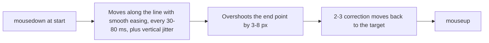

# Drag & Drop

Nova exposes two mouse-drag paths and an HTML5 drag polyfill. Choose the path the page can handle, then verify the resulting order or value.

## Browser-Input Drag (`nova.input_drag`)

Nova sends a press, evenly spaced moves (`steps`, default 10) and a release through the DevTools input pipeline. This is the browser-input path to use when a page requires trusted mouse input. It still does not by itself prove that a slider reached the intended value or a sortable list changed order.

## Humanized Drag (`nova.input_drag_humanized`)

This tool runs as a script inside the page and dispatches **synthetic** mouse events (`isTrusted: false`; the result reports `mode: "humanized_js"`). Use `nova.input_drag` when a page only accepts real input.

* **Duration:** `durationMs` (500–10,000); default a random value between 1,800 and 2,400 ms.
* **Jitter:** `jitterPx` (0–10, default 2) sets the random vertical deviation per step.
* **Start point:** `startX`/`startY`, or the center of `selector`, on which the `mousedown` is dispatched.
* The result includes a movement profile (step intervals and distances).

“Humanized” describes the movement profile. It does not guarantee website acceptance or turn synthetic events into trusted ones.

## HTML5 Drag and Drop

Nova injects a drag polyfill into pages that turns a held mouse gesture over a supported `draggable` element into HTML5 drag events (`dragstart`, `dragover`, `drop`, `dragend`). Gestures from both `nova.input_drag` and `nova.input_drag_humanized` can reach this polyfill. Its HTML5 events are synthesized in page script; a control that requires trusted drag events or a different interaction model may still need another approach. Check the resulting order or value after the gesture.

## Tool References

* [`nova.input_drag`](../../../mcp-reference/tools/browser-automation/nova-input-drag.md) — Browser-input drag parameters and examples.
* [`nova.input_drag_humanized`](../../../mcp-reference/tools/browser-automation/nova-input-drag-humanized.md) — Synthetic movement profile parameters and examples.
* [Input Dispatch](../input-dispatch/README.md) — Mouse, keyboard and text delivery.
* [Selectors & Shadow DOM](../selectors-and-shadow-dom/README.md) — Resolving element targets.

[Browser Interaction overview](../README.md) · [All core features](../../README.md)
