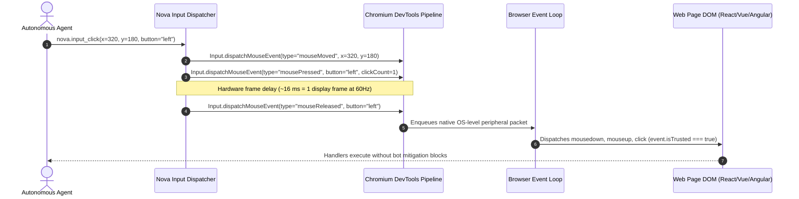
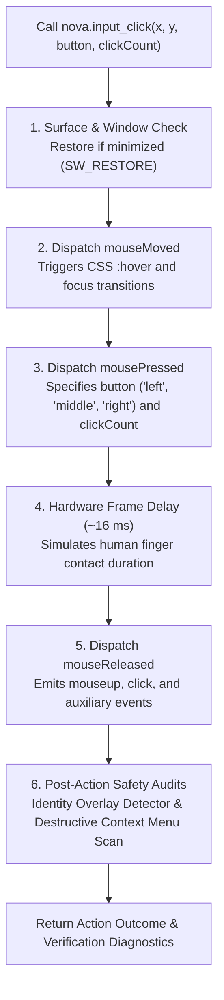
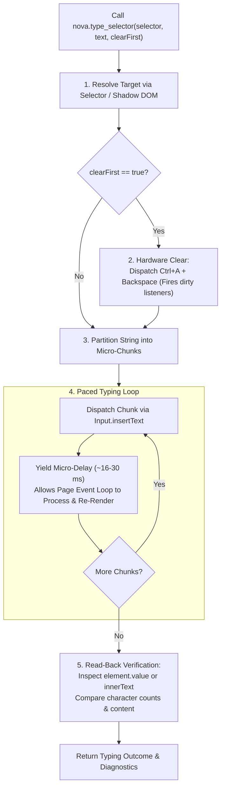
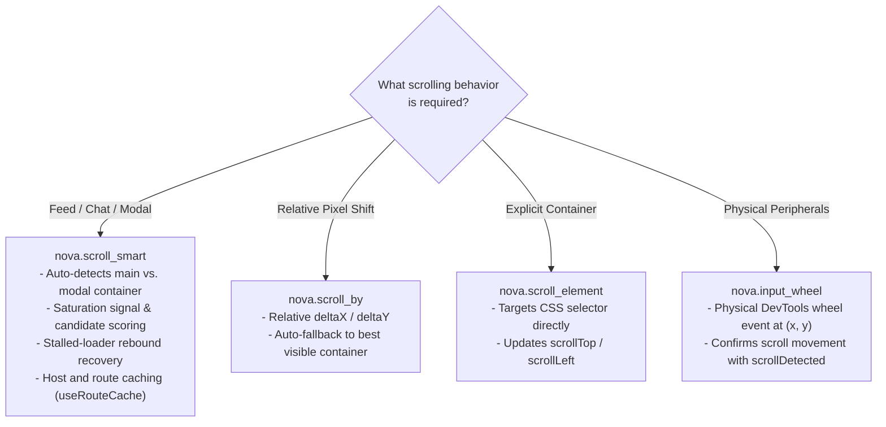

# Low-Level Input Dispatch Architecture

> "When an agent types or clicks, the browser should feel real hardware under the hood, not a script poking the DOM."
>
> — Chromium DevTools Protocol Engineering Notes

> [!NOTE]
> The Input Dispatch subsystem is Nova AI Workspace's foundational layer for delivering hardware-accurate mouse, keyboard, and scrolling events directly into web applications. By routing actions through Microsoft Edge WebView2's native Chromium DevTools Protocol (CDP) pipeline, Nova generates genuine browser events (`isTrusted: true`), restores throttled presentation surfaces, prevents character drops in complex rich-text editors, integrates first-class Monaco and CodeMirror adapters, and executes smart container scrolling with stalled-loader rebound recovery.

---

## 1. Physical vs. Synthetic Events (`isTrusted: true`)

A fundamental distinction in modern web automation is whether an event is trusted by the browser engine:



### Event Authenticity Comparison

| Dimension | Script Injections (`element.click()`, `dispatchEvent`) | Nova DevTools Dispatch (`nova.input_*`) |
|---|---|---|
| **Event Trust Flag** | `event.isTrusted === false` | **`event.isTrusted === true`** |
| **Peripheral Stack** | Synthetic JavaScript object instantiated in page | Dispatched from browser process via native CDP pipeline |
| **Bot Detection Tolerance** | Flagged or rejected by Cloudflare, reCAPTCHA, and enterprise portals | **Accepted as genuine hardware interaction** |
| **CSS Pseudo-States** | Does not trigger `:hover`, `:active`, or `:focus-visible` styles | **Fully updates CSS pseudo-classes and layout state** |
| **Event Timing** | Synchronous execution blocks page JavaScript loop | **Asynchronous event queue preserves natural frame timing** |

---

## 2. Pointer Dispatch & Click Delivery Sequence

When executing `nova.input_click` or `nova.click_selector`, Nova generates a calibrated peripheral sequence:



### Detailed Sequence Steps

1. **Window & Surface Check:** Nova verifies that the host window is visible and active. If the window is minimized, Nova restores it (`SW_RESTORE`), as Chromium suspends frame rendering and input dispatch in minimized states.
2. **Pointer Movement (`mouseMoved`):** Emits a pointer move event to the exact coordinates $(x, y)$. This triggers CSS `:hover` states, tooltips, and element focus transitions.
3. **Button Press (`mousePressed`):** Emits a button press event with the specified `button` (`left`, `middle`, `right`) and `clickCount`:
   - `clickCount = 1`: Standard single click.
   - `clickCount = 2`: Double-click (selects words, opens files).
   - `clickCount = 3`: Triple-click (selects entire paragraphs or code lines).
4. **Hardware Frame Delay:** Nova enforces a calibrated ~16 ms delay (corresponding to one screen refresh frame at 60 Hz) between press and release. This ensures that web applications measuring press-to-release duration (to differentiate clicks from dragging) register the gesture as a valid click.
5. **Button Release (`mouseReleased`):** Emits the release event, completing the physical click cycle and firing `click` handlers.
6. **Post-Action Safety Audits:** Nova inspects the page for sprouted phishing overlays or destructive context menus.

---

## 3. Keyboard & Text Insertion Subsystems

Web applications utilize diverse input controls ranging from simple HTML `<input>` tags to multi-layer rich-text editors and code canvases. Nova provides specialized input channels tailored to each control type:

```mermaid
flowchart TD
    InputType{"What kind of input\nis being targeted?"}

    InputType -->|Simple Input / Search Bar| FastText["nova.input_text\n- Direct Input.insertText\n- Near-instantaneous string insertion\n- Focused element required"]

    InputType -->|Rich-Text Editor\n(ProseMirror, Slate, Lexical, Draft.js)| ChunkedType["nova.type_selector\n- Paced chunked typing with micro-delays\n- Hardware Ctrl+A + Backspace clearing\n- Read-back verification"]

    InputType -->|Monaco Code Editor\n(VS Code Web, GitHub Codespaces)| MonacoModel["Monaco Model Adapter\n- Direct model.setValue() via main world\n- In-expression SHA-256 hash verification\n- Zero character drops"]

    InputType -->|CodeMirror Editor\n(CodeMirror 5/6, DevTools, REPLs)| CodeMirrorModel["CodeMirror Model Adapter\n- Direct view.dispatch() transaction\n- Text hash validation"]

    InputType -->|Functional Keys & Hotkeys| KeyShortcut["nova.input_key & nova.input_shortcut\n- Windows Virtual Key mapping\n- Strict modifier sequences (Ctrl, Shift, Alt, Meta)"]
```

### 1. Fast Text Insertion (`nova.input_text`)

Dispatches text using the DevTools `Input.insertText` command:
- **Characteristics:** Near-instantaneous insertion of strings into the currently focused DOM element.
- **When to use:** Long paragraphs, search queries, URL inputs, and simple text fields where typing latency is unnecessary.
- **Requirement:** The target element must already hold focus (e.g., via prior click or `nova.type_selector`).

### 2. The Chunked Typing Engine (`nova.type_selector`)

Modern web applications frequently employ asynchronous, state-managed rich-text editors (e.g., Notion, Slack, Google Docs, Linear, Jira). In these editors, injecting an entire paragraph instantaneously via `insertText` creates race conditions in the framework's internal transaction queues, dropping characters, duplicating strings, or corrupting cursor positions.



- **Hardware Content Clearing:** If `clearFirst=true`, Nova dispatches a physical `Ctrl+A` followed by `Backspace` rather than mutating `.value = ""`. This ensures framework change listeners, dirty flags, and undo histories update naturally.
- **Paced Micro-Chunk Delivery:** The input string is divided into small character slices. Nova pauses briefly between slices to allow the browser's JavaScript event loop to process state updates and re-render the virtual DOM.
- **Read-Back Verification:** Immediately following completion, Nova reads the element's actual `.value` or `.innerText` to confirm that the text was accepted by the page without character drops.

### 3. Specialized Code Editor Model Adapters

For professional development interfaces, Nova includes specialized model adapters that bypass DOM cursor emulation entirely:

#### Monaco Editor Adapter (`monaco_model`)
Targets the Monaco Editor (the engine powering VS Code Web and GitHub):
- Executes directly within the page's main world context to access the global `monaco.editor` instance.
- Replaces content atomically via `editor.getModel().setValue()`, preserving undo stacks and editor models.
- Verifies the operation using an in-expression **SHA-256 hash comparison**, confirming that the target buffer matches the requested text exactly.

#### CodeMirror Model Adapter (`codemirror_model`)
Targets CodeMirror 5 and 6 instances:
- Dispatches transactions directly into the editor view (`view.dispatch()`).
- Eliminates character truncation and line break corruption common in large code blocks.

### 4. Functional Keys & Shortcuts (`nova.input_key`, `nova.input_shortcut`)

- **`nova.input_key`:** Emulates physical key press and release cycles (`rawKeyDown` + `keyUp`) mapped to Windows Virtual Key codes. Supports functional keys (`Enter`, `Tab`, `Escape`, `Backspace`, `Delete`, `ArrowUp`, `ArrowDown`, `ArrowLeft`, `ArrowRight`, `F1`–`F12`).
- **`nova.input_shortcut`:** Dispatches complex multi-key combinations (e.g., `Ctrl+Shift+K`, `Alt+F4`, `Ctrl+V`). Nova depresses modifier keys in sequence, dispatches the primary key, and releases modifiers in strict reverse order to prevent stuck-key states in the browser engine.

---

## 4. Advanced Scrolling Subsystems

Standard window scrolling (`window.scrollTo` or `window.scrollBy`) fails in modern web applications because scrolling is often isolated within inner `<div>` containers (such as sidebars, message feeds, or modal dialogs) rather than the root `window` object. Nova provides four complementary scrolling mechanisms:



### 1. Smart Scrolling (`nova.scroll_smart`)

`nova.scroll_smart` is Nova's primary tool for Single Page Applications, infinite feeds, and chat interfaces:
- **Container Auto-Detection & Scoring:** Evaluates candidate scrollable containers (`main`, `dialog`, message lists, overflow containers) based on visible area, scrollable headroom, and DOM depth, selecting the optimal target automatically.
- **Saturation Signal:** The response includes rich saturation diagnostics (`grewThisScroll`, `stableRounds`, and hints) to help agents determine whether more items are currently lazy-loading or if the feed has reached the bottom.
- **Stalled-Loader Rebound Recovery:** On infinite-scroll feeds, lazy-loaders frequently stall when scrolled continuously to the bottom—the page stops loading new items because the underlying `IntersectionObserver` sentinel is stuck offscreen. Nova automatically performs a **rebound maneuver**: scrolling upward by approximately one viewport (negative `deltaY`) and then back down, re-triggering the observer threshold.
- **Route Caching:** Learns and caches last-known-good scroll containers per host and route key (`useRouteCache=true`), accelerating repeat interactions.

### 2. Relative Scrolling (`nova.scroll_by`)

Dispatches relative pixel offsets (`deltaX`, `deltaY`). If the root window cannot scroll, it automatically falls back to the best visible scrollable container.

### 3. Element-Scoped Scrolling (`nova.scroll_element`)

Directly scrolls a specified container element identified by CSS selector, updating its `scrollTop` or `scrollLeft` position without affecting surrounding page elements.

### 4. Coordinate Wheel Events (`nova.input_wheel`)

Dispatches physical mouse wheel ticks at exact viewport coordinates $(x, y)$. Nova monitors whether the document or an underlying container actually shifted in response to the wheel event, returning a `scrollDetected: true/false` confirmation.

---

## 5. Navigation Waiting & Visual Capture Integration

All pointer and click actions support optional post-action inspection flags:

- **`waitForNavigation`:** When set to `true`, Nova pauses after dispatch to monitor for URL transitions, page load lifecycle events, and modal dialog appearances.
- **`navigationStrict`:** Ensures the tool call is considered successful only if both the input dispatch **and** the navigation complete without error.
- **`includeScreenshot`:** Embeds an immediate post-action visual capture in the tool response, allowing agents to inspect UI state transitions without requiring a separate screenshot tool call.

---

## 6. Complete Tool Reference for Input Dispatch

All tools belong to the `browser_automation` capability bundle:

| Tool | Core Parameters | Output / Diagnostics |
| :--- | :--- | :--- |
| [`nova.input_click`](../../../mcp-reference/tools/browser-automation/nova-input-click.md) | `x`, `y`, `button`, `clickCount`, `waitForNavigation`, `includeScreenshot` | Action outcome, effective coordinates, navigation status, post-click screenshot, overlay detection warnings |
| [`nova.input_move`](../../../mcp-reference/tools/browser-automation/nova-input-move.md) | `x`, `y` | Pointer movement confirmation, updated hover states |
| [`nova.input_wheel`](../../../mcp-reference/tools/browser-automation/nova-input-wheel.md) | `x`, `y`, `deltaX`, `deltaY` | Physical wheel event outcome, `scrollDetected` verification |
| [`nova.input_text`](../../../mcp-reference/tools/browser-automation/nova-input-text.md) | `text` | Fast text insertion confirmation into focused element |
| [`nova.type_selector`](../../../mcp-reference/tools/browser-automation/nova-type-selector.md) | `selector`, `text`, `clearFirst`, `verify` | Chunked typing outcome, verified read-back text, chunk count, typing latency |
| [`nova.input_key`](../../../mcp-reference/tools/browser-automation/nova-input-key.md) | `key` (`Enter`, `Tab`, `Escape`, `Backspace`, arrow keys) | Key event dispatch confirmation |
| [`nova.input_shortcut`](../../../mcp-reference/tools/browser-automation/nova-input-shortcut.md) | `modifiers` (`ctrl`, `shift`, `alt`, `meta`), `key` | Shortcut dispatch outcome and modifier release confirmation |
| [`nova.scroll_smart`](../../../mcp-reference/tools/browser-automation/nova-scroll-smart.md) | `deltaY`, `deltaX`, `containerSelector`, `useRouteCache` | Saturation signal, candidate counts, rebound recovery diagnostics |
| [`nova.scroll_by`](../../../mcp-reference/tools/browser-automation/nova-scroll-by.md) | `deltaY`, `deltaX`, `containerSelector` | Relative scroll outcome and fallback container details |
| [`nova.scroll_to`](../../../mcp-reference/tools/browser-automation/nova-scroll-to.md) | `x`, `y` | Absolute window scroll coordinates |
| [`nova.scroll_element`](../../../mcp-reference/tools/browser-automation/nova-scroll-element.md) | `selector`, `deltaY` | Scoped element scroll outcome |

---

## 7. Related Documentation

- [Browser Interaction Overview](../README.md) — Master interaction architecture and tier hierarchy.
- [Selectors & Shadow DOM](../selectors-and-shadow-dom/README.md) — Shadow DOM traversal, dropdowns, and guarded macros.
- [Drag & Drop](../drag-and-drop/README.md) — Physical and humanized drag profiles and HTML5 polyfill.
- [Closed-Loop System (CLS)](../../closed-loop-system-cls/README.md) — Verification contracts for input mutations.

[All core features](../../README.md)
