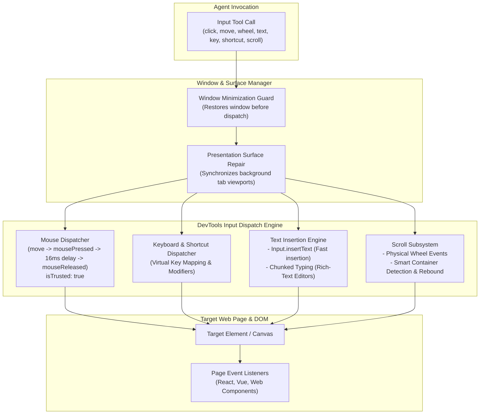
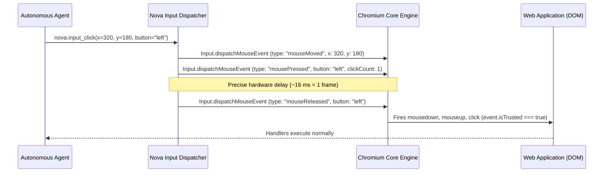
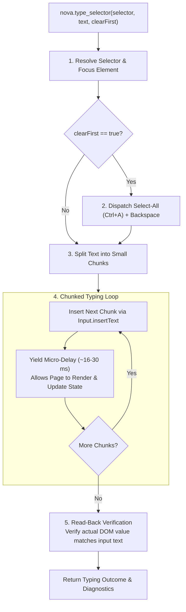
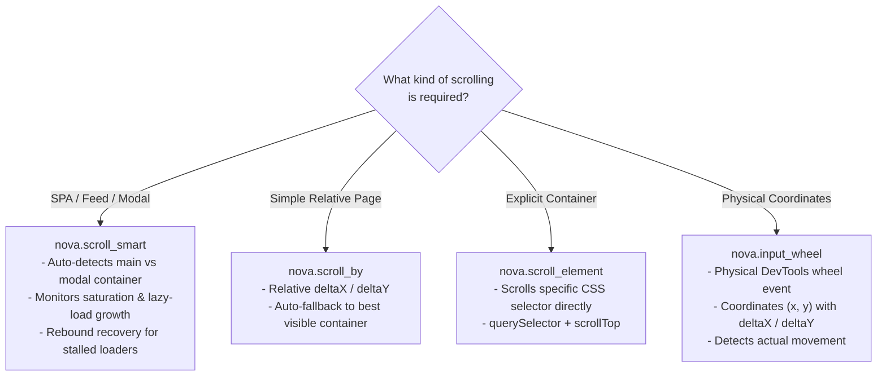

# Low-Level Input Dispatch Architecture

The Input Dispatch subsystem is Nova's foundational layer for delivering hardware-accurate mouse, keyboard, and scrolling events directly into web pages. By routing actions through the browser engine's DevTools protocol, Nova generates genuine browser events (`isTrusted: true`), restores throttled presentation surfaces, prevents character drops in rich-text editors, and handles complex scrolling dynamics in modern Single Page Applications (SPAs).

---

## Physical vs. Synthetic Events (`isTrusted: true`)

A fundamental distinction in web automation is whether an event is trusted:

* **Synthetic Events (`isTrusted: false`):** Dispatched via JavaScript scripts (such as `element.dispatchEvent(new MouseEvent(...))`). Modern web frameworks, bot mitigation services, and security-critical web apps (e.g., banking, corporate portals, CAPTCHAs) frequently ignore or reject untrusted events.
* **Physical DevTools Events (`isTrusted: true`):** Nova dispatches input through the underlying Chromium DevTools pipeline (`Input.dispatchMouseEvent`, `Input.dispatchKeyEvent`, `Input.insertText`). The browser engine treats these as authentic hardware events generated by physical peripherals.

### Click Delivery Sequence

When executing `nova.input_click` or `nova.click_selector`:
1. **Pointer Movement:** Emits `mouseMoved` to the target coordinates, triggering CSS `:hover` states and element focus transitions.
2. **Button Press:** Emits `mousePressed` with the specified button (`left`, `middle`, `right`) and `clickCount` (1 for single click, 2 for double click, 3 for triple click).
3. **Hardware Frame Delay:** Nova introduces a realistic ~16 ms delay (equivalent to one display refresh frame) between press and release. This ensures JavaScript event listeners that measure mousedown-to-mouseup latency acknowledge the click as a physical interaction.
4. **Button Release:** Emits `mouseReleased` to trigger standard `click` events.

---

## Window State & Surface Protection

### Automatic Minimization Restoration

Chromium aggressively optimizes resource usage when its host window is minimized:
* Frame rendering loops (`requestAnimationFrame`) are paused.
* Timers are heavily throttled.
* Pointer event dispatch can be dropped or desynchronized from the actual DOM layout.

Before dispatching any physical mouse or keyboard input, Nova checks the WinUI 3 window state. If the application window is minimized, Nova automatically restores it to normal windowed or maximized state (`SW_RESTORE`). This guarantees that layout coordinates and rendering pipelines are active before coordinates are evaluated.

### Presentation Surface Repair

When interacting with inactive tabs or background sandboxes, the target viewport may not have rendered recent layout changes. Nova executes a presentation surface repair transaction to ensure the viewport dimensions, scroll offsets, and visual layer trees match the intended target state.

---

## Keyboard & Text Insertion Subsystems

Nova provides three distinct methods for text and keyboard input:

| Tool | Delivery Mechanism | Primary Use Case | Speed & Behavior |
| :--- | :--- | :--- | :--- |
| **`nova.input_text`** | DevTools `Input.insertText` | Long text entry into already focused inputs, search bars, and standard forms. | **Near-instantaneous.** Directly inserts string into the focused element without firing individual keystroke events. |
| **`nova.type_selector`** | Chunked text insertion with render micro-delays | Rich-text editors (Draft.js, Slate, ProseMirror, Quill, Lexical) and interactive composers. | **Resilient & Chunked.** Focuses element, clears content, types in chunks, waits for DOM rendering between chunks, and performs read-back verification. |
| **`nova.input_key`** | DevTools `rawKeyDown` + `keyUp` | Functional keys: `Enter`, `Tab`, `Escape`, `Backspace`, arrow keys, `F1`–`F12`. | Emulates physical key press and release cycles with Windows virtual key codes. |
| **`nova.input_shortcut`** | Modifier + Key combination | Global shortcuts: `Ctrl+Shift+K`, `Alt+F4`, `Ctrl+A`, `Ctrl+V`. | Holds modifier keys (`Ctrl`, `Shift`, `Alt`, `Meta`), dispatches the target key, and releases modifiers in reverse order. |

### The Chunked Typing Engine (`nova.type_selector`)

Modern web applications frequently employ asynchronous rich-text editors (such as Slate.js, ProseMirror, or Lexical in Notion, Slack, or Google Docs). In these editors, typing an entire paragraph instantly via `Input.insertText` causes internal state race conditions, dropping characters or corrupting cursor positions.

1. **Focus & Selection:** Focuses the element matched by the CSS selector (with full open Shadow DOM support).
2. **Clear Existing Content:** If `clearFirst=true`, Nova sends a hardware `Ctrl+A` followed by `Backspace` rather than setting `.value = ""`, ensuring framework dirty-state listeners fire correctly.
3. **Chunked Insertion:** Long text is divided into small character slices. Nova dispatches each slice and briefly pauses to allow the browser's JavaScript event loop to process state updates and re-render.
4. **Read-Back Verification:** Following completion, Nova inspects the element's actual `.value` or `.innerText` to verify that the text was accepted by the page without dropped characters.

---

## Scrolling Subsystems

Standard window scrolling (`window.scrollTo` or `window.scrollBy`) frequently fails in modern web applications because scrolling is often contained within inner `
` containers (such as a sidebar, message list, or modal dialog) rather than the `window` object. Nova provides four complementary scrolling mechanisms:

### 1. Smart Scrolling (`nova.scroll_smart`)

`nova.scroll_smart` is Nova's primary tool for Single Page Applications, chat feeds, and infinite-scroll feeds:
* **Container Auto-Detection:** Automatically evaluates scrollable candidate containers (`main`, `dialog`, scrollable message lists) and chooses the most relevant visible container, falling back to window scrolling only if no container is found.
* **Saturation Signal:** The response includes saturation diagnostics (`grewThisScroll`, `stableRounds`, and hints) to help agents determine whether more items are currently lazy-loading or if the feed has reached the end.
* **Stalled-Loader Rebound Recovery:** On infinite-scroll feeds, lazy-loaders often stall when scrolled continuously to the bottom—the page stops loading new items because the `IntersectionObserver` threshold is stuck. Nova automatically performs a **rebound maneuver**: scrolling upward by approximately one viewport (negative `deltaY`) and then back down, re-triggering the observer.
* **Route Caching:** Learns and caches last-known-good scroll containers per host and route key (`useRouteCache=true`).

### 2. Relative Scrolling (`nova.scroll_by`)

Dispatches relative pixel shifts (`deltaX`, `deltaY`). If the root window cannot scroll, it automatically falls back to the best visible scrollable container.

### 3. Element-Scoped Scrolling (`nova.scroll_element`)

Directly scrolls a specified container element via CSS selector, updating its `scrollTop` or `scrollLeft` position without affecting surrounding page elements.

### 4. Coordinate Wheel Events (`nova.input_wheel`)

Dispatches physical mouse wheel ticks at exact viewport coordinates $(x, y)$. Nova monitors whether the document or an underlying container actually shifted in response to the wheel event, returning a `scrollDetected: true/false` confirmation.

---

## Navigation Waiting & Visual Capture Integration

All pointer actions support optional post-action inspection options:

* **`waitForNavigation`:** When set to `true`, Nova pauses after dispatch to monitor for URL changes, page load lifecycle events, and modal dialog appearances.
* **`navigationStrict`:** Ensures the tool call is considered successful only if both the input dispatch **and** the navigation complete without error.
* **`includeScreenshot`:** Embeds an immediate post-action visual capture in the tool response, allowing agents to inspect UI state transitions without requiring a separate screenshot tool call.

---

## Tool Reference

| Tool | Core Parameters | Output / Diagnostics |
| :--- | :--- | :--- |
| [`nova.input_click`](../../../mcp-reference/tools/browser-automation/nova-input-click.md) | `x`, `y`, `button`, `clickCount`, `waitForNavigation`, `includeScreenshot` | Action outcome, navigation status, post-click screenshot, overlay detection warnings |
| [`nova.input_move`](../../../mcp-reference/tools/browser-automation/nova-input-move.md) | `x`, `y` | Pointer movement confirmation |
| [`nova.input_wheel`](../../../mcp-reference/tools/browser-automation/nova-input-wheel.md) | `x`, `y`, `deltaX`, `deltaY` | Physical wheel event outcome, `scrollDetected` verification |
| [`nova.input_text`](../../../mcp-reference/tools/browser-automation/nova-input-text.md) | `text` | Fast text insertion confirmation into focused element |
| [`nova.type_selector`](../../../mcp-reference/tools/browser-automation/nova-type-selector.md) | `selector`, `text`, `clearFirst`, `verify` | Chunked typing outcome, verified read-back text, typing latency metrics |
| [`nova.input_key`](../../../mcp-reference/tools/browser-automation/nova-input-key.md) | `key` (`Enter`, `Tab`, `Escape`, etc.) | Key event dispatch confirmation |
| [`nova.input_shortcut`](../../../mcp-reference/tools/browser-automation/nova-input-shortcut.md) | `modifiers` (`ctrl`, `shift`, `alt`, `meta`), `key` | Shortcut dispatch outcome |
| [`nova.scroll_smart`](../../../mcp-reference/tools/browser-automation/nova-scroll-smart.md) | `deltaY`, `deltaX`, `containerSelector`, `useRouteCache` | Saturation signal, candidate counts, rebound recovery diagnostics |
| [`nova.scroll_by`](../../../mcp-reference/tools/browser-automation/nova-scroll-by.md) | `deltaY`, `deltaX`, `containerSelector` | Relative scroll outcome and fallback container details |
| [`nova.scroll_to`](../../../mcp-reference/tools/browser-automation/nova-scroll-to.md) | `x`, `y` | Absolute window scroll coordinates |
| [`nova.scroll_element`](../../../mcp-reference/tools/browser-automation/nova-scroll-element.md) | `selector`, `deltaY` | Scoped element scroll outcome |

---

[Browser Interaction overview](../README.md) · [Selectors & Shadow DOM](../selectors-and-shadow-dom/README.md) · [Drag & Drop](../drag-and-drop/README.md) · [All core features](../../README.md)
