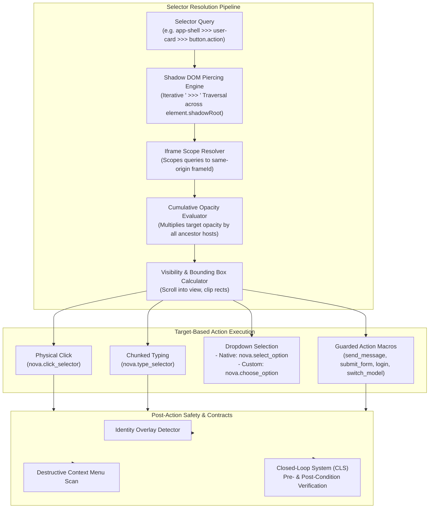
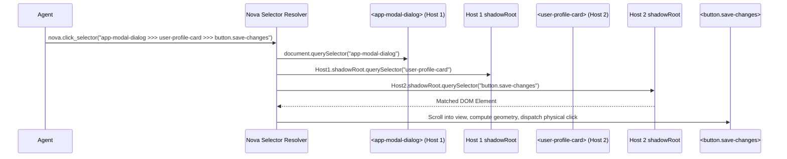
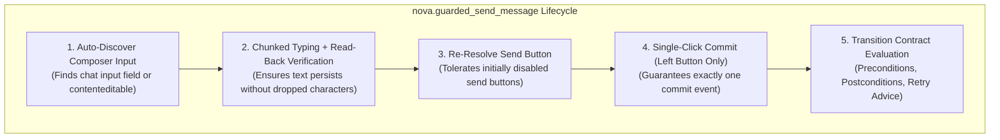

# Selectors, Shadow DOM & Guarded Actions

Web applications increasingly encapsulate user interfaces inside Web Components, open Shadow DOM boundaries, iframes, and dynamic component frameworks. Standard DOM queries like `document.querySelector()` cannot penetrate Shadow DOM trees or handle custom dropdown components.

Nova provides a robust selector resolution engine capable of piercing open shadow roots via the ` >>> ` combinator, calculating cumulative ancestor opacity, manipulating both native and custom dropdowns, and executing composite **Guarded Action Macros** backed by closed-loop verification contracts.



---

## Shadow DOM Traversal (` >>> `)

The Shadow DOM standard provides encapsulation by isolating a component's internal markup and styles from the outer document. Standard CSS selectors cannot cross a shadow boundary.

Nova extends standard CSS selectors with the **` >>> ` piercing combinator**. Each segment separated by ` >>> ` is an independent CSS selector; each ` >>> ` transitions from the matched element into its open shadow root:

```css
/* Piercing two levels of nested Web Components to click a save button */
app-modal-dialog >>> user-profile-card >>> button.save-changes
```



### Traversal Invariants

1. **Open Shadow Roots Only:** Traversal follows `element.shadowRoot`. Because the browser exposes this property only for open shadow roots, closed shadow roots cannot be accessed via CSS selectors. For closed shadow roots, use perceptual CTA handles (`ctaRef` from `nova.perceive`) or coordinate-based input.
2. **Cumulative Ancestor Opacity:** An element's effective visibility depends on its entire ancestor chain. Nova calculates the multiplicative product of the target element's CSS `opacity` and all ancestor hosts across shadow boundaries:
   $$\text{Effective Opacity} = \text{Opacity}_{\text{target}} \times \prod_{i=1}^{n} \text{Opacity}_{\text{ancestor}_i}$$
   - **Click & Upload Exception:** Elements with an effective opacity of 0 (such as an invisible `<input type="file">` overlaid on top of a styled upload button) remain valid click and file upload targets.
   - **Screenshot Refusal:** Element-scoped screenshot captures of fully transparent elements are refused, as capturing them would simply show the background layer behind them.

---

## Dropdown Selection: Native vs. Custom Components

Modern web frameworks implement dropdowns in two fundamentally different ways:

```mermaid
graph TD
    DropdownType{"What kind of dropdown\nis on the page?"}

    DropdownType -->|Native HTML <select>| NativeSelect["nova.select_option\n- Manipulates <select> by value attribute\n- Emulates change and input events"]

    DropdownType -->|Custom UI Library\n(Radix, Headless UI, React Select, MUI)| CustomSelect["nova.choose_option\n- Matches by visible text, substring, or index\n- Automatically opens menu, selects item, and closes\n- Compatible with native <select> as well"]
```

### 1. Native `<select>` Elements (`nova.select_option`)

`nova.select_option` targets standard HTML `<select>` elements and chooses an `<option>` by its `value` attribute. It updates the DOM property and dispatches both `input` and `change` events.

### 2. Universal Custom Dropdowns (`nova.choose_option`)

Most enterprise web applications (React, Angular, Vue) replace native `<select>` tags with custom ARIA-based component libraries (such as Radix UI, Headless UI, React Select, Ant Design, Material-UI, or Tailwind Comboboxes). These components do not possess `<select>` tags or `value` attributes.

`nova.choose_option` provides universal dropdown interaction:
* **Identification:** Matches options by visible text, substring, or 0-based index.
* **Autonomous Interaction:** Automatically detects if the dropdown menu is closed, clicks the trigger element to open the list, scrolls the desired item into view, selects it, and verifies closure of the dropdown popover.
* **Dual Compatibility:** If given a native `<select>`, it seamlessly handles it by matching the visible option label rather than requiring technical value strings.

---

## Guarded Action Macros

High-level composite actions that combine target discovery, text insertion, read-back verification, and button execution into an atomic call. Guarded macros prevent race conditions and eliminate the need for multi-step script choreography.



### 1. Guarded Message Dispatch (`nova.guarded_send_message`)

Specifically optimized for generative AI and chat surfaces (ChatGPT, Claude.ai, Gemini, Slack, Discord):
* **Selectorless Auto-Discovery:** When `selector` and `ctaRef` are omitted, Nova automatically scans the document (or iframe) to identify the chat composer input field and its paired send button.
* **Tolerates Initially Disabled Send Buttons:** In modern chat interfaces, the send button is disabled (`aria-disabled="true"` or `disabled`) when the composer is empty. Nova's auto-discovery accounts for this: it discovers the disabled send button, types the message, verifies that the button becomes enabled, and then commits the click.
* **Single-Click Commit Invariant:** Disallows double-clicking or non-left buttons (`button='left'`, `clickCount=1`), preventing accidental duplicate message transmissions.
* **Structured Failure Reason Codes:** If discovery fails, Nova returns structured diagnostic reason codes rather than generic errors:
  - `action.no_input_field_found`: No chat composer field was identified.
  - `action.no_send_button_found`: Composer input was found, but no send button could be paired with it.
  - `action.no_chat_surface_pair_found`: Elements found, but could not be definitively paired.
  - `action.ambiguous_input_field`: Multiple competing chat inputs found with equal confidence.

### 2. Guarded Form Submission (`nova.guarded_submit_form`)

Wraps form submission buttons with a built-in submit transition contract template. It verifies that required fields are valid before clicking and monitors for post-submit state transitions (e.g., modal closure, success alerts, or URL changes).

### 3. Guarded Authentication (`nova.guarded_login`)

Automates login form submission. Integrates directly with [Auth Surface Detection (ASD)](../../auth-surface-detection-asd/README.md) to detect whether login succeeded, failed due to bad credentials, or encountered a multi-factor authentication (MFA) challenge.

### 4. Guarded Model & Workspace Switching (`nova.guarded_switch_model`, `nova.guarded_switch_sandbox`)

Handles switching AI model selectors or active sandbox workspaces with automatic pre-condition checks and option selection verification.

### 5. Inspecting Composer State (`nova.composer_state`)

A non-mutating inspection tool that reports the exact state of the chat composer: active input text, placeholder strings, send button enabled status, and paired container identifiers.

---

## Post-Action Safety Scans

Every selector-based click is audited immediately post-dispatch:

1. **Identity Overlay Detector:** Detects if a newly opened overlay mimics an external authentication provider or phishing prompt.
2. **Destructive Context Menu Scan:** If a right-click is dispatched, Nova scans the resulting context menu for dangerous triggers (e.g., delete, clear all, revoke tokens) and attaches explicit safety warnings.

---

## Tool Reference

| Tool | Core Parameters | Output / Diagnostics |
| :--- | :--- | :--- |
| [`nova.click_selector`](../../../mcp-reference/tools/browser-automation/nova-click-selector.md) | `selector`, `ctaRef`, `button`, `clickCount`, `autoDismissBlockers`, `verify` | Action outcome, effective selector, verified state, blocker dismissal status |
| [`nova.type_selector`](../../../mcp-reference/tools/browser-automation/nova-type-selector.md) | `selector`, `text`, `clearFirst`, `verify` | Typing outcome, verified read-back text, chunk count, typing latency |
| [`nova.select_option`](../../../mcp-reference/tools/browser-automation/nova-select-option.md) | `selector`, `value` | Native select outcome, verified selected value |
| [`nova.choose_option`](../../../mcp-reference/tools/browser-automation/nova-choose-option.md) | `selector`, `text`, `index` | Custom dropdown outcome, matched option label, menu state |
| [`nova.guarded_send_message`](../../../mcp-reference/tools/guarded-actions/nova-guarded-send-message.md) | `text`, `selector` (optional), `autoDismissBlockers` | Guarded commit status, effective selector, verification state, retry advice |
| [`nova.guarded_submit_form`](../../../mcp-reference/tools/guarded-actions/nova-guarded-submit-form.md) | `selector`, `transitionContract` | Form submission outcome, contract verification results |
| [`nova.guarded_login`](../../../mcp-reference/tools/guarded-actions/nova-guarded-login.md) | `selector`, `transitionContract` | Authentication progression state, error classification |
| [`nova.guarded_switch_model`](../../../mcp-reference/tools/guarded-actions/nova-guarded-switch-model.md) | `selector`, `modelName` | Model switch outcome and verification state |
| [`nova.guarded_switch_sandbox`](../../../mcp-reference/tools/guarded-actions/nova-guarded-switch-sandbox.md) | `selector`, `sandboxId` | Sandbox transition outcome |
| [`nova.composer_state`](../../../mcp-reference/tools/dom-and-reading/README.md) | `targetId` | Composer input text, send button enabled status, container info |

---

[Browser Interaction overview](../README.md) · [Input Dispatch](../input-dispatch/README.md) · [Drag & Drop](../drag-and-drop/README.md) · [All core features](../../README.md)
