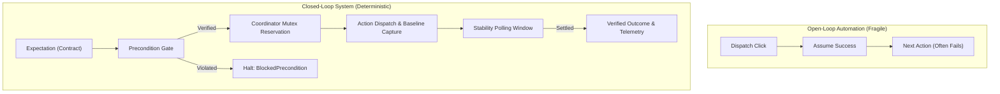
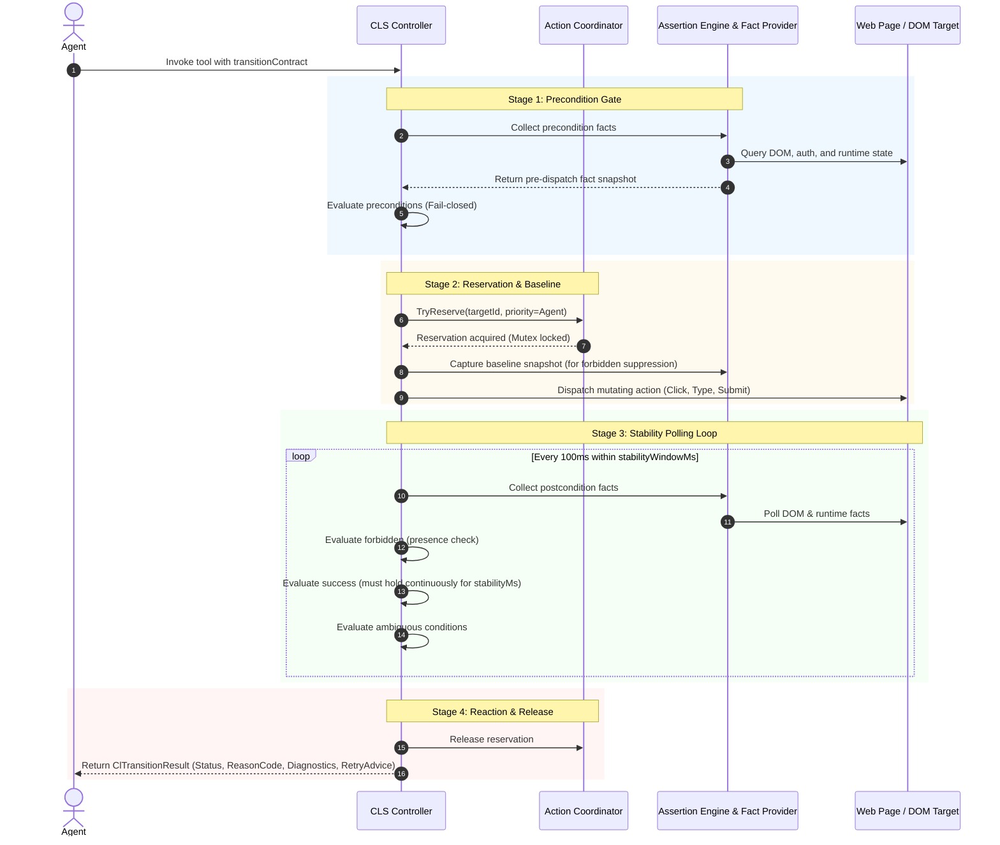
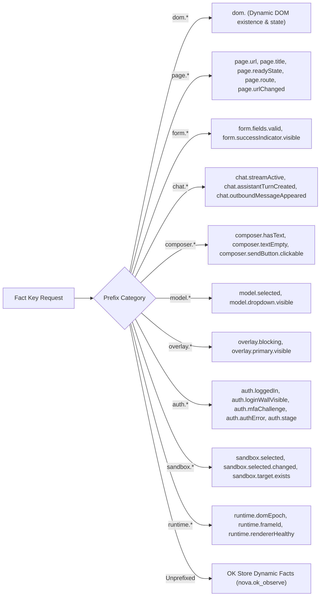
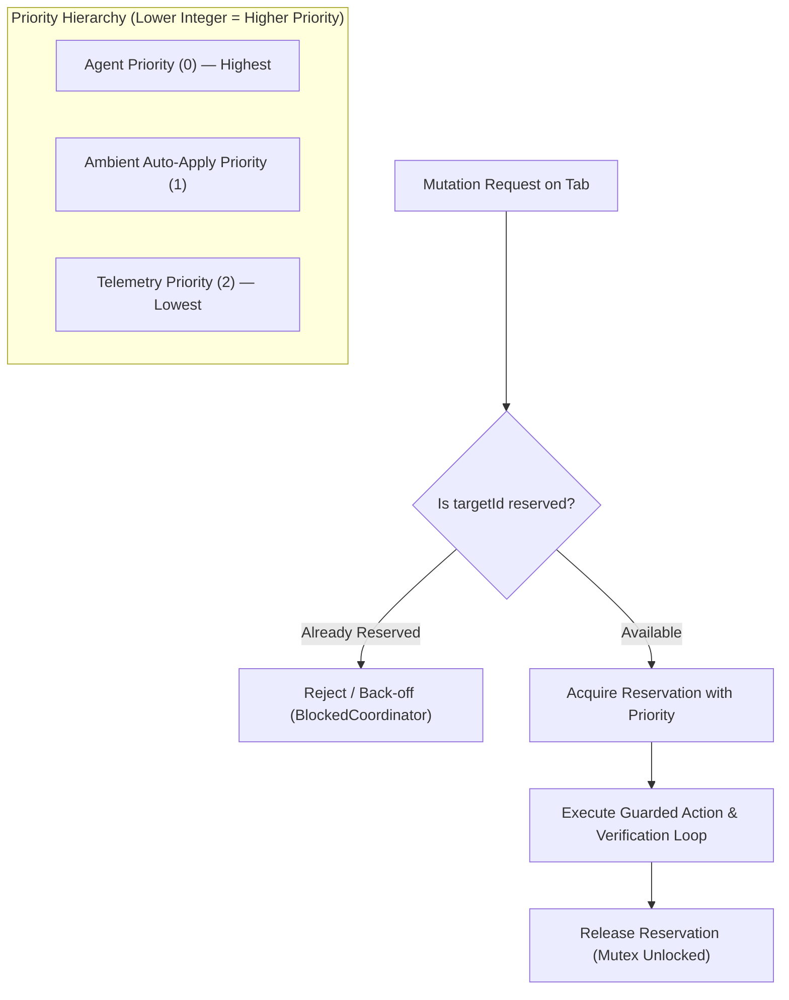
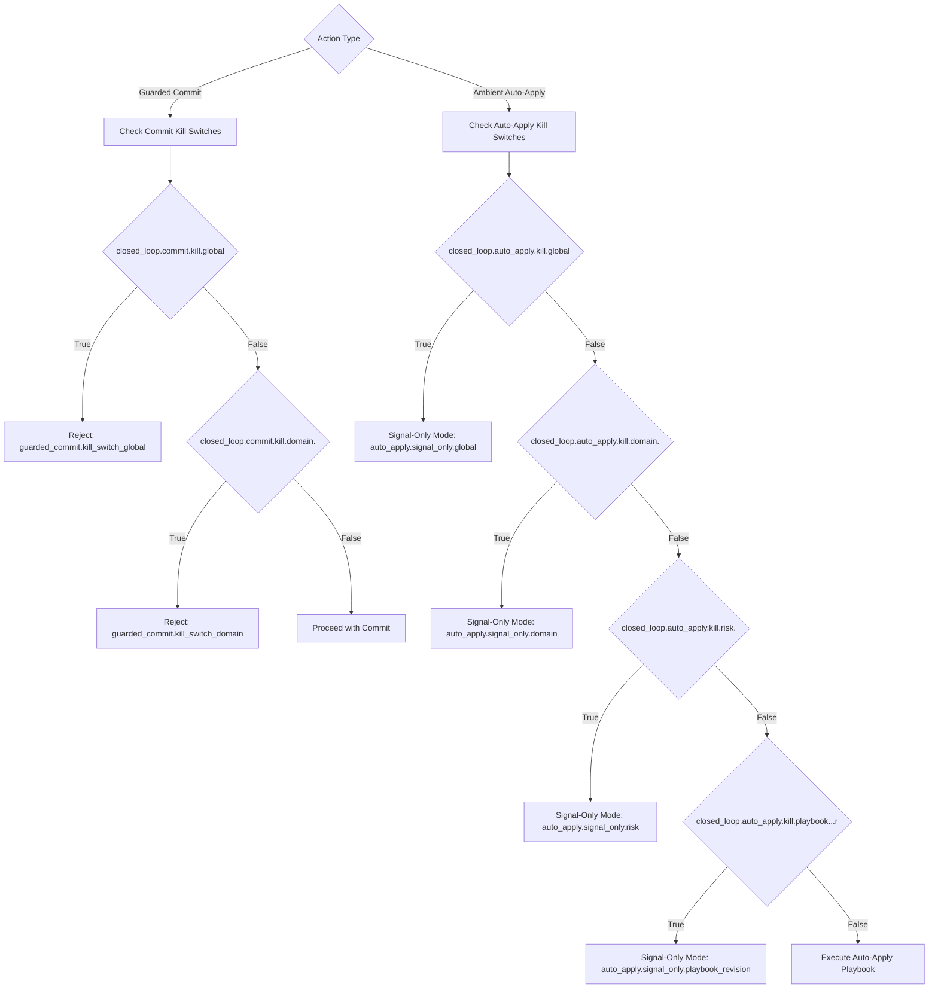
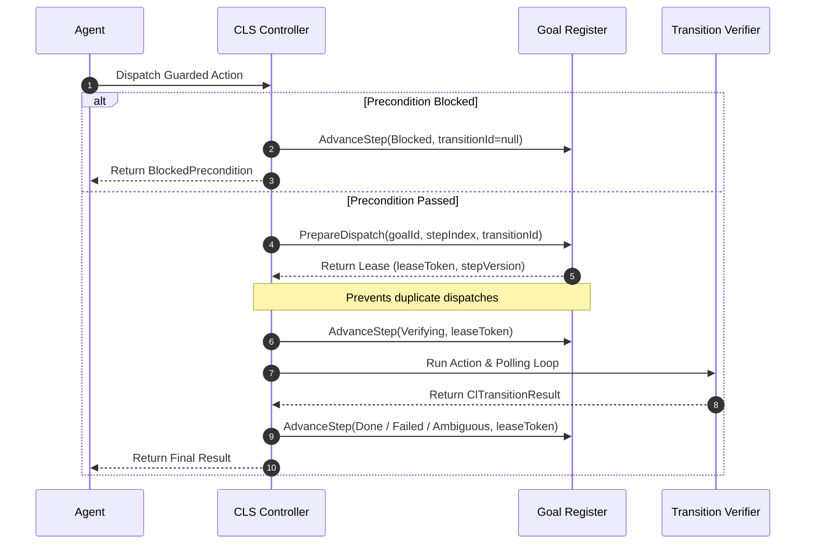
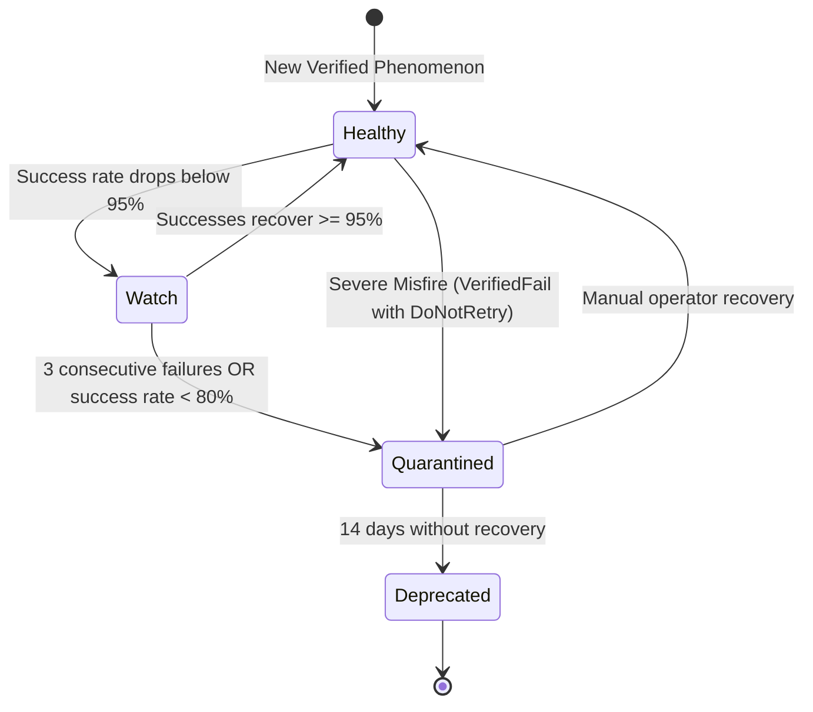

# Closed-Loop System (CLS)

> [!NOTE]
> The **Closed-Loop System (CLS)** of Nova AI Workspace transforms browser automation from blind, "fire-and-forget" command execution into a deterministic control loop governed by **transition contracts**. Every guarded action follows the immutable cycle: **Expectation $\rightarrow$ Precondition Gate $\rightarrow$ Coordinator Reservation $\rightarrow$ Action Dispatch $\rightarrow$ Stability Verification $\rightarrow$ Outcome Reaction**. Operating in deep synergy with the Tool Observation Bus (TOB), the Phenomenological Knowledge Store (PKS), and the Goal Register, CLS guarantees that non-idempotent commits are never blindly retried, transient UI flickers are not mistaken for permanent state, and failed postconditions are detected immediately.

---

## 1. Executive Summary & The Problem of Open-Loop Automation

Conventional browser automation tools (such as Selenium, Puppeteer, or standard CDP scripts) operate in an **open loop**:
1. A script locates an element and fires a click event.
2. The automation driver assumes that because the OS-level or CDP-level click was dispatched without an error, the operation was successful.
3. The script proceeds immediately to the next instruction.

In modern dynamic web applications, open-loop execution is fragile and error-prone:
* **The Modal Stays Open:** A close button (`✕`) is clicked, but an unhandled animation, an API validation error, or a second overlapping overlay prevents the dialog from vanishing. The script attempts to interact with underlying page content and crashes because the element is obstructed.
* **Double Form Submission & Duplicate Billing:** An agent submits a payment or sends an email. A momentary network delay prevents an immediate URL change. An open-loop retry logic clicks "Submit" a second time, charging the user twice or sending duplicate messages.
* **Transient UI Flickers:** An element temporarily toggles a CSS class during a hover animation, tricking naive pollers into reporting success before the interface settles into an error state.
* **Silent Navigation Failures:** A login button is clicked, but due to invalid credentials, an in-page error message appears without a URL change. A script expecting navigation hangs until global execution timeouts expire.

**CLS closes the loop.** An action is defined not merely by what input is sent, but by **what observable state must hold beforehand**, **how concurrency is serialized during execution**, and **what state transition must be verified afterwards**.



### Four Interlocking Systems, Distinct Responsibilities

| Subsystem | Core Architectural Responsibility |
| :--- | :--- |
| **[TOB (Tool Observation Bus)](../tool-observation-bus-tob/README.md)** | **Execution Evidence:** Immutable, server-side audit logging of every tool call, parameter, and raw outcome. |
| **[PKS (Knowledge Store)](../learning/phenomenological-knowledge-store-pks/README.md)** | **Procedural Memory:** Stores learned UI playbooks, selector fingerprints, and health ratings across sessions. |
| **[OK (Operational Knowledge)](../learning/operational-knowledge-ok/README.md)** | **Runtime Situational State:** Tracks live tab capabilities, authentication facts, and active DOM context. |
| **CLS (Closed-Loop System)** | **State Transition Enforcement:** Precondition gates, mutex-guarded dispatch, stability polling, and outcome verification. |

---

## 2. The 4-Stage Control Loop Architecture

Every closed-loop interaction—whether explicitly authored by an agent via `transitionContract` on interactive tools like `nova.click_selector`, or implicitly synthesized by compound tools like `nova.guarded_send_message`—executes through a deterministic 4-stage pipeline.



### Stage 1: Precondition Verification & Stale Fact Recovery
* **Fail-Closed Execution:** Before any mutating click or input is sent, preconditions are evaluated against live target facts. If preconditions fail (`ClEvalVerdict.Failed`), the action is **never dispatched**, returning `DispatchStatus = BlockedPrecondition` and `VerificationStatus = Skipped`.
* **Stale Fact Recovery:** If an unreadable or stale fact produces an `Unknown` verdict, CLS introduces a brief 200 ms settling pause and re-collects facts once. If preconditions remain indeterminate, execution halts safely, preventing blind mutations on uncertain surfaces.

### Stage 2: Action Coordinator Reservation & Baseline Capture
* **Per-Tab Mutation Mutex:** To prevent race conditions between concurrent agent actions, background crawlers, and Ambient Auto-Apply, the `ActionCoordinator` enforces serialized execution per `targetId`.
* **Baseline Snapshotting:** Immediately prior to action dispatch, CLS captures a baseline snapshot of all facts referenced in the `forbidden` postcondition bucket. This enables **Baseline Suppression** in Stage 3.
* **Dispatch:** The actual mutation (e.g. native mouse click, keystroke sequence, form submit) is executed against the target WebView.

### Stage 3: Outcome Verification & Stability Hold
* **High-Frequency Polling:** CLS enters an asynchronous verification loop polling target facts every **100 ms** up to `stabilityWindowMs` (typically 2,000 to 8,000 ms depending on action class).
* **Baseline Suppression Invariant:** If a forbidden condition was *already present before the action ran* (e.g. the URL is still on the compose page during the brief fraction of a second before a send action navigates away), it is an existing condition that cannot be blamed on the action. The baseline filter suppresses this condition so an action is not falsely marked as failed while transitioning.
* **Continuous Stability Hold (`stabilityMs`):** To prevent false positives from transient UI flickers, animations, or temporary spinner disappearance, success conditions must hold continuously for `stabilityMs` (default 100 to 250 ms) before `verified_success` is declared.
* **Short-Circuit Optimization:** If `ShortCircuitOnSuccess == true` and `stabilityMs == 0`, CLS completes immediately upon the first verified success tick, eliminating artificial latency.

### Stage 4: Diagnostics Projection & Telemetry Feedback
* **Top-Level Wire Projection:** The verification result is projected into top-level MCP response fields: `status`, `reasonCode`, `stage`, `retryable`, `retryAdvice`, and structured `postconditionDiagnostics`.
* **Knowledge Loop Feedback:** Outcomes automatically update PKS phenomenon health records: consistent successes elevate playbooks to higher autonomy levels, while repeated failures demote or deprecate broken selector patterns.

---

## 3. The Pure Assertion Engine (`AssertionEngine`)

At the heart of CLS is the `AssertionEngine`—a purely deterministic, in-memory tri-state evaluation engine with zero I/O side effects.

### 3.1 The Frozen Truth Table
Every individual assertion evaluates to `true` (Satisfied), `false` (Failed), or `null` (Unknown). Unknown is treated with strict mathematical rigor:

| Assertion Bucket | All Children `true` | At Least One `true`, None `false` | At Least One `false` | Any `null` (Unknown), None `false` |
| :--- | :--- | :--- | :--- | :--- |
| **`all`** | **Satisfied** (`true`) | Unknown (`null`) | **Failed** (`false`) | Unknown (`null`) |
| **`any`** | **Satisfied** (`true`) | **Satisfied** (`true`) | Failed (`false`) | Unknown (`null`) |
| **`forbidden`** | **Failed** (`false` - Violation!) | **Failed** (`false` - Violation!) | **Satisfied** (`true` - Clean) | Unknown (`null`) |

### 3.2 Precedence Hierarchy
When combining bucket outcomes, CLS enforces strict precedence:
$$\text{Forbidden Violation} > \text{Success Match} > \text{Ambiguous Signal} > \text{Unknown / Timeout}$$

If a forbidden condition fires (e.g. `auth.authError == true` or `form.errorBanner.visible == true`), it immediately overrides any partial success signals, terminating the verification loop with `verified_fail`.

### 3.3 The 10 Comparison Operators

| Operator | Syntax | Supported Types | Evaluation Behavior |
| :--- | :--- | :--- | :--- |
| **`eq`** | `"eq"` | All JSON types | Structural deep-equality. Recursively checks objects and arrays; strict value match on primitives. |
| **`not_eq`** / **`neq`** | `"not_eq"` | All JSON types | Negation of deep-equality. `true` if types or contents differ. |
| **`exists`** | `"exists"` | Any | `true` if the fact is present and neither `null` nor `undefined`. |
| **`not_exists`** | `"not_exists"` | Any | `true` if the fact is missing, `null`, or `undefined`. |
| **`contains`** | `"contains"` | String | Substring match (`haystack.Contains(needle, Ordinal)`). Fails on non-strings. |
| **`gt`** | `"gt"` | Number | Numeric greater than ($a > b$). |
| **`lt`** | `"lt"` | Number | Numeric less than ($a < b$). |
| **`gte`** | `"gte"` | Number | Numeric greater than or equal ($a \ge b$). |
| **`lte`** | `"lte"` | Number | Numeric less than or equal ($a \le b$). |

### 3.4 Fact Degradation & Unreadable Handling
When a fact provider encounters an element that cannot be queried or a probe that throws an exception, it reports the fact as JSON `null`.
* **No False Mismatches:** Comparing an unreadable `null` fact against a concrete expected value (e.g. checking if `composer.textEmpty == true`) yields **Unknown (`null`)**, not `false`. This prevents an infrastructure probe failure from masquerading as a confirmed state mismatch.
* **Diagnostic Trace Error Codes:** Every evaluated assertion generates an immutable trace containing one of:
  * `fact_not_found`: The requested fact key was not produced by any provider.
  * `stale_fact`: The fact was marked stale by renderer/navigation lifecycle transitions.
  * `fact_unreadable`: The DOM element or property could not be resolved.
  * `frame_mismatch`: The fact was observed in a different frame than the asserted `frameId`.
  * `type_mismatch`: Operator cannot compare the observed and expected types (e.g. `gt` on strings).

---

## 4. Fact Key Vocabulary & Scoped Semantic Selectors

To prevent subtle authoring bugs where an agent guesses a fact key (e.g. typing `dom.text` instead of `composer.hasText`) and runs into an uninformative timeout, Nova enforces a strict fact key vocabulary. Known prefixes with unrecognized names are rejected up front with JSON-RPC error `-32602`.



### Complete Prefix Reference

| Prefix Group | Supported Fact Keys | Typical Usage & Verification Target |
| :--- | :--- | :--- |
| **`dom.<selector>`** | Arbitrary CSS selectors (e.g. `dom.#modal-close`, `dom.button.submit`) | Resolves directly against target DOM. Combined with `exists` or `not_exists` to verify element appearance or removal. |
| **`page.*`** | `page.url`<br>`page.title`<br>`page.readyState`<br>`page.route`<br>`page.urlChanged` | Navigation verification; URL change detection; client-side route tracking. |
| **`form.*`** | `form.fields.valid`<br>`form.successIndicator.visible` | Form validation state; submission confirmation banners. |
| **`chat.*`** | `chat.streamActive`<br>`chat.streamActive.started`<br>`chat.assistantTurnCreated`<br>`chat.outboundMessageAppeared` | AI chat completion tracking; streaming response detection; messenger turn creation. |
| **`composer.*`** | `composer.hasText`<br>`composer.textEmpty`<br>`composer.sendButton.clickable` | Text entry validation; composer clearing confirmation post-send. |
| **`model.*`** | `model.selected`<br>`model.dropdown.visible` | AI model picker switching and dropdown visibility. |
| **`overlay.*`** | `overlay.blocking`<br>`overlay.primary.visible` | Modal blocker detection; cookie banner verification. |
| **`auth.*`** | `auth.assessment`<br>`auth.stage`<br>`auth.loggedIn`<br>`auth.loginWallVisible`<br>`auth.authError`<br>`auth.mfaChallenge` | Authentication state; sign-in wall detection; MFA challenge prompts; login error verification. |
| **`sandbox.*`** | `sandbox.selected`<br>`sandbox.selected.changed`<br>`sandbox.target.exists` | Multi-sandbox profile switching and target binding verification. |
| **`runtime.*`** | `runtime.domEpoch`<br>`runtime.frameId`<br>`runtime.rendererHealthy` | DOM revision tracking; subframe identification; renderer liveness. |

### 4.1 Scoped Semantic Fact Keys (`@css=...`)
While global semantic fact keys (like `composer.hasText` or `composer.sendButton.clickable`) automatically locate the active composer using smart heuristic surface detection, complex web applications often feature multiple concurrent entry areas (e.g. a main prompt box, an inline comment input, and a sidebar search).

Nova solves this via **Scoped Semantic Fact Keys**:
```text
composer.hasText@css=%23custom-chat-input
composer.sendButton.clickable@css=.sidebar-submit-btn
```

* **URL-Encoded Selectors:** The selector following `@css=` is URL-encoded.
* **Target Scoping:** Nova evaluates the semantic fact specifically against the target element identified by the selector.
* **Shadow DOM Piercing:** If the selector targets a component inside an open Shadow DOM root (e.g. `x-chat::shadow #input`), Nova's selector engine automatically resolves the shadow boundary.

---

## 5. Commit Point Classification & Pre-Commit Preview

Not all browser actions carry the same risk. Clicking an informational tab is low risk; clicking **"Send Message"**, **"Submit Order"**, or switching active models is a **Commit Point**.

### 5.1 Commit Point Classification Rules
Nova automatically classifies an action as a commit point if any of the following criteria are met:
1. **Send Buttons:** Selectors matching `send-button`, `send_button`, or `data-testid="send"`.
2. **Submit Forms:** Buttons or inputs matching `[type="submit"]` or `type="submit"`.
3. **Typed Enter:** Calls to `nova.type_selector` with `pressEnter: true`.
4. **Model Switches:** Selectors matching `model-selector`, `model-switch`, or `data-testid="model"`.
5. **Sandbox Switches:** Selectors matching `sandbox-switch`, `workspace-switch`, or `sandbox-selector`.
6. **Authentication Actions:** Selectors matching `login`, `sign-in`, or `signin` combined with `button`, `submit`, or `[role="button"]`.

### 5.2 Pre-Commit Preview in `nova.perceive` (`safety.guarded_commit_preview`)
Traditional automation systems wait until an action is dispatched to reject an unguarded commit, wasting full tool round-trips. Nova avoids this:
* During `nova.perceive`, Nova scans all interactive CTAs and projects their classification into `structuredContent.commitPointCtas`.
* The returned CTA handles list the exact ref IDs of buttons that require a `transitionContract`.
* Agents know *in advance* that clicking CTA ref #4 will require postconditions, allowing them to construct contracts before attempting the click.

### 5.3 Missing-Contract Gate & Starter Hint
If an agent attempts to execute a commit-point action via `nova.click_selector` or `nova.type_selector` without providing a `transitionContract`, Nova halts execution immediately:
* **Response Status:** `status: "blocked"`, `stage: "guarded_commit_check"`.
* **Action Dispatched:** `actionDispatched: false` (Zero side effects on the page).
* **Copyable Starter Contract:** To prevent agents from guessing syntax or falling back to dangerous unverified `nova.eval` workarounds, Nova includes a complete, copyable starter contract in the error message:

```json
{
  "actionKind": "submit_form",
  "postconditions": {
    "success": {
      "any": [
        { "factKey": "page.urlChanged", "operator": "eq", "expected": true },
        { "factKey": "form.successIndicator.visible", "operator": "eq", "expected": true }
      ]
    }
  }
}
```

---

## 6. Contract Authoring & Stability Profiles

Agents specify transition contracts using the `transitionContract` parameter. Nova configures timing defaults based on the declared `actionKind`.

```json
{
  "actionKind": "submit_form",
  "retryPolicy": "non_idempotent",
  "ambiguityPolicy": "signal",
  "stabilityWindowMs": 8000,
  "stabilityMs": 200,
  "preconditions": {
    "all": [
      { "factKey": "form.fields.valid", "op": "eq", "value": true }
    ]
  },
  "postconditions": {
    "success": {
      "any": [
        { "factKey": "page.urlChanged", "op": "eq", "value": true },
        { "factKey": "form.successIndicator.visible", "op": "eq", "value": true }
      ]
    },
    "forbidden": {
      "any": [
        { "factKey": "dom.div.form-error-banner", "op": "exists" }
      ]
    },
    "ambiguous": {
      "any": [
        { "factKey": "auth.mfaChallenge", "op": "eq", "value": true }
      ]
    }
  }
}
```

### Action Stability Templates (`ClStabilityTemplates`)

| Action Kind (`actionKind`) | Default `WindowMs` | Default `StabilityMs` | Short-Circuit on Success | Primary Operational Use Case |
| :--- | :--- | :--- | :--- | :--- |
| **`dismiss_overlay`** | 3,000 ms | 250 ms | `true` | Closing modals, cookie banners, tooltips, dialogs. Requires 250 ms hold to ensure blocker does not bounce back. |
| **`send_message`** | 5,000 ms | 0 ms | `true` | Sending chat or messenger prompts. Immediate return once composer clears or assistant turn starts. |
| **`submit_form`** | 8,000 ms | 0 ms | `true` | Checkout, registration, form submission. Extended window accommodates server-side processing latency. |
| **`select_option`** | 2,000 ms | 100 ms | `true` | Dropdowns, model switches, tab selection. Fast verification with brief settling debounce. |
| **`custom`** | 5,000 ms | 250 ms | `true` | User-defined multi-step workflows and ad-hoc transition assertions. |

---

## 7. Verification Verdicts, Indeterminate Reasons & Retry Advice

CLS strictly separates the questions: *"Did the action dispatch?"*, *"Was the intended outcome verified?"*, and *"Is it safe to retry?"*

### 7.1 Verification Statuses

| Verification Status | Definition & Operational Meaning |
| :--- | :--- |
| **`verified_success`** | All required success assertions passed and held continuously for `stabilityMs`. |
| **`verified_fail`** | A forbidden assertion matched, dispatch threw an exception, or preconditions definitively failed. |
| **`indeterminate`** | The outcome could not be definitively confirmed within the observation window. **Never treated as success.** |
| **`skipped`** | Verification was not performed (preconditions blocked execution or no postconditions were specified). |

### 7.2 Dissecting Indeterminate Reasons (`ClIndeterminateReason`)
When an outcome is indeterminate, CLS provides exact diagnostic attribution:

* **`postcondition_mismatch` (Contract Mismatch vs. Timeout):**
  > [!IMPORTANT]
  > Nova distinguishes between "no usable signal arrived" and "Nova read the resulting state and it definitively did not match what the caller asserted".
  > 
  > If the polling window closes while the success assertion evaluated to `Failed`, Nova reports `postcondition_mismatch` instead of a generic `timeout`. This informs the agent that the action *already executed* and page state was readable, preventing disastrous double-submissions caused by overly narrow assertions on successful non-idempotent commits!
* **`timeout`:** The polling window elapsed without receiving a definitive signal (e.g. slow network response).
* **`ambiguous_signal`:** An explicit ambiguity assertion matched (e.g. an unexpected 2FA challenge after login).
* **`page_navigated`:** Top-level navigation destroyed the page context before postconditions settled.
* **`frame_destroyed`:** An iframe containing the target element was detached during execution.
* **`eval_error`:** Renderer exception during fact evaluation.

### 7.3 Retry Policies & Derived Advice

| Configured `retryPolicy` | Observed Outcome | Generated `retryAdvice` | `retryable` | Actionable Agent Guidance |
| :--- | :--- | :--- | :--- | :--- |
| **`idempotent`** | Failure or Timeout | `safe_to_retry` | `true` | The action has no cumulative side effects (e.g. closing a modal, selecting an option). Safe to dispatch again. |
| **`non_idempotent`** | Any non-success | `check_postcondition_first` | `false` | Consequential action (e.g. sending mail, charging payment). **Do not blindly retry.** Re-read page state first. |
| **`no_retry`** | Any non-success | `do_not_retry` | `false` | Action must not be repeated under any circumstances. |
| Any | `verified_fail` | `do_not_retry` | `false` | Explicit forbidden violation detected. Repeating the same action will fail identically. |

---

## 8. Action Coordinator & Tab Concurrency Protection

Autonomous browser environments frequently host competing actors:
1. Interactive agent tool calls (clicking, typing).
2. Background Ambient Auto-Apply routines (dismissing cookie banners).
3. Telemetry and probe background workers.

If an Ambient Auto-Apply routine clicks a cookie banner button at the exact millisecond the agent clicks a payment button, the resulting click coordinate collision or focus shift can corrupt execution.

Nova's **`ActionCoordinator`** resolves this:



### 8.1 Frozen Coordination Invariants
1. **Non-Preemptive In-Flight Guarantee:** Once a guarded action begins execution, it **cannot be preempted** by any other process—even a higher priority agent request—until verification completes or the timeout expires.
2. **Priority Ordering:** `Agent (0) > AutoApply (1) > Telemetry (2)`. If an agent issues a command, Ambient Auto-Apply immediately steps aside.
3. **PKS Execution Within Mutex:** Ambient Auto-Apply acquires its coordinator reservation *before* inspecting playbooks, ensuring no state changes occur between matching and execution.
4. **Deadman TTL Expiration:** Every reservation generates a unique ID (`res-<counter:X8>`) and carries an explicit timeout (up to 15,000 ms). If an action process crashes, `PurgeExpired()` automatically clears dead reservations, preventing permanent tab deadlocks.

---

## 9. Hierarchical Kill Switches & Signal-Only Controls

In enterprise and production environments, operators must be able to instantly disable automated commits or auto-apply playbooks without restarting the application or modifying code.

CLS provides a multi-tier hierarchy of **Kill Switches** backed by the PKS Key-Value store:



### Kill Switch Reference Catalog

| Switch Category | Key Pattern | Behavioral Effect When Active | Reason Code |
| :--- | :--- | :--- | :--- |
| **Global Commit Kill** | `closed_loop.commit.kill.global` | Completely blocks all guarded commit point tools across all tabs. | `guarded_commit.kill_switch_global` |
| **Domain Commit Kill** | `closed_loop.commit.kill.domain.<scope>` | Blocks commit point tools exclusively on the specified domain. | `guarded_commit.kill_switch_domain` |
| **Global Auto-Apply Kill** | `closed_loop.auto_apply.kill.global` | Switches all auto-apply remediation to observation-only (no clicks). | `auto_apply.signal_only.global` |
| **Domain Auto-Apply Kill** | `closed_loop.auto_apply.kill.domain.<scope>` | Disables remediation clicks on a specific domain. | `auto_apply.signal_only.domain` |
| **Risk-Class Kill** | `closed_loop.auto_apply.kill.risk.<class>` | Disables auto-apply for specific risk levels (`readonly`, `dismissive`, `auth`, `transactional`). | `auto_apply.signal_only.risk` |
| **Playbook Revision Kill** | `closed_loop.auto_apply.kill.playbook.<scope>.<id>.r<rev>` | Disables a specific revision of a single PKS playbook. | `auto_apply.signal_only.playbook_revision` |

* **Flexible Truthy Parsing:** A switch is active if its KV string equals `1`, `true`, `yes`, `on`, `enabled`, `block`, or `signal_only`.

---

## 10. Learned Default Contracts (`OutcomeCandidateStore`)

Requiring explicit transition contracts on every simple click would place excessive cognitive overhead on agents. To bridge the gap between open-loop fragility and full contract authoring, Nova introduces **Learned Default Contracts**.

```mermaid
flowchart TD
    Action["Agent calls nova.click_selector WITHOUT transitionContract"] --> CheckCommit{"Is Selector a Commit Point?"}
    CheckCommit -->|Yes| Block["Block: Requires explicit contract"]
    CheckCommit -->|No| CheckStore{"Promoted candidates in OutcomeCandidateStore?"}
    CheckStore -->|None| Unguarded["Execute plain interaction (unguarded)"]
    CheckStore -->|Promoted (10+ evals @ 90%+ agreement)| Synthesize["Synthesize learned:<id> contract"]

    Synthesize --> Dispatch["Dispatch Action"]
    Dispatch --> Verify["Run Postcondition Polling Loop"]
    Verify --> Telemetry["Feed Hit/Miss outcome back to Candidate Store"]
```

### Safety Invariants of Learned Contracts
1. **Local-Only Learning:** Operates purely on the local machine within `OutcomeCandidateStore`. No external network backchannel exists.
2. **Promotion Threshold:** Assertions must be shadow-evaluated at least **10 times** with an agreement rate $\ge 90\%$ before being promoted.
3. **No False Failures:** A learned contract populates *only* `ExpectedOutcome.Success.All`. It has **no preconditions**, **no forbidden bucket**, and **no ambiguous bucket**. Consequently, the verifier can return only `VerifiedSuccess` or `Indeterminate`—a learned assertion that stops matching will *never* falsely fail an action!
4. **Commit Point Exclusion:** Learned contracts are strictly prohibited on commit points. Critical operations require explicit agent or compound tool contracts.

---

## 11. Goal Register Integration

When an agent manages multi-step execution graphs via **`nova.goal_register`**, Closed-Loop transitions hook directly into the active goal's lifecycle state machine:



* **Duplicate Dispatch Prevention:** `GoalRegister.PrepareDispatch` assigns an atomic lease token to the active step. If another process attempts to dispatch against the same step, execution is rejected, incrementing `closed_loop.duplicate_dispatch_prevented.total`.
* **Step Status Synchronization:**
  * `VerifiedSuccess` $\rightarrow$ Step advances to `GrStepStatus.Done`.
  * `VerifiedFail` $\rightarrow$ Step advances to `GrStepStatus.Failed`.
  * `Indeterminate` $\rightarrow$ Step advances to `GrStepStatus.Ambiguous`.

---

## 12. Fact Provider Architecture & Single-Eval Script Mechanics

Querying DOM elements and page properties repeatedly over an asynchronous polling loop can create severe IPC and CPU overhead if implemented naively. Nova's `FactProviderComposite` uses batched, single-evaluation architecture.

### 12.1 Per-Frame Batched Script Execution
Instead of issuing dozens of individual CDP or JavaScript calls, Nova analyzes the contract's request plan and compiles all required assertions into a **single JavaScript IIFE per frame**:

```javascript
(function(){
  // Embedded semantic helpers & shadow DOM root collector
  var r = {};
  r["composer.hasText"] = (function(){ var info=novaFindSendSurface(); return info && info.hasEntry ? info.entryHasText : null; })();
  r["dom.#submit-btn"] = !!document.querySelector("#submit-btn");
  r["page.urlChanged"] = (function(){ /* checks against __novaFactState */ })();
  return JSON.stringify(r);
})()
```

### 12.2 Shadow DOM Traversal (`novaCollectRoots`)
Modern web chat applications (ChatGPT, Claude, Slack, Teams) heavily encapsulate their composers inside nested Web Components. Nova's embedded script collector traverses up to **80 open shadow roots** concurrently, ensuring elements inside shadow DOM boundaries are discovered without manual selector gymnastics.

### 12.3 Smart Send Surface Detection (`novaFindSendSurface`)
Nova does not rely on fragile static CSS selectors to find chat and messenger inputs. The embedded collector features a heuristic scoring engine:
* **Positive Intent Scoring:** Evaluates element tag, role, `aria-label`, `title`, and inner text for intent tokens (`send`, `senden`, `submit`, `post`, `reply`).
* **Non-Send Filter:** Strictly penalizes and discards non-send action buttons (`attach`, `upload`, `paperclip`, `voice`, `mic`, `tools`, `settings`).
* **Proximity Matching:** Locates the nearest text entry surface (`<textarea>`, `<input>`, or `contenteditable`) within 6 parent DOM levels.

### 12.4 Messenger Delta Counters
For non-AI chat applications (e.g. LinkedIn, Slack) where AI stream signals (`chat.streamActive`) do not exist, Nova uses specialized delta counters (`chat.outboundMessageAppeared`, `chat.assistantTurnCreated`):
* Tracks the count of rendered message rows across polling ticks.
* If zero message rows exist, the fact evaluates to `null` (Unknown) rather than `false`, ensuring that unsupported selectors do not cause false postcondition mismatches.

### 12.5 DOM Epoch & Freshness Management
* **`runtime.domEpoch`:** An atomic counter incremented whenever a top-level navigation, renderer reload, or iframe destruction occurs (`InvalidateDomEpoch()`).
* **Stale Fact Quarantine:** Facts gathered prior to an epoch increment are flagged as `ClFactFreshness.Stale`, automatically triggering the 200 ms settle-and-retry path in `CheckPreconditionsAsync`.

---

## 13. Outcome Learning & Phenomenon Health State Machine

Every completed transition contract feeds back into Nova's Phenomenological Knowledge Store (PKS), updating the health state machine of matching UI phenomena:



### 13.1 Health Classification Metrics
* **Healthy:** Success rate $\ge 95\%$ over 30 days and 0 unrecovered severe misfires.
* **Watch:** Success rate between $80\%$ and $95\%$.
* **Quarantined:** Success rate $< 80\%$, $\ge 3$ consecutive failures, or a **Severe Misfire** (`VerifiedFail` where retry advice is `DoNotRetry`).
* **Deprecated:** Quarantined phenomenon unrecovered after 14 days.

### 13.2 Selector Ambiguity Protection (`telemetry_ambiguous_selector`)
When attributing a transition outcome to a stored phenomenon, Nova requires exact route and selector matching. If multiple phenomena claim the same selector on the same route segment, Nova skips health updates with reason code `telemetry_ambiguous_selector`, preventing corrupted health records.

---

## 14. Comprehensive Wire Response & Diagnostics Specification

When an agent executes an action with a transition contract, Nova returns detailed verification telemetry in the response payload:

```json
{
  "ok": false,
  "status": "partial",
  "applied": true,
  "stage": "postcondition_check",
  "reasonCode": "guarded_commit.postcondition_mismatch",
  "retryable": false,
  "retryAdvice": "check_postcondition_first",
  "verificationStatus": "indeterminate",
  "message": "The action was dispatched and Nova could read the resulting state — this is NOT an unknown outcome and NOT a failed dispatch. The observed state simply never matched the success assertion this call supplied. Check the postcondition before attempting another send.",
  "postconditionDiagnostics": {
    "contractName": "guarded_commit.postconditions",
    "factKey": "composer.textEmpty",
    "op": "eq",
    "expectedState": true,
    "observedState": false,
    "assertionError": null,
    "elapsedMs": 5012,
    "outcomeVerdict": "failed"
  },
  "structuredContent": {
    "guardedCommit": {
      "transitionId": "tx-8f2a1b9c0d3e",
      "dispatchStatus": "dispatched",
      "verificationStatus": "verified_fail",
      "indeterminateReason": null,
      "retryAdvice": "do_not_retry",
      "preconditionVerdict": "satisfied",
      "outcomeVerdict": "satisfied",
      "failedAssertions": [
        {
          "factKey": "auth.authError",
          "op": "eq",
          "expected": true,
          "observed": true,
          "passed": true,
          "error": null
        }
      ],
      "startedAt": 1728392100120,
      "completedAt": 1728392102340,
      "durationMs": 2220
    }
  }
}
```

### Polarity Inversion in `failedAssertions`
> [!NOTE]
> In `failedAssertions`, Nova inverts reporting polarity depending on the failure mode:
> * **Unmet Precondition or Success:** Reports assertions where `passed == false` or `null` (the required condition was missing).
> * **Forbidden Violation:** Reports assertions where `passed == true` (the forbidden condition was present and triggered the trip).

### 14.1 OK Store Telemetry Metrics Catalog

Every closed-loop transition writes atomic metrics into the local Operational Knowledge (OK) store:

| Metric Key | Value Type | Description & Operational Purpose |
| :--- | :--- | :--- |
| `closed_loop.dispatch.total` | Counter (`1`) | Total number of mutating actions dispatched through CLS. |
| `closed_loop.verified_success.total` | Counter (`1`) | Total transitions meeting all success assertions and stability holds. |
| `closed_loop.indeterminate.total` | Counter (`1`) | Total transitions that timed out or returned indeterminate signals. |
| `closed_loop.blocked_precondition.total` | Counter (`1`) | Total actions halted before dispatch due to failing preconditions. |
| `closed_loop.duplicate_dispatch_prevented.total` | Counter (`1`) | Total redundant dispatches blocked by Goal Register step leases. |
| `closed_loop.verification_latency_ms` | Gauge (`ms`) | Duration of the verification loop from dispatch to final verdict. |
| `closed_loop.actions_upgraded.total` | Counter (`1`) | Actions executed with closed-loop contracts instead of open-loop clicks. |
| `closed_loop.quarantine_entries.total` | Counter (`1`) | Playbook phenomena moved to quarantine due to severe misfires or failures. |
| `closed_loop.auto_apply.attempt.total` | Counter (`1`) | Total background auto-apply playbooks initiated. |
| `closed_loop.auto_apply.success.total` | Counter (`1`) | Total background auto-apply playbooks verified clean. |
| `closed_loop.transition.result` | Structured JSON | Full transition summary (action kind, statuses, duration, retry policy). |
| `closed_loop.auto_apply.result` | Structured JSON | Auto-apply execution outcome and affected phenomenon IDs. |

---

## 15. Summary: The CLS Architectural Matrix

| Architectural Layer | Core Responsibility | Invariant / Guarantee | Primary Failure Mode Addressed |
| :--- | :--- | :--- | :--- |
| **Assertion Engine** | Pure tri-state mathematical evaluation. | Frozen truth table; unreadable facts degrade to `Unknown`, not `Failed`. | Prevents false negative mismatches caused by DOM query errors. |
| **Precondition Gate** | Pre-flight validation prior to mutation. | Fail-closed; mutating actions are blocked if preconditions fail. | Prevents sending inputs to non-ready or missing forms. |
| **Action Coordinator** | Mutex serialization per tab. | Non-preemptive in-flight execution; Priority: Agent > AutoApply. | Prevents concurrent click collisions and race conditions. |
| **Baseline Suppression** | Filters pre-existing failure states. | Forbidden states present before dispatch cannot fail the transition. | Eliminates false failures during transitional page navigations. |
| **Stability Hold** | Debounces transient UI states. | Success conditions must remain true continuously for `stabilityMs`. | Prevents false positives caused by temporary animation flickers. |
| **Diagnostic Attribution** | Differentiates timeout from mismatch. | Distinguishes `postcondition_mismatch` from network infrastructure `timeout`. | Prevents duplicate non-idempotent commits (e.g. sending mail twice). |
| **Commit Point Guard** | Prevents blind high-risk operations. | Actions on commit points require contracts; pre-commit preview in perceive. | Blocks unintended form submissions and prompt fires. |
| **Learned Default Contracts** | Autonomous postcondition fallback. | Synthesizes store-backed verification without risking false failures. | Provides verification for unguarded clicks without agent effort. |
| **Goal Register Link** | Step lifecycle synchronization. | Leases prevent duplicate dispatch; steps reflect verified outcome. | Prevents duplicate actions in multi-step agent plans. |
| **Hierarchical Kill Switches** | Instant operational override. | Granular PKS-backed kill switches for global, domain, and risk classes. | Enables instant operator intervention without downtime. |
| **Fact Provider Composite** | High-efficiency batched querying. | Single-eval script per frame; smart send surface and shadow DOM traversal. | Eliminates IPC latency and polling performance degradation. |
| **Ambient Auto-Apply** | Background blocker mitigation. | Executes PKS playbooks under coordinator reservation with verified contracts. | Clears cookie banners without agent distraction. |

---

## Related Documentation

* **[Agent-Native Affordances](../agent-native-affordances/README.md)** — Compound interaction primitives and closed-loop execution patterns.
* **[Agent Awareness Gates (AAG)](../agent-awareness-gates-aag/README.md)** — Pre-execution situational awareness and tab leases.
* **[Tool Observation Bus (TOB)](../tool-observation-bus-tob/README.md)** — Server-side immutable record of executed actions and verification traces.
* **[Auth Surface Detection (ASD)](../auth-surface-detection-asd/README.md)** — Heuristic authentication state detection and persistence gating.
* **[Phenomenological Knowledge Store (PKS)](../learning/phenomenological-knowledge-store-pks/README.md)** — Procedural UI memory, playbooks, and health tracking.
* **[Ambient Auto-Apply](../learning/ambient-auto-apply/README.md)** — Autonomous background blocker remediation.

[All core features](../README.md)
