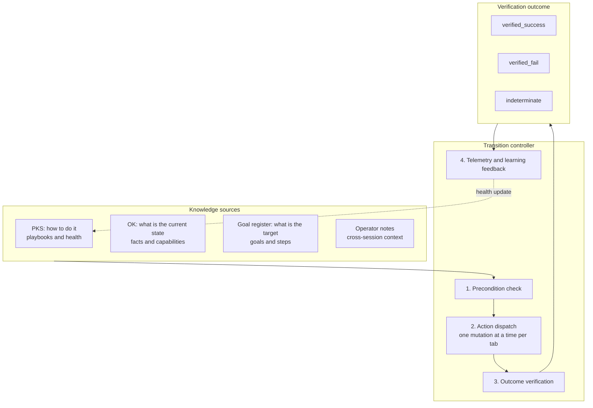

# Closed-Loop System (CLS) & Ambient Auto-Apply

> [!NOTE]
> The Closed-Loop System (CLS) of Nova AI Workspace treats an agent action as a state transition that is checked afterwards, instead of an open-loop "click dispatched, hope it worked". **Ambient Auto-Apply** builds on it: Nova can handle known, low-risk blockers such as cookie banners with verified PKS playbooks while an agent navigates.

---

## 1. Start with an action: closing a blocking modal

An agent clicks a modal's close button. The click may be dispatched successfully while the modal remains in place, another overlay appears, or the expected page transition never happens. Continuing as if the blocker had gone would make the next steps unreliable.

With a transition contract, the agent states what should hold before the action and what should change afterwards. For this example, the contract can require the modal to be absent after the click. Nova executes the action, checks the specified outcome within its time window, and reports the verification result.

The distinction is between **an action being dispatched** and **its intended effect being checked**. A check for an absent modal establishes that condition; it does not automatically establish every other aspect of page usability. The contract must express the outcome the task actually needs.

**CLS** closes the loop: every guarded action follows the cycle **expectation → execution → verification → reaction**.

### Four systems, different responsibilities

**[TOB](tob.md)** records execution evidence. **[ALP](learning-pipeline-alp.md)** evaluates learning evidence and trust. **[PKS](pks.md)** stores procedural knowledge. **CLS** uses checked state transitions when applying actions and learned playbooks. New outcomes feed back into that learning loop.

A PKS match supplies a possible way to act; it does not establish that the action worked on today's page. CLS provides the outcome check. Authorization and awareness gates still govern whether the action may run.

---

## 2. The Closed Control Loop

Agents describe the expected outcome with a `transitionContract` on interactive tools such as `nova.click_selector` (preconditions, postconditions, retry policy). The result reports `verificationStatus` (`verified_success`, `verified_fail`, `indeterminate`, or `skipped`) and retry advice. The guarded tools (`nova.guarded_send_message`, `nova.guarded_submit_form`, `nova.guarded_login`, and others) add a matching contract automatically.

| Result | How to interpret it |
| :--- | :--- |
| `verified_success` | The specified success conditions were satisfied. |
| `verified_fail` | Verification detected an explicit failure condition. |
| `indeterminate` | The available checks did not establish success or an explicit failure; a timeout or ambiguous state is not a success. |
| `skipped` | Verification was not performed; this is not verified success. |

Verification is only as broad as the contract and the observable signals. Retry advice helps the agent choose a next step; it does not authorize repeating a consequential action blindly.

*Guiding Principle:* **Dynamic knowledge, static guardrails.** Selectors, fingerprints and health data are learned; the authorization policy is fixed in code.

---

## 3. Ambient Auto-Apply

Beyond explicit agent commands, Nova can apply known PKS playbooks on its own:
* **When it runs:** On page loads and route changes that an agent's navigation request caused, and at the agent's `nova.perceive` calls. Ordinary browsing by the user does not trigger it.
* **What qualifies:** Only active (L2) phenomena with a healthy record whose last confirmation is less than 60 days old. Login and transactional actions (submit, send, checkout, payment and similar) are never auto-applied.
* **Confirmation:** By default Nova asks before each ambient application ("always ask"); this can be changed to once per session or never ask, or the feature can be turned off.
* **Self-protection:** A playbook whose success rate drops below 80% is put under watch. Under watch, 3 consecutive failures, a success rate below 60%, or a severe misfire quarantine it; a quarantined playbook without verified recovery is deprecated after 14 days.

For example, a learned cookie-rejection playbook can clear a familiar blocker during an agent's navigation, but only if it meets the ambient eligibility, consent-policy and confirmation rules. A login wall may also be recognized by PKS; that does not make signing in an ambient action.

**Trusted knowledge and permission to apply it automatically are separate decisions.** The ambient watch/quarantine lifecycle also complements PKS promotion and demotion; its thresholds serve a different decision and should not be read as replacements for the [PKS trust gates](pks.md#5-why-knowledge-needs-trust-levels).

---

## 4. Operational Benefits

1. **Explicit Outcomes:** A guarded action reports whether its effect was verified, not only that it was dispatched.
2. **Early Failure Detection:** A failed postcondition is reported in the tool result instead of surfacing several steps later.
3. **Knowledge That Corrects Itself:** If a learned selector breaks after a site redesign, failures demote and eventually deprecate the phenomenon, so agents stop relying on it.

---

## 5. MCP Tooling

Agents use CLS capabilities through these MCP tools:

* **Defining Goals:**
  * `nova.goal_register`: Creates, queries, closes and annotates closed-loop goals; Nova advances the steps.
* **Executing Sequences & Playbooks:**
  * `nova.run_sequence`: Executes a sequence of navigation, click, type and wait steps in a single call.
  * `nova.phenomenon_apply`: Runs a stored PKS playbook and reports the outcome automatically.
* **Feedback & Learning:**
  * `nova.telemetry_report`: Records the outcome of a playbook execution to update its health record.
  * `nova.revalidate`: Re-checks DOM-only whether learned selectors still exist on the live page.

---

## 6. Implementation notes

| Component | Responsibility |
| :--- | :--- |
| **`AutoApplyController`** | Ambient auto-apply decisions: eligibility, risk class, and health state of a playbook. |
| **`TransitionVerifier`** | Checks after an action whether the expected outcome occurred within the time window. |
| **`ActionCoordinator`** | Serializes mutating actions on a tab so they do not overlap. |
| **`ScopedSemanticFactKey`** | Builds fact keys scoped to a specific target and site. |

---

## Related Documentation

* **[Agent Awareness Gates (AAG)](aag.md)** — Precondition gates and tab leases.
* **[Phenomenological Knowledge Store (PKS)](pks.md)** — Procedural UI memory and learning levels.
* **[Tool Observation Bus (TOB)](tob.md)** — Server-side record of executed tool calls.
