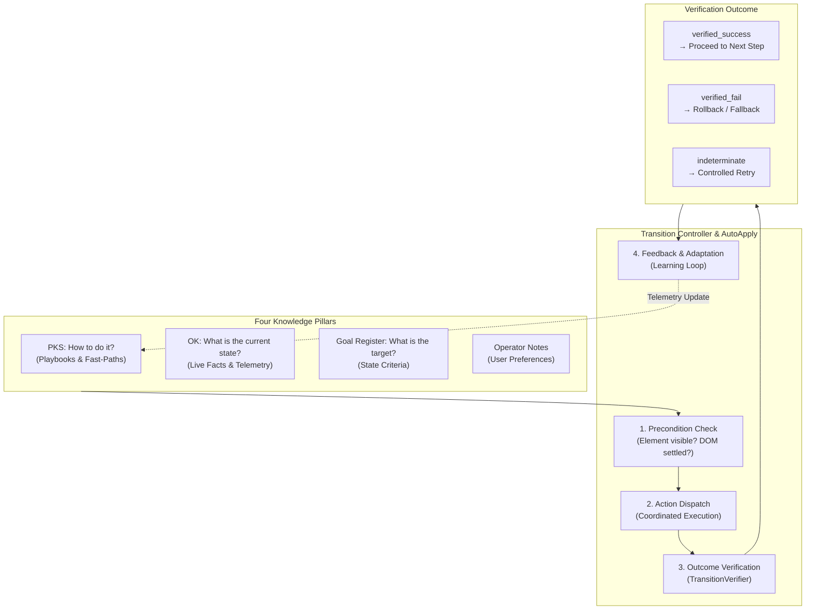

# Closed-Loop System (CLS) & Ambient Auto-Apply

> [!NOTE]
> The Closed-Loop System (CLS) of Nova AI Workspace (`AutoApply`) transforms browser automation from error-prone open-loop actions ("click dispatched, fingers crossed") into mathematically verified state transitions. In conjunction with **Ambient Auto-Apply**, Nova autonomously resolves recurring disruptions (cookie consent walls, modals, surveys) in the background.

---

## 1. Problem Statement: The Open-Loop Dilemma

Almost all traditional browser automation frameworks (Puppeteer, Playwright, Selenium, Computer Use) operate in an **open loop**:
1. **Lying Success Confirmations:** A tool reports `{ ok: true }` the instant a click event fires—not whether the form was submitted, the modal closed, or the route transitioned.
2. **Cascading Failures:** When an agent falsely assumes a step succeeded, all subsequent actions fail. The agent enters costly retry loops or hallucinates incorrect outcomes.
3. **Absence of Self-Correction:** When an action fails, the system cannot determine *why* (was the button obscured? did an API request lag? was a required field missing?).

**CLS** closes the feedback loop: Every action follows an immutable cycle: **Expectation $\rightarrow$ Execution $\rightarrow$ Verification $\rightarrow$ Feedback**.

---

## 2. The Closed Control Loop

*Guiding Principle:* **Dynamic knowledge, static guardrails.** — Selectors and behavioral patterns are learned dynamically, while safety policies and verification rules remain immutable in code.

---

## 3. Ambient Auto-Apply: Autonomous Background Healing

Beyond interactive agent commands, Nova features **Ambient Auto-Apply**:
* **Background Blocker Clearance:** When a page loads, if Nova detects a known blocking pattern (e.g. OneTrust or Cookiebot banner, welcome modal), it executes the matching verified L2 playbook from PKS **completely in the background**.
* **Zero Token Consumption:** Eliminates the need for the LLM to spend context tokens reading, reasoning about, and dismissing repetitive consent banners.
* **Safety Guardrails:**
  * **Blast-Radius Limit:** Maximum of 1 auto-apply action per navigation cycle.
  * **Hard Deny on Sensitive Routes:** Auto-apply is strictly disabled on banking, authentication, and checkout routes.
  * **Autonomy Audit Log:** Every autonomous background interaction is recorded in the system audit trail.

---

## 4. Under the Hood

| Component | Responsibility |
| :--- | :--- |
| **`AutoApplyController`** | Main controller for ambient actions: Scans DOM signals, matches L2 playbooks, and executes safe transitions. |
| **`TransitionVerifier`** | Verifies that expected DOM mutations (e.g. element removal, route change) actually occurred. |
| **`ScopedSemanticFactKey`** | Typed mapping of learned state facts to specific sandboxes and domains. |

---

## 5. MCP Tooling

Agents leverage CLS capabilities through coordinated MCP tool calls:

* **Defining Goals & Expectations:**
  * `nova.goal_register`: Registers the primary session goal and completion verification criteria.
* **Executing Sequences & Playbooks:**
  * `nova.run_sequence`: Dispatches an atomic chain of steps with automated closed-loop verification per step.
  * `nova.phenomenon_apply`: Executes a learned PKS phenomenon and verifies the outcome against live DOM state.
* **Feedback & Learning:**
  * `nova.learn_feedback`: Transmits success or failure signals to update phenomenon trust scores in PKS.
  * `nova.revalidate`: Forces the system to re-verify stale or suspect pattern assumptions against live markup.

---

## 6. Operational Reliability Benefits

1. **Deterministic Execution:** No more silent form submission hangs or frozen UI states.
2. **Sub-Second Failure Detection:** Failures are detected and returned within milliseconds—avoiding 30-second LLM timeout loops.
3. **Continuous Self-Healing:** If a learned selector breaks after a site redesign, the phenomenon is automatically degraded (`Auto-Deprecation`), allowing the agent to gracefully fall back to semantic exploration.

---

## Related Documentation

* **[Agent Awareness Gates (AAG)](aag.md)** — Pre-execution safety and multi-agent lease locking.
* **[Phenomenological Knowledge Store (PKS)](pks.md)** — Procedural UI memory and continuous learning.
* **[Tool Observation Bus (TOB)](tob.md)** — Server-side evidence ledger and tamper-proof visit windows.
