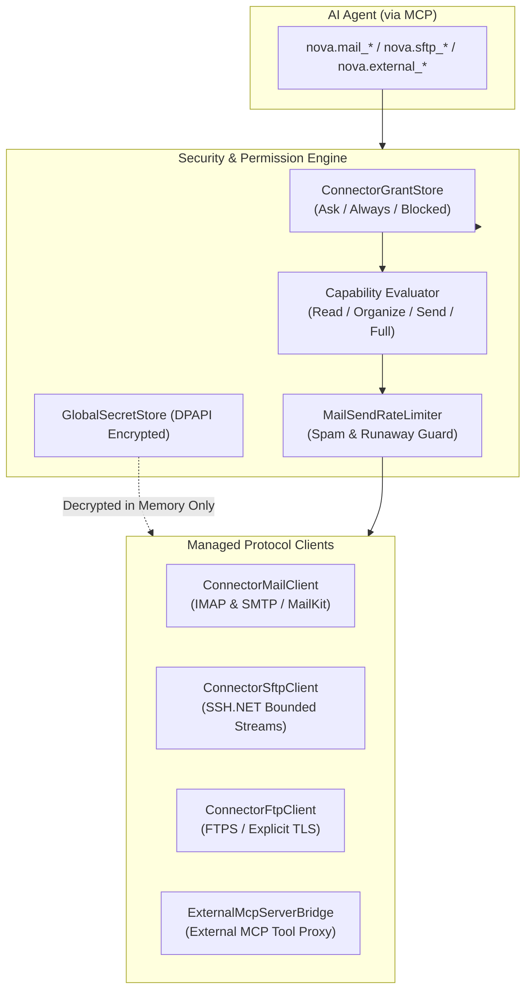

# Connectors & External Protocol Gateways

> [!NOTE]
> Nova AI Workspace's connectors engine (`NovaBrowser.Core.Connectors`) provides secure, audited interfaces to external protocols and servers: email (IMAP/SMTP), file transfer (SFTP/FTP), and external MCP server aggregation — backed by strict secret separation (SecretRef) and fine-grained capability permissions.

---

## 1. Problem Statement & Motivation

Autonomous agents frequently need to interact with existing enterprise infrastructure:
1. **Secret Leak Hazards:** When credentials (passwords, private keys, API tokens) are passed in prompts or plain-text configurations, they inevitably leak into LLM context windows or external cloud logs.
2. **Unbounded Write Permissions:** An agent tasked solely with reading customer inquiries must never possess unrestrained rights to blast emails to arbitrary third parties or purge production mailboxes.
3. **Protocol Fragility:** Ad-hoc Python scripts or shell wrappers routinely fail due to timeouts, socket keep-alive drops, or interrupted binary file transfers.

**Nova AI Workspace** eliminates these failure modes with managed, strongly typed connectors featuring **capability-based authorization**, full **secret isolation**, and **immutable audit logging**.

---

## 2. Architecture & Access Control

---

## 3. The Secret-Reference Pattern (SecretRef)

A core security tenet of Nova: **Connector profiles never contain plain-text passwords or keys on disk or across MCP boundaries.**
* **Reference over Value:** In a connector profile (`ConnectorProfileStore.cs`), only the symbolic secret identifier is stored (e.g., `secretRef: "prod-mail-pw"`).
* **Just-In-Time In-Memory Resolution:** The Nova host resolves the secret at the exact moment of connection establishment via the DPAPI-encrypted `GlobalSecretStore`.
* **Zero MCP Exposure:** Agents cannot retrieve passwords through `connector_list` or any introspection tool.

---

## 4. Core Codebase Components

| Component | Source File | Responsibility |
| :--- | :--- | :--- |
| **`ConnectorModel`** | `NovaBrowser/Core/Connectors/ConnectorModel.cs` | Domain models for Mail, SFTP, and FTP profiles, transport security definitions, and capability enums. |
| **`ConnectorMailClient`** | `NovaBrowser/Core/Connectors/ConnectorMailClient.cs` | Resilient IMAP/SMTP client managing folder trees, threading, structured parsing, and sanitized sending workflows. |
| **`MailBackupService`** | `NovaBrowser/Core/Connectors/MailBackupService.cs` | Full offline mailbox backups into standards-compliant EML archives with resume checkpoints. |
| **`ConnectorSftpClient`** | `NovaBrowser/Core/Connectors/ConnectorSftpClient.cs` | Managed SFTP connections with private-key authentication, bounded streams, and strict path-traversal prevention. |
| **`MailSendRateLimiter`** | `NovaBrowser/Core/Connectors/MailSendRateLimiter.cs` | Guards against email storms and unbounded automated sending loops. |
| **`MailAttachmentFilePolicy`** | `NovaBrowser/Core/Connectors/MailAttachmentFilePolicy.cs` | Enforces file extension and MIME type allowlists to prevent malware execution or malicious script downloads. |

---

## 5. MCP Tool Matrix

Agents interact with external protocols through dedicated tool suites:

* **Email Workflows (`nova.mail_*`):**
  * `nova.mail_folders`: Lists mailbox folders (Inbox, Sent, Drafts, Archive) with message counters.
  * `nova.mail_list`: Searches and paginates messages by criteria (date range, sender, subject, unread status).
  * `nova.mail_read`: Fetches clean message bodies (sanitized text, safe HTML, metadata).
  * `nova.mail_draft_create` / `nova.mail_send`: Drafts or dispatches messages subject to `MailSendRateLimiter` and `MailRecipientPolicy`.
  * `nova.mail_attachment_save`: Saves email attachments locally following file security policies.
  * `nova.mail_export_eml`: Exports messages as RFC-compliant `.eml` files for audit archiving.
  * `nova.mail_backup_start` / `status` / `stop`: Manages incremental background mailbox backups.
* **File Transfer (`nova.sftp_*` & `nova.ftp_*`):**
  * `nova.sftp_list` / `ftp_list`: Lists directories on remote hosts.
  * `nova.sftp_get` / `ftp_get`: Downloads files with bounded stream limits and resume capability.
  * `nova.sftp_put` / `ftp_put`: Uploads local files securely to remote endpoints.
  * `nova.sftp_rename` / `delete`: Renames or deletes remote files under verified permissions.
* **Connector & Authorization Management:**
  * `nova.connector_list`: Lists configured connection profiles and active authorization states.
  * `nova.connector_create` / `update` / `delete`: Manages connection configuration profiles.
  * `nova.connector_grant_set`: Assigns permission levels (`Ask`, `Always`, `Blocked`) for specific operations.
* **External MCP Server Aggregation (`nova.external_*`):**
  * `nova.external_servers`: Lists registered third-party MCP servers.
  * `nova.external_tools`: Seamlessly aggregates third-party tools into Nova's tool discovery catalog.
  * `nova.external_tool_call`: Safely routes tool invocations to external MCP servers.

---

## 6. Security & Policy Enforcement

1. **Granular Capability Tiers:**
   * `MailRead`: Read-only access to message bodies and metadata.
   * `MailOrganize`: Marking flags, moving messages, or sending items to trash.
   * `MailSend`: Active outbound transmission via SMTP.
   * `SftpRead`: Read-only downloading of files and directories.
   * `SftpFull`: Read, write, and deletion privileges.
2. **Recipient Allowlisting (`MailRecipientPolicy`):** Restricts outbound emails to pre-approved domain allowlists to prevent accidental leakage to unintended recipients.
3. **Strict Path-Traversal Protection:** SFTP and FTP paths are canonicalized (`Path.GetFullPath`) against target directory roots to defeat `../../` breakout attempts.
