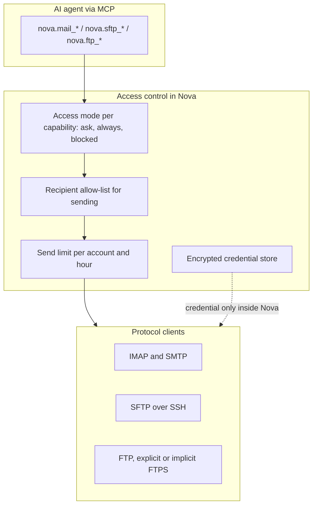

# Connectors & External Protocol Gateways

> [!NOTE]
> Nova AI Workspace's connectors give agents controlled access to e-mail (IMAP for reading, SMTP for sending) and file transfer (SFTP, FTP and FTPS). Passwords and key passphrases are stored encrypted and are never returned to an agent; every capability has its own access mode. Separately, Nova can register and call external MCP servers.

---

## 1. Problem Statement & Motivation

Autonomous agents frequently need to interact with existing infrastructure:
1. **Secret Leak Hazards:** When credentials are passed in prompts or plain-text configurations, they end up in the model's context and in logs.
2. **Unbounded Write Permissions:** An agent tasked with reading customer inquiries should not automatically be able to send mail to arbitrary recipients or delete files on a server.
3. **Protocol Fragility:** Ad-hoc scripts fail on timeouts, certificate problems or interrupted transfers, and nobody sees what they did.

Nova handles the connection itself, keeps the credential on its side, and asks the user — or applies the user's standing decision — before each kind of access.

---

## 2. Architecture & Access Control

---

## 3. Credentials Stay in Nova

* **Write-only secrets:** A password or key passphrase is passed once (in Settings or with `nova.connector_create` / `nova.connector_update`) and stored encrypted with Windows DPAPI. The connection profile only holds a reference to it. No tool returns it — `nova.connector_list` shows the profile without the secret.
* **Copy from the Vault:** Instead of a password, `passwordFromVault` takes the id of a saved login from the [Vault](vault-and-secrets.md). Nova copies the password internally after the user confirms it in a dialog; the agent never sees it.
* **SSH keys:** For SFTP with `authMode='private_key'`, Nova stores the path to an existing private key file and an optional passphrase; both are write-only.
* **SSH host keys:** Nova connects to an SFTP server only when its host key is trusted. Trust is given by a person in Settings ("Confirm this SSH host"), after comparing the shown fingerprint; agents cannot add or replace host keys. A changed key is reported as "SSH host key changed".

---

## 4. Supported Protocols

| Connector type | Protocol | Transport security | Default port |
| :--- | :--- | :--- | :--- |
| `mail` | IMAP (reading, organizing, backup) and SMTP (sending) | `auto` (requires TLS), `ssl_on_connect`, `start_tls`; `none` only as a debug option | IMAP 993, SMTP 587 |
| `sftp` | SFTP over SSH | SSH (`auto` only) | 22 |
| `ftp` | FTP / FTPS | `auto` or `start_tls` = explicit FTPS, `ssl_on_connect` = implicit FTPS, `none` = plain FTP; `auto` never downgrades | 21 |

Unencrypted connections and accepting an invalid mail-server certificate are off by default. They need the option "Allow insecure mail and FTP connections for debugging" in Settings **and** `allowInsecure=true` on every affected tool call.

Running commands over SSH is not part of the connectors; the SFTP connector transfers files only.

---

## 5. MCP Tool Matrix

All connector tools are in the `connector_ops` bundle.

* **E-mail (`nova.mail_*`):**
  * `nova.mail_folders`, `nova.mail_folder_create`: List folders, create a folder.
  * `nova.mail_list`, `nova.mail_search`: List messages of a folder (up to 200 per call, with cursors) and search with IMAP filters.
  * `nova.mail_read`: Read a message.
  * `nova.mail_mark`, `nova.mail_move`, `nova.mail_delete`: Change flags, move or delete messages.
  * `nova.mail_draft_create`, `nova.mail_send`: Create a draft or send a mail — up to 20 recipients each in To, Cc and Bcc (50 in total), up to 20 attachments with 25 MB in total, optional HTML body, signature, priority, read-receipt request and threaded replies.
  * `nova.mail_attachment_save`: Save an attachment locally.
  * `nova.mail_export_eml`: Export one message as `.eml` or several (up to 200) as `.zip`; existing files are never overwritten.
  * `nova.mail_backup_start`, `nova.mail_backup_status`, `nova.mail_backup_stop`: Back up a mailbox in the background as local ZIP part files. The resume point survives a Nova restart, so `incremental` continues where the last backup stopped.
* **File transfer (`nova.sftp_*`, `nova.ftp_*`):**
  * `nova.sftp_list` / `nova.ftp_list`: List a remote directory.
  * `nova.sftp_get` / `nova.ftp_get`: Download. SFTP also transfers whole directories with `recursive=true` (up to 500 entries); FTP transfers single files. At most 1 GiB per call.
  * `nova.sftp_put` / `nova.ftp_put`: Upload, with the same limits.
  * `nova.sftp_rename`, `nova.sftp_delete`, `nova.ftp_rename`, `nova.ftp_delete`: Rename or delete remote files.
* **Connections and access:**
  * `nova.connector_list`: Lists connections and their access modes.
  * `nova.connector_create`, `nova.connector_update`, `nova.connector_delete`: Manage connections.
  * `nova.connector_grant_set`: Sets the access mode for one capability.
  * `nova.connector_recipient_set`: Replaces the recipient allow-list of a mail account.

Local files for downloads, uploads and attachments must lie inside the Downloads folder or the current workspace project folder.

---

## 6. Security & Policy Enforcement

1. **Capabilities and access modes:** Mail connections have the capabilities `read`, `organize` and `send`; SFTP and FTP connections have `read` and `full`. Each capability is set to `ask` (prompt every time), `always` or `blocked`, globally or for one workspace. An `always` grant for mail reading can be limited to specific folders and senders.
2. **Recipient allow-list:** Recipients — addresses or whole domains — on the account's allow-list can be sent to directly; every other recipient needs the user's approval in a prompt.
3. **Send limit:** By default an account sends at most 20 mails per hour (rolling window, counted per workspace). Above that, `nova.mail_send` is refused and tells the agent when it can send again.
4. **Unattended runs fail closed:** In scheduled tasks, or with `unattended=true`, a call that would need a prompt is refused instead of waiting for a person.
5. **Risky attachments:** Attachment file names are sanitized. Executable-looking attachments are saved with an added `.isolated` extension so they cannot be launched by a double-click (a separate development option can turn this off); Nova never opens or runs them.
6. **Bounded transfers:** Byte and file limits are enforced on the transfer streams themselves, not only checked beforehand.

---

## 7. External MCP Servers

Nova can also register other MCP servers and call their tools (bundle `external_mcp`):

* `nova.external_server_add`, `nova.external_server_update`, `nova.external_server_remove`, `nova.external_server_import`: Register servers with `stdio`, `http` (Streamable HTTP) or `sse` transport, or import definitions from Claude Desktop, VS Code, Claude Code or JSON config files.
* `nova.external_server_start`, `nova.external_server_stop`, `nova.external_server_logs`: Start a stdio server (Nova runs the process), stop it, read its recent error output.
* `nova.external_servers`, `nova.external_tools`: List registered servers and the tools a server offers.
* `nova.external_tool_call`: Call a tool on an external server.
