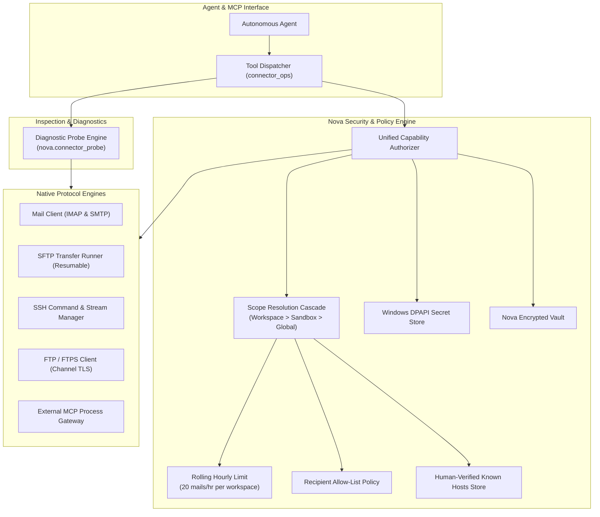
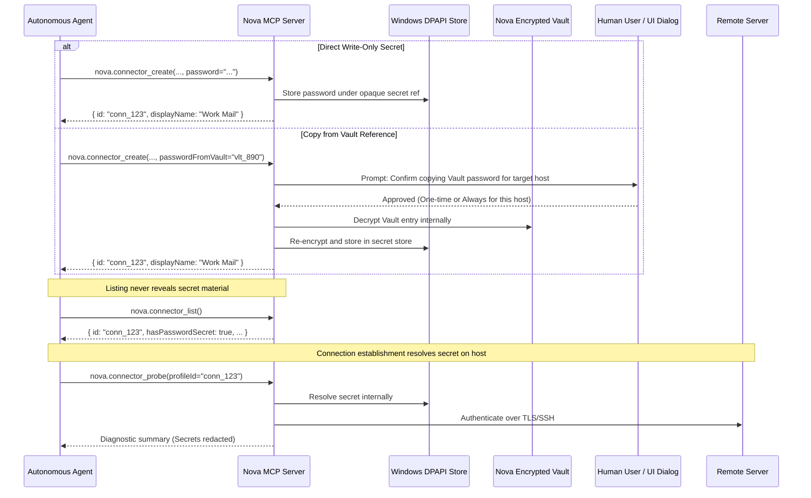
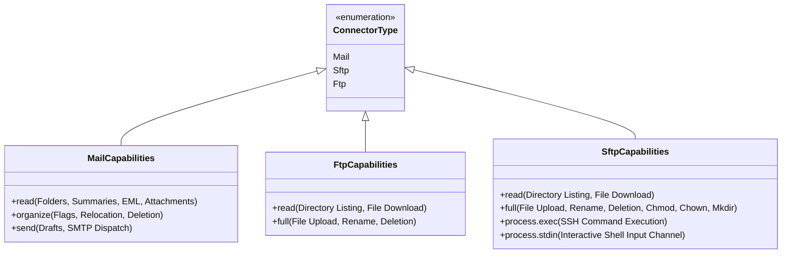
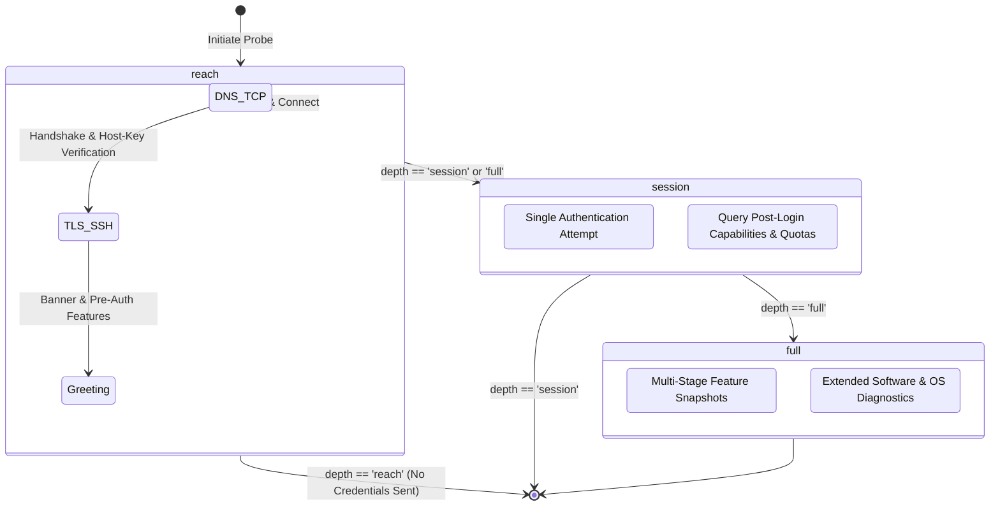

# Connectors Architecture & Security

Connectors represent authenticated remote communication channels managed natively by Nova. They enable autonomous agents to interact with mailboxes (IMAP/SMTP), remote file systems (SFTP/FTP), shell environments (SSH), and external Model Context Protocol (MCP) services while keeping credentials strictly isolated on the host.

Nova's connector subsystem is governed by a unified security model that decouples credential ownership from agent operations. Credentials are stored write-only via Windows Data Protection API (DPAPI) or resolved dynamically from Nova's encrypted Vault. Access control is enforced through multi-tiered capability grants, workspace boundaries, send limits, and non-destructive diagnostic probes.

---

## Connector Subsystems

| Subsystem | Underlying Protocols | Primary Capabilities | Core Operations |
| :--- | :--- | :--- | :--- |
| **[Mail: IMAP & SMTP](mail/README.md)** | IMAP (RFC 3501) & SMTP (RFC 5321) | `read`, `organize`, `send` | Message search, reading, tagging, drafting, sending, `.eml` exports, background mailbox archiving |
| **[Secure Shell (SSH)](ssh/README.md)** | SSH-2 (RFC 4251-4254) | `process.exec`, `process.stdin` | Batch command execution, background long-running sessions, interactive stdin streaming, stream capture |
| **[SSH File Transfer (SFTP)](sftp/README.md)** | SFTP over SSH-2 | `read`, `full` | Directory synchronization, resumable uploads/downloads, atomic commit recovery, parallel acceleration |
| **[FTP & FTPS](ftp-and-ftps/README.md)** | FTP (RFC 959) & FTPS (RFC 4217) | `read`, `full` | Directory listing, explicit/implicit TLS transfers, passive mode negotiation, resumable single-file jobs |
| **[External MCP Servers](external-mcp/README.md)** | stdio, Streamable HTTP, SSE | Aggregated tools | Subprocess orchestration, configuration import (Claude/VS Code), token authentication, tool call proxying |

---

## Credential Storage & Secret Isolation

Nova implements a strict zero-leakage security posture for connection credentials. Agents utilize remote services without ever having access to raw passwords, SSH private keys, or passphrases:

### Key Security Invariants

1. **Write-Only Storage:** Passwords, passphrases, and private key paths are ingested once via `nova.connector_create` or `nova.connector_update` and encrypted using Windows DPAPI. Profiles hold only opaque reference keys.
2. **Metadata Projection Sanitization:** The profile metadata record exposed via `nova.connector_list` strips all secret values. It exposes boolean presence indicators (`hasPasswordSecret`, `hasPrivateKey`, `hasKeyPassphrase`) rather than raw credentials.
3. **Vault Integration (`passwordFromVault`):** Instead of passing raw credentials in plain text over JSON-RPC, an agent can supply a Vault entry identifier obtained from `nova.vault_list`. Nova resolves the password internally. To prevent cross-origin credential harvesting, Nova triggers an interactive confirmation dialog displaying the Vault entry alongside the target host names. Users can grant an "Always" decision for that specific login-host pair, enabling subsequent unattended runs.
4. **SSH Host-Key Verification Gate:** All SSH and SFTP connections require prior host-key verification. When a connection is initiated to an unknown host or if the host key changes, Nova halts the connection attempt before sending any authentication credentials. Host keys must be reviewed and confirmed by a human operator in Nova Settings. Agents cannot confirm or modify host keys.

---

## Unified Capability & Grant Architecture

Permissions are evaluated dynamically through a multi-dimensional capability model across three grant modes and three hierarchical scopes.

### Grant Modes

* **`ask` (Default):** Interactive mode. Prompts the human operator for confirmation upon the first use within a session. In unattended or scheduled task contexts (`unattended=true`), calls requiring an `ask` confirmation fail closed immediately with error code `-32033` (`connector_approval_required`).
* **`always`:** Autonomous execution permitted. Bypasses interactive prompts for that specific capability. For mail read operations, an `always` grant can be further constrained by explicit folder and sender allow-lists.
* **`blocked`:** Explicit administrative block. Any attempt to invoke the capability is rejected immediately.

### Scope Resolution Hierarchy

When an agent requests a capability, Nova resolves grants using a strictest-context-first rule:

$$\text{Active Grant} = \text{Lookup}(\text{Workspace}) \succ \text{Lookup}(\text{Sandbox}) \succ \text{Lookup}(\text{Global}) \succ \text{Default}(\text{ask})$$

1. **Workspace Scope:** Bound to Nova's host-verified terminal or scheduled task workspace directory. A grant configured at workspace level overrides broader sandbox and global rules (e.g., an account can be set to `always` in the accounting project workspace but remain `blocked` elsewhere). Workspace context is validated via host-issued signed tokens; caller-supplied context IDs are rejected.
2. **Sandbox Scope:** Bound to an isolated browsing profile container (`A`, `B`, etc.).
3. **Global Scope:** System-wide baseline applied when no workspace or sandbox grant exists.

### Type-Specific Capabilities

* **Mail Stages:**
  - `read`: Listing folders, querying message metadata, reading message bodies and attachments.
  - `organize`: Setting message flags (`Seen`, `Flagged`), moving messages between folders, deleting messages.
  - `send`: Creating drafts and transmitting messages via SMTP.
* **FTP Stages:**
  - `read`: Directory inspection and downloading files.
  - `full`: Uploading files, renaming, and deleting remote files.
* **SFTP Stages:**
  - `read`: Listing directories and downloading files.
  - `full`: Uploads, deletions, directory creation, symbolic link management, and permission changes (`chmod`, `chown`).
  - `process.exec`: Spawning one-shot commands or background SSH sessions. Automatically inherits the `full` grant if not explicitly defined.
  - `process.stdin`: Streaming interactive standard input into an active SSH session (`nova.ssh_run_write`). This capability is strictly opt-in and **never** inherits weaker grants.

---

## Diagnostic Probe Engine (`nova.connector_probe`)

The diagnostic probe engine allows agents and developers to inspect remote infrastructure without mutating remote state. It separates verifiable evidence from client-side inferences.

### Depth Levels

1. **`reach` (Default):**
   - Transmits **zero credentials**.
   - Executes DNS resolution, TCP connection, TLS handshake (or SSH transport layer and host-key exchange), captures server banner, and reads pre-authentication capabilities.
   - Ideal for health checks, TLS inspection, and reachability tests without risk of account lockout.
2. **`session`:**
   - Performs all `reach` actions, then executes **exactly one** authentication attempt per service (up to two for Mail: IMAP and SMTP).
   - If authentication succeeds, queries read-only system facts (e.g., IMAP namespaces, storage quotas, SFTP file system statistics via `statvfs`).
   - If authentication fails, it never retries, preventing fail2ban triggers.
3. **`full`:**
   - Opens the exact same network connections as `session` without additional aggressiveness.
   - Gathers multi-stage protocol snapshots (`preTls`, `postTls`, `postAuth`) and deep software version metadata.

### Truth Model & Capability States

Every reported capability item is tagged with a provenance state and source:

* `advertised`: The remote server explicitly claimed support (e.g., in IMAP `CAPABILITY` or FTP `FEAT`).
* `inferred`: Deduced by protocol analysis heuristics.
* `observed`: Witnessed directly during wire exchange.
* `verified`: Cryptographically or functionally validated by Nova.
* `notTested`: The capability was not evaluated during this probe (never collapsed into `unsupported`).
* `blockedByPolicy`: Supported remotely but suppressed by local security policy.

### Probe Safeguards

* **Rate Limiting & Result Caching:** Probes executed with identical arguments within 30 seconds return cached results (`cached: true`).
* **Authentication Lockout:** Following an `auth_failed` result, subsequent login probes for that profile are locked out for 60 seconds (`-32029` with `retryAfterMs`), requiring human credential verification before retrying.
* **Redacted Protocol Transcript:** When requested via `includeTranscript=true`, wire exchanges undergo two-tier redaction: credentials, tokens, personal identifiers, and mailbox folder names are stripped. All server responses are explicitly tagged as `untrusted_remote`.
* **Zero Side Effects:** Remote file writes, flag mutations, message retrievals, and mail sending are structurally disabled (`sideEffects.writes = 0`).

---

## Security Policies & Boundary Enforcement

1. **Rolling Hourly Send Limit:** Mail accounts are restricted to transmitting at most 20 messages per rolling 60-minute window per workspace. Exceeding this budget triggers an automatic hold with an explicit cooldown timer.
2. **Recipient Allow-Lists (`AllowedRecipients`):** Mail accounts support an allow-list of authorized destination addresses (e.g., `accounting@domain.com`) and wildcard domain patterns (e.g., `domain.com` or `@domain.com`). Sending to unlisted recipients requires explicit user confirmation.
3. **Local Filesystem Sandboxing:** File transfers, attachment downloads, and export operations are restricted to the local `Downloads` directory or the current workspace root directory. Path traversal attempts (`../`) are blocked before execution.
4. **Dangerous Attachment Isolation:** Attachments matching executable extensions (`.exe`, `.bat`, `.cmd`, `.ps1`, `.vbs`, `.js`, etc.) are quarantined upon download with an added `.isolated` file extension, preventing accidental shell execution.
5. **Insecure Connection Guard:** Plaintext transport (`security='none'`) or invalid TLS certificate exceptions require both the global user setting ("Allow insecure mail and FTP connections for debugging") and explicit per-call opt-in (`allowInsecure=true`).

---

## MCP Tool Catalog (`connector_ops`)

| Tool | Purpose | Key Parameters |
| :--- | :--- | :--- |
| [`nova.connector_list`](../../mcp-reference/tools/connectors-and-mail/nova-connector-list.md) | Lists configured accounts and resolved capability grants | `type` (optional: `mail`, `sftp`, `ftp`) |
| [`nova.connector_create`](../../mcp-reference/tools/connectors-and-mail/nova-connector-create.md) | Registers a new mail account or server connection | `displayName`, `type`, `username`, `password`, `passwordFromVault`, `authMode`, `privateKeyPath`, `host`, `port`, `security` |
| [`nova.connector_update`](../../mcp-reference/tools/connectors-and-mail/nova-connector-update.md) | Updates existing connection endpoints or credentials | `id`, updated configuration fields, `allowInsecure` |
| [`nova.connector_delete`](../../mcp-reference/tools/connectors-and-mail/nova-connector-delete.md) | Removes a connector profile and cleans up orphan secrets | `id` |
| [`nova.connector_grant_set`](../../mcp-reference/tools/connectors-and-mail/nova-connector-grant-set.md) | Sets access mode (`ask`, `always`, `blocked`) for a capability | `profileId`, `capability`, `mode`, `scope`, `allowedMailFolders`, `allowedMailSenders` |
| [`nova.connector_recipient_set`](../../mcp-reference/tools/connectors-and-mail/nova-connector-recipient-set.md) | Replaces the allowed recipient list for a mail account | `profileId`, `recipients` |
| [`nova.connector_probe`](../../mcp-reference/tools/connectors-and-mail/nova-connector-probe.md) | Performs non-destructive network & capability diagnostics | `profileId`, `depth` (`reach`, `session`, `full`), `includeTranscript`, `allowInsecure` |

---

## Detailed Protocol Guides

* **[Mail Architecture (IMAP & SMTP)](mail/README.md)**: Deep dive into mailbox navigation, search cursors, compose constraints, and encrypted local backup storage.
* **[Secure Shell (SSH) Execution](ssh/README.md)**: Detailed mechanics of one-shot commands, interactive stdin streaming, stream capture, and process exit analysis.
* **[SSH File Transfer Protocol (SFTP)](sftp/README.md)**: Resumable transfer engine, prefix window validation, atomic commit recovery, and parallel file transfers.
* **[FTP & FTPS Architecture](ftp-and-ftps/README.md)**: Transport security modes, control vs. data channel encryption, and passive transfer negotiation.
* **[External MCP Server Orchestration](external-mcp/README.md)**: Managing child processes, Streamable HTTP/SSE endpoints, configuration import, and proxied tool calls.

---

[All core features](../README.md) · [Privacy and Vault](../privacy/vault-and-secrets/README.md) · [Alpha limitations](../../../ALPHA.md)
