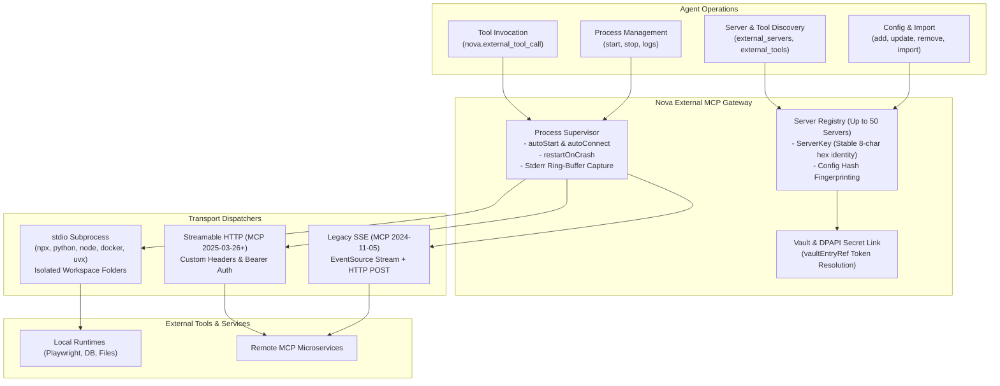
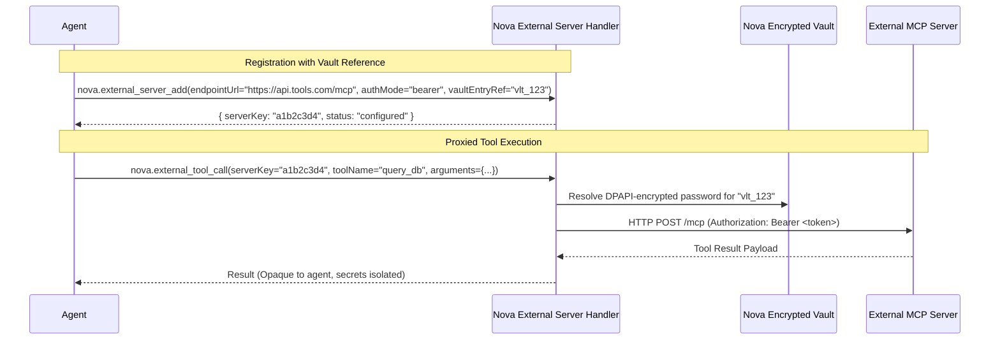
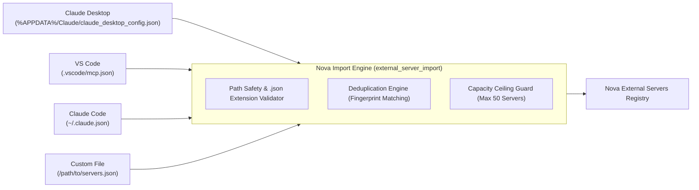

# External Model Context Protocol (MCP) Server Orchestration

Nova acts as an intelligent MCP client and aggregation gateway, enabling autonomous agents to integrate third-party tools, local developer environments, and remote services through a unified interface. Registered external MCP servers are managed via the `external_mcp` tool bundle, featuring multi-transport support, configuration import from existing developer tools, Windows DPAPI secret protection, crash recovery, and proxied tool execution.

---

## Transport Protocols & Process Lifecycle

External servers communicate through three standardized transport protocols:

| Transport | Implementation & Lifecycle | Use Cases | Configuration Parameters |
| :--- | :--- | :--- | :--- |
| **`stdio`** | Nova spawns and manages a local child process. Streams input/output via standard pipes. Stderr is captured continuously for diagnostics. | Local developer tools, CLI utilities (`npx`, `python`, `node`, `uvx`, `docker`). | `command`, `args`, `cwd`, `env` |
| **`http`** | Streamable HTTP transport based on the modern MCP specification (2025-03-26+). Uses persistent HTTP sessions with streaming response support. | Remote cloud MCP services, containerized microservices. | `endpointUrl`, `headers`, `authMode`, `bearerToken` |
| **`sse`** | Server-Sent Events transport based on legacy MCP (2024-11-05). Maintains an incoming SSE stream for server notifications and standard HTTP POST for tool calls. | Legacy MCP endpoints, bridge proxies. | `endpointUrl`, `headers`, `authMode`, `bearerToken` |

### Subprocess Supervision (`stdio`)

When managing local `stdio` subprocesses:
* **Persistent Isolated Workspaces:** If no working directory (`cwd`) is specified, Nova automatically provides an isolated, persistent working directory located under `StoragePaths.ExternalMcpWorkspacesDir`.
* **Crash Resilience (`restartOnCrash`):** When enabled, if a managed subprocess crashes unexpectedly, Nova detects process termination and restarts it automatically.
* **Startup & Request Timeouts:**
  - `startupTimeoutMs`: Timeout for initial handshake and tool discovery (5,000 ms to 120,000 ms, default: 30,000 ms).
  - `defaultRequestTimeoutMs`: Timeout for executing remote tool calls (5,000 ms to 600,000 ms, default: 120,000 ms).
* **Live Error Diagnostics:** Subprocess stderr output is buffered in an in-memory ring buffer, accessible to agents at any time via `nova.external_server_logs`.

---

## Secret Management & Vault Integration

Authentication for remote HTTP and SSE servers supports both anonymous and Bearer token authentication:

1. **Vault Reference (`vaultEntryRef`):** Rather than transmitting plain text Bearer tokens over JSON-RPC, configurations can point to a Vault entry ID. Nova decrypts the token internally using Windows DPAPI upon each connection.
2. **Config Hash Fingerprinting:** Nova computes configuration hashes to detect changes and trigger server reconnection. To prevent secret exposure, Bearer tokens are never hashed directly; Nova computes an 8-character SHA-256 fingerprint (`bearer:<fingerprint>`), ensuring secret material is never logged or exposed.

---

## 1-Click Configuration Import (`nova.external_server_import`)

Agents and users can import existing MCP server setups directly from popular IDEs and environments into Nova:

### Supported Import Sources

* **`claude_desktop`:** Automatically detects `%APPDATA%\Claude\claude_desktop_config.json`.
* **`vscode`:** Auto-detects workspace and user-level VS Code MCP configuration files.
* **`claude_code`:** Auto-detects user-level configuration at `~/.claude.json`.
* **`file`:** Imports from any arbitrary JSON configuration file specified via `filePath`.

### Import Security Guards

* **Strict Path Safety:** Paths are checked to prevent path traversal. All configuration files must have a valid `.json` extension.
* **Deduplication:** The importer compares command paths, arguments, and endpoints against existing servers to prevent duplicate registrations.
* **Capacity Cap:** Nova enforces a system limit of **50 external servers** (`MaxExternalServers = 50`). If an import payload exceeds this limit, the import finishes existing entries gracefully and reports the exact count of added items alongside the cap reason.

---

## External MCP Tool Catalog

| Tool | Purpose | Key Parameters |
| :--- | :--- | :--- |
| [`nova.external_servers`](../../../mcp-reference/tools/external-mcp/nova-external-servers.md) | Lists all configured external servers with health, runtime state, and tool counts | None |
| [`nova.external_server_add`](../../../mcp-reference/tools/external-mcp/nova-external-server-add.md) | Registers a new external server (stdio, http, or sse) | `displayName`, `transport`, `command`, `args`, `cwd`, `env`, `endpointUrl`, `authMode`, `bearerToken`, `vaultEntryRef`, `headers`, `autoStart`, `restartOnCrash` |
| [`nova.external_server_update`](../../../mcp-reference/tools/external-mcp/nova-external-server-update.md) | Modifies an existing external server configuration | `serverKey`, updated fields |
| [`nova.external_server_remove`](../../../mcp-reference/tools/external-mcp/nova-external-server-remove.md) | Removes an external server configuration | `serverKey` |
| [`nova.external_server_import`](../../../mcp-reference/tools/external-mcp/nova-external-server-import.md) | Ingests server configurations from Claude Desktop, VS Code, Claude Code, or JSON | `source`, `filePath`, `serverName`, `autoStart` |
| [`nova.external_server_start`](../../../mcp-reference/tools/external-mcp/nova-external-server-start.md) | Spawns a stdio process or connects to an HTTP/SSE external server | `serverKey` |
| [`nova.external_server_stop`](../../../mcp-reference/tools/external-mcp/nova-external-server-stop.md) | Stops a running stdio process or disconnects an external server | `serverKey` |
| [`nova.external_server_logs`](../../../mcp-reference/tools/external-mcp/nova-external-server-logs.md) | Reads recent stderr output from a managed stdio subprocess | `serverKey`, `maxLines` |
| [`nova.external_tools`](../../../mcp-reference/tools/external-mcp/nova-external-tools.md) | Lists all tools exported by a configured external server | `serverKey` |
| [`nova.external_tool_call`](../../../mcp-reference/tools/external-mcp/nova-external-tool-call.md) | Invokes a specific tool on an external MCP server | `serverKey`, `toolName`, `arguments` |

---

[Connectors overview](../README.md) · [All core features](../../README.md)
