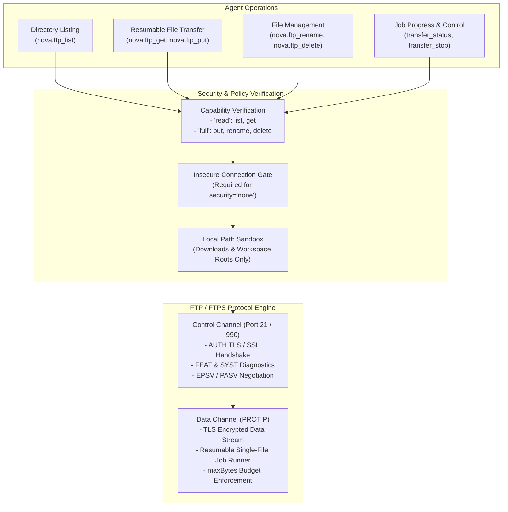
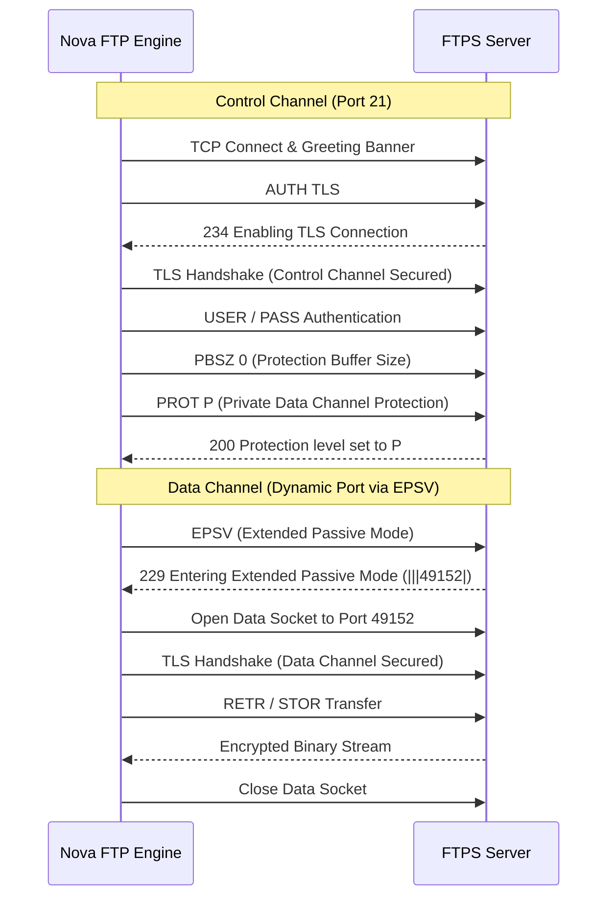

# File Transfer Protocol (FTP) & FTP over TLS (FTPS)

Nova's `ftp` connector subsystem provides file transfer capabilities over traditional File Transfer Protocol (FTP, RFC 959) and modern FTP over TLS (FTPS, RFC 4217). It supports split-channel cryptographic negotiation, passive mode NAT traversal, and single-file resumable background transfers with strict byte budgeting and filesystem sandboxing.

---

## Transport Security Modes

FTP and FTPS share the `ftp` connector type. The transport security mode must match the remote server's configuration:

| Mode | Transport Type | Standard Port | Security Characteristics |
| :--- | :--- | :--- | :--- |
| **`auto`** | Explicit FTPS (RFC 4217) | 21 | Connects in plaintext, immediately executes `AUTH TLS`, and upgrades both control and data channels to TLS. **Never downgrades to unencrypted plaintext.** |
| **`start_tls`** | Explicit FTPS | 21 | Alias for explicit FTPS. Enforces TLS handshake before login credentials are exchanged. |
| **`ssl_on_connect`** | Implicit FTPS | 990 | Initiates a direct TLS handshake on socket connect before the initial server banner is received. |
| **`none`** | Plaintext FTP | 21 | Unencrypted legacy mode. Passwords and file contents travel in clear text. Requires explicit user opt-in in Settings and `allowInsecure=true`. |

### The Insecure Connection Gate

Nova prohibits unencrypted connections by default. Attempting to create or use a connection with `security='none'` is rejected unless two conditions are met:
1. The human user has toggled on "Allow insecure mail and FTP connections for debugging" in Nova Settings.
2. The agent explicitly provides `allowInsecure=true` on the MCP tool invocation.

---

## Dual-Channel Cryptography: Control vs. Data Channels

FTP utilizes two separate TCP connections with independent security contexts:

1. **Control Channel (`AUTH TLS`):** Handles command-line exchanges, user authentication, and directory commands. In FTPS mode, credentials are never sent before TLS negotiation completes.
2. **Data Channel Protection (`PROT P`):** Handles file contents and directory listings. Nova automatically issues `PBSZ 0` followed by `PROT P` (Private) to mandate TLS encryption on all data connections. Connections negotiating unencrypted data channels (`PROT C`) are flagged as insecure.

---

## Passive Mode Negotiation & NAT Traversal

Modern firewalls and NAT routers frequently block active FTP data connections (where the server connects back to the client). Nova negotiates passive mode transfers:
* **Extended Passive Mode (`EPSV`, RFC 2428):** Preferred mode. Works seamlessly across IPv4 and IPv6 networks without leaking internal IP addresses.
* **Passive Mode (`PASV`):** Fallback mode used if the server indicates `EPSV` is unsupported.

---

## Resumable Transfers & Job Management

Unlike SFTP, which supports recursive multi-file directory transfers, FTP file operations operate on single files:

* **Background Execution:** `nova.ftp_get` and `nova.ftp_put` launch asynchronous background transfer jobs, returning a unique `jobId` when transfers exceed the immediate `wait` timeout.
* **Resumability:** An interrupted transfer can be paused via `nova.ftp_transfer_stop`. Repeating the original `nova.ftp_get` or `nova.ftp_put` invocation with the same arguments automatically locates the existing partial file and resumes transferring from the byte offset where it stopped.
* **Byte Budgets (`maxBytes`):** Callers can specify an optional `maxBytes` ceiling. If the remote file exceeds this budget, or if cumulative transferred bytes cross the threshold, the transfer aborts immediately to protect against unexpected bandwidth usage.
* **Local Filesystem Sandboxing:** All local source and destination paths must reside inside the user's `Downloads` directory or the current workspace root directory.

---

## FTP Tool Reference

| Tool | Capability Required | Description |
| :--- | :--- | :--- |
| [`nova.ftp_list`](../../../mcp-reference/tools/connectors-and-mail/nova-ftp-list.md) | `read` | Lists remote directory contents, parsing RFC 3659 MLSD or standard UNIX listings |
| [`nova.ftp_get`](../../../mcp-reference/tools/connectors-and-mail/nova-ftp-get.md) | `read` | Downloads a single file from the FTP/FTPS server as a resumable background job |
| [`nova.ftp_put`](../../../mcp-reference/tools/connectors-and-mail/nova-ftp-put.md) | `full` | Uploads a local file to the FTP/FTPS server as a resumable background job |
| [`nova.ftp_transfer_status`](../../../mcp-reference/tools/connectors-and-mail/nova-ftp-transfer-status.md) | `read` | Queries real-time progress, transferred bytes, and completion state of an active FTP job |
| [`nova.ftp_transfer_stop`](../../../mcp-reference/tools/connectors-and-mail/nova-ftp-transfer-stop.md) | `read` / `full` | Halts an in-progress transfer job, preserving partial files for later resumption |
| [`nova.ftp_rename`](../../../mcp-reference/tools/connectors-and-mail/nova-ftp-rename.md) | `full` | Renames or moves a file on the remote FTP server |
| [`nova.ftp_delete`](../../../mcp-reference/tools/connectors-and-mail/nova-ftp-delete.md) | `full` | Deletes a remote file from the FTP server |

---

[Connectors overview](../README.md) · [SFTP File Transfer](../sftp/README.md) · [All core features](../../README.md)
