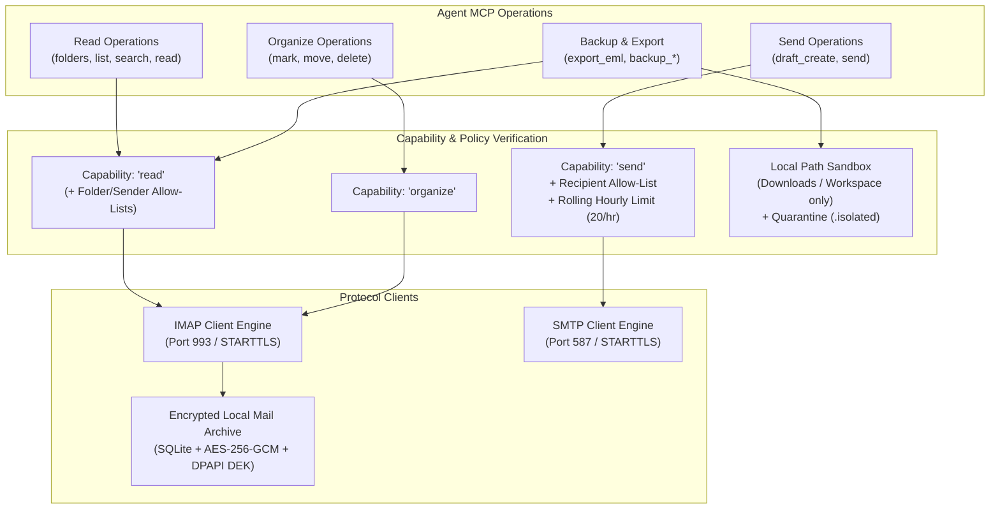
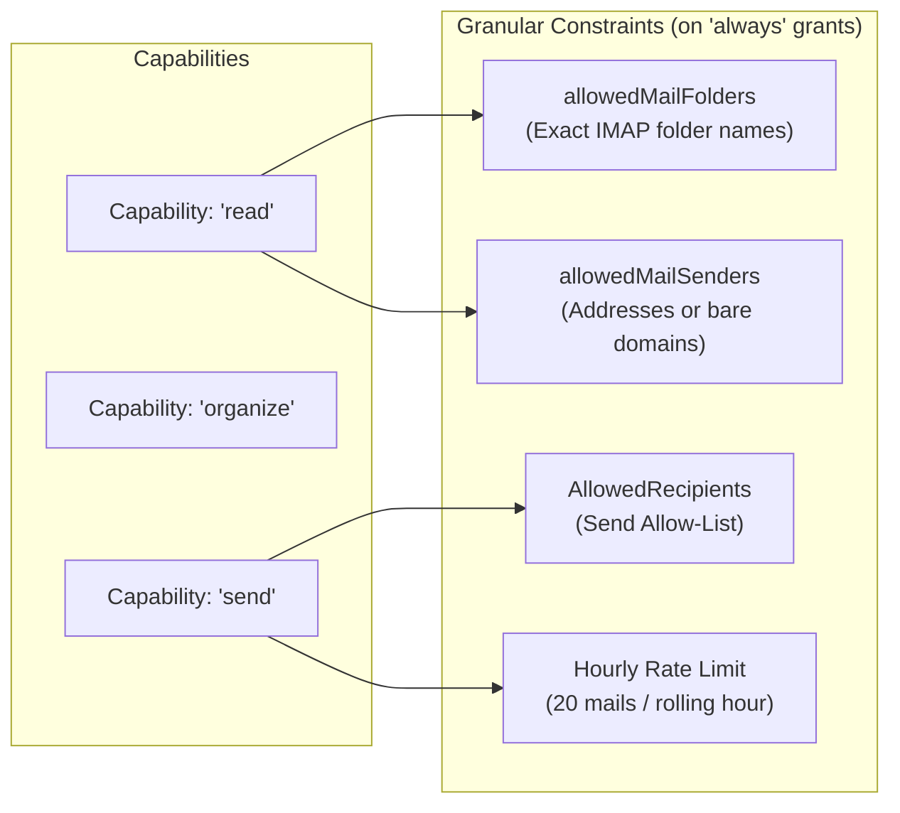
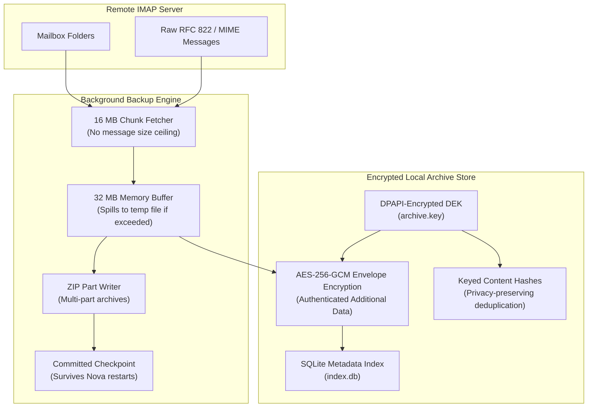

# Mail Architecture: IMAP & SMTP

The Mail connector subsystem integrates Internet Message Access Protocol (IMAP) for reading, organizing, and backing up messages with Simple Mail Transfer Protocol (SMTP) for composition and delivery. It enforces a strict separation between read-only inspection, organizational mailbox mutations, and outbound transmission, backed by granular permission filters, recipient allow-lists, rate-limiting gates, and an encrypted local archive engine.

---

## Dual-Endpoint Configuration & Transport Security

Each mail connector profile configures two distinct endpoints sharing a single logical account:

1. **Primary Endpoint (IMAP - Incoming):** Handles mailbox hierarchy, message retrieval, flag updates, message movements, and mailbox exports. Default port: **993**.
2. **Secondary Endpoint (SMTP - Outgoing):** Handles draft submission and outbound mail delivery. Default port: **587**.

### Transport Modes

* **`auto` (Recommended Default):** Requires TLS encryption and negotiates the strongest available protocol. For port 993, it initiates implicit SSL/TLS; for port 587, it initiates explicit STARTTLS. **It never downgrades to plaintext.**
* **`ssl_on_connect`:** Direct implicit TLS connection established immediately upon TCP socket handshake.
* **`start_tls`:** Plaintext handshake followed by an RFC 3207 / RFC 2595 `STARTTLS` upgrade command.
* **`none` (Debug / Legacy):** Plaintext unencrypted transport. Blocked by default; requires both the user's global setting ("Allow insecure mail and FTP connections for debugging") and `allowInsecure=true` on creation and each invocation.

### TLS Certificate Exceptions

To accommodate local testing and self-signed corporate test environments, endpoints support `imapAllowInvalidCertificate` and `smtpAllowInvalidCertificate`. When enabled, certificate validation errors (expired, self-signed, or host mismatch) are bypassed. This flag is completely inert unless the global insecure connections toggle is active and `allowInsecure=true` is passed.

---

## Capability Stages & Access Filtering

Mail operations are partitioned across three distinct capability stages:

### 1. `read` Capability & Scoped Filtering

Grants access to folder listings, message listings, search indexes, individual message contents, attachment extractions, and `.eml` exports.

When an `always` grant is configured for `read`, it can be restricted by two complementary filter axes:
* **`allowedMailFolders`:** A list of exact IMAP folder names (e.g. `["INBOX", "Orders"]`). When set, attempts to read, search, or list messages in unlisted folders are rejected.
* **`allowedMailSenders`:** A list of allowed sender addresses (e.g. `support@vendor.com`) or bare domains (e.g. `vendor.com` / `@vendor.com`).
* **ANDed Evaluation:** When both axes are defined, a message must reside in an allowed folder **and** originate from an allowed sender to be accessible.

### 2. `organize` Capability

Grants authority to modify mailbox state:
* Altering flags (`\Seen`, `\Flagged`, `\Answered`).
* Moving messages between folders (`nova.mail_move`).
* Deleting messages (`nova.mail_delete`).

### 3. `send` Capability & Protection Gates

Transmitting mail via `nova.mail_send` requires passing three independent authorization gates:
1. **Account Capability Grant:** The `send` capability must be granted (`always` or interactive confirmation).
2. **Recipient Allow-List (`AllowedRecipients`):** Configured on the connector profile. Destinations matching full email addresses (`invoices@partner.com`) or bare domains (`@partner.com`) are dispatched without an interactive prompt. Any unlisted recipient triggers a user confirmation dialog.
3. **Rolling Send Limit:** An account may send at most **20 messages per rolling 60-minute window per workspace**. When the ceiling is reached, `nova.mail_send` rejects further calls and returns the exact cooldown duration until capacity refreshes.
4. **Mutating Remote Confirmation Policy:** In accordance with Nova's system-wide execution policy, outbound mail transmission requires policy clearance before execution.

---

## Mailbox Navigation & Search

### Folder Discovery

`nova.mail_folders` returns the full hierarchical folder tree with server attributes (`\Sent`, `\Trash`, `\Drafts`, `\Archive`, `\Junk`) and message count statistics. Agents can create new mailbox folders via `nova.mail_folder_create`.

### Cursor-Based Pagination (`nova.mail_list`)

To maintain predictable memory consumption when querying large mailboxes, `nova.mail_list` fetches messages in batches of up to 200 items. Subsequent pages are retrieved using opaque cursor tokens.

### Structured IMAP Search (`nova.mail_search`)

Rather than scanning entire mailboxes on the client, `nova.mail_search` translates queries into server-side IMAP search terms:
* Sender and recipient matching (`from`, `to`).
* Subject and body text substrings (`subject`, `body`).
* Temporal constraints (`since`, `before`).
* Flag predicates (`unreadOnly`, `flaggedOnly`).

---

## Drafting & Sending Pipeline

### Composition Constraints

* **Recipients:** Maximum 20 recipients each in `to`, `cc`, and `bcc` (maximum 50 recipients total per message).
* **Attachments:** Maximum 20 attachments with a combined size limit of 25 MB.
* **Signatures:** Nova automatically appends connector signatures configured via `signatureText` (for plain text) or `signatureHtml` (for HTML) separated by standard RFC `-- \n` delimiters, unless `includeSignature=false` is passed.
* **Threading:** Supports `replyToMessageId` or explicit `inReplyTo` and `references` headers for conversation threading.
* **Importance & Receipts:** Supports `priority` (`low`, `normal`, `high`) and `requestReadReceipt=true`.

---

## Attachment Security & Quarantine

When an agent downloads an attachment using `nova.mail_attachment_save`:

1. **Filesystem Sandboxing:** Local destination paths are strictly confined to the user's `Downloads` folder or the current workspace root directory.
2. **Quarantine Isolation:** Any attachment whose filename indicates an executable or script format (`.exe`, `.dll`, `.bat`, `.cmd`, `.ps1`, `.vbs`, `.js`, `.hta`, `.msi`, `.scr`, etc.) is saved with an appended `.isolated` suffix (e.g. `invoice.pdf.exe.isolated`). This prevents accidental execution through system shell file associations.

---

## Encrypted Local Mail Archive & Background Backups

Nova features a native local mail archive engine and a multi-part background backup loop designed for forensic resilience, legal compliance, and offline availability.

### 1. Resumable Mailbox Backups (`nova.mail_backup_*`)

* **Background Process:** Backups run asynchronously via `nova.mail_backup_start`, reporting real-time progress via `nova.mail_backup_status` and cancellable via `nova.mail_backup_stop`.
* **Zero Message Dropping:** Unlike basic email clients, the backup engine enforces **no per-message size limit**. Unusually large messages (e.g., legal filings or large attachments up to 100 MB) are streamed using 16 MB chunking (`MailBackupFetchChunkBytes`).
* **Memory Buffer & Spooling:** Messages up to 32 MB are buffered in memory; larger payloads automatically spool to encrypted temporary disk files.
* **Crash-Resilient Checkpointing:** Checkpoints only advance when a ZIP part is fully committed and verified on disk. If interrupted, `incremental` mode resumes directly from the last committed checkpoint without re-downloading existing parts.

### 2. Encrypted Local Storage Architecture

The local mail archive engine isolates stored messages per connector profile:

* **SQLite Index (`index.db`):** Maintains searchable metadata, folder hierarchies, and message timestamps.
* **DPAPI Data Encryption Key (DEK):** Each profile directory holds an `archive.key` containing an AES-256 Data Encryption Key encrypted with Windows DPAPI.
* **AES-256-GCM Envelopes:** Raw `.eml` contents are encrypted with AES-256-GCM using unique initialization vectors and Authenticated Additional Data (AAD) binding the ciphertext to the profile ID and message ID.
* **Privacy-Preserving Deduplication:** Message deduplication and Message-ID lookups use keyed HMAC-SHA256 hashes generated with the profile's DEK, preventing leakage through SQLite index inspection.
* **Retention & Size Eviction:** Configurable policies automatically prune aged records or enforce maximum storage ceilings on a FIFO basis.
* **Strict Remote Invariant:** Local cache and archive errors never mutate remote IMAP servers.

---

## Mail Tool Reference

| Tool | Capability Required | Description |
| :--- | :--- | :--- |
| [`nova.mail_folders`](../../../mcp-reference/tools/connectors-and-mail/nova-mail-folders.md) | `read` | Lists mailbox folder hierarchy and message counts |
| [`nova.mail_folder_create`](../../../mcp-reference/tools/connectors-and-mail/nova-mail-folder-create.md) | `organize` | Creates a new folder on the IMAP server |
| [`nova.mail_list`](../../../mcp-reference/tools/connectors-and-mail/nova-mail-list.md) | `read` | Retrieves cursor-paginated message summaries from a folder |
| [`nova.mail_search`](../../../mcp-reference/tools/connectors-and-mail/nova-mail-search.md) | `read` | Executes server-side IMAP search queries |
| [`nova.mail_read`](../../../mcp-reference/tools/connectors-and-mail/nova-mail-read.md) | `read` | Fetches full message content, body text, HTML, and attachment info |
| [`nova.mail_mark`](../../../mcp-reference/tools/connectors-and-mail/nova-mail-mark.md) | `organize` | Updates message flags (`seen`, `flagged`, `answered`) |
| [`nova.mail_move`](../../../mcp-reference/tools/connectors-and-mail/nova-mail-move.md) | `organize` | Moves messages from one folder to another |
| [`nova.mail_delete`](../../../mcp-reference/tools/connectors-and-mail/nova-mail-delete.md) | `organize` | Deletes messages permanently or moves to trash |
| [`nova.mail_draft_create`](../../../mcp-reference/tools/connectors-and-mail/nova-mail-draft-create.md) | `send` | Creates a draft message in the IMAP drafts folder |
| [`nova.mail_send`](../../../mcp-reference/tools/connectors-and-mail/nova-mail-send.md) | `send` | Sends an email via SMTP (subject to recipient list & rate limits) |
| [`nova.mail_attachment_save`](../../../mcp-reference/tools/connectors-and-mail/nova-mail-attachment-save.md) | `read` | Extracts an attachment into Downloads/Workspace with `.isolated` quarantine |
| [`nova.mail_export_eml`](../../../mcp-reference/tools/connectors-and-mail/nova-mail-export-eml.md) | `read` | Exports messages as `.eml` or a zipped archive |
| [`nova.mail_backup_start`](../../../mcp-reference/tools/connectors-and-mail/nova-mail-backup-start.md) | `read` | Starts an asynchronous, resumable mailbox backup |
| [`nova.mail_backup_status`](../../../mcp-reference/tools/connectors-and-mail/nova-mail-backup-status.md) | `read` | Checks progress, byte counts, and state of a running backup |
| [`nova.mail_backup_stop`](../../../mcp-reference/tools/connectors-and-mail/nova-mail-backup-stop.md) | `read` | Gracefully stops a running backup, committing the open ZIP part |

---

[Connectors overview](../README.md) · [All core features](../../README.md)
