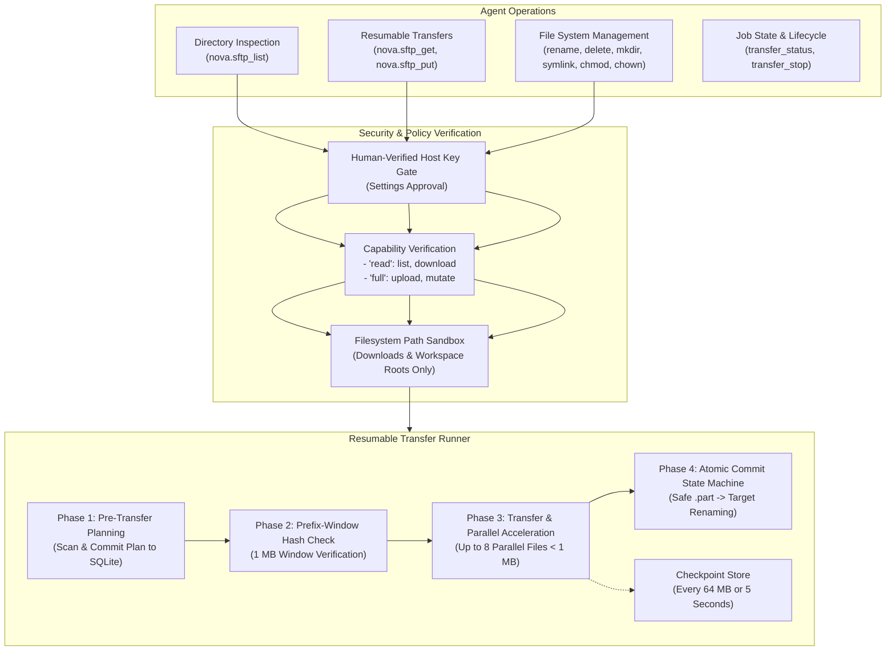
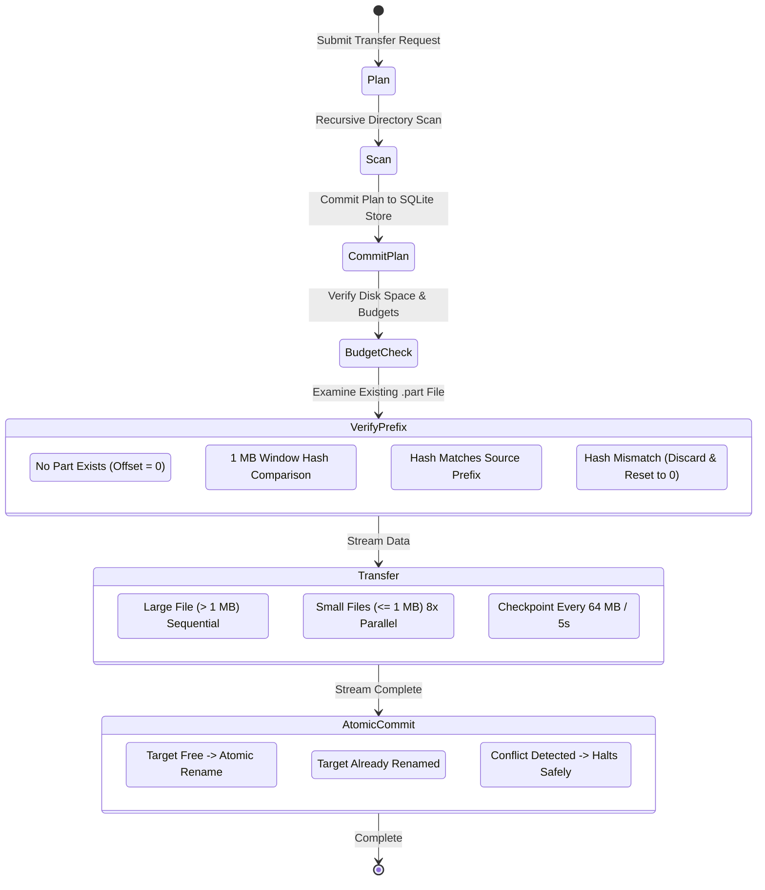

# SSH File Transfer Protocol (SFTP) Architecture

The SFTP connector subsystem provides high-throughput, crash-resilient file and directory transfers over SSH-2. It combines cryptographic host-key trust, filesystem sandboxing, and a resumable transfer engine featuring prefix-window verification, atomic commit recovery, and parallel transfer acceleration for small files.

---

## Connection Profiles & Host-Key Verification Gate

An SFTP connector operates over standard SSH transport (port **22**). It supports two authentication mechanisms:
* **`password`:** Stored encrypted via Windows DPAPI or copied dynamically from the Vault (`passwordFromVault`).
* **`private_key`:** Host path to an existing OpenSSH/PEM private key file, with an optional DPAPI-encrypted passphrase (`keyPassphrase`). The key path is stored securely on the host and never surfaced in listings or tool outputs.

### Host-Key Verification Gate

Before any authentication packet is transmitted, Nova verifies the remote server's public host key:
* **First-Time Connections:** Untrusted host keys halt the connection. The host key fingerprint must be explicitly confirmed by a person in Nova Settings.
* **Key Tampering / Rotation:** If a host key changes, Nova flags `ssh_host_key_changed` and aborts immediately. Agents are strictly prohibited from adding, modifying, or bypassing host keys.

---

## Capabilities & Operation Matrix

SFTP operations are divided between two capability levels:

| Capability | Permitted Operations | Typical Tools |
| :--- | :--- | :--- |
| **`read`** | Querying remote directories, inspecting file attributes, downloading files and trees. | `nova.sftp_list`, `nova.sftp_get` |
| **`full`** | Uploading files, creating directories, renaming, deleting, modifying permissions and links. | `nova.sftp_put`, `nova.sftp_rename`, `nova.sftp_delete`, `nova.sftp_mkdir`, `nova.sftp_symlink`, `nova.sftp_chmod`, `nova.sftp_chown` |

The same connector profile can also serve remote command execution via [SSH commands](../ssh/README.md), which requires the separate `process.exec` capability stage and Nova's `MutatingRemote` execution policy.

---

## The Resumable Transfer Engine

Large-scale file and directory transfers execute through Nova's protocol-neutral transfer runner. The runner operates as a four-phase state machine designed to survive process crashes, network drops, and server-side disconnects.

### Phase 1: Pre-Transfer Planning (`ScanIfNeeded`)

Before transmitting or writing a single byte:
1. The transfer runner recursively traverses the source directory (`recursive=true`).
2. A complete manifest of every file, size, and destination path is recorded in Nova's local SQLite job database.
3. Available disk space and caller byte budgets are verified (`CheckBudgetAndSpace`). If the target disk lacks sufficient space, the transfer fails immediately without leaving partial artifacts.

### Phase 2: Prefix-Window Verification (`VerifyPrefix`)

> [!CRITICAL]
> **The Prefix-Verification Invariant:** A resume operation must **never** append bytes to an existing partial file until Nova has cryptographically proven that the existing partial data is a bit-exact prefix of the source file.

When resuming an interrupted transfer with an existing `.part` file:
1. **Length Pre-Check:** If the local `.part` file is larger than the source file, it cannot be a prefix. The runner issues `Restart`, deleting the corrupted part and resetting offset to 0.
2. **Window Hash Comparison:** For parts matching or smaller than the source, the runner reads a 1 MB verification window (`PrefixWindowBytes = 1,048,576`) immediately preceding the recorded offset.
3. It computes the hash of this window from both the local `.part` file and the remote source file:
   - **Hash Match:** Outcome is `Resume`. Transfer resumes appending at the exact recorded offset.
   - **Hash Mismatch:** Outcome is `Restart`. The corrupted part is discarded and transfer begins afresh from offset 0.

### Phase 3: Small-File Parallel Acceleration

Transferring directory trees containing thousands of small files (e.g. source code trees or documentation) is typically bottlenecked by SSH round-trip network latencies rather than bandwidth:
* **Sequential Large Files:** Files larger than 1 MB stream sequentially to maximize single-stream throughput.
* **Parallel Small Files:** Files $\le 1\text{ MB}$ run concurrently across an internal pool of up to **8 parallel workers** on the shared SSH connection (`ParallelFiles = 8`).
* Live testing demonstrates a transfer speedup from 3 files/second to over 50 files/second across WAN connections.

### Phase 4: Atomic Commit State Machine

To prevent partial files from being mistaken for completed files:
1. Data is always written to a temporary staging file (`<filename>.part`).
2. Upon payload completion, the file enters an atomic commit state machine:
   - **`RenameAgain`:** Target file does not exist yet. Atomically rename `.part` to final target.
   - **`MarkCommitted`:** A crash occurred right after a successful rename. Target exists with exact matching length; entry is marked committed.
   - **`Conflict`:** Both `.part` and target exist after an ambiguous crash. The runner halts execution and reports a conflict rather than overwriting existing data.
   - **`ExternalMutation`:** The entry was marked committed, but the target file disappeared or was altered by an external process.

### Checkpointing & Crash Recovery

* **Intervals:** Checkpoints are flushed to disk every **64 MB of transferred data** or every **5 seconds** (`CheckpointInterval`).
* **Survival Across Restarts:** If Nova is closed or crashes during a 100 GB transfer, launching the identical `nova.sftp_get` or `nova.sftp_put` command automatically resumes the existing `jobId` from the latest committed checkpoint.
* **Credential Re-Resolution:** When reconnecting after a network drop, the runner re-authenticates through DPAPI and passes the host-key verification gate again, ensuring rotated credentials take effect without restarting jobs.

---

## Filesystem Sandboxing & Traversal Prevention

Local filesystem paths involved in SFTP downloads and uploads are strictly sandboxed:
* Paths must reside inside the user's `Downloads` folder or within the active workspace root directory.
* Directory traversal vectors (`../`, relative symlinks resolving outside the root, or absolute drive paths targeting system directories) are rejected with error code `-32602`.

---

## SFTP Tool Reference

| Tool | Capability Required | Description |
| :--- | :--- | :--- |
| [`nova.sftp_list`](../../../mcp-reference/tools/connectors-and-mail/nova-sftp-list.md) | `read` | Lists remote directory contents with attributes, permissions, and sizes |
| [`nova.sftp_get`](../../../mcp-reference/tools/connectors-and-mail/nova-sftp-get.md) | `read` | Downloads a file or recursive directory tree as a resumable background job |
| [`nova.sftp_put`](../../../mcp-reference/tools/connectors-and-mail/nova-sftp-put.md) | `full` | Uploads a local file or directory tree as a resumable background job |
| [`nova.sftp_transfer_status`](../../../mcp-reference/tools/connectors-and-mail/nova-sftp-transfer-status.md) | `read` | Queries real-time progress, byte rates, ETA, and state of a transfer job |
| [`nova.sftp_transfer_stop`](../../../mcp-reference/tools/connectors-and-mail/nova-sftp-transfer-stop.md) | `read` / `full` | Pauses or stops an active transfer job, preserving `.part` files for later resumption |
| [`nova.sftp_rename`](../../../mcp-reference/tools/connectors-and-mail/nova-sftp-rename.md) | `full` | Renames or moves a file or directory on the remote server |
| [`nova.sftp_delete`](../../../mcp-reference/tools/connectors-and-mail/nova-sftp-delete.md) | `full` | Deletes a remote file or empty directory |
| [`nova.sftp_mkdir`](../../../mcp-reference/tools/connectors-and-mail/nova-sftp-mkdir.md) | `full` | Creates a new remote directory (optionally recursive) |
| [`nova.sftp_symlink`](../../../mcp-reference/tools/connectors-and-mail/nova-sftp-symlink.md) | `full` | Creates a symbolic link pointing to a remote target path |
| [`nova.sftp_chmod`](../../../mcp-reference/tools/connectors-and-mail/nova-sftp-chmod.md) | `full` | Modifies POSIX permission bits on a remote file or directory |
| [`nova.sftp_chown`](../../../mcp-reference/tools/connectors-and-mail/nova-sftp-chown.md) | `full` | Alters user (UID) and group (GID) ownership on a remote item |

---

[Connectors overview](../README.md) · [Secure Shell (SSH)](../ssh/README.md) · [All core features](../../README.md)
