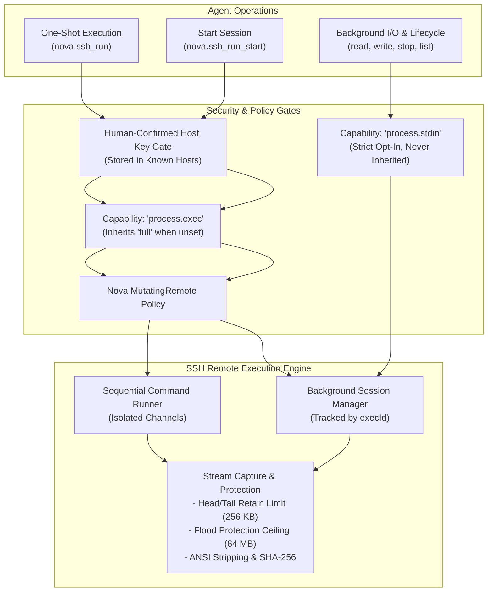
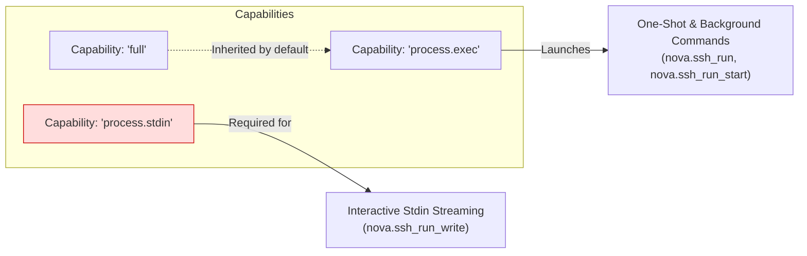
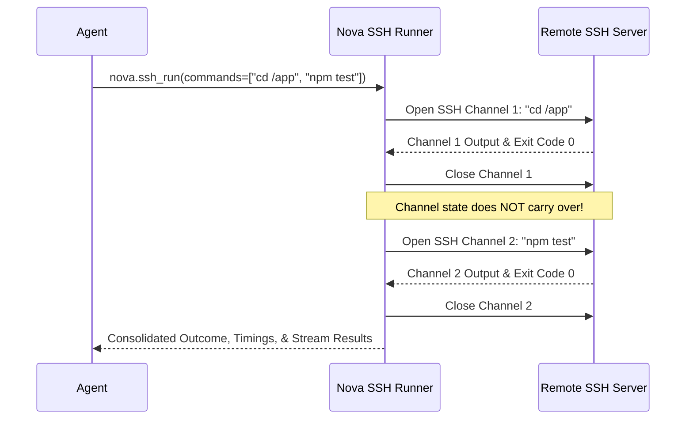
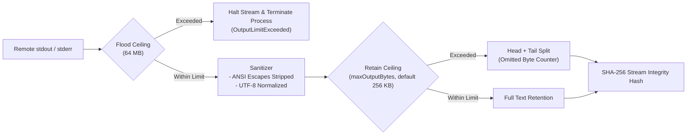
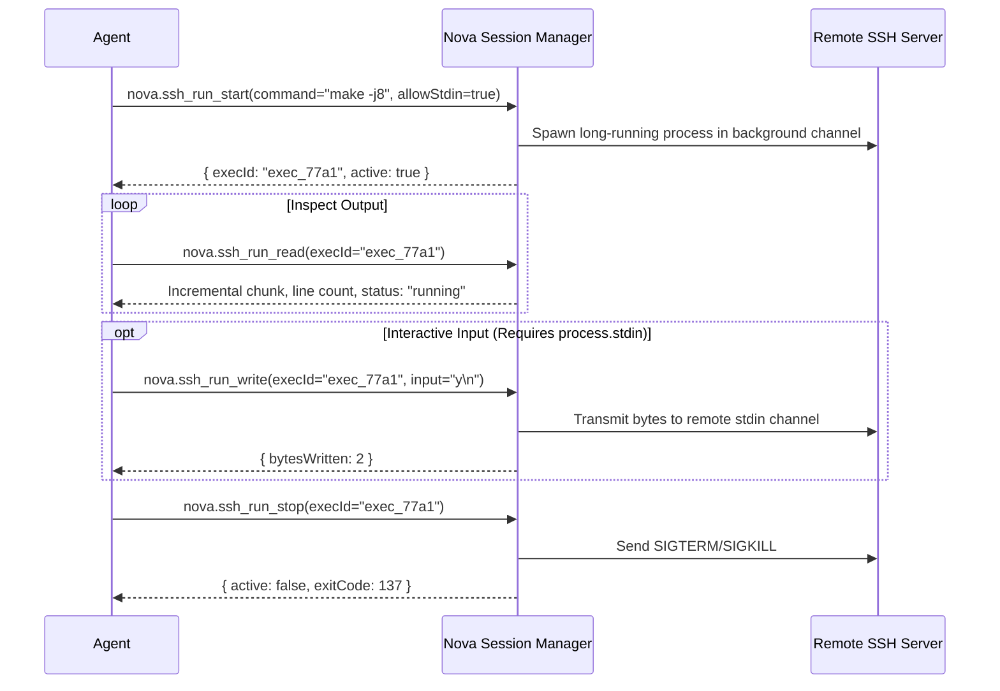

# Secure Shell (SSH) Execution Architecture

Nova provides a robust remote command execution engine over SSH-2 (RFC 4251–4254). It allows autonomous agents to run diagnostics, execute build and deployment pipelines, manage background processes, and stream interactive input into remote processes while maintaining strict process isolation, host-key verification, output flood protection, and empirical termination accounting.

---

## Connection Profiles & Host-Key Verification Gate

SSH execution uses the connection profile of an `sftp` connector (standard port **22**). While file operations and command execution share network endpoints and authentication credentials, command execution is decoupled into distinct capability stages.

### The Host-Key Verification Gate

To prevent Man-in-the-Middle (MitM) attacks and credential interception, Nova enforces an unbypassable host-key verification gate:
1. **Zero Blind Trust:** When connecting to a remote host for the first time, Nova captures the server's public host key and fingerprint.
2. **Human-Only Authorization:** Host keys must be reviewed and confirmed by a human operator in Nova Settings. **Agents cannot confirm or replace host keys via MCP tools.**
3. **Key Change Detection:** If a remote server presents a changed host key, Nova immediately freezes the connection attempt before transmitting any credentials, reporting an explicit `ssh_host_key_changed` error.

---

## Capability Stages: Execution vs. Interactive Stdin

Command execution is partitioned into two specialized capability stages:

1. **`process.exec` Capability:**
   - Authorizes spawning remote commands and background sessions.
   - For backward compatibility and ease of configuration, if an account already has an explicit `full` file-transfer grant, `process.exec` automatically inherits that grant mode unless explicitly overridden.
2. **`process.stdin` Capability (Strict Opt-In):**
   - Authorizes feeding live, interactive standard input into a running background process (`allowStdin=true` and `nova.ssh_run_write`).
   - Because open stdin channels allow arbitrary command chaining and interactive shell escape, `process.stdin` is **strictly opt-in and never inherits weaker grants**.

In addition to connector-level capabilities, executing mutating remote commands requires approval under Nova's system-wide `MutatingRemote` execution policy.

---

## One-Shot Execution (`nova.ssh_run`)

`nova.ssh_run` executes a single command or a sequential batch of commands within dedicated SSH exec channels.

### Channel Isolation Invariant

In an SSH exec batch, **each command executes inside a fresh, independent remote channel**. Environment variables and working directory modifications do **not** carry over between commands:
* An initial command like `cd /var/www` only alters the directory for that specific channel.
* Subsequent commands execute in the user's default login directory unless explicitly chained (e.g., `cd /var/www && npm test`).

### Execution Controls & Timeouts

* **`commandTimeoutSeconds` (Default: 60s):** Per-command deadline. If expired, Nova requests immediate process termination (SIGKILL) and reports `TimedOut`.
* **`overallTimeoutSeconds` (Default: 300s):** Global deadline for the entire batch.
* **`stopOnError` (Default: `true`):** Halts the batch immediately if any command returns an exit code outside `expectedExitCodes`. Subsequent commands are marked with outcome `Skipped`.
* **`expectedExitCodes` (Default: `[0]`):** Defines which return codes indicate success.

---

## Stream Capture & Flood Protection

Nova protects agent memory and context windows against runaway processes through multi-tier stream filtering:

1. **Flood Protection Ceiling (`ReceiveLimitBytes = 64 MB`):**
   - If a misconfigured remote process produces a continuous output flood, Nova halts reading once 64 MB is received and terminates the remote process. The command outcome is flagged as `OutputLimitExceeded`.
2. **Head/Tail Retain Buffer (`maxOutputBytes = 256 KB`):**
   - To provide actionable context without exhausting token budgets, results capture the start (head) and end (tail) of the output stream, reporting exact counts for omitted bytes.
3. **ANSI & Control Character Stripping:**
   - Terminal color sequences and raw cursor manipulation codes are stripped from text output, leaving clean, machine-readable log lines.
4. **Stream Integrity Hash:**
   - Every completed stream includes a SHA-256 cryptographic hash of all received bytes, providing verifiable proof of stream content.

---

## Empirical Termination Accounting

SSH protocols report process termination through exit status packets or exit signal messages, but remote servers can drop connections or close channels without sending an exit packet. Nova separates what was **observed** from what was **assumed**:

| Outcome | Meaning | Remote Certainty |
| :--- | :--- | :--- |
| **`Exited`** | Server transmitted an explicit RFC 4254 `exit-status` packet with return code. | Confirmed terminated. |
| **`Signaled`** | Server reported process was killed by a remote signal (e.g. `SIGKILL`, `SIGSEGV`). | Confirmed terminated. |
| **`TimedOut`** | Nova's deadline fired. A termination signal was sent, but exit confirmation was not received. | **Uncertain**: Process may still be running remotely. |
| **`Cancelled`** | Caller cancelled operation. Signal requested. | **Uncertain**. |
| **`OutputLimitExceeded`** | Flood cap exceeded; connection closed. | **Uncertain**. |
| **`ConnectionLost`** | TCP or SSH connection dropped mid-execution. | **Uncertain**: Server may still be executing process. |
| **`Unknown`** | Channel closed normally, but server omitted exit-status and exit-signal messages. | **Uncertain**. |

---

## Background SSH Sessions (`nova.ssh_run_start`)

For long-running tasks, compilation jobs, or services that require periodic inspection, Nova manages asynchronous background sessions:

### Background Session Lifecycle

* **`nova.ssh_run_start`:** Launches the command and returns an `execId`. If interactive input will be needed later, `allowStdin=true` must be set at creation.
* **`nova.ssh_run_read`:** Reads new output accumulated since the previous read call using an internal ring buffer.
* **`nova.ssh_run_write`:** Sends text or raw bytes to standard input. Gated behind the `process.stdin` capability.
* **`nova.ssh_run_stop`:** Terminates the session, transmitting termination signals to the remote channel.
* **`nova.ssh_run_list`:** Discovers all active and recently completed background execution sessions.

---

## Architecture Decision: Line-Oriented Execution vs. PTY

Nova deliberately executes commands via standard SSH exec channels **without allocating a Pseudo-Terminal (PTY)**:

* **Why No PTY?** Interactive PTYs alter program behavior: tools paginate output (invoking `less` or `more`), emit escape codes for terminal dimensions, redraw progress bars, and send carriage returns that corrupt log streams.
* **Autonomous Reliability:** Operating without a PTY forces programs into standard non-interactive line-buffering mode, generating clean, deterministic log outputs that autonomous agents can reliably parse.

---

## SSH Tool Reference

| Tool | Capability Required | Description |
| :--- | :--- | :--- |
| [`nova.ssh_run`](../../../mcp-reference/tools/connectors-and-mail/nova-ssh-run.md) | `process.exec` | Executes a single command or batch of commands synchronously |
| [`nova.ssh_run_start`](../../../mcp-reference/tools/connectors-and-mail/nova-ssh-run-start.md) | `process.exec` | Spawns a background command session and returns an `execId` |
| [`nova.ssh_run_read`](../../../mcp-reference/tools/connectors-and-mail/nova-ssh-run-read.md) | `read` / `process.exec` | Reads buffered output from an active background session |
| [`nova.ssh_run_write`](../../../mcp-reference/tools/connectors-and-mail/nova-ssh-run-write.md) | `process.stdin` | Sends interactive input to a background session with `allowStdin=true` |
| [`nova.ssh_run_stop`](../../../mcp-reference/tools/connectors-and-mail/nova-ssh-run-stop.md) | `process.exec` | Stops an active background session and signals the remote process |
| [`nova.ssh_run_list`](../../../mcp-reference/tools/connectors-and-mail/nova-ssh-run-list.md) | `read` / `process.exec` | Lists all active and recent background SSH command sessions |

---

[Connectors overview](../README.md) · [SFTP File Transfer](../sftp/README.md) · [All core features](../../README.md)
