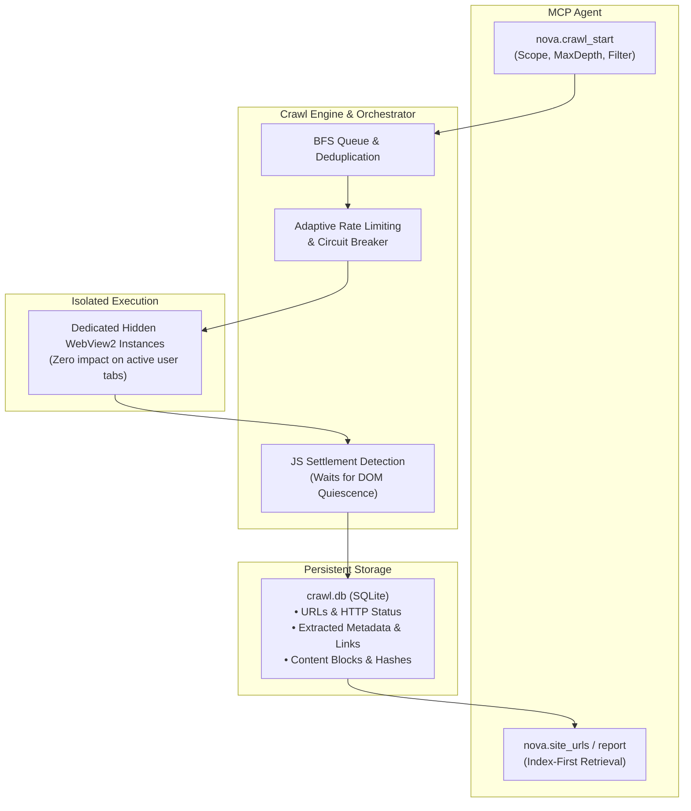

# Autonomous Crawler & Surface Explorer

> [!NOTE]
> Nova AI Workspace's embedded crawler and surface exploration subsystem equips AI agents with structured site discovery capabilities: Breadth-First Search (BFS), automated JavaScript settlement detection, and persistent URL indexing in a separate, hidden background WebView2 instance.

---

## 1. Problem Statement: Manual Navigation vs. Structured Discovery

When an AI agent needs to locate a product in an online catalog with hundreds of categories or analyze comprehensive developer documentation, manual page-by-page traversal (`navigate` $\rightarrow$ `search_text` $\rightarrow$ `click`) quickly breaks down:
* Enormous token burn caused by repeatedly parsing raw, incomplete intermediate pages.
* No shared memory across sessions: after a browser restart, the agent cannot recall previously crawled URLs.
* Rate limits and bot blocks triggered by unthrottled, burst navigation.

Nova solves this via an **embedded BFS crawler engine** and a **persistent site URL index**.

---

## 2. Crawler Subsystem Architecture

---

## 3. Core Capabilities & Protective Mechanisms

1. **Complete Tab Decoupling:**
   * The crawler operates inside up to 3 parallel, invisible WebView2 instances. Active user tabs and visual browsing remain unaffected.
2. **Persistent SQLite Index (`crawl.db`):**
   * All visited URLs, HTTP response codes, extracted metadata, link graphs, and content hashes are stored in SQLite and survive application restarts.
3. **Index-First Workflows (`nova.site_urls`):**
   * Once a domain has been indexed, agents do not need to re-crawl. With `nova.site_urls`, agents query existing URL patterns (e.g., `/products/*`, `/docs/*`) and navigate directly to target pages.
4. **Adaptive Rate Limiting & Circuit Breakers:**
   * If the crawler encounters HTTP 429 (Too Many Requests) or 503 (Service Unavailable), it automatically backs off or pauses, preventing IP bans.
5. **Robots.txt & Sitemap Awareness:**
   * Respects standard crawl directives and parses XML sitemaps to optimize path exploration.

---

## 4. MCP Tool Reference for Crawler & Discovery

| Tool | Purpose |
| :--- | :--- |
| `nova.crawl_start` | Initiates a BFS crawl with entry URL, max depth, concurrency, and regex URL filters. |
| `nova.crawl_status` | Inspects real-time progress, queue depth, page fetch rates, and error counters. |
| `nova.crawl_results` | Retrieves extracted pages, page titles, link relationships, and structured text chunks. |
| `nova.crawl_stop` | Gracefully terminates an active crawl and commits all state to storage. |
| `nova.site_urls` | Queries the persistent site URL database by regex, prefix, or content pattern. |
| `nova.site_urls_report` | Produces aggregated statistics on site link depth and URL topologies. |
| `nova.explore_surface` | Executes structured UI surface exploration on a target page. |

---

## 5. Under the Hood

* **Crawler Engine & BFS Orchestrator:** `Crawler` subsystem
* **MCP Crawler Handler:** `McpCrawlerHandler`
* **Surface Explorer:** `McpSurfaceExplorerHandler` & `SurfaceSafetyPipeline`
