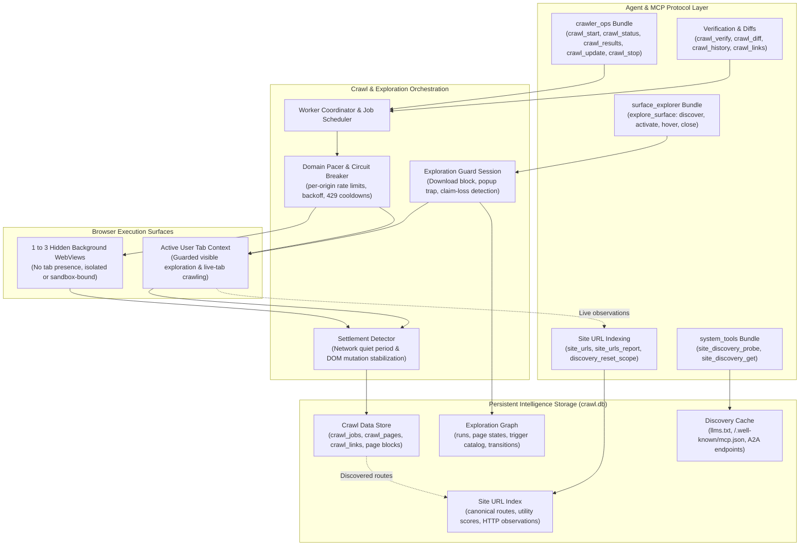
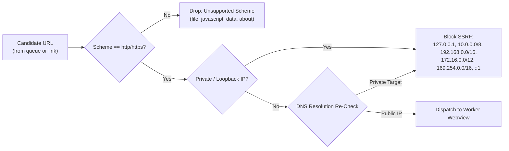
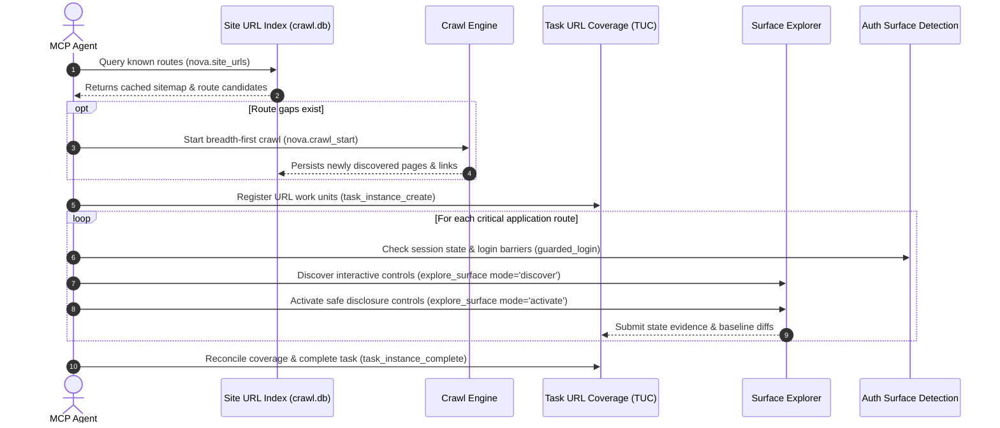

# Crawler & Discovery Architecture Hub

Website exploration in Nova AI Workspace operates across two complementary architectural planes: discovering routes across a website's structural topology, and revealing interactive states hidden within modern single-page applications. 

Nova provides an autonomous, resource-bounded traversal engine alongside a guarded in-page surface explorer, backed by a persistent SQLite intelligence store (`crawl.db`) that survives browser restarts and unifies multi-session knowledge.

---

## The Dual Exploration Model

Modern web applications present two fundamentally distinct challenges to autonomous agents:

| Dimension | Route-Level Traversal (Crawler) | In-Page State Exploration (Surface Explorer) |
| :--- | :--- | :--- |
| **Primary Scope** | Navigating between distinct URLs across an origin or domain. | Revealing interactive states hidden behind DOM controls on a single page. |
| **Execution Surface** | 1 to 3 hidden background WebViews (or live tab in `live_tab` mode). | The active, visible user tab under exclusive agent lease/claim. |
| **Key Targets** | HTML documents, blog posts, documentation pages, XML sitemaps. | Collapsible panels, accordions, modal dialogs, tab switchers, hover tooltips. |
| **Safety Posture** | SSRF filtering, domain rate limiting, backoff, and circuit breaking. | Interception of popups, downloads, form submissions, and external navigation. |
| **Persistence Unit** | Crawled pages, extracted text, link graphs, and canonical site URLs. | State transitions, trigger inventories, baseline DOMs, and visual diffs. |
| **Primary Tool** | [`nova.crawl_start`](../../mcp-reference/tools/crawler-and-discovery/nova-crawl-start.md) | [`nova.explore_surface`](../../mcp-reference/tools/task-memory/nova-explore-surface.md) |

A completed crawler traversal maps accessible URL routes across a domain, but does not execute interactive in-page controls to reveal dynamic DOM states. Conversely, an exhaustive Surface Explorer run catalogs every collapsible menu on a specific page, but does not follow outgoing hyper-links across the broader site. High-capability agents combine both mechanisms to achieve end-to-end site intelligence.

---

## Core Architectural Domains

The Crawler and Discovery subsystem comprises five specialized architectural pillars:

### 1. [Autonomous Breadth-First Crawler](crawler/README.md)
Coordinates background web exploration across single or parallel worker pipelines. Features include:
* **Worker Isolation:** Runs in 1 to 3 hidden WebViews completely decoupled from the user's visible tabs (`crawlMode='hidden'`), or follows supported routes sequentially in a visible tab (`crawlMode='live_tab'`).
* **Profile & Sandbox Binding:** Supports binding a crawl to an active tab or sandbox profile (`targetId`), inheriting cookies, local storage, and authenticated sessions without tab pollution.
* **Intelligent Settlement:** Uses dual-heuristic settlement (network quiet period + DOM mutation idle) evaluated via CDP promises to handle heavy client-side JavaScript rendering.
* **Adaptive Domain Pacing:** Centralized rate-limiting per origin, exponential backoff, HTTP 429 `Retry-After` adherence, and automatic circuit-breaking cooldowns when encountering server errors or bot challenges.
* **Standards Compliance:** Opt-in robots.txt compliance (`respectRobotsTxt`), XML sitemap and sitemap-index expansion (`useSitemap`), and regex-based URL include/exclude filters.

### 2. [Surface Explorer & Interactive DOM States](surface-explorer/README.md)
Enables safe, systematic exploration of dynamic interface states inside modern single-page applications:
* **Four Lifecycle Modes:** `discover` (non-mutating scan and classification), `activate` (guarded execution of eligible disclosure triggers), `hover` (visual inspection of hover-dependent content), and `close` (idempotent resource and guard teardown).
* **Tri-State Trigger Classification:** Evaluates interactive controls into `SAFE` (explicit disclosure controls like tabs and accordions), `PROBE_REQUIRED` (heuristic candidates, pagination, read navigation), and `DENY` (destructive actions, form submissions, payment buttons).
* **Guarded Execution Sessions:** Intercepts and blocks window opening (`window.open`), file downloads, external URI protocols, permission prompts, JavaScript dialogs (`alert`, `confirm`), and file choosers.
* **Real-Time Claim Tracking:** Monitors active tab lease state; instantly halts exploration if the agent's tab claim expires or the user switches tabs (`CLAIM_LOST`, `TAB_BECAME_HIDDEN`).

### 3. [Persistent Site URL Index & Live Navigation](site-url-index/README.md)
Maintains a persistent, cross-session routing atlas in SQLite:
* **Index-First Discovery:** Allows agents to query previously indexed URLs by domain, origin, or path prefix (`nova.site_urls`) with utility scores, avoiding redundant network crawls and token burn.
* **Canonicalization Pipeline:** Normalizes routes by stripping fragments, cleaning tracker parameters (UTM, gclid, session IDs), preserving path casing, and collapsing query variations into canonical logical routes.
* **Live Ingestion (`nova.site_urls_report`):** Enables agents to stream opportunistic observations from regular browsing (new links found, HTTP 404s, HTTP redirects) directly into the index.
* **Scope Cleanliness:** Provides scoped cache eviction and index deletion via `nova.discovery_reset_scope`.

### 4. [AI & Website MCP Discovery Probes](site-discovery-and-mcp/README.md)
Inspects modern web origins for standardized AI documentation and remote agent protocols:
* **AI Metadata Probing (`llms.txt`):** Automatically locates, fetches, and parses `llms.txt` and `llms-full.txt` files into structured markdown summaries and link catalogs.
* **Remote MCP Server Discovery:** Probes for `/.well-known/mcp.json` and discovery response headers (`mcp-server`), locating remote Model Context Protocol endpoints.
* **Zero-Execution Inspection:** Tools [`nova.site_discovery_probe`](../../mcp-reference/tools/crawler-and-discovery/nova-site-discovery-probe.md) and [`nova.site_mcp_inspect`](../../mcp-reference/tools/site-data-and-identity/nova-site-mcp-inspect.md) evaluate remote server cards and advertised tool schemas in an isolated inspect-only mode without executing untrusted remote code.

### 5. [History, Diffs, Targeted Verification & Link Analysis](diff-and-verification/README.md)
Provides precision tools for historical comparison, deterministic auditing, and instant link extraction:
* **Crawl History & Generational Diffs:** Compares two crawls of the same website via [`nova.crawl_diff`](../../mcp-reference/tools/crawler-and-discovery/nova-crawl-diff.md) to detect added, removed, or modified routes and content hash drifts.
* **Deterministic Batch Verification (`nova.crawl_verify`):** Audits a fixed list of URLs without following outgoing links, supporting semantic readiness gates (`waitFor`), strict postcondition assertions (`assert`), and structured data extraction recipes.
* **Instant Tab Link Extraction (`nova.crawl_links`):** Analyzes and classifies all hyperlinks on the current active tab into internal, external, anchor, and scheme-specific links without initiating a background crawl.

---

## Security, Safety & SSRF Boundaries

Because crawler workers operate autonomously in the background, Nova enforces strict defense-in-depth safety boundaries:

### 1. Anti-SSRF (Server-Side Request Forgery) Protection
Hidden crawler WebViews refuse all connections to:
* IPv4 loopback (`127.0.0.0/8`) and IPv6 loopback (`::1`).
* RFC 1918 private subnets (`10.0.0.0/8`, `172.16.0.0/12`, `192.168.0.0/16`).
* Link-local addresses (`169.254.0.0/16`, `fe80::/10`).
* Hostnames that resolve to private addresses, verified at both initial request and subsequent redirect hops to prevent DNS rebinding attacks.

### 2. Headless Peripheral & Permission Containment
Hidden crawler WebViews reuse Chromium profile state for cookie and authentication parity, but enforce an airtight permission perimeter:
* All prompt-capable device permissions (webcam, microphone, speaker selection) are permanently denied.
* Screen capture, clipboard access, geolocation, and window management requests fail closed immediately.
* Late or asynchronous permission events fail closed without displaying prompts or leaking capabilities to background web scripts.

### 3. Surface Explorer Interaction Guardrails
During in-page exploration runs, Nova attaches an active `ExplorationGuardSession` to the tab's underlying browser runtime:
* **Downloads:** Intercepted and blocked before bytes reach disk.
* **Window Creation:** New windows, popups, and tab creation via `window.open` or `target="_blank"` are blocked.
* **Protocol Launchers:** External URI schemes (`mailto:`, `tel:`, custom app protocols) are suppressed.
* **Native Dialogs:** JavaScript `alert()`, `confirm()`, and `prompt()` modals are dismissed automatically with non-mutating defaults.
* **File Uploads:** File chooser dialogues are trapped and aborted before touching the native filesystem.

---

## Cross-Subsystem Workflows

The Crawler and Discovery engine interfaces directly with Nova's core learning, observation, and safety architectures:

1. **Task URL Coverage (TUC) & Episodic Task Memory (ETM):**
   * Discovered routes from `crawl.db` feed directly into Task URL Coverage units. Agents verify exhaustive route inspection using structured evidence, preventing premature task completion.
2. **Auth Surface Detection (ASD):**
   * When a background crawl or surface exploration run encounters an authentication barrier (HTTP 401/403, `WWW-Authenticate` challenge headers, or client-side login forms), Nova pauses the run, tags the route as requiring authentication, and provides diagnostic scheme hints (`Negotiate`, `NTLM`, `Bearer`, `Basic`) rather than cycling in infinite redirect loops.
3. **Phenomenological Knowledge Store (PKS) & Hydration Drift:**
   * When SPAs dynamically alter their client-side routes post-hydration, Nova's settlement detector validates route equivalence. Genuine hydration drift patterns are persisted as reusable PKS knowledge to streamline future navigation across the domain.
4. **Tool Observation Bus (TOB):**
   * Every crawl initiation, pause, parameter update, and exploration step emits tamper-proof telemetry events through the Tool Observation Bus, providing a reliable audit trail for compliance and multi-agent coordination.

---

## Subsystem Navigation

* [**Autonomous Breadth-First Crawler**](crawler/README.md) — Multi-worker crawling, limits, settlement, pacing, and robots/sitemap support.
* [**Surface Explorer**](surface-explorer/README.md) — Interactive DOM state discovery, trigger classification, hover peeks, and guard sessions.
* [**Site URL Index & Live Reporting**](site-url-index/README.md) — Cross-session routing memory, URL canonicalization, and live browsing ingestion.
* [**AI & Website MCP Discovery**](site-discovery-and-mcp/README.md) — Automated probing of `llms.txt`, `/.well-known/mcp.json`, and remote server cards.
* [**Diffs & Verification**](diff-and-verification/README.md) — Generational crawl comparisons, batch URL verification recipes, and instant link extraction.

---

[All core features](../README.md) · [Crawler & Discovery MCP Tool Inventory](../../mcp-reference/tools/crawler-and-discovery/README.md) · [Surface Explorer Tool Reference](../../mcp-reference/tools/task-memory/nova-explore-surface.md)
