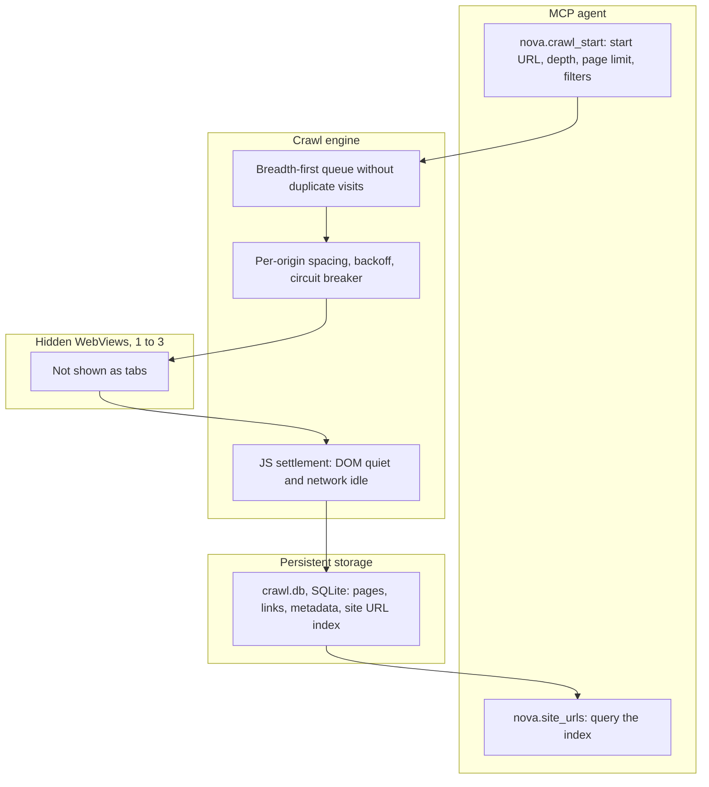

# Autonomous Crawler & Surface Explorer

> [!NOTE]
> Nova AI Workspace's embedded crawler lets agents explore a website breadth-first in hidden background WebViews, wait for JavaScript to settle on each page, and keep what it found in a persistent site URL index. The Surface Explorer complements it inside a visible tab by finding and safely opening interactive elements such as menus and dialogs.

---

## 1. A Concrete Example: Find the Relevant Documentation

An agent needs to review an API's documentation. It starts a crawl with a documentation-path filter, a depth limit and a page budget. Nova follows discovered links, extracts page content and stores the results. The agent then queries the index for relevant paths and revisits the pages that answer its questions.

On the next run, the index provides a starting map. It records known URLs and previous observations, not a guarantee that every page was discovered or that old content is still current.

## 2. Discovery Has a Scope

| Mechanism | What it discovers |
| :--- | :--- |
| Hidden crawl | Reachable pages within its link, depth, page and URL-filter limits. |
| Live-tab crawl | Supported routes in an existing visible tab, preserving its current page context where possible. |
| Site URL index | URLs Nova already knows from crawls and reported navigation observations. |
| Surface Explorer | Interactive triggers on the current page, such as menus and dialogs. |

A crawl that finishes has finished its configured traversal. Pages behind pagination, unvisited interactions, login barriers or excluded paths can remain undiscovered. JavaScript settlement is a readiness heuristic, not proof that all content has loaded. For an exhaustive task, define and verify the required units with [ETM](../learning/episodic-task-memory-etm/README.md).

## 3. Why Keep a Reusable Map?

When an AI agent needs to locate a product in an online catalog with hundreds of categories or analyze comprehensive developer documentation, manual page-by-page traversal (`navigate` → `search_text` → `click`) quickly breaks down:

* Enormous token burn caused by repeatedly parsing raw, incomplete intermediate pages.
* No shared memory across sessions: after a browser restart, the agent cannot recall previously visited URLs.
* Rate limits and bot blocks triggered by unthrottled, burst navigation.

Nova addresses this with an **embedded breadth-first crawler** and a **persistent site URL index**.

---

## 4. Crawler Subsystem Architecture

---

## 5. Core Capabilities & Protective Mechanisms

1. **Separate from the tabs:**
   * By default (`crawlMode='hidden'`) the crawler runs in 1 to 3 parallel hidden WebViews (`parallel`, default 1). They do not appear in `nova.tabs`. Memory use depends on the pages and browser runtime.
   * With `targetId`, the hidden crawl uses the browser profile of that tab or sandbox, so it shares its cookies and local storage.
   * `crawlMode='live_tab'` follows supported routes inside the visible tab and is always sequential. It requires `targetId`; robots enforcement, sitemap expansion, crawl screenshots and delta mode are not supported in this mode. Keeping the tab avoids creating a new document for supported same-document routes, but session preservation still depends on the website.
2. **Limits per crawl:** `maxDepth` 0–10 (default 2), `maxPages` 1–500 (default 30), `settleTimeMs` 500–15,000 ms per page (default 3,000), `pageDelayMs` 200–5,000 ms between page starts on the same origin (default 500). Parallel workers share the same per-origin spacing, so they do not multiply the request rate.
3. **Persistent SQLite index (`crawl.db`):**
   * Crawled pages, links, metadata and the site URL index are stored in `crawl.db` in the Nova profile and survive restarts. `nova.crawl_history` and `nova.crawl_diff` work on past crawls.
4. **Index-first workflows (`nova.site_urls`):**
   * Once a site has been crawled, agents can query its known URLs by domain or origin and path prefix, sorted by a utility score, instead of crawling again. Agents report what they observe while navigating (new pages, 404s, redirects) with `nova.site_urls_report`.
5. **Backoff & circuit breaker:**
   * Consecutive errors increase the delay (`backoffStrategy`: `exponential` by default, `linear` or `none`; capped by `maxBackoffMs`, default 10 s). HTTP 429 always gets its own, longer cooldown.
   * After `maxConsecutiveErrors` failures on the same domain (default 5), the crawler skips that domain for 60 seconds.
   * When the crawler reaches a human-verification page, it pauses the crawl instead of continuing to hit it.
6. **robots.txt & sitemaps (opt-in):**
   * `respectRobotsTxt=true` skips disallowed paths and applies `Crawl-Delay`. By default robots.txt is fetched and shown in `nova.crawl_status`, but not enforced.
   * `useSitemap=true` reads sitemaps (including sitemap indexes and `Sitemap:` lines in robots.txt) and adds their URLs to the queue.
7. **No private-network targets:** Hidden crawls refuse loopback, private and link-local addresses, including host names that resolve to them, and re-check redirects.

---

## 6. MCP Tool Reference for Crawler & Discovery

Crawler tools are in the `crawler_ops` bundle; the discovery probe tools are in `system_tools`, the Surface Explorer is in `surface_explorer`.

| Tool | Purpose |
| :--- | :--- |
| `nova.crawl_start` | Starts a background crawl from a start URL with depth, page limit, URL include/exclude regex, content and metadata extraction, optional screenshots and a custom per-page script. |
| `nova.crawl_status` | Progress, current phase and error counters of a crawl. |
| `nova.crawl_results` | Pages of a crawl with titles, links, metadata and extracted content, filterable and paged. |
| `nova.crawl_stop` | Stops a running crawl. |
| `nova.crawl_update` | Changes limits and pacing of a running crawl, or pauses and resumes it. |
| `nova.crawl_verify` | Visits a fixed list of URLs instead of following links. |
| `nova.crawl_history`, `nova.crawl_diff` | Lists past crawls; compares two crawls of the same site. |
| `nova.crawl_links` | Extracts and classifies the links of an open tab immediately, without a crawl. |
| `nova.site_urls` | Queries the persistent site URL index. |
| `nova.site_urls_report` | Reports live navigation observations to the index. |
| `nova.discovery_reset_scope` | Deletes the stored crawl history, results and URL index for one site. |
| `nova.site_discovery_probe`, `nova.site_discovery_get` | Checks a site for AI and MCP discovery files (such as `llms.txt` and `/.well-known/mcp.json`); reads the cached result. |
| `nova.explore_surface` | Surface Explorer: finds interactive triggers in the visible tab (`discover`), opens one classified as safe (`activate`), hovers (`hover`) or ends a run (`close`). Hovering always needs approval; activating asks for approval under the default activation policy. |

## Related Documentation

* **[Task Memory (ETM)](../learning/episodic-task-memory-etm/README.md)** — Defined work units and evidence of task coverage.
* **[Auth Surface Detection](../auth-surface-detection-asd/README.md)** — Login barriers and session-state assessment.
* **[PKS](../learning/phenomenological-knowledge-store-pks/README.md)** — Reusable procedural knowledge about recurring situations.

[All core features](../README.md)
