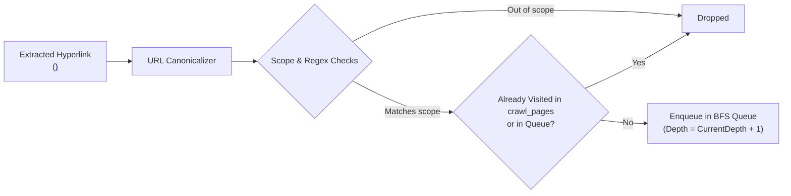
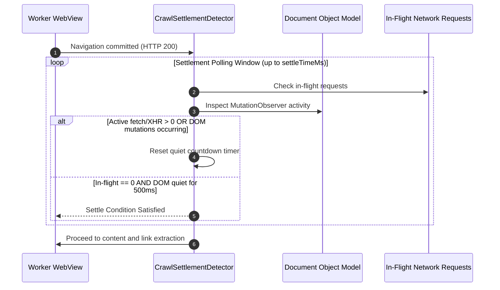
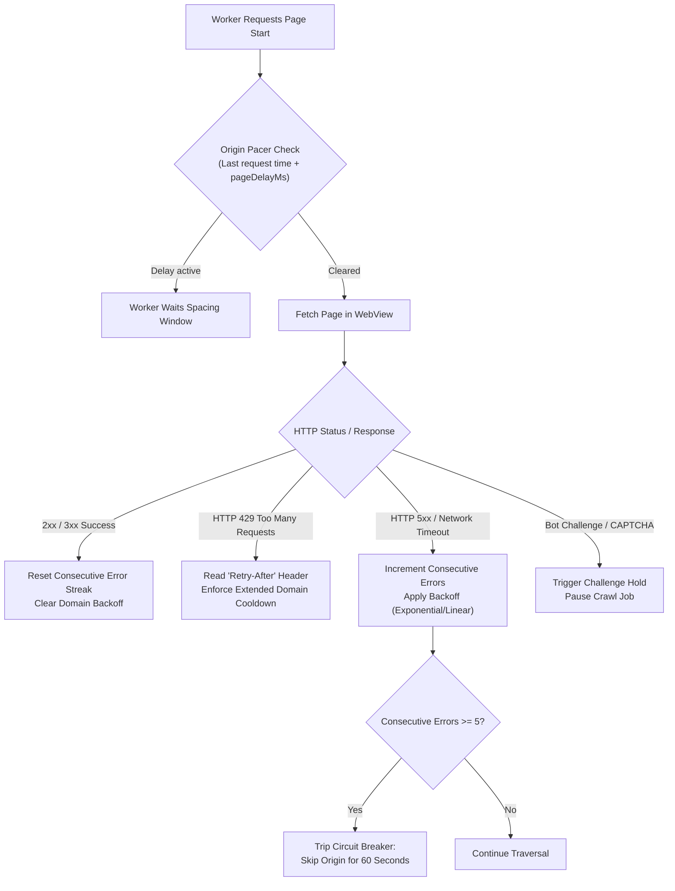
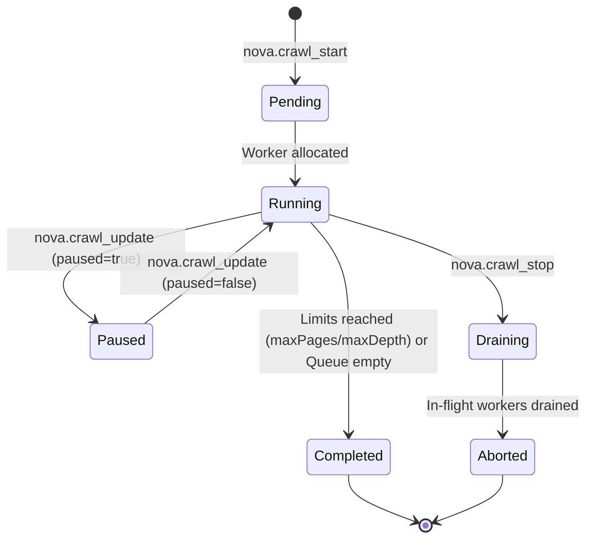

# Autonomous Breadth-First Crawler & URL Traversal

The Nova embedded crawler provides a resource-bounded, background-capable traversal engine designed for deep website discovery, content extraction, and persistent route indexing. 

Operating independently of the user's visible browsing workspace, the crawler executes breadth-first traversal across modern dynamic websites by running isolated background WebViews, waiting for client-side JavaScript to settle, and committing structured crawl records to persistent SQLite storage (`crawl.db`).

---

## 1. System Architecture & Worker Lifecycle

The crawler engine coordinates multiple background worker instances while strictly bounding system memory, network bandwidth, and host impact:

```mermaid
flowchart TD
    subgraph Controller["Crawl Controller & Lifecycle"]
        AgentCmd["Agent MCP Call\n(nova.crawl_start / crawl_update)"]
        Coordinator["Worker Coordinator & State Machine\n(Pending, Running, Paused, Draining, Completed)"]
        Queue["Breadth-First URL Priority Queue\n(Unique canonical URLs, depth-ordered)"]
    end

    subgraph PacingAndSafety["Pacing, Backoff & Circuit Breaker"]
        OriginPacer["Shared Origin Pacer\n(pageDelayMs, burst limits)"]
        BackoffEngine["Adaptive Backoff & 429 Cooldown\n(Exponential backoff, Retry-After header)"]
        CircuitBreaker["Domain Circuit Breaker\n(Skips host after 5 consecutive failures)"]
        ChallengeHold["Challenge Hold Detector\n(Pauses crawl on CAPTCHA / bot challenge)"]
    end

    subgraph WorkerPool["Worker Execution Pool (1 to 3 Workers)"]
        Worker1["Hidden Worker 1\n(Chromium WebView2, no tab presence)"]
        Worker2["Hidden Worker 2\n(Parallel worker sharing origin pacer)"]
        Worker3["Hidden Worker 3\n(Parallel worker sharing origin pacer)"]
        LiveTabWorker["Live Tab Worker\n(Sequential crawl within visible tab context)"]
    end

    subgraph SettlementEngine["Settlement & Extraction"]
        SettleDetector["Crawl Settlement Detector\n(Network idle window + DOM quiet heuristic)"]
        ContentExtractor["Content & Metadata Extractor\n(Readability, selectors, OpenGraph, JSON-LD)"]
        CustomScriptExec["CDP Runtime Evaluator\n(awaitPromise=true, isolated custom scripts)"]
        ScreenshotWriter["Screenshot Writer\n(Bounded dimension PNG/JPEG artifacts)"]
    end

    subgraph Database["Persistent SQLite Intelligence (crawl.db)"]
        CrawlJobs["crawl_jobs\n(Config, status, timings, counters)"]
        CrawlPages["crawl_pages\n(URL, title, status, content, hashes)"]
        CrawlLinks["crawl_links\n(Discovered hyperlinks & graph edges)"]
        SiteUrls["site_urls\n(Persistent canonical URL index)"]
    end

    AgentCmd --> Coordinator
    Coordinator --> Queue
    Queue --> OriginPacer
    OriginPacer --> BackoffEngine --> CircuitBreaker
    CircuitBreaker --> ChallengeHold
    ChallengeHold --> WorkerPool

    WorkerPool --> SettlementEngine
    SettlementEngine --> Database
```

---

## 2. Crawl Execution Modes

Nova provides two distinct crawl execution paradigms depending on isolation and context requirements:

| Dimension | `crawlMode = 'hidden'` (Default) | `crawlMode = 'live_tab'` |
| :--- | :--- | :--- |
| **Worker Surface** | 1 to 3 hidden background WebViews (`parallel: 1..3`). | An existing, visible user browser tab (`parallel: 1`). |
| **Tab Bar Presence** | Completely invisible; does not appear in `nova.tabs`. | Visible in the tab strip; active page changes as crawl advances. |
| **Profile & Storage** | Isolated default profile or inherits a specified tab profile (`targetId`). | Strictly uses the active tab's profile, cookies, and session state. |
| **Concurrency** | True parallel execution across up to 3 independent workers. | Sequential only; each route is visited sequentially within the tab. |
| **SPA Context** | Independent navigation instances for each URL. | Preserves client-side Single-Page Application (SPA) memory across same-document routes. |
| **Robots & Sitemaps** | Supported (`respectRobotsTxt`, `useSitemap`). | Disabled; live tab crawling relies solely on discovered links. |
| **Screenshots & Diff** | Full screenshot and delta capture supported. | Screenshots and delta mode are disabled in live tab mode. |

### Target-Bound Hidden Crawling
When a hidden crawl specifies `targetId`, the crawler binds directly to the browser profile of that target tab or sandbox:
* **Cookie & Session Parity:** The background WebViews share the target's exact cookie jar, indexedDB instances, and local storage keys. This allows crawling authenticated internal portals, staging environments, and personalized dashboards.
* **Canonical Profile Isolation:** The worker reuses the shared WebView2 user-data directory and the target's specific `ProfileName`. It does not create temporary profiles or corrupt live user sessions.
* **Peripheral Lockdown:** Although the background worker shares the user's login session, all prompt-capable device permissions (microphone, webcam, geolocation, screen sharing) are permanently blocked inside hidden workers.

---

## 3. Traversal Queue & Canonical URL Normalization

The crawler maintains a strict breadth-first traversal queue, ordering candidate URLs by discovery depth and enqueue sequence:

### URL Normalization Rules
To prevent infinite loops, duplicate page fetches, and crawl queue explosion, every candidate link passes through Nova's URL canonicalizer before evaluation:
1. **Scheme Validation:** Only absolute `http://` and `https://` URLs are admitted. Unsupported schemes (`javascript:`, `mailto:`, `tel:`, `data:`, `file:`, `about:`) are rejected immediately.
2. **Fragment Removal:** Anchor fragments (`#section-2`, `#/deep/link`) are stripped, ensuring the root document is fetched once.
3. **Trailing Slash Normalization:** Route paths are normalized so that `/docs` and `/docs/` resolve to the same canonical queue key.
4. **Case Preservation:** Unlike simplistic normalizers, path casing is strictly preserved (e.g., `/API/v2/Endpoints` is not converted to lowercase).
5. **Tracker Parameter Stripping:** Marketing parameters (`utm_source`, `utm_medium`, `gclid`, `fbclid`) are stripped, while functional query parameters that alter server response content are retained.

---

## 4. Bounded Crawl Budgets & Limits

Every crawl job is strictly bounded by configurable safety thresholds:

| Parameter | Type | Default | Allowed Range | Description |
| :--- | :---: | :---: | :---: | :--- |
| `maxDepth` | `integer` | `2` | `0` to `10` | Maximum link distance from the initial start URL. `0` fetches only the start URL. |
| `maxPages` | `integer` | `30` | `1` to `500` | Maximum total page documents crawled before gracefully terminating the job. |
| `parallel` | `integer` | `1` | `1` to `3` | Number of concurrent hidden WebViews processing the queue. |
| `pageDelayMs` | `integer` | `500` | `200` to `5000` | Minimum delay in milliseconds between page requests to the same origin. |
| `settleTimeMs` | `integer` | `3000` | `500` to `15000` | Maximum window to wait for network idle and DOM mutation settlement. |
| `burstSize` | `integer` | `5` | `1` to `20` | Maximum requests allowed in a rapid burst before enforcing burst delay. |
| `burstDelayMs` | `integer` | `2000` | `500` to `10000` | Enforced cooling delay following a completed request burst. |

---

## 5. Settlement Detection & Hydration Drift

Modern web pages rely extensively on asynchronous client-side rendering (React, Vue, Angular, Svelte, Next.js). Dispatched HTTP responses containing empty shell containers (`

`) must not be captured prematurely before client scripts execute.

### The Dual Quiet Settlement Heuristic
Nova's `CrawlSettlementDetector` evaluates page readiness inside the worker WebView through CDP `Runtime.evaluate` with `awaitPromise=true`:

1. **Network Quiet Window:** Monitors active network requests initiated by the page. The detector requires all primary document assets, script bundles, and XHR/Fetch calls to complete.
2. **DOM Mutation Silence:** Observes DOM tree changes via an in-page `MutationObserver`. The settlement condition is only satisfied when DOM mutations cease for a sustained quiet window (default 500 ms).
3. **Semantic Completion Overrides:** When `waitFor` selector criteria are specified, the detector enforces that the target selector must be present and visible before settlement is declared, preventing slow components from being skipped.

### Hydration Drift Protection
On Single-Page Applications, client-side hydration frequently alters the browser URL immediately after load (for example, canonical redirects, query param cleanup, or SPA route transitions). Nova's hydration drift detector compares the requested URL with the post-settlement document URL:
* Canonical-equivalent differences (trailing slashes, anchor stripping, tracker removal) are recognized and normalized without failing the crawl.
* Genuine cross-route redirects are detected and updated in the crawl record and the [Site URL Index](../site-url-index/README.md).

---

## 6. Adaptive Domain Pacing & Resilience

To prevent aggressive crawler traffic from overloading origin servers or triggering bot protection countermeasures, Nova provides a centralized pacing and circuit-breaking engine (`CrawlOriginPacer`):

1. **Shared Origin Spacing:** Even when running `parallel: 3` workers, all workers coordinate through a single origin pacer. Parallel workers process distinct domains concurrently or share the same per-origin spacing window, guaranteeing that concurrency does not multiply traffic to a single host.
2. **Backoff Strategies:**
   * `exponential` (Default): Doubling delays upon consecutive network or server failures, capped at `maxBackoffMs` (default 10,000 ms).
   * `linear`: Fixed step increases.
   * `none`: Strict constant pacing.
3. **HTTP 429 Handling:** HTTP 429 responses trigger an automatic priority cooldown, honoring standard `Retry-After` headers where present.
4. **Domain Circuit Breaker:** If a domain fails with consecutive errors exceeding `maxConsecutiveErrors` (default 5), Nova trips the circuit breaker for that domain, skipping subsequent queued URLs for 60 seconds.
5. **Challenge Hold:** When Cloudflare, reCAPTCHA, or bot verification challenges are detected, Nova initiates a `ChallengeHold`, pausing the crawl instead of continuously hammering the challenge page.

---

## 7. Standards Compliance & Discovery Options

### Robots.txt Compliance (`respectRobotsTxt`)
* When enabled (`respectRobotsTxt: true`), the crawler fetches and parses `robots.txt` from the origin root before processing queued URLs.
* Evaluates `User-agent: *` and Nova-specific user agent blocks, honoring `Disallow` paths and the `Crawl-Delay` directive.
* By default, robots.txt is inspected for telemetry and displayed in `nova.crawl_status`, but enforcement is opt-in to support authorized administrative and testing workflows.

### XML Sitemap Expansion (`useSitemap`)
* When enabled (`useSitemap: true`), Nova automatically locates XML sitemaps via:
  1. Standard locations: `/sitemap.xml`, `/sitemap_index.xml`.
  2. Directives declared within `robots.txt` (`Sitemap: https://...`).
* The engine recursively resolves sitemap indexes and child sitemaps, extracting `<loc>` endpoints and enqueuing them into the breadth-first traversal queue, filtered by valid `http`/`https` schemes.

### Content & Metadata Extraction
* **Scoped Text Extraction:** Agents can supply `contentSelector` (e.g., `main`, `article`, `.docs-content`) to extract only primary content, and `excludeSelectors` (e.g., `nav`, `footer`, `.ad-banner`, `.cookie-notice`) to strip peripheral boilerplate.
* **Metadata Extraction:** Automatically extracts page title, meta description, canonical link tag, Open Graph metadata (`og:title`, `og:image`), Twitter cards, and structured JSON-LD schemas.
* **Full-Page Screenshots:** When `captureScreenshots: true` is configured, workers capture PNG or JPEG screenshots of settled pages, stored under `StoragePaths.CrawlScreenshotsDir` with deduplicated SHA-256 hashes.

---

## 8. In-Flight Crawl Operations & MCP Tool Contracts

Agents manage active and completed crawls through the `crawler_ops` MCP tool bundle:

### Tool Inventory & Usage Reference

| Tool | Core Arguments | Diagnostic Outputs |
| :--- | :--- | :--- |
| [`nova.crawl_start`](../../../mcp-reference/tools/crawler-and-discovery/nova-crawl-start.md) | `url`, `maxDepth?`, `maxPages?`, `parallel?`, `pageDelayMs?`, `settleTimeMs?`, `crawlMode?`, `targetId?`, `respectRobotsTxt?`, `useSitemap?`, `urlPattern?`, `excludePattern?`, `contentSelector?`, `captureScreenshots?` | `crawlId`, initial queue status, worker configuration |
| [`nova.crawl_status`](../../../mcp-reference/tools/crawler-and-discovery/nova-crawl-status.md) | `crawlId` | `status` (`running`, `paused`, `completed`), `pagesCrawled`, `queueSize`, `activeWorkers`, `errorCount`, `elapsedSeconds` |
| [`nova.crawl_results`](../../../mcp-reference/tools/crawler-and-discovery/nova-crawl-results.md) | `crawlId`, `limit?`, `offset?`, `statusFilter?`, `includeContent?`, `includeLinks?` | Paged array of crawled pages, HTTP status codes, titles, extracted text, link graphs, and screenshot paths |
| [`nova.crawl_update`](../../../mcp-reference/tools/crawler-and-discovery/nova-crawl-update.md) | `crawlId`, `paused?`, `maxPages?`, `pageDelayMs?`, `settleTimeMs?`, `urlPattern?` | Updated configuration confirmation, modified pacing and limits |
| [`nova.crawl_stop`](../../../mcp-reference/tools/crawler-and-discovery/nova-crawl-stop.md) | `crawlId` | Safe cancellation acknowledgment, drained worker count |

---

## 9. Related Subsystems & Documentation

* [**Crawler & Discovery Architecture Hub**](../README.md) — Architectural overview, dual exploration model, and security boundaries.
* [**Surface Explorer**](../surface-explorer/README.md) — Revealing dynamic in-page DOM states, modals, accordions, and hover menus.
* [**Persistent Site URL Index**](../site-url-index/README.md) — Persistent sitemap memory, URL canonicalization, and live navigation reporting.
* [**AI & MCP Discovery Probes**](../site-discovery-and-mcp/README.md) — Probing `llms.txt`, `/.well-known/mcp.json`, and remote server cards.
* [**Diffs & Verification**](../diff-and-verification/README.md) — Generational crawl diffs, fixed-list verification, and instant tab link extraction.
* [**Task URL Coverage (TUC)**](../../learning/task-url-coverage-tuc/README.md) — Verifying exhaustive task coverage against crawled URL units.
* [**Auth Surface Detection (ASD)**](../../auth-surface-detection-asd/README.md) — Handling login barriers and session authentication during crawls.

---

[All core features](../../README.md) · [Crawler & Discovery MCP Tools](../../../mcp-reference/tools/crawler-and-discovery/README.md)
