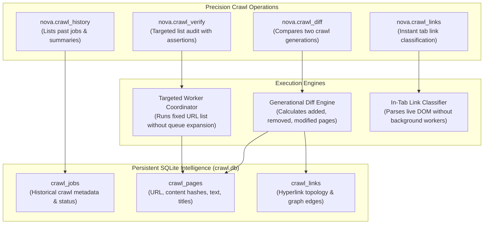
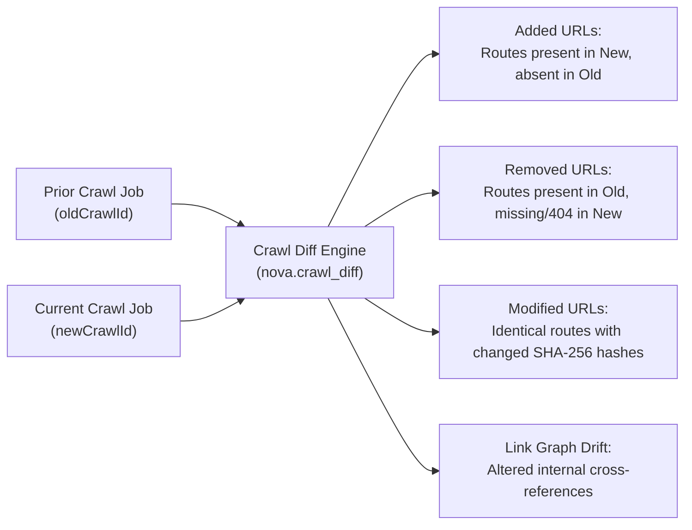
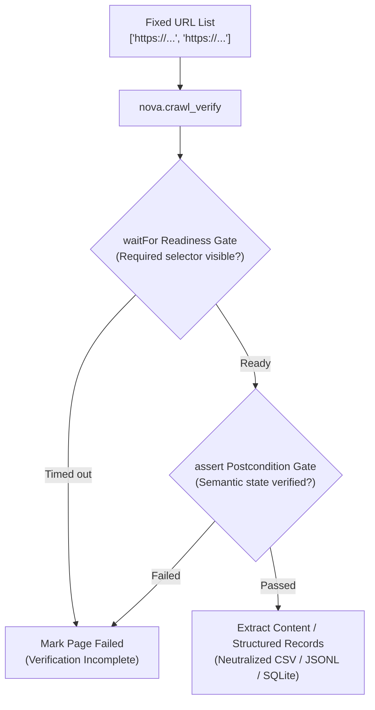
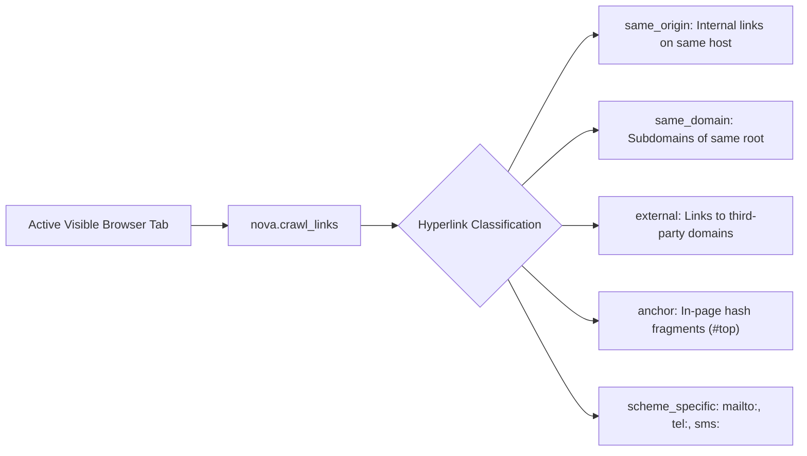

# Crawl History, Diffs, Targeted Verification & Link Analysis

Beyond automated breadth-first crawling, web intelligence workflows frequently require precision auditing: comparing website changes over time, verifying fixed lists of critical routes under strict assertions, or instantly classifying hyperlinks on an active browser tab without background queue overhead.

Nova AI Workspace provides four specialized tools within the `crawler_ops` bundle to address these needs: [`nova.crawl_history`](../../../mcp-reference/tools/crawler-and-discovery/nova-crawl-history.md), [`nova.crawl_diff`](../../../mcp-reference/tools/crawler-and-discovery/nova-crawl-diff.md), [`nova.crawl_verify`](../../../mcp-reference/tools/crawler-and-discovery/nova-crawl-verify.md), and [`nova.crawl_links`](../../../mcp-reference/tools/crawler-and-discovery/nova-crawl-links.md).

---

## 1. System Architecture & Precision Operations

These tools leverage the persistent SQLite crawl database (`crawl.db`) and Nova's settlement engine to perform targeted operations:



---

## 2. Generational Change Detection with `nova.crawl_diff`

Websites change continuously: documentation is updated, legacy endpoints are deprecated, and new product pages appear. By comparing two crawl jobs of the same website, agents detect exact structural and content drifts:



### The Three Change Categories

1. **`added_urls`:** Routes that exist in `newCrawlId` but were not discovered in `oldCrawlId`. Useful for detecting newly published API endpoints, changelogs, or articles.
2. **`removed_urls`:** Routes that existed in `oldCrawlId` but are absent or return HTTP 404 in `newCrawlId`. Useful for broken link detection and deprecation audits.
3. **`modified_urls`:** Routes present in both crawls whose page content hash (`page_hash`), extracted text, or page title has changed.
4. **`unchanged_urls`:** Stable pages (optionally included via `includeUnchanged: true`).

### Calling `nova.crawl_diff`

```json
{
  "name": "nova.crawl_diff",
  "arguments": {
    "oldCrawlId": "crawl_20261001_docs",
    "newCrawlId": "crawl_20261010_docs",
    "includeUnchanged": false,
    "limit": 50
  }
}
```

---

## 3. Targeted Batch Verification with `nova.crawl_verify`

Unlike `nova.crawl_start` (which traverses outgoing links breadth-first), [`nova.crawl_verify`](../../../mcp-reference/tools/crawler-and-discovery/nova-crawl-verify.md) visits a **strictly fixed, non-expanding list of URLs**:



### Key Differences from Standard Crawling

* **Zero Link Expansion:** Discovered hyperlinks inside verified pages are never added to the queue.
* **Deterministic Batches:** Exactly the provided URLs are visited, ensuring predictable execution times and token consumption.
* **Semantic Readiness (`waitFor`):** Ensures elements have finished rendering before verification succeeds. HTTP 200 or `document.readyState=complete` is insufficient if the required selector is not visible.
* **Postcondition Assertions (`assert`):** Evaluates declarative postconditions against the settled page (e.g., verifying that a specific banner exists or an error toast is absent). A verification batch where all pages fail assertion terminates as failed.

### Research Automation & Structured Extraction

`nova.crawl_verify` supports deterministic research data collection:
* **Custom Extraction Scripts (`customScript`):** Executes isolated scripts that return typed records `{ state, records }`. Record keys are strictly validated before committing.
* **Read-Only Popover Extraction (`readOnlyPopover`):** Extracts content from hover/popover elements using selector/attribute rules without dispatching DOM events, focus shifts, or mutations.
* **Formula Neutralization in CSV Exports:** All text cells exported to CSV are neutralized to prevent spreadsheet formula injection attacks (`=CMD(...)`, `+`, `-`, `@`).
* **Atomic Checkpoints:** Records and page snapshots commit within atomic SQLite transactions, supporting resumable extraction runs across crashes.

---

## 4. Instant In-Tab Link Extraction with `nova.crawl_links`

When an agent is viewing an open tab and needs to inspect available links before deciding whether to navigate or crawl, [`nova.crawl_links`](../../../mcp-reference/tools/crawler-and-discovery/nova-crawl-links.md) extracts and classifies all hyperlinks immediately:



### Advantages Over Crawling
* **Immediate:** Returns in milliseconds; requires no background worker allocation or queue initialization.
* **Context-Preserving:** Operates directly on the current DOM state of the visible tab, including dynamically injected links from JavaScript widgets.
* **Pre-Flight Planning:** Allows agents to count internal vs external links and filter by regex pattern (`urlPattern`) before committing to a multi-page crawl.

---

## 5. Tool Contract Summary

| Tool | Core Arguments | Diagnostic Outputs |
| :--- | :--- | :--- |
| [`nova.crawl_history`](../../../mcp-reference/tools/crawler-and-discovery/nova-crawl-history.md) | `scopeKey?`, `status?`, `limit?` | Array of past crawl jobs with crawl IDs, start URLs, page counts, and start/finish timestamps |
| [`nova.crawl_diff`](../../../mcp-reference/tools/crawler-and-discovery/nova-crawl-diff.md) | `oldCrawlId`, `newCrawlId`, `includeUnchanged?`, `limit?` | Arrays of `added_urls`, `removed_urls`, `modified_urls`, with SHA-256 content hashes |
| [`nova.crawl_verify`](../../../mcp-reference/tools/crawler-and-discovery/nova-crawl-verify.md) | `urls`, `waitFor?`, `assert?`, `customScript?`, `readOnlyPopover?`, `extractContent?` | Verified pages, assertion outcomes, structured extracted records, failure diagnostics |
| [`nova.crawl_links`](../../../mcp-reference/tools/crawler-and-discovery/nova-crawl-links.md) | `targetId?`, `urlPattern?`, `sameDomainOnly?`, `sameScopeOnly?`, `includeText?` | Categorized link arrays (`same_origin`, `external`, `anchor`) with link text and hrefs |

---

## 6. Related Documentation

* [**Crawler & Discovery Architecture Hub**](../README.md) — Architectural overview, dual exploration model, and security invariants.
* [**Autonomous Breadth-First Crawler**](../crawler/README.md) — Multi-worker route traversal, settlement detection, and sitemap expansion.
* [**Surface Explorer**](../surface-explorer/README.md) — Revealing dynamic in-page DOM states, modals, accordions, and hover menus.
* [**Site URL Index & Live Reporting**](../site-url-index/README.md) — Persistent sitemap memory, URL canonicalization, and live navigation reporting.
* [**AI & MCP Discovery Probes**](../site-discovery-and-mcp/README.md) — Probing `llms.txt`, `/.well-known/mcp.json`, and remote server cards.
* [**Crawl Diff MCP Tool Reference**](../../../mcp-reference/tools/crawler-and-discovery/nova-crawl-diff.md) — Detailed parameters for `nova.crawl_diff`.
* [**Crawl Verify MCP Tool Reference**](../../../mcp-reference/tools/crawler-and-discovery/nova-crawl-verify.md) — Detailed parameters for `nova.crawl_verify`.
* [**Crawl Links MCP Tool Reference**](../../../mcp-reference/tools/crawler-and-discovery/nova-crawl-links.md) — Detailed parameters for `nova.crawl_links`.

---

[All core features](../../README.md) · [Crawler & Discovery overview](../README.md)
