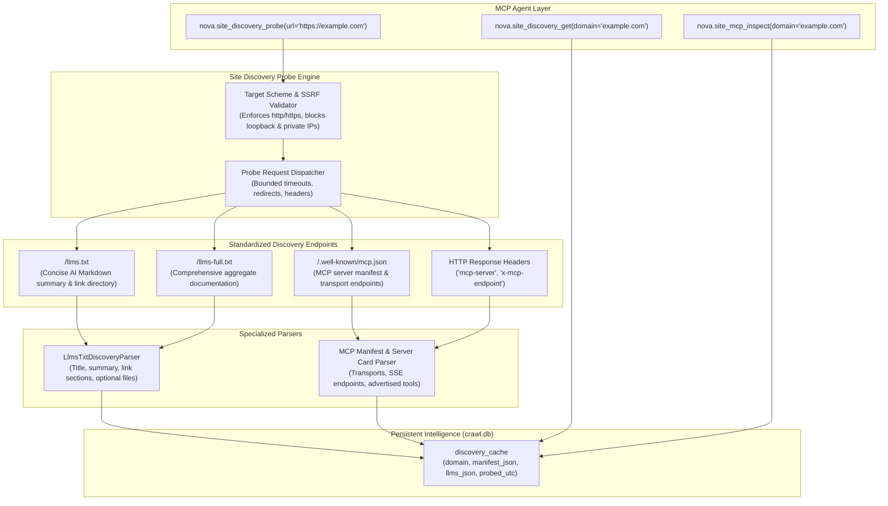
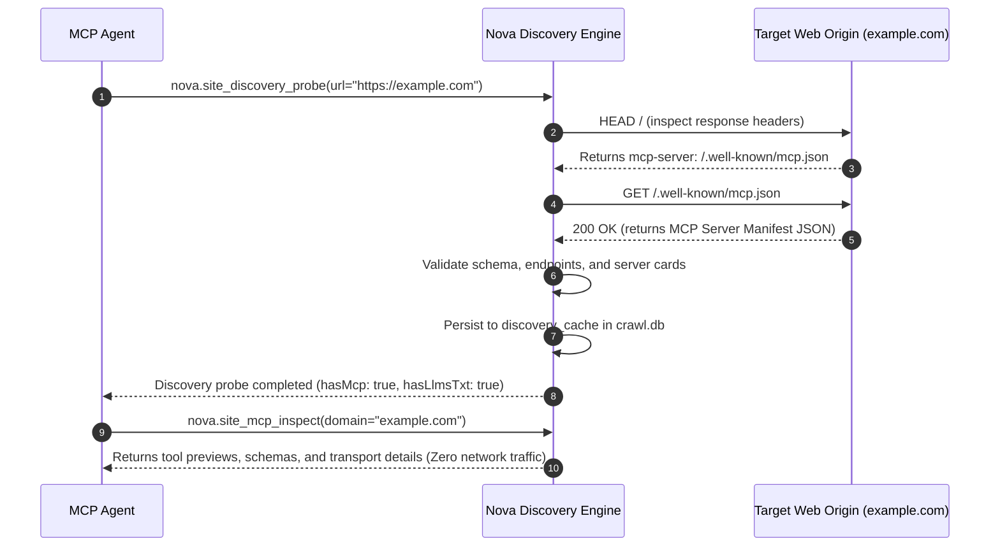
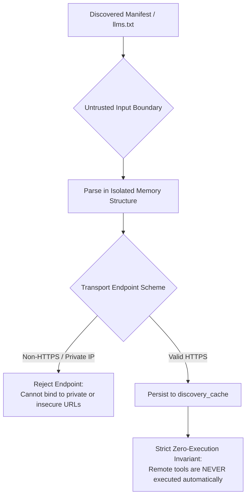

# AI Discovery, llms.txt & Website MCP Probing

As websites evolve from purely human-oriented graphical interfaces toward agent-accessible platforms, modern web origins increasingly publish machine-readable discovery files. These standards allow AI agents to understand site architecture, read concise documentation, and discover remote Model Context Protocol (MCP) server endpoints without parsing complex HTML layouts.

Nova AI Workspace provides built-in discovery probes that automatically detect, parse, and cache modern AI discovery endpoints (`llms.txt`, `llms-full.txt`, and `/.well-known/mcp.json`) in persistent SQLite storage (`crawl.db`), exposing structured tools for immediate inspection.

---

## 1. System Architecture & Discovery Flow

The discovery engine coordinates lightweight probing, content parsing, and cached retrieval:



---

## 2. Supported Discovery Standards

Nova actively inspects websites for two complementary machine-readable standards:

| Standard | Standard File / Location | Primary Purpose | Format |
| :--- | :--- | :--- | :--- |
| **`llms.txt`** | `/llms.txt`, `/llms-full.txt` | Provides LLM-friendly documentation summaries, key concepts, and links to detailed Markdown guides. | GitHub Flavored Markdown (GFM) |
| **MCP Server Discovery** | `/.well-known/mcp.json` or HTTP header `mcp-server` | Advertises remote Model Context Protocol servers hosted by the domain, including transport URLs and capabilities. | JSON (MCP Discovery Schema) |
| **Agent-to-Agent (A2A)** | Manifest declarations in `mcp.json` | Specifies inter-agent communication protocols and capability cards for autonomous collaboration. | JSON-LD / MCP Metadata |

---

## 3. The `llms.txt` Specification & Parsing

The `llms.txt` convention allows documentation platforms, developer portals, and knowledge bases to provide concise, clean Markdown documentation tailored specifically for AI context windows.

### What `llms.txt` Contains
* **Header:** Primary project title and summary statement.
* **Sections:** Categorized links to authoritative documentation guides.
* **Optional Details:** Brief summaries for each link and links to complete, concatenated files (`llms-full.txt`).

### Nova's Parsing Engine (`LlmsTxtDiscoveryParser`)
When `nova.site_discovery_probe` encounters an `llms.txt` file, Nova parses it into structured components:
1. **Title & Summary Extraction:** Extracts the root H1 heading and introductory paragraph.
2. **Link Categorization:** Extracts section headings (e.g., `## Core Concepts`, `## API Reference`) and maps child links to absolute URLs.
3. **Full Reference Linking:** Automatically checks for `/llms-full.txt` if declared or available, allowing agents to ingest the entire knowledge base in a single read.

---

## 4. Model Context Protocol (MCP) Web Discovery

Websites can expose their internal APIs and agent capabilities directly through remote Model Context Protocol servers. Nova detects these endpoints automatically:



### The Discovery Manifest (`mcp.json`)
The manifest typically declares:
* **Server Identity:** Name, version, description, and author.
* **Transport Bindings:** Server-Sent Events (SSE) endpoints (e.g., `https://api.example.com/mcp/sse`) or WebSocket streaming URLs.
* **Authentication Requirements:** OAuth 2.0 authorization endpoints, Bearer token requirements, or public access flags.
* **Tool Catalog Preview:** Names, descriptions, and input JSON schemas for tools provided by the remote server.

---

## 5. MCP Discovery Tool Contracts

Agents interact with discovery files through tools in the `system_tools` and `crawler_ops` bundles:

### 1. `nova.site_discovery_probe`
Actively probes a web origin for discovery endpoints over the network:

```json
{
  "name": "nova.site_discovery_probe",
  "arguments": {
    "url": "https://docs.anthropic.com",
    "forceRefresh": false
  }
}
```

**Result Payload:**
```json
{
  "domain": "docs.anthropic.com",
  "probedUtc": "2026-10-10T01:45:00Z",
  "hasLlmsTxt": true,
  "hasLlmsFullTxt": true,
  "hasMcp": false,
  "llmsTxt": {
    "title": "Anthropic Documentation",
    "summary": "Official guides, API references, and prompt engineering resources.",
    "sections": [
      {
        "name": "Guides",
        "linkCount": 18
      }
    ]
  }
}
```

### 2. `nova.site_discovery_get`
Retrieves cached discovery results instantly without making network requests:

```json
{
  "name": "nova.site_discovery_get",
  "arguments": {
    "domain": "docs.anthropic.com"
  }
}
```

### 3. `nova.site_mcp_inspect`
Inspects remote MCP server metadata from cached discovery data:

```json
{
  "name": "nova.site_mcp_inspect",
  "arguments": {
    "domain": "api.example.com"
  }
}
```

**Result Payload:**
```json
{
  "domain": "api.example.com",
  "serverName": "Example Public API MCP",
  "transportKind": "sse",
  "endpointUrl": "https://api.example.com/mcp/sse",
  "requiresAuth": true,
  "advertisedTools": [
    {
      "name": "search_catalog",
      "description": "Searches product inventory by keyword and category.",
      "inputSchema": { "type": "object", "properties": { "query": { "type": "string" } } }
    }
  ]
}
```

---

## 6. Security, Safety & Trust Boundaries

Because discovery files originate from external third-party web servers, Nova enforces strict security invariants:



### 1. Untrusted Input Posture
All content retrieved from `llms.txt`, `llms-full.txt`, and `mcp.json` is treated as untrusted third-party data. Tool descriptions, prompt suggestions, and schemas are sanitized to prevent prompt injection attacks against LLMs.

### 2. SSRF & Scheme Isolation
Discovery probes strictly enforce `http://` and `https://` schemes. Probes to loopback addresses (`127.0.0.1`, `::1`), link-local IPs (`169.254.x.x`), or RFC 1918 private subnets are permanently blocked, preventing malicious servers from redirecting probes to internal network services.

### 3. The Zero Auto-Execution Invariant
**Discovered remote MCP servers and their advertised tools are NEVER executed automatically.** 
* `nova.site_mcp_inspect` is strictly read-only; it inspects schemas and descriptions without establishing persistent network connections or calling remote methods.
* Connecting to a discovered remote MCP server requires explicit user approval and administrative configuration via Nova's External Server settings or [`nova.site_mcp_connect_request`](../../../mcp-reference/tools/site-data-and-identity/nova-site-mcp-connect-request.md).

---

## 7. Related Documentation

* [**Crawler & Discovery Architecture Hub**](../README.md) — Architectural overview, dual exploration model, and security boundaries.
* [**Autonomous Breadth-First Crawler**](../crawler/README.md) — Multi-worker crawling, limits, settlement, pacing, and robots/sitemap support.
* [**Surface Explorer**](../surface-explorer/README.md) — Revealing dynamic in-page DOM states, modals, accordions, and hover menus.
* [**Site URL Index & Live Reporting**](../site-url-index/README.md) — Persistent sitemap memory, URL canonicalization, and live navigation reporting.
* [**Diffs & Verification**](../diff-and-verification/README.md) — Generational crawl diffs, fixed-list verification, and instant link extraction.
* [**Site Discovery Probe Tool Reference**](../../../mcp-reference/tools/crawler-and-discovery/nova-site-discovery-probe.md) — Detailed parameters for `nova.site_discovery_probe`.
* [**Site Discovery Get Tool Reference**](../../../mcp-reference/tools/crawler-and-discovery/nova-site-discovery-get.md) — Detailed parameters for `nova.site_discovery_get`.
* [**Site MCP Inspect Tool Reference**](../../../mcp-reference/tools/site-data-and-identity/nova-site-mcp-inspect.md) — Inspecting remote MCP server capabilities.

---

[All core features](../../README.md) · [Crawler & Discovery overview](../README.md)
