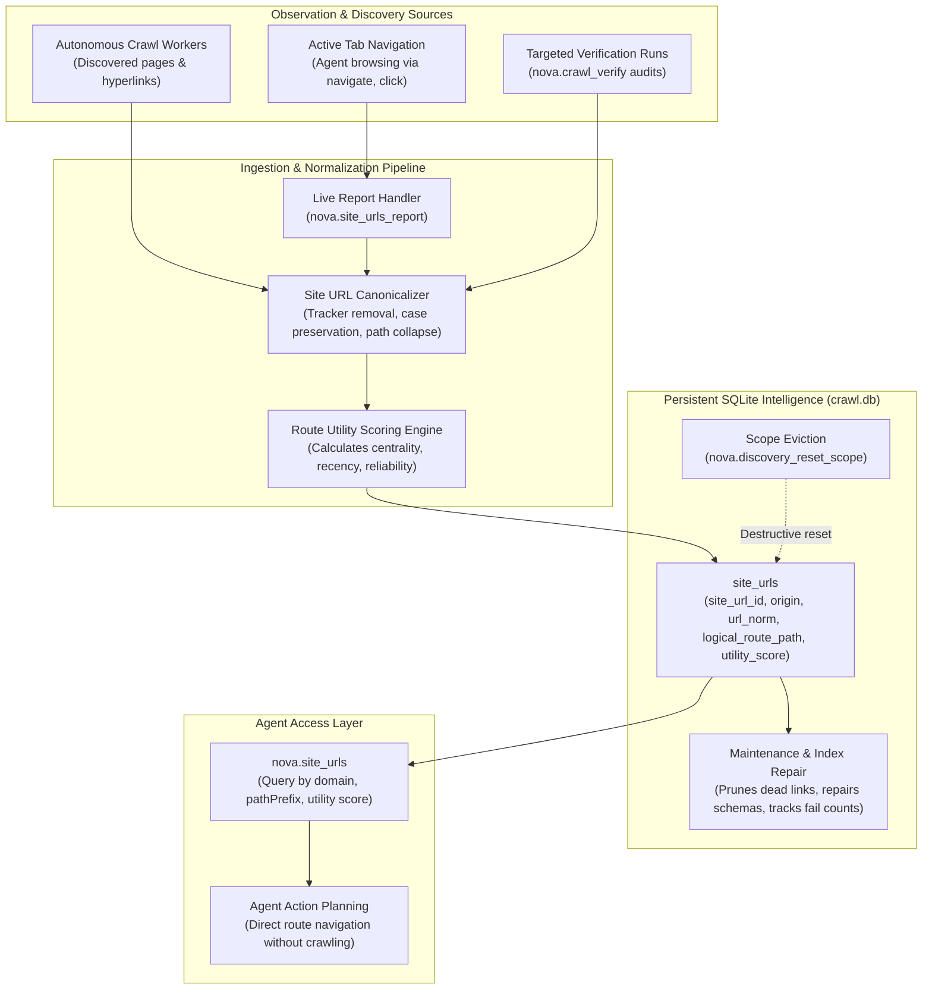
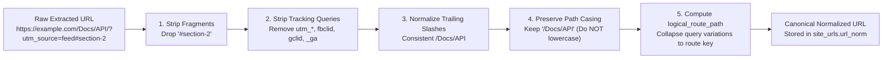

# Persistent Site URL Index & Live Navigation Intelligence

The **Site URL Index** is Nova AI Workspace's persistent routing memory. Rather than forcing autonomous agents to perform repetitive, token-expensive, and rate-limited website crawls each time they need to locate documentation or specific endpoints, Nova maintains a structured atlas of known URLs, HTTP status observations, and utility scores in a persistent SQLite database (`crawl.db`).

The index serves two operational paradigms: **Index-First Querying** (retrieving known paths before navigating) and **Live Ingestion** (opportunistically learning from regular browsing traffic without background crawler overhead).

---

## 1. System Architecture & The Index Lifecycle

The Site URL Index sits between Nova's active browser tabs, background crawl workers, and persistent SQLite storage:



---

## 2. Why Index-First Navigation Outperforms Re-Crawling

When an agent needs to consult developer documentation, examine an e-commerce catalog, or audit administrative settings, traditional web automation approaches suffer from severe inefficiencies:

| Dimension | Brute-Force Re-Crawling | Index-First Navigation with Nova |
| :--- | :--- | :--- |
| **Time to First Route** | **High:** Minutes spent waiting for breadth-first queue traversals. | **Zero Latency:** Instant SQLite index query via [`nova.site_urls`](../../../mcp-reference/tools/crawler-and-discovery/nova-site-urls.md). |
| **Token Burn** | **Extreme:** Thousands of tokens spent parsing intermediate index pages. | **Minimal:** Only the relevant target route is queried and loaded. |
| **Network & Server Load** | **High:** Heavy bursts of HTTP requests triggering bot detection. | **None:** Reads local SQLite cache without emitting external network traffic. |
| **Session Persistence** | **Ephemeral:** Lost as soon as the automation script terminates. | **Cross-Session:** Survives browser restarts and multi-agent handoffs. |

---

## 3. URL Canonicalization & Normalization

Websites frequently present the same logical resource through hundreds of syntactic variations (tracking parameters, session tokens, case discrepancies, trailing slashes, anchor fragments). Left unchecked, raw URL ingestion causes index fragmentation and duplicate traversals.

Nova's `SiteUrlCanonicalizer` cleans every candidate route before it enters `site_urls`:



### The Five Normalization Rules

1. **Fragment Stripping:** Anchor identifiers (`#overview`, `#/spa/route`) are stripped from server-side route records so the root document is indexed once.
2. **Tracker & Telemetry Parameter Scrubbing:** Strips common marketing parameters (`utm_source`, `utm_medium`, `utm_campaign`, `gclid`, `fbclid`, `mc_eid`, `_ga`) while strictly preserving functional parameters that alter returned content (e.g., `?id=123`, `?page=2`, `?category=books`).
3. **Trailing Slash Deduplication:** Ensures that `/guide` and `/guide/` resolve to the same canonical database identity, preventing duplicate records.
4. **Strict Path-Case Preservation:** While hostnames are lowercased per RFC 3986, path components are strictly preserved. Lowercasing paths breaks case-sensitive web frameworks (e.g., `/Wiki/Special_Pages` vs `/wiki/special_pages`).
5. **Logical Route Path Collapsing:** The canonicalizer generates `logical_route_path`, collapsing cosmetic query-string variants under a unified route key. This prevents overview summaries and sitemap graphs from rendering duplicate rows.

---

## 4. SQLite Schema & Entity Model

The `site_urls` table in `crawl.db` stores comprehensive route metadata:

```sql
CREATE TABLE site_urls (
    site_url_id         TEXT PRIMARY KEY,
    domain              TEXT NOT NULL,
    scope_key           TEXT NOT NULL,
    origin              TEXT NOT NULL,
    url                 TEXT NOT NULL,
    url_norm            TEXT NOT NULL UNIQUE,
    logical_route_path  TEXT NOT NULL,
    http_status         INTEGER,
    title               TEXT,
    utility_score       REAL DEFAULT 1.0,
    visit_count         INTEGER DEFAULT 0,
    verify_fail_count   INTEGER DEFAULT 0,
    exploration_state   TEXT DEFAULT 'UNEXPLORED',
    last_observed_utc   DATETIME,
    last_explored_utc   DATETIME
);
```

### Core Fields

* **`url_norm`:** The canonicalized URL string used as the unique index key.
* **`logical_route_path`:** The normalized path projection used for route-level grouping and reporting.
* **`http_status`:** The most recently observed HTTP status code (`200`, `301`, `302`, `404`, `500`).
* **`utility_score`:** A floating-point relevance metric (1.0 to 10.0) reflecting link centrality, visit frequency, and document importance.
* **`verify_fail_count`:** Tracks consecutive failure observations during targeted audits, allowing the engine to demote or flag dead links.
* **`exploration_state`:** Tracks whether the page has undergone interactive [Surface Exploration](../surface-explorer/README.md) (`UNEXPLORED`, `DISCOVERED`, `EXPLORED`).

---

## 5. Index-First Workflows with `nova.site_urls`

Agents query the persistent index using [`nova.site_urls`](../../../mcp-reference/tools/crawler-and-discovery/nova-site-urls.md):

```json
{
  "name": "nova.site_urls",
  "arguments": {
    "domain": "docs.example.com",
    "pathPrefix": "/api/v2/",
    "limit": 25,
    "includeDead": false
  }
}
```

### Response Projection

The tool returns an ordered array of matching routes with their canonical URLs, titles, HTTP statuses, and utility scores:

```json
{
  "domain": "docs.example.com",
  "totalMatches": 42,
  "urls": [
    {
      "url": "https://docs.example.com/api/v2/authentication",
      "logicalRoute": "/api/v2/authentication",
      "title": "API v2 Authentication Guide",
      "status": 200,
      "utilityScore": 8.5,
      "explorationState": "EXPLORED"
    },
    {
      "url": "https://docs.example.com/api/v2/endpoints",
      "logicalRoute": "/api/v2/endpoints",
      "title": "REST Endpoints Reference",
      "status": 200,
      "utilityScore": 7.8,
      "explorationState": "UNEXPLORED"
    }
  ]
}
```

By querying the index before navigating, the agent can immediately jump directly to `https://docs.example.com/api/v2/authentication` without exploring navigation menus or parsing landing pages.

---

## 6. Live Navigation Ingestion with `nova.site_urls_report`

The Site URL Index is not static; it continuously updates as an agent interacts with the browser. Agents use [`nova.site_urls_report`](../../../mcp-reference/tools/crawler-and-discovery/nova-site-urls-report.md) to report real-time navigation observations:

```json
{
  "name": "nova.site_urls_report",
  "arguments": {
    "reports": [
      {
        "url": "https://docs.example.com/api/v2/endpoints/webhooks",
        "kind": "new_page",
        "title": "Webhooks Reference",
        "httpStatus": 200
      },
      {
        "url": "https://docs.example.com/api/v1/legacy",
        "kind": "not_found",
        "httpStatus": 404
      },
      {
        "url": "https://docs.example.com/docs/auth",
        "kind": "redirect",
        "targetUrl": "https://docs.example.com/api/v2/authentication",
        "httpStatus": 301
      }
    ]
  }
}
```

### Observation Types

1. **`new_page`:** Registers a previously unknown URL discovered in page markup or JavaScript navigation.
2. **`not_found`:** Marks a route as dead (`httpStatus: 404`) and increments its `verify_fail_count`, preventing other agents from visiting broken paths.
3. **`redirect`:** Documents permanent or temporary redirects (`301`/`302`), binding the alias route to the canonical destination.
4. **`canonical`:** Reports explicit `<link rel="canonical">` declarations found in page headers, updating alias mappings.

---

## 7. Scope Cleanliness & `nova.discovery_reset_scope`

When a website undergoes a major redesign, changes URL structure, or when testing requires a pristine environment, agents can reset stored knowledge for an origin or domain using [`nova.discovery_reset_scope`](../../../mcp-reference/tools/crawler-and-discovery/nova-discovery-reset-scope.md):

```json
{
  "name": "nova.discovery_reset_scope",
  "arguments": {
    "domain": "staging.example.com"
  }
}
```

### What Reset Scope Clears
`nova.discovery_reset_scope` executes an atomic SQLite transaction in `crawl.db`:
* Deletes all matching entries in `site_urls` for the specified domain/scope.
* Deletes associated crawl records in `crawl_pages`, `crawl_links`, and `crawl_jobs`.
* Evicts cached AI/MCP discovery probe entries in `discovery_cache`.
* Removes stored Surface Explorer graph entries in `exploration_pages` and `exploration_interactions`.
* Deletes orphaned screenshot artifacts under `StoragePaths.CrawlScreenshotsDir`.

---

## 8. Related Documentation

* [**Crawler & Discovery Architecture Hub**](../README.md) — Architectural overview, dual exploration model, and security invariants.
* [**Autonomous Breadth-First Crawler**](../crawler/README.md) — Multi-worker route traversal, settlement detection, and sitemap expansion.
* [**Surface Explorer**](../surface-explorer/README.md) — Revealing dynamic in-page DOM states, modals, accordions, and hover menus.
* [**AI & MCP Discovery Probes**](../site-discovery-and-mcp/README.md) — Probing `llms.txt`, `/.well-known/mcp.json`, and remote server cards.
* [**Diffs & Verification**](../diff-and-verification/README.md) — Generational crawl diffs, fixed-list verification, and instant link extraction.
* [**Site URLs MCP Tool Reference**](../../../mcp-reference/tools/crawler-and-discovery/nova-site-urls.md) — Detailed parameter contract for `nova.site_urls`.
* [**Site URLs Report Tool Reference**](../../../mcp-reference/tools/crawler-and-discovery/nova-site-urls-report.md) — Detailed parameter contract for `nova.site_urls_report`.

---

[All core features](../../README.md) · [Crawler & Discovery overview](../README.md)
