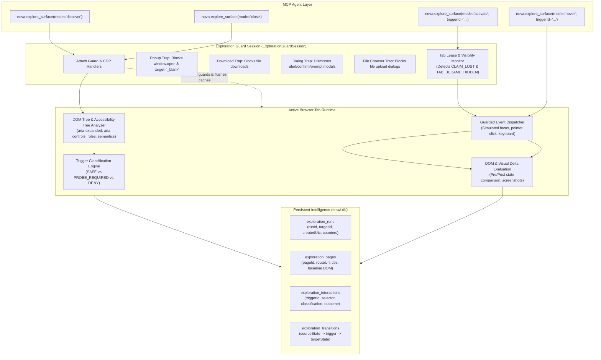
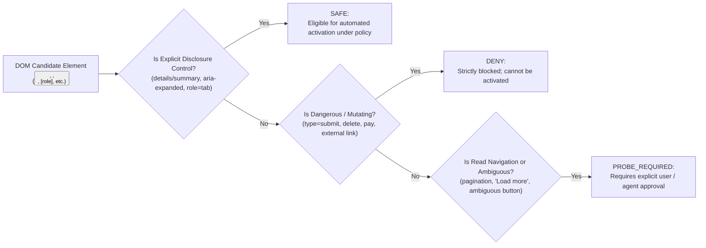
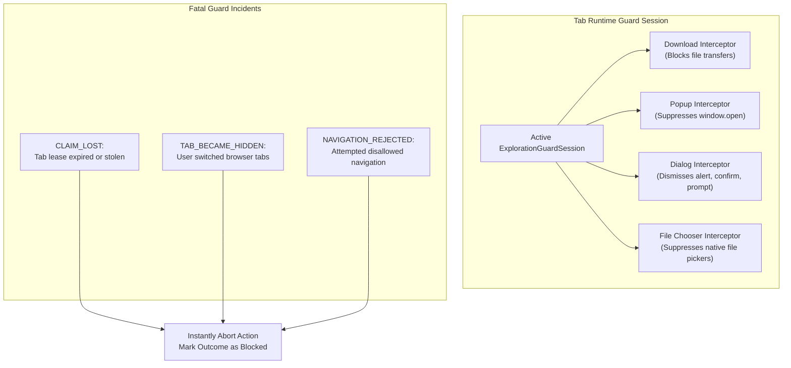
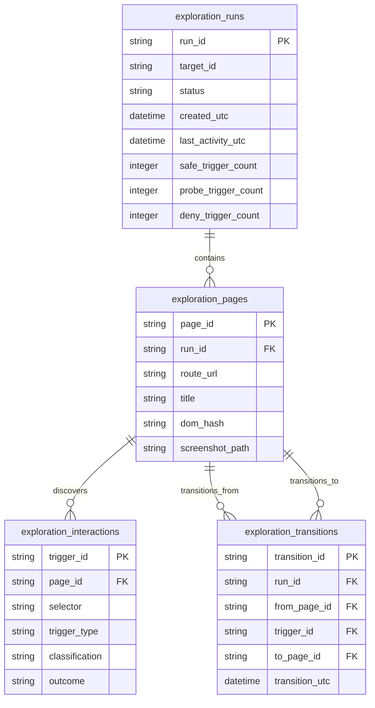

# Surface Explorer & Interactive DOM State Analysis

Modern web applications and Single-Page Applications (SPAs) store substantial portions of their content, documentation, and user interfaces behind dynamic, interactive disclosure controls. Collapsible accordions, tab switchers, modal dialogs, popovers, flyout menus, and hover tooltips frequently alter the visible page without changing the browser URL.

While standard crawlers map routes between URLs, Nova's **Surface Explorer** enables agents to safely, systematically discover and activate interactive in-page controls within the visible tab. It operates under a strict, multi-layered guard session that prevents destructive actions, popup windows, unintended downloads, and navigation drift.

---

## 1. System Architecture & The Exploration Lifecycle

Surface Explorer operates through the `nova.explore_surface` tool (part of the `surface_explorer` capability bundle). It binds directly to the active tab leased by the calling agent:



---

## 2. Four Operational Modes

Surface Explorer structures interactive exploration into four explicit, decoupled lifecycle modes:

| Mode | Core Purpose | Safety & Execution Invariants | Persistence |
| :--- | :--- | :--- | :--- |
| **`discover`** | Scans the active document and builds an inventory of interactive triggers. | **Non-mutating.** Dispatches zero clicks or keyboard events. Merely catalogs elements and their classifications. | Creates an active run in `exploration_runs` and stores discovered triggers in `exploration_interactions`. |
| **`activate`** | Activates an eligible disclosure control from an existing open run. | **Guarded execution.** Re-checks trigger eligibility, validates active tab lease, arms the guard session, and dispatches the action. | Records the transition ($S_0 \to S_1$), DOM deltas, and state outcome. |
| **`hover`** | Peeks at hover-dependent UI elements (tooltips, preview popovers). | **Visual before/after comparison.** Always requires explicit agent/user approval. Returns whether hover content was revealed. | Captures visual diff evidence; does not permanently mutate DOM state. |
| **`close`** | Concludes the exploration session. | **Idempotent cleanup.** Disarms `ExplorationGuardSession`, unhooks CDP interceptors, and clears runtime caches. | Marks the run status as closed in SQLite. Does not undo DOM mutations made by the site. |

---

## 3. Trigger Classification Engine

Not all clickable DOM elements represent benign disclosure controls. A click might submit a payment form, delete a record, trigger a file download, or navigate away from the current domain.

Before any interaction is permitted, Nova's classification engine categorizes candidate elements into one of three strict tiers:



### Classification Tiers Explained

1. **`SAFE` (Explicit Disclosure Controls):**
   * Elements designed exclusively to toggle the visibility of content without performing server-side state mutations or navigation.
   * Examples: Native `<details><summary>` elements, buttons with `aria-expanded="false"`, tab navigation items with `role="tab"`, accordion header buttons, and hamburger menu toggles.
   * Activation: Eligible for activation under standard exploration policies.
2. **`PROBE_REQUIRED` (Semantic & Heuristic Candidates):**
   * Controls that appear to be read-only navigation or dynamic content expansion, but lack explicit ARIA disclosure markers.
   * Examples: "Load more comments" buttons, pagination controls ("Next page", "Page 2"), infinite scroll triggers, and clickable cards.
   * Activation: Requires explicit agent confirmation or user approval. Cannot be activated silently.
3. **`DENY` (Dangerous / State-Mutating Controls):**
   * Elements that submit forms, initiate destructive operations, handle authentication, or perform transactions.
   * Examples: `<button type="submit">`, elements matching payment/checkout patterns, "Delete", "Remove", "Confirm Purchase", external navigation links, and `<input type="file">`.
   * Activation: Strictly rejected. Disallowed from automated exploration under all circumstances.

---

## 4. Guarded Interaction Architecture

During `activate` and `hover` operations, Nova enforces an airtight security envelope through the `ExplorationGuardSession`:



### The Seven Protective Invariants

1. **Download Interception:** All download events initiated by page scripts during activation are trapped and cancelled before writing data to disk.
2. **Popup & Window Creation Suppression:** Calls to `window.open()`, `target="_blank"` link clicks, and new window creation events are intercepted and dropped.
3. **Protocol Launch Blocking:** External OS protocol handlers (`mailto:`, `tel:`, custom app schemes) are blocked.
4. **Script Dialog Trapping:** Native JavaScript dialogs (`window.alert`, `window.confirm`, `window.prompt`, `beforeunload`) are automatically dismissed with non-mutating defaults, preventing the browser thread from hanging.
5. **File Chooser Containment:** File upload prompts (`Page.setInterceptFileChooserDialog`) are trapped and aborted, preventing native Windows file dialogs from opening.
6. **Tab Claim Monitoring (`CLAIM_LOST`):** The guard continuously monitors the calling agent's tab claim. If the claim expires, is released, or is overridden by a user action, exploration is terminated instantly.
7. **Visibility Protection (`TAB_BECAME_HIDDEN`):** If the user switches away from the tab or changes active sandbox profiles during an in-flight activation, Nova raises `TAB_BECAME_HIDDEN` and halts execution, ensuring background tabs are never manipulated invisibly.

---

## 5. Outcome Taxonomy & State Evaluation

Dispatched interactions are evaluated based on observable evidence rather than the mere dispatch of a synthetic click:

$$\text{Interaction Outcome} \in \{\text{delta\_observed}, \text{no\_delta}, \text{blocked\_by\_guard}, \text{navigation\_rejected}, \text{claim\_lost}\}$$

| Outcome Code | Meaning | Action & Error Handling |
| :--- | :--- | :--- |
| **`delta_observed`** | The trigger successfully expanded a panel, opened a modal, or altered visible DOM content. | Recorded in `exploration_transitions` with DOM mutation diff and optional screenshot. |
| **`no_delta`** | The click was dispatched without error, but produced no measurable DOM mutation or visual change (e.g., already-open accordion, disabled button). | Recorded as a non-error. Clears consecutive error streaks without failing the run. |
| **`blocked_by_guard`** | The interaction attempted an unauthorized action (e.g., triggered a file download, opened a popup, or prompted for a file upload) and was halted by the guard. | Interaction aborted; security incident logged in run diagnostics. |
| **`navigation_rejected`** | The trigger attempted to navigate to an external origin or unsupported route. | Interaction aborted; tab stays on current document. |
| **`claim_lost`** | The agent lost exclusive lease over the tab mid-flight. | Exploration aborted immediately; agent must re-acquire tab lease. |

---

## 6. Graph Modeling & Persistent Storage (`crawl.db`)

Surface exploration models a website's interactive interface as a directed state graph stored within `crawl.db`:



* **`exploration_runs`:** Tracks the lifecycle of an exploration session, associated browser target, and aggregate trigger metrics.
* **`exploration_pages`:** Represents discrete DOM states. If opening a modal alters the page substantially, a new state node is created with its own DOM hash and optional screenshot.
* **`exploration_interactions`:** The catalog of all discovered candidate controls, their classification, and recorded outcomes.
* **`exploration_transitions`:** Directed edges in the site graph, documenting which specific trigger transitioned the interface from State $A$ to State $B$.

---

## 7. Tool Contract Reference

All surface exploration actions are executed through [`nova.explore_surface`](../../../mcp-reference/tools/task-memory/nova-explore-surface.md):

```json
{
  "name": "nova.explore_surface",
  "arguments": {
    "mode": "discover",
    "targetId": "active",
    "agentId": "research-agent-01",
    "persistRun": true
  }
}
```

### Parameter Reference

| Parameter | Type | Required | Description |
| :--- | :---: | :---: | :--- |
| `mode` | `string` | **Yes** | One of `discover`, `activate`, `hover`, `close`. |
| `targetId` | `string` | No | Target tab identifier or `'active'`. Defaults to active tab. |
| `agentId` | `string` | No | Calling agent ID holding the tab lease. |
| `triggerId` | `string` | Conditional | Required for `activate` and `hover` modes; specifies the trigger to interact with. |
| `persistRun` | `boolean` | No | When `true` in `discover` mode, saves the run and triggers to `crawl.db`. |
| `captureScreenshot` | `boolean` | No | Captures visual evidence before and after interaction. |
| `contentSelector` | `string` | No | Restricts discovery or diff analysis to a specific DOM subtree. |

---

## 8. Related Documentation

* [**Crawler & Discovery Architecture Hub**](../README.md) — High-level architecture, dual exploration model, and security invariants.
* [**Autonomous Breadth-First Crawler**](../crawler/README.md) — Multi-worker route traversal, settlement detection, and sitemap expansion.
* [**Site URL Index & Live Reporting**](../site-url-index/README.md) — Persistent sitemap memory, URL canonicalization, and live navigation reporting.
* [**AI & MCP Discovery Probes**](../site-discovery-and-mcp/README.md) — Probing `llms.txt`, `/.well-known/mcp.json`, and remote server cards.
* [**Diffs & Verification**](../diff-and-verification/README.md) — Generational crawl diffs, fixed-list verification, and instant link extraction.
* [**Agent Awareness Gates (AAG)**](../../agent-awareness-gates-aag/README.md) — Preconditions and guardrails before agent operations.
* [**Surface Explorer Tool Specification**](../../../mcp-reference/tools/task-memory/nova-explore-surface.md) — Full MCP tool reference with detailed request/response examples.

---

[All core features](../../README.md) · [Crawler & Discovery overview](../README.md)
