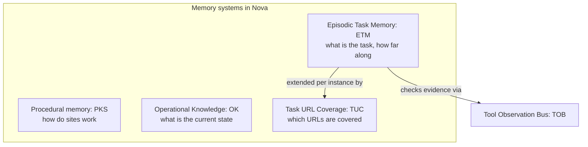
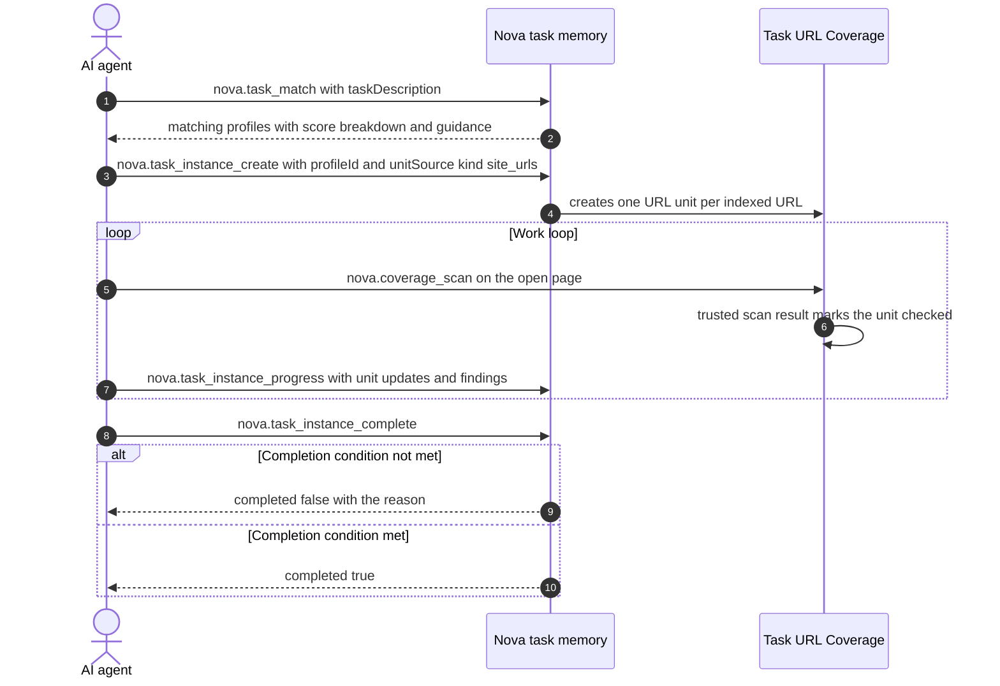

# Episodic Task Memory (ETM)

> [!NOTE]
> **Episodic Task Memory (ETM)** stores task profiles, running task instances, work units and progress durably. [Task URL Coverage (TUC)](../task-url-coverage-tuc/README.md) adds URL-specific coverage evidence. They help agents resume recurring tasks and keep them from declaring a large task done before the work is actually covered.

---

## 1. Start with a task that spans sessions

An agent is asked to audit 120 pages for broken links. After checking 17, the session ends. The next agent needs more than a summary saying “the audit is in progress”: it needs the remaining pages, blocked work, findings and checks required before completion.

ETM keeps that structure durably. The agent can retrieve the existing instance and continue its open work units. For a new audit a week later, it can reuse the task profile's guidance and completion rules while starting a new instance for the new run.

**A profile describes the recurring task; an instance records one run of it.** Resuming an instance preserves progress. Reusing a profile does not prove that last week's checked pages are still correct today.

**The ETM Guiding Principle:**
> *"The final report is the byproduct, not the goal."*

Completion is evaluated by Nova against the instance's completion condition (discovery state, work units, mandatory checks), not against the agent's narrative.

### The task objects in plain language

| Object | Question it answers |
| :--- | :--- |
| Task profile | What does this recurring task require, and what guidance should be reused? |
| Task instance | Which particular run are we working on? |
| Work unit | What individual item remains, was checked, or is blocked? |
| Completion condition | What must be satisfied before this run counts as complete? |
| [Task URL Coverage (TUC)](../task-url-coverage-tuc/README.md) | Which URL units have acceptable coverage evidence? |

ETM preserves task state; it does not perform the unfinished work merely because that state exists. The agent must retrieve it, continue the work and request completion.

---

## 2. Knowledge Taxonomy in Nova

Each memory system answers a different question:

| System | Main question |
| :--- | :--- |
| [Browser Memory](../browser-memory/README.md) | What notes, preferences or context should be remembered for this site? |
| [Operational Knowledge](../operational-knowledge-ok/README.md) | What state is currently reported for this target? |
| [PKS](../phenomenological-knowledge-store-pks/README.md) | How can a recurring web situation be recognized, handled and verified? |
| **ETM** | What task is this, and how far has this run progressed? |

ETM uses [TOB](../tool-observation-bus-tob/README.md) evidence when evaluating configured evidence policies. A checked status reported by an agent remains distinguishable from coverage supported by server-observed calls.

---

## 3. The ETM Lifecycle

After a completed instance, Nova recalculates the confidence of the task profile from its usage signals.

---

## 4. Completion Modes

A task's completion condition uses one of three coverage modes:

| Mode | Completion allowed when… |
| :--- | :--- |
| `exhaustive` | discovery is `frozen`, at least one work unit exists, no work units remain open, none are blocked or failed, and all mandatory checks are satisfied. |
| `threshold` | the stop metric reaches its value and all mandatory checks are satisfied. |
| `exploratory` | the minimum number of checked units is reached and all mandatory checks are satisfied. |

If the completion policy is not met, `nova.task_instance_complete` returns `completed: false` with a reason. Ordinary unmet completion conditions are reported as readiness results; the separate blocking URL-coverage gate can return an error. A profile can additionally define an evidence policy: Nova then compares the units the agent marked as checked with the tool calls TOB actually observed and rejects completion with `evidence_gap` if too many lack evidence.

These checks apply to the declared task scope, discovered units and configured policy. Freezing discovery is an explicit assertion that the work set has been found; ETM cannot establish that every relevant page on an unknown site has been discovered merely because all stored units are checked. Excluded units and threshold or exploratory completion should therefore be visible in the report rather than described as exhaustive coverage.

---

## 5. MCP Tooling for ETM

* **Task Profiles & Discovery:**
  * `nova.task_search`: Free-text search over existing task profiles.
  * `nova.task_match`: Matches a task description against existing profiles with a score breakdown.
  * `nova.task_profiles`: Lists profiles, filtered by task type, domain or platform.
  * `nova.task_profile_get` / `nova.task_profile_upsert`: Read or create/update a profile (goal, guidance, mandatory checks, completion condition, known exceptions).
* **Instance Lifecycle & Progress Tracking:**
  * `nova.task_instance_create`: Starts an instance from a profile or ad hoc, optionally with a `unitSource` for URL units.
  * `nova.task_instance_progress`: Reports discovered units, unit status updates, findings, mandatory-check updates and the discovery state.
  * `nova.task_instance_get`: Returns the stored snapshot, progress and open units for resuming.
  * `nova.task_instance_verify`: Checks completion readiness and returns the verification steps of the profile.
  * `nova.task_instance_complete`: Requests completion; Nova evaluates the completion condition.
  * `nova.task_instance_abort`: Ends an instance whose completion condition cannot be met.
* **Guidance Promotion:**
  * `nova.task_guidance_log_add`: Logs a guidance observation without changing the profile directly.
  * `nova.task_guidance_logs`: Lists guidance logs and learning statistics.
  * `nova.task_promotion_candidates`: Lists guidance that is ready for promotion.
  * `nova.task_promote_guidance`: Promotes guidance into the task profile.

---

## 6. Implementation notes

| Component | Responsibility |
| :--- | :--- |
| **`McpTaskMemoryHandler`** | Handles the task profile, instance, progress, guidance and promotion tools. |
| **`TaskCompletionEvaluator`** | Evaluates the completion condition of an instance. |
| **`EvidenceLedger`** | Correlates TOB observations and visit windows with work units at completion. |

---

## Related Documentation

* **[Tool Observation Bus (TOB)](../tool-observation-bus-tob/README.md)** — Server-side evidence ledger and visit windows.
* **[Agent Awareness Gates (AAG)](../agent-awareness-gates-aag/README.md)** — Precondition gates and tab leases.
* **[Phenomenological Knowledge Store (PKS)](../phenomenological-knowledge-store-pks/README.md)** — Procedural UI memory and learning levels.

[All core features](../README.md)
