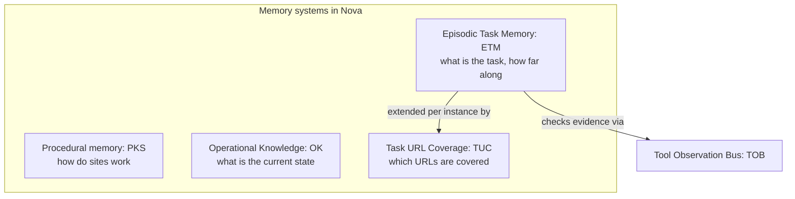
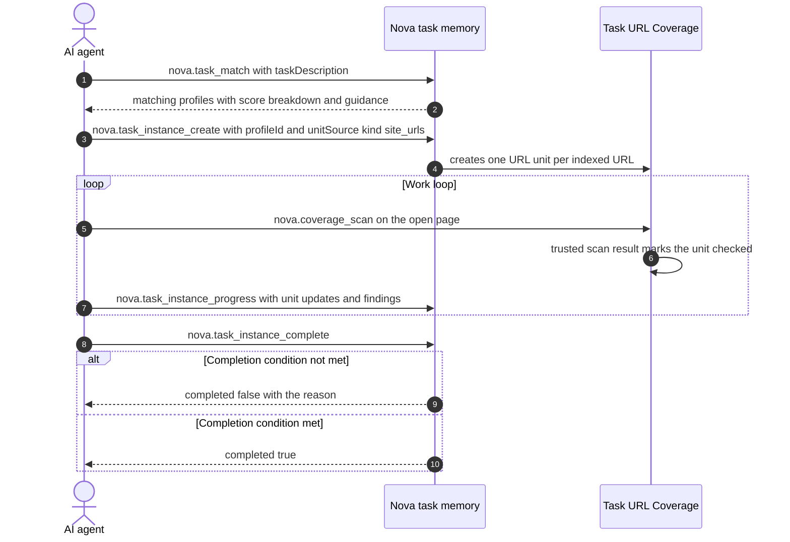

# Episodic Task Memory (ETM) & Task URL Coverage (TUC)

> [!NOTE]
> Nova's episodic task memory (**ETM**) and **Task URL Coverage** (**TUC**) store task profiles, running task instances, work units and progress durably. They help agents resume recurring tasks and keep them from declaring a large task done before the work is actually covered.

---

## 1. Problem Statement: Premature Abandonment & Task Amnesia

Without structured task memory, autonomous agents suffer from two recurring failure modes:
1. **Premature Done-Claiming:** An agent receives the instruction: *"Audit all 120 subpages of our developer portal for broken links."* After checking 17 pages, it loses track and announces: *"All relevant pages verified – done!"*
2. **Episodic Amnesia:** When the same audit is requested a week later, the agent starts from scratch instead of using the existing task profile, its guidance and known exceptions.

**The ETM Guiding Principle:**
> *"The final report is the byproduct, not the goal."*

Completion is evaluated by Nova against the instance's completion condition (discovery state, work units, mandatory checks), not against the agent's narrative.

---

## 2. Knowledge Taxonomy in Nova

---

## 3. The ETM Lifecycle

After a completed instance, Nova recalculates the confidence of the task profile from its usage signals.

---

## 4. Completion Modes

A task's completion condition uses one of three coverage modes:

| Mode | Completion allowed when… |
| :--- | :--- |
| `exhaustive` | discovery is `frozen`, no work units remain open, none are blocked or failed, and all mandatory checks are satisfied. |
| `threshold` | the stop metric reaches its value and all mandatory checks are satisfied. |
| `exploratory` | the minimum number of checked units is reached and all mandatory checks are satisfied. |

If the policy is not met, `nova.task_instance_complete` returns `completed: false` with a reason instead of an error. A profile can additionally define an evidence policy: Nova then compares the units the agent marked as checked with the tool calls TOB actually observed and rejects completion with `evidence_gap` if too many lack evidence.

---

## 5. TUC: Task URL Coverage

For tasks that must cover a list of URLs (audits, accessibility or link checks), TUC adds URL units to an instance:
* **Unit sources:** `unitSource` on `nova.task_instance_create` fills URL units from Nova's site URL index (`site_urls` or `crawler` with `scopeDomain`) or from an explicit URL list (`explicit`).
* **Server-trusted evidence:** `nova.coverage_scan` runs a registered scan script on the page and checks its result on the server before the matching URL unit counts as covered by trusted evidence. Units the agent marks as checked itself are recorded as agent claims.
* **Pattern grouping:** Parameterized routes such as `/products/{id}` are grouped for reporting, so large URL sets stay readable.
* **Completion gate:** In Block mode, `nova.task_instance_complete` is refused (`url_units_remaining`) while URL units remain open; a URL that does not apply has to be excluded explicitly. In the default Warn mode, open URL units do not block completion on their own; a rejected completion includes the URL coverage status.

---

## 6. Under the Hood

| Component | Responsibility |
| :--- | :--- |
| **`McpTaskMemoryHandler`** | Handles the task profile, instance, progress, guidance and promotion tools. |
| **`TaskCompletionEvaluator`** | Evaluates the completion condition of an instance. |
| **`TaskUrlCoverageTracker`** | Records coverage observations after tool calls and advances URL units on trusted evidence. |
| **`TaskKindResolver`** | Resolves the sampling policy for grouped URLs from the declared, profile and keyword-based task kind; the stricter one wins. |
| **`EvidenceLedger`** | Correlates TOB observations and visit windows with work units at completion. |

---

## 7. MCP Tooling for ETM & TUC

* **Task Profiles & Discovery:**
  * `nova.task_search`: Free-text search over existing task profiles.
  * `nova.task_match`: Matches a task description against existing profiles with a score breakdown.
  * `nova.task_profiles`: Lists profiles, filtered by task type, domain or platform.
  * `nova.task_profile_get` / `nova.task_profile_upsert`: Read or create/update a profile (goal, guidance, mandatory checks, completion condition, known exceptions).
* **Instance Lifecycle & Progress Tracking:**
  * `nova.task_instance_create`: Starts an instance from a profile or ad hoc, optionally with a `unitSource` for URL units.
  * `nova.task_instance_progress`: Reports discovered units, unit status updates, findings, mandatory-check updates and the discovery state.
  * `nova.task_instance_get`: Returns the stored snapshot, progress and open units for resuming.
  * `nova.task_instance_verify`: Checks completion readiness and returns the verification steps of the profile.
  * `nova.task_instance_complete`: Requests completion; Nova evaluates the completion condition.
  * `nova.task_instance_abort`: Ends an instance whose completion condition cannot be met.
* **Coverage Auditing:**
  * `nova.coverage_scan`: Runs a registered scan script on a tab to produce trusted coverage evidence.
  * `nova.task_instance_reconcile_coverage`: Compares recorded observations with open URL units and proposes updates.
* **Guidance Promotion:**
  * `nova.task_guidance_log_add`: Logs a guidance observation without changing the profile directly.
  * `nova.task_guidance_logs`: Lists guidance logs and learning statistics.
  * `nova.task_promotion_candidates`: Lists guidance that is ready for promotion.
  * `nova.task_promote_guidance`: Promotes guidance into the task profile.

---

## Related Documentation

* **[Tool Observation Bus (TOB)](tob.md)** — Server-side evidence ledger and visit windows.
* **[Agent Awareness Gates (AAG)](aag.md)** — Precondition gates and tab leases.
* **[Phenomenological Knowledge Store (PKS)](pks.md)** — Procedural UI memory and learning levels.
