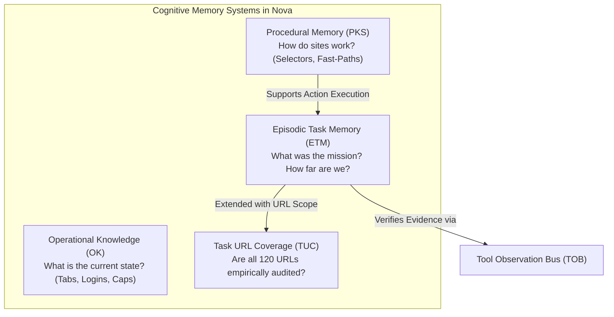
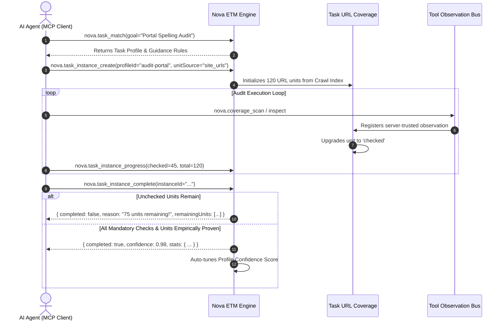

# Episodic Task Memory (ETM) & Task URL Coverage (TUC)

> [!NOTE]
> The episodic task memory system of Nova AI Workspace (**ETM**, `NovaBrowser.Core.McpTaskMemoryHandler`) and **Task URL Coverage** (**TUC**, `NovaBrowser.Core.Knowledge.TaskUrlCoverageTracker`) anchor mission goals, work units, and progress checkpoints durably in the system. They prevent agents from abandoning long-running audits prematurely or suffering from session amnesia.

---

## 1. Problem Statement: Premature Abandonment & Task Amnesia

Without structured task memory, autonomous agents suffer from two recurring failure modes:
1. **Premature Done-Claiming:** An agent receives the instruction: *"Audit all 120 subpages of our developer portal for broken links."* After checking 17 pages, it loses track due to context window fatigue and announces: *"All relevant pages successfully verified – Done!"*
2. **Episodic Amnesia:** When a user triggers the same audit a week later, the agent starts from scratch rather than leveraging existing task profiles, known caveats, and guidance notes.

**The ETM Guiding Principle:**
> *"The final summary report is the byproduct, not the goal."*

Task completion and coverage are never declared based on an agent's narrative assertions; they are evaluated server-side against **concrete work units, mandatory checks, and empirical server evidence**.

---

## 2. Knowledge Taxonomy in Nova

---

## 3. The ETM Lifecycle

---

## 4. TUC: Task URL Coverage (Exhaustive Verification)

For exhaustive verification workflows (e.g. security audits, accessibility compliance, link checking), TUC guarantees:
* **Server-Constructed Trust:** An agent cannot manually mark a URL unit as checked. The `checked` status is granted strictly through verified server evidence from `nova.coverage_scan` or read actions meeting dwell-time thresholds.
* **Pattern Clustering:** Parameterized routes (e.g. `/products/{id}` across 500 items) are collapsed into aggregated URL clusters, preventing prompt context bloat.
* **Completion Gate:** If an agent attempts to close an instance while mandatory routes remain unvisited, completion is rejected server-side (`completed: false`).

---

## 5. Production Code References

| Component | Source File | Responsibility |
| :--- | :--- | :--- |
| **`McpTaskMemoryHandler`** | `NovaBrowser/Core/Mcp/McpTaskMemoryHandler.cs` | Main dispatcher for all 15 task memory tools: profiles, instances, progress, and promotion. |
| **`TaskUrlCoverageTracker`** | `NovaBrowser/Core/Knowledge/TaskUrlCoverageTracker.cs` | Records coverage observations following tool calls and upgrades units to `checked`. |
| **`TaskKindResolver`** | `NovaBrowser/Core/Knowledge/TaskKindResolver.cs` | Classifies missions by semantic nature (audit, extraction, navigation, form fill). |
| **`EvidenceLedger`** | `NovaBrowser/Core/Tob/EvidenceLedger.cs` | Correlates real TOB visit windows with ETM work units during task completion evaluation. |

---

## 6. MCP Tooling for ETM & TUC

Agents interact with task memory through dedicated MCP tools:

* **Task Profiles & Discovery:**
  * `nova.task_match`: Matches a planned goal against existing task profiles with scoring breakdown.
  * `nova.task_search`: Searches active and archived profiles by free-text keywords.
  * `nova.task_profiles`: Lists profiles filtered by task type, domain, or platform.
  * `nova.task_profile_get` / `upsert`: Reads or updates profile requirements, mandatory checks, and termination conditions.
* **Instance Lifecycle & Progress Tracking:**
  * `nova.task_instance_create`: Spawns a new task instance bound to a profile and optional unit source (`site_urls`).
  * `nova.task_instance_progress`: Reports intermediate progress, checks off mandatory gates, and updates discovery state.
  * `nova.task_instance_get`: Retrieves live snapshot, open units, and error thresholds.
  * `nova.task_instance_complete`: Requests formal task completion (subject to strict server-side proof).
  * `nova.task_instance_abort`: Terminates an unrecoverable task instance with structured failure rationale.
  * `nova.task_instance_verify`: Audits accumulated evidence and highlights remaining gaps.
* **Coverage Auditing:**
  * `nova.coverage_scan`: Dispatches an isolated, server-trusted audit script on the active tab to advance unit states.
  * `nova.task_instance_reconcile_coverage`: Replays observations against open routes to propose unit upgrades.
* **Continuous Guidance Promotion:**
  * `nova.task_guidance_log_add`: Logs runtime observations (e.g. "Checkout button requires 2s delay for state settlement").
  * `nova.task_promote_guidance`: Permanently promotes proven runtime guidance into the master task profile.

---

## Related Documentation

* **[Tool Observation Bus (TOB)](tob.md)** — Tamper-proof evidence ledger and visit window calculation.
* **[Agent Awareness Gates (AAG)](aag.md)** — Pre-execution safety and multi-agent lease locking.
* **[Phenomenological Knowledge Store (PKS)](pks.md)** — Procedural UI memory and continuous learning.
