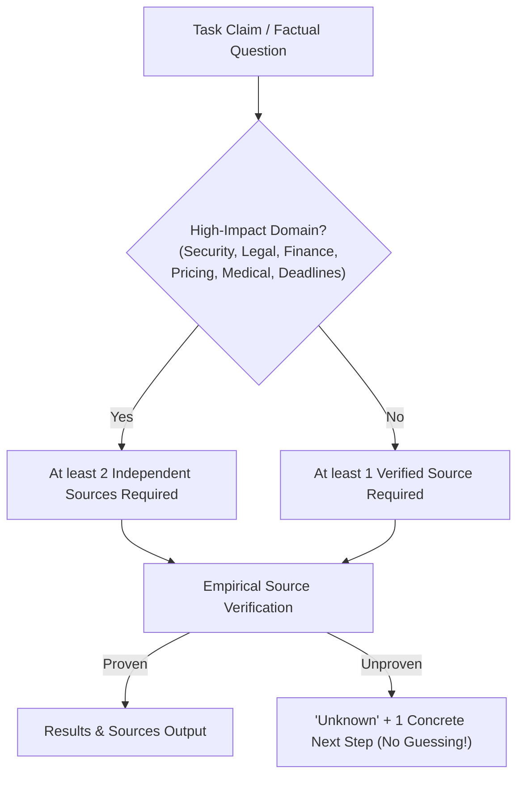

# Evidence Verification Mode (EVM) & Visual Ground Truth

> [!NOTE]
> Evidence Verification Mode (EVM) and the Visual Ground Truth pipeline protect agents from hallucinations during research and visual inspection tasks. Factual assertions must be supported by empirical evidence, while visual evidence remains pixel-sharp and token-efficient through targeted region crops.

---

## 1. Problem Statement: Research Hallucinations & Vision Token Waste

When AI agents conduct web research or evaluate UI layouts, two common failure modes emerge:
1. **Unsubstantiated Claims:** The agent assumes facts (e.g. pricing tiers, security advisories, filing deadlines) or relies on a single unverified source.
2. **Vision Token Explosion via 4K Screenshots:** Capturing an entire 4K viewport screenshot consumes approximately 5,800 vision tokens. Despite this massive overhead, small 13px text in downscaled viewports is often blurry or illegible.

Nova resolves this via **Claim-Based EVM Testing** and **Deterministic Proof-Crops**.

---

## 2. The EVM Verification Ruleset

For factual research workflows, Nova enforces a structured evidence schema (`structuredContent.evm`) via `get_instructions(mode='task')`:

### The 5 Core Principles:
1. **Claim Decomposition:** Every research task is decomposed into atomic, verifiable claims.
2. **Evidence Minimum:** Standard claims $\ge$ 1 source; sensitive high-impact domains $\ge$ 2 independent sources.
3. **Unknown Over Guessing:** If a fact cannot be conclusively established, the agent returns `unknown` accompanied by exactly one actionable next investigative step.
4. **Early Termination:** Research halts as soon as all claim tests are positively verified, preventing redundant browsing loops.
5. **Compact Output Structure:** Results are formatted into structured sections: `Results` / `Sources` / `Unknowns`.

---

## 3. Visual Ground Truth & Proof-Crop Architecture

Instead of photographing the entire viewport, Nova utilizes targeted **element and region crops**:

| Capture Technique | Byte Size | Vision Tokens | Legibility (13px Font) | Primary Use Case |
| :--- | :---: | :---: | :---: | :--- |
| **Full Viewport Capture** | ~150–500 KB JPEG | ~4,000–5,800 | Often downscaled / blurry | Broad macroscopic page orientation |
| **Selector / Region Crop (PNG)** | **~15–35 KB PNG** | **~350–650** | **100% Pixel-Sharp (Lossless)** | **Empirical Proof & Ground Truth** |

### Advanced Visual Capabilities:
* **`responseMode='reference'`:** Stores screenshots as session-scoped URIs (`nova://screenshot/...`), transmitting 0 inline tokens until the agent explicitly requests the asset.
* **Visual Bounding (`highlightSelector`):** Outlines the target element in high-contrast color (Red/Cyan) prior to capture, locking visual context.
* **Perceptual Screenshot Diffing (`nova.screenshot_diff`):** Performs pixel-by-pixel comparisons against stored baselines (`nova.screenshot_baseline`) to detect UI regressions instantly.

---

## 4. MCP Tooling for EVM & Evidence

| Tool | Purpose |
| :--- | :--- |
| `nova.capture_screenshot` | Captures lossless region crops (`selector`, `region`) with automatic format selection. |
| `nova.read_screenshot_resource` | Selectively retrieves stored screenshot image buffers by URI. |
| `nova.screenshot_diff` | Conducts perceptual diffing between two images and renders visual deviation masks. |
| `nova.screenshot_baseline` | Stores or updates reference screenshots for automated visual regression tests. |
| `nova.audit_accessibility` | Validates color contrast ratios, ARIA landmarks, and touch-target bounds. |
| `nova.measure_web_vitals` | Captures live Core Web Vitals (LCP, CLS, INP) for page performance audits. |

---

## 5. Production Code References

* **Screenshot Pipeline & AAG Budgets:** `NovaBrowser/Core/Mcp/McpServer.ExecutionScreenshots.cs`
* **EVM Mode Instructions:** `NovaBrowser/Core/Mcp/McpServer.GetInstructionsHandler.cs`
* **Accessibility Auditing & Metrics:** `NovaBrowser/Core/Diagnostics/`

---

## Related Documentation

* **[Tool Observation Bus (TOB)](tob.md)** — Server-side evidence ledger and tamper-proof visit windows.
* **[Agent Awareness Gates (AAG)](aag.md)** — Pre-execution safety and multi-agent lease locking.
* **[Humanized Input Engine](humanized-input-engine.md)** — Bot-resilient physical mouse and keyboard execution.
