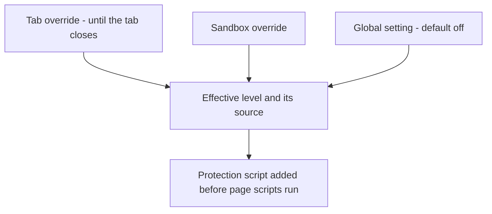

# Fingerprint Protection & Browser Identity

> [!NOTE]
> Nova has two separate controls for what websites learn about the browser: **fingerprint protection** adds seeded noise to, or fixes the values of, browser traits that sites use to recognize a device, and **browser identity** decides which browser the user-agent string and Client Hints announce. Both are off by default: fingerprint protection starts at `off`, and the identity starts as the native WebView2/Edge identity.

---

## 1. A Concrete Example: Change Readouts Without Changing the Engine

A site reads a canvas image, audio samples and hardware properties to help recognise a browser. With Standard fingerprint protection, Nova changes supported canvas and audio readouts using stable seeded noise. Repeating the same read in the same tab does not generate fresh noise every time.

Separately, a browser identity preset changes the user-agent and, for Chromium-shaped identities, matching Client Hints. Selecting Firefox does not turn WebView2 into Firefox: the rendering engine remains Chromium, and that preset does not provide a fully coherent Firefox identity.

These controls alter selected signals. They do not establish anonymity or guarantee that a site cannot link visits through an account, cookies, IP address or other browser characteristics.

## 2. Which Control Answers Which Question?

| Control | Question it answers |
| :--- | :--- |
| Fingerprint protection | Which supported device and rendering readouts should be modified? |
| Browser identity | Which user-agent and Client Hints should the browser announce? |
| Tab emulation | Which viewport, locale, touch or temporary user-agent should a test use? |
| [Sandbox isolation](sandbox-isolation.md) | Which cookies and persistent site data belong to this session? |
| [Proxy routing](proxy-and-network.md) | Which network route does the shared browser use? |

## 3. Why Consistency Matters

1. **Device fingerprinting:** Small differences in canvas and audio output, installed fonts, GPU name, CPU core count and screen size can be combined into an identifier that survives cookie deletion.
2. **Incoherent spoofing:** Changing only the user-agent string while `navigator.userAgentData` and the `Sec-CH-UA` Client Hints still describe the real browser is a contradiction that bot detection looks for.
3. **Breakage:** Noise that changes on every read makes canvas-based charts and drawing tools drift and is itself detectable.

---

## 4. Fingerprint Protection Levels

| Level | Settings label | What it changes |
| :--- | :--- | :--- |
| **`off`** *(default)* | Off | Nothing. |
| **`standard`** | Standard (Canvas + Audio) | Canvas: ±1 noise on RGB values read back via `getImageData`, `toDataURL` and `toBlob` (the visible canvas itself is not modified). Audio: noise far below audibility on audio buffer and analyser readouts. |
| **`strict`** | Strict (all incl. fonts, graphics, hardware) | Everything in `standard`, plus: `document.fonts.check()` answers `true` only for a small set of common fonts, and `measureText` widths get sub-pixel noise; the WebGL vendor and renderer report a generic NVIDIA/ANGLE value; `hardwareConcurrency` and `deviceMemory` report 8 and `maxTouchPoints` 0; the screen reports 1920 × 1080 (available 1920 × 1040) at 24-bit color depth. |

Strict can occasionally make games or audio apps misbehave. A level change takes effect on the next page load.

---

## 5. Where the Level Comes From

The most specific setting wins: **tab > sandbox > global**.

| Scope | In the UI | Via MCP |
| :--- | :--- | :--- |
| Global | Settings: "Fingerprint protection", "Protection level" | `nova.fingerprint_set_global(level)` |
| Sandbox | Sandbox settings: "Fingerprint protection for this sandbox" ("Use global value" clears it) | `nova.fingerprint_set_sandbox(sandboxId, level)`, `level: null` clears it |
| Tab | Tab context menu: "Fingerprint protection" ("Use profile setting" clears it) | `nova.fingerprint_set_tab(tabId, level)`, `level: null` clears it |

A tab override is kept in memory only and ends when the tab is closed. `nova.fingerprint_get` shows the effective level and which scope it comes from.

---

## 6. Stable Noise per Tab

The noise is not random per read. It is derived from a seed computed from the sandbox's persistent ID, the tab ID and the time Nova was started (SHA-256, first 32 bits), combined with the position or input that is being read. As a result:

* Repeated reads in the same document return the same value, and a reload in the same tab produces the same fingerprint.
* Two tabs produce different values.
* After a Nova restart the values change.

The script reads its configuration from a global variable and deletes that variable immediately, so page scripts cannot simply read back the level or the seed. Patched functions report themselves as native code to `Function.prototype.toString`.

---

## 7. Browser Identity

`nova.identity_set` stores one browser identity in the settings and applies it immediately to all open tabs. It has no per-tab or per-sandbox scope.

| Preset | User-agent | Client Hints |
| :--- | :--- | :--- |
| `default` | Native WebView2/Edge identity, no override | Native, fully consistent |
| `chrome` | Chrome on Windows | Matching `navigator.userAgentData` / `Sec-CH-UA` |
| `firefox` | Firefox on Windows | None — the Chromium engine keeps its own `userAgentData`, so this is not fully coherent |
| `safari` | Safari on macOS | None — not fully coherent, same reason |
| `custom` | Free-form string (max. 1,024 characters) | Matching hints only if the string looks like Chromium |

`version` selects a browser version for the `chrome`, `firefox` and `safari` presets; `nova.identity_presets` lists the valid values. `nova.identity_get` shows the stored identity and the effective user-agent.

For a single tab, `nova.emulation_set_user_agent` sets a temporary user-agent (plus optional `acceptLanguage` and `platform`). This override is not saved, stays on that tab across navigations until it is replaced or the tab is closed, and is not undone by a later `nova.identity_set`.

---

## 8. Related Emulation Tools

These act on one tab or sandbox (`targetId`) and are meant for testing, not as a persistent identity:

* `nova.emulation_set_device_metrics`: viewport width and height, device scale factor, mobile layout.
* `nova.emulation_set_locale`: `navigator.language(s)` and `Accept-Language`, time zone, geolocation.
* `nova.emulation_set_touch`: touch event emulation and `maxTouchPoints`.

---

## Related Documentation

* **[Multi-Sandbox Session Isolation](sandbox-isolation.md)** — Separate storage profiles per sandbox.
* **[Proxy Routing & Network](proxy-and-network.md)** — Shared browser routing and optional leak protection.
