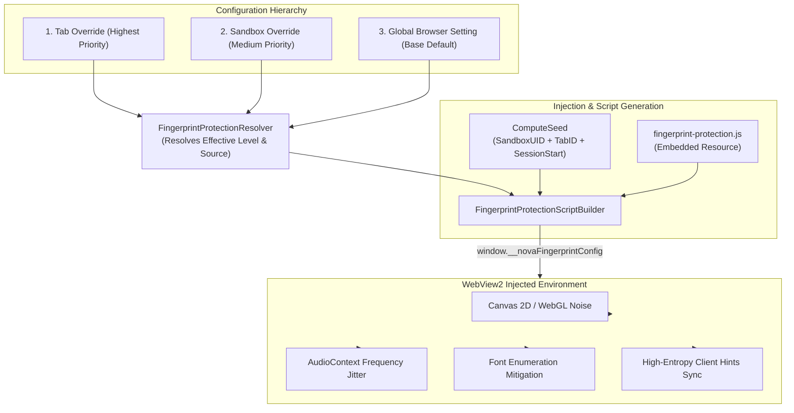

# Anti-Fingerprint Protection & Stealth Identity Engine

> [!NOTE]
> The Anti-Fingerprint and Identity Engine of Nova AI Workspace (`FingerprintProtection`) protects automated sessions from bot detection and cross-site tracking. It combines a 3-tier configuration hierarchy, mathematically deterministic noise seeding, and consistent high-entropy Client Hints.

---

## 1. Problem Statement & Motivation

Modern web applications deploy advanced client-side fingerprinting libraries (e.g. FingerprintJS, CreepJS, DataDome, Cloudflare Turnstile):
1. **Hardware & Canvas Fingerprinting:** Subtle hardware variances in 2D Canvas rendering, WebGL shader compilation, AudioContext frequency responses, and installed system fonts generate a unique persistent hash—even across incognito tabs.
2. **Inconsistent Headless Signatures:** When User-Agents are manually spoofed, internal `navigator` properties or high-entropy Client Hints (`sec-ch-ua`) frequently mismatch. Anti-bot heuristics immediately flag these discrepancies.
3. **Breakage of Legitimate Web Features:** Purely random noise per frame breaks WebGL games, 3D product viewports, and canvas-based charts.

**Nova AI Workspace** resolves this through a **deterministic, seeded noise model** that remains stable within a session while rendering cross-site and cross-tab correlation impossible.

---

## 2. Architecture & 3-Tier Hierarchy



---

## 3. Standardized Protection Levels

Nova provides four standardized protection tiers:

| Level | Operational Mode | Active Mitigations | Recommended Use Case |
| :--- | :--- | :--- | :--- |
| **`off`** | Disabled | No modifications applied | Internal developer testing or debugging internal sites. |
| **`balanced`** *(Default)* | Balanced | Canvas noise, Audio jitter, Navigator normalization | Maximum web compatibility while blocking commercial tracking networks. |
| **`strict`** | Strict | Canvas, Audio, WebGL vendor spoofing, Font limiting, Screen jitter | Challenging web platforms with aggressive fingerprinting heuristics. |
| **`maximum`** | Maximum Stealth | Complete API masking, sub-pixel jitter, locked hardware profiles | High-security research workflows requiring maximum stealth. |

---

## 4. Deterministic Seeding (`ComputeSeed`)

Noise is never pseudo-random per frame; it is derived deterministically from three entropy sources:
```csharp
var seed = ComputeSeed(sandboxPersistentUid, tabId, sessionStartUnixMs);
```
1. **`sandboxPersistentUid`:** Binds noise characteristics to the user profile.
2. **`tabId`:** Ensures two tabs within the same session produce distinct values (preventing cross-tab correlation).
3. **`sessionStartUnixMs`:** Rotates the fingerprint profile cleanly upon every Nova restart.

Following initialization, the injected script immediately deletes `window.__novaFingerprintConfig` from the global scope, ensuring third-party scripts cannot extract the seed.

---

## 5. Under the Hood

| Component | Responsibility |
| :--- | :--- |
| **`FingerprintProtectionResolver`** | Resolves effective protection level following `Tab > Sandbox > Global` priority. |
| **`FingerprintProtectionScriptBuilder`** | Generates the bootstrap script with seed and mitigation matrix. |
| **`BrowserIdentityProfiles`** | Canonical identity presets ensuring coherent User-Agents and Client Hints. |
| **`PerTabFingerprintOverrides`** | Thread-safe in-memory store managing ephemeral tab-level overrides. |

---

## 6. MCP Tooling for Fingerprint & Identity

* **Fingerprint Protection:**
  * `nova.fingerprint_get`: Inspects active protection level and resolution source.
  * `nova.fingerprint_set_global`: Configures browser-wide default protection level.
  * `nova.fingerprint_set_sandbox`: Configures protection override for a sandbox profile.
  * `nova.fingerprint_set_tab`: Applies an ephemeral override to an individual tab.
* **Identity & Persona Management:**
  * `nova.identity_presets`: Lists verified browser presets (Chrome/Windows, Safari/macOS, Firefox/Linux).
  * `nova.identity_get`: Inspects active identity attributes for a tab.
  * `nova.identity_set`: Assigns a coherent browser persona to a tab or sandbox.
* **Hardware & Device Emulation:**
  * `nova.emulation_set_device_metrics`: Adjusts resolution, device pixel ratio (DPR), and orientation.
  * `nova.emulation_set_user_agent`: Sets User-Agent and client hints synchronously.
  * `nova.emulation_set_locale`: Configures language headers and timezones.
  * `nova.emulation_set_touch`: Enables touch events and gesture emulation.

---

## Related Documentation

* **[Multi-Sandbox Session Isolation](sandbox-isolation.md)** — Partitioned storage profiles and proxy bindings.
* **[Proxy Routing & Stealth Network](proxy-and-network.md)** — SOCKS5/HTTP routing and WebRTC leak protection.
